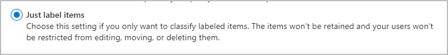

# Learn about retention labels

>*[Microsoft 365 licensing guidance for security & compliance](https://aka.ms/ComplianceSD).*

Across your organization, you probably have different types of content that require different actions taken on them in order to comply with industry regulations and internal policies. For example, you might have:
  
- Tax forms that need to be retained for a minimum period of time. 
    
- Press materials that need to be permanently deleted when they reach a certain age. 
    
- Competitive research that needs to be both retained and then permanently deleted. 
    
- Work visas that must be marked as a record so that they can't be edited or deleted. 
    
In all these cases, retention labels can help you take the right actions on the right content. Using retention labels, you can classify data across your organization for governance, and enforce retention rules based on that classification.
  
With retention labels, you can:
  
- **Enable people in your organization to apply a retention label manually** to content in Outlook on the web, Outlook 2010 and later, OneDrive, SharePoint, and Microsoft 365 Groups. Users often know best what type of content they're working with, so they can classify it and have the appropriate policy applied. 
    
- **Apply retention labels to content automatically** if it matches specific conditions, such as when the content contains: 
   
    - Specific types of sensitive information.
    
    - Specific keywords that match a query you create.
    
    - Pattern matches for a trainable classifier.

- **Apply a default retention label to a document library, folder, or document set** in SharePoint, so that all documents that are stored in that location inherit the default retention label.

Additionally, retention labels support [records management](records-management.md) for email and documents across Microsoft 365 apps and services. You can use a retention label to classify content as a record. When this happens and the content remains in Microsoft 365, the label can't be changed or removed, and the content can't be edited or deleted. 

Retention labels, unlike [sensitivity labels](sensitivity-labels.md), do not persist if the content is moved outside Microsoft 365.

There is no limit to the number of retention labels that are supported for a tenant. However, 10,000 is the maximum number of policies that are supported for a tenant and these include the policies that apply the labels (retention label policies and auto-apply retention policies), as well as retention policies.

## Classifying content without applying any actions

Although the main purpose of retention labels is to retain or delete content, you can also use retention labels without turning on any retention or other actions. In this case, you can use a retention label simply as a text label, without enforcing any actions.
  
For example, you can create and apply a retention label named "Review later" with no actions, and then use that label to find that content later.
  

### Using a retention label as a condition in a DLP policy

You can also use a retention label as a condition in a data loss prevention (DLP) policy, and the DLP policy can enforce other actions, such as restricting access, on content that contains a specific label. 
  
For more information, see [Using a retention label as a condition in a DLP policy](data-loss-prevention-policies.md#using-a-retention-label-as-a-condition-in-a-dlp-policy).

## How retention labels work with retention label policies

Retention labels are independent, reusable building blocks that are included in one or more retention label policies. The primary purpose of a retention label policy is to group a set of retention labels and specify the locations where you want those labels to appear. Then, admins and users can apply those labels to content.
  

  
1. When you publish retention labels, they're included in a retention label policy. Retention label names are immutable, which means that they cannot be edited after they're created.

2. A single retention label can be included in many retention label policies.

3. A single location can also be included in many retention label policies.
    
3. Retention label policies specify the locations to publish the retention labels.

In addition to retention label policies, you can also create an auto-apply policy with a retention label. With this policy, a retention label is automatically applied when conditions that you specify in the policy are met. 

## Only one retention label at a time

It's important to know that content like an email or document can have only a single retention label assigned to it at a time:
  
- For retention labels assigned manually by end users, people can remove or change the retention label that's assigned.
    
- If content has an auto-apply label assigned, an auto-apply label can be replaced by a retention label assigned manually by an end user.
    
- If content has a retention label assigned manually by an end user, an auto-apply label cannot replace the manually assigned retention label.
    
- If there are multiple rules that assign an auto-apply label and content meets the conditions of multiple rules, the retention label for the oldest rule is assigned.
    
To understand how and why one retention label is applied rather than another, it's helpful to understand the difference between explicitly assign a label, and implicitly assigned a label:

- Manually assigned labels are explicitly assigned
- Automatically applied labels are implicitly assigned

An explicitly assigned retention label takes precedence over an implicitly assigned retention label. For more information, see the [The principles of retention, or what takes precedence?](#the-principles-of-retention-or-what-takes-precedence) section on this page.

## Retention label policies and locations

Different types of retention labels can be published to different locations, depending on what the retention label does.
  
|**If the retention label is…**|**Then the label policy can be applied to…**|
|:-----|:-----|
|Published to admins and end users    |Exchange, SharePoint, OneDrive, Microsoft 365 Groups    |
|Auto-applied based on sensitive information types or trainable classifiers    |Exchange (all mailboxes only), SharePoint, OneDrive    |
|Auto-applied based on a query    |Exchange, SharePoint, OneDrive, Microsoft 365 Groups    |
   
In Exchange, auto-apply retention labels are applied only to messages newly sent (data in transit), not to all items currently in the mailbox (data at rest). Also, auto-apply retention labels for sensitive information types and trainable classifiers apply to all mailboxes; you can't select specific mailboxes.
  
Exchange public folders, Skype, and Teams channel messages and chats do not support retention labels. To retain and delete contain from these locations, use [retention policies](retention-poliices.md) instead.

## How retention labels enforce retention

Retention labels can enforce the same retention actions that a retention policy can - retain and then delete, or retain-only, or delete-only. You can use retention labels to implement a sophisticated file plan that identifies specific files for different retention settings. For more information about how retention works, see [Learn about retention policies](retention-policies.md).

In addition, a retention label has two retention options that are available only in a retention label and not in a retention policy. With a retention label, you can:
  
- Trigger a disposition review at the end of the retention period, so that SharePoint and OneDrive documents must be reviewed before they can be deleted. For more information, see [Disposition reviews](disposition.md#disposition-reviews).
    
- Start the retention period from when the content was labeled, instead of the age of the content or when it was last modified. When you use this option:
    - It applies only to content in SharePoint sites and OneDrive accounts. For Exchange email, the retention period is always based on the date when the message was sent or received.
    - You can't change the retention period after the label is saved.
    

Another important difference is that when you apply a retention label rather than a retention policy to files in SharePoint, and the label is configured to retain content, users can't delete the file while the retention period is enforced. Users can delete content when the same label is applied to files in OneDrive and to emails, unless the label marks the content as a record.

## The principles of retention, or what takes precedence?

It's possible or even likely that content might have several retention policies applied to it, each with a different action (retain, delete, or both) and retention period. What takes precedence? At the highest level, rest assured that content being retained by one policy can't be permanently deleted by another policy.
  

  
To understand how different labels with retention actions are applied to content, keep these principles of retention in mind:
  
1. **Retention wins over deletion.** Suppose that one retention policy says to delete Exchange email after three years, but another retention policy says to retain Exchange email for five years and then delete it. Any content that reaches three years old will be deleted and hidden from the users' view, but still retained in the Recoverable Items folder until the content reaches five years old, when it will be permanently deleted. 
    
2. **The longest retention period wins.** If content's subject to multiple policies that retain content, it will be retained until the end of the longest retention period. 
    
3. **Explicit inclusion wins over implicit inclusion.** This means: 
    
    1. If a retention label with retention settings is manually assigned by a user to an item, such as an Exchange email or OneDrive document, that retention label takes precedence over both a policy assigned at the site or mailbox level and a default retention label assigned by the document library. For example, if the explicit retention label says to retain for 10 years, but the retention policy assigned to the site says to retain for only five years, the retention label takes precedence. Auto-applied retention labels are considered implicit, not explicit, because they're applied automatically by Microsoft 365.
    
    2. If a retention policy includes a specific location, such as a specific user's mailbox or OneDrive account, that policy takes precedence over another retention policy that applies to all users' mailboxes or OneDrive accounts but doesn't specifically include that user's mailbox.
    
4. **The shortest deletion period wins.** Similarly, if content's subject to multiple policies that delete content (with no retention), it will be deleted at the end of the shortest retention period. 
    
Understand that the principles of retention work as a tie-breaking flow from top to bottom: If the rules applied by all policies or labels are the same at one level, the flow moves down to the next level to determine precedence for which rule is applied.
  
Finally, a retention policy or retention label cannot permanently delete any content that's on hold for eDiscovery. When the hold is released, the content again becomes eligible for the cleanup process described above.

### Precedence for auto-labeling with trainable classifiers

All retention labels that are configured for trainable classifiers are evaluated simultaneously. If an item is detected by more than one trainable classifier, the following criteria is used to determine which retention label to apply:

1. Retention labels configured for retain-only or retain and then delete have a higher priority over retention labels that are configured for delete-only.

2. For retention labels that are configured for retain-only or retain and then delete, the retention label that is configured for the longest retention period wins.

3. For retention labels that are configured for delete-only, the retention label that has been configured for the shortest period wins.

4. Retention labels with the same action and the same period result in a retention label selection that is non-deterministic.

## Monitor retention labels

After you publish or auto-apply your retention labels, you'll want to verify that they're being applied to content as you intended. To monitor your retention labels:
  
- **Label Activity Explorer**. With the explorer (example in the next picture), you can quickly search and view retention label activity for all content across SharePoint and OneDrive over the past 30 days. For more information, see [View label activity for documents](view-label-activity-for-documents.md).

- **Label analytics** page. In the Microsoft 365 compliance center and Microsoft 365 security center, you can quickly view your top retention labels and where they're applied. You can also view all content with a specific retention label. For more information, see [View label usage with label analytics](label-analytics.md).
    
- **Data governance reports**. With these reports, you can quickly view retention label trends and activity for all content across Exchange, SharePoint, and OneDrive over the past 90 days. For more information, see [View the data governance reports](view-the-data-governance-reports.md).
    

## Using Content Search to find all content with a specific retention label applied to it

After retention labels are assigned to content, either by users or auto-applied, you can use content search to find all content that's classified with a specific retention label.
  
When you create a content search, choose the **Compliance label** condition, and then enter the complete retention label name or part of the label name and use a wildcard. For more information, see [Keyword queries and search conditions for Content Search](keyword-queries-and-search-conditions.md).
  

## PowerShell cmdlets for retention labels

To use the retention label cmdlets, you must first [connect to the Office 365 Security & Compliance Center Powershell](https://docs.microsoft.com/powershell/exchange/office-365-scc/connect-to-scc-powershell/connect-to-scc-powershell). Then, you can use the following cmdlets:
    
- [Get-ComplianceTag](https://docs.microsoft.com/powershell/module/exchange/get-compliancetag)

- [New-ComplianceTag](https://docs.microsoft.com/powershell/module/exchange/new-compliancetag)

- [Remove-ComplianceTag](https://docs.microsoft.com/powershell/module/exchange/remove-compliancetag)

- [Set-ComplianceTag](https://docs.microsoft.com/powershell/module/exchange/set-compliancetag)

- [Enable-ComplianceTagStorage](https://docs.microsoft.com/powershell/module/exchange/enable-compliancetagstorage)

- [Get-ComplianceTagStorage](https://docs.microsoft.com/powershell/module/exchange/get-compliancetagstorage)

- [Get-RetentionCompliancePolicy](https://docs.microsoft.com/powershell/module/exchange/get-retentioncompliancepolicy)

- [New-RetentionCompliancePolicy](https://docs.microsoft.com/powershell/module/exchange/new-retentioncompliancepolicy)

- [Remove-RetentionCompliancePolicy](https://docs.microsoft.com/powershell/module/exchange/remove-retentioncompliancepolicy)

- [Set-RetentionCompliancePolicy](https://docs.microsoft.com/powershell/module/exchange/set-retentioncompliancepolicy)

- [Get-RetentionComplianceRule](https://docs.microsoft.com/powershell/module/exchange/get-retentioncompliancerule)

- [New-RetentionComplianceRule](https://docs.microsoft.com/powershell/module/exchange/new-retentioncompliancerule)

- [Remove-RetentionComplianceRule](https://docs.microsoft.com/powershell/module/exchange/remove-retentioncompliancerule)

- [Set-RetentionComplianceRule](https://docs.microsoft.com/powershell/module/exchange/set-retentioncompliancerule)

## Use retention labels instead of older features

Retention labels can easily be made available to an entire organization and its content across Microsoft 365, including Exchange, SharePoint, OneDrive, and Microsoft 365 groups. If you need to retain or delete content, or manage records anywhere in Microsoft 365, we recommend that you use retention labels.
  
There are several other features that have previously been used to retain or delete content or to manage records in Microsoft 365. These features will continue to work side by side with retention labels. While there are instances where the implementation of retention labels differs from previous features, the evolution of retention labels will drive the future of records management across Microsoft 365. Therefore, moving forward, for data governance, we recommend that you use retention labels instead of the following older features.
  
### Exchange Online

- [Retention tags and retention policies](https://go.microsoft.com/fwlink/?linkid=846125), also known as [messaging records management (MRM)](https://go.microsoft.com/fwlink/?linkid=846126) (deletion only) 
    
### SharePoint and OneDrive

- [Configuring in place records management](https://support.office.com/article/7707a878-780c-4be6-9cb0-9718ecde050a) (retention) 
    
- [Introduction to the Records Center](https://support.office.com/article/bae6ca5a-7b19-40e0-b433-e3613a747c2c) (retention) 
    
- [Information management policies](intro-to-info-mgmt-policies.md) (deletion only) 
    
## Next steps

To use retention labels that both admins and users can apply in apps, see [Create retention labels and apply them in apps](create-retention-labels.md). This method supports the following scenarios:

- Manually apply retention labels in apps
- Applying a default retention label to all content in a SharePoint library, folder, or document set
- Automatically applying a retention label to email by using rules

To use retention labels that are automatically applied to content, based on conditions, see [Apply a retention label to content automatically](apply-retention-labels-automatically.md).

