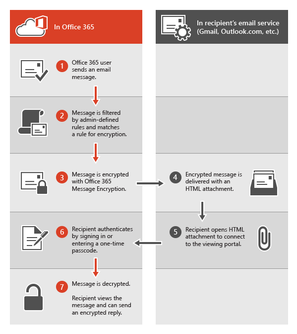

# Legacy information for Office 365 Message Encryption

If you haven't yet moved your organization to the new OME capabilities, but you have already deployed OME, then the information in this article applies to your organization. Microsoft recommends that you make a plan to move to the new OME capabilities as soon as it is reasonable for your organization. For instructions, see [Set up new Office 365 Message Encryption capabilities built on top of Azure Information Protection](set-up-new-message-encryption-capabilities.md). If you want to find out more about how the new capabilities work first, see [Office 365 Message Encryption](ome.md). The rest of this article refers to OME behavior before the release of the new OME capabilities.
  
With Office 365 Message Encryption, your organization can send and receive encrypted email messages between people inside and outside your organization. Office 365 Message Encryption works with Outlook.com, Yahoo, Gmail, and other email services. Email message encryption helps ensure that only intended recipients can view message content.
  
Here are some examples:
  
- A bank employee sends credit card statements to customers

- An insurance company representative provides policy details to customers

- A mortgage broker requests financial information from a customer for a loan application

- A health care provider sends health care information to patients

- An attorney sends confidential information to a customer or another attorney

## How Office 365 Message Encryption works without the new capabilities

Office 365 Message Encryption is an online service that's built on Microsoft Azure Rights Management (Azure RMS). With Azure RMS, administrators can define mail flow rules to determine the conditions for encryption. For example, a rule can require the encryption of all messages addressed to a specific recipient.
  
When someone sends an email message in Exchange Online that matches an encryption rule, the message is sent with an HTML attachment. The recipient opens the HTML attachment and follows instructions to view the encrypted message on the Office 365 Message Encryption portal. The recipient can choose to view the message by signing in with a Microsoft account or a work or school associated with Office 365, or by using a one-time pass code. Both options help ensure that only the intended recipient can view the encrypted message. This process is very different for the new OME capabilities.
  
The following diagram summarizes the passage of an email message through the encryption and decryption process.
  

  
For more information, see [Service information for legacy Office 365 Message Encryption prior to the release of the new OME capabilities](legacy-information-for-message-encryption.md#LegacyServiceInfo).
  
## Defining mail flow rules for Office 365 Message Encryption that don't use the new OME capabilities

To enable Office 365 Message Encryption without the new capabilities, Exchange Online and Exchange Online Protection administrators define Exchange mail flow rules. These rules determine under what conditions email messages should be encrypted, as well as conditions for removing message encryption. When an encryption action is set for a rule, the service performs the action on any messages that match the rule conditions before sending the messages.

Mail flow rules are flexible, letting you combine conditions so you can meet specific security requirements in a single rule. For example, you can create a rule to encrypt all messages that contain specified keywords and are addressed to external recipients. Office 365 Message Encryption also encrypts replies from recipients of encrypted email, and you can create a rule that decrypts those replies as a convenience for your email users. That way, users in your organization won't have to sign in to the encryption portal to view replies.
  
For more information about how to create Exchange mail flow rules, see [Define Rules for Office 365 Message Encryption](define-mail-flow-rules-to-encrypt-email.md).
  
### Use the EAC to create a mail flow rule for encrypting email messages without the new OME capabilities

1. In a web browser, using a work or school account that has been granted global administrator permissions, [sign in to Office 365](https://support.office.com/article/b9582171-fd1f-4284-9846-bdd72bb28426#ID0EAABAAA=Web_browser).

2. Choose the **Admin** tile.

3. In the Microsoft 365 admin center, choose **Admin centers** \> **Exchange**.

4. In the EAC, go to **Mail flow** \> **Rules** and select **New**  \> **Create a new rule**. For more information about using the EAC, see [Exchange admin center in Exchange Online](/exchange/exchange-admin-center).

5. In **Name**, type a name for the rule, such as Encrypt mail for DrToniRamos@hotmail.com.

6. In **Apply this rule if** select a condition, and enter a value if necessary. For example, to encrypt messages going to DrToniRamos@hotmail.com:

   1. In **Apply this rule if**, select **the recipient is**.

   2. Select an existing name from the contact list or type a new email address in the **check names** box.

      - To select an existing name, select it from the list and then click **OK**.

      - To enter a new name, type an email address in the **check names** box and then select **check names** \> **OK**.

7. To add more conditions, choose **More options** and then select **add condition** and select from the list.

   For example, to apply the rule only if the recipient is outside your organization, select **add condition** and then select **The recipient is external/internal** \> **Outside the organization** \> **OK**.

8. To enable encryption without using the new OME capabilities, in **Do the following**, select **Modify the message security** \> **Apply the previous version of OME**, and then choose **Save**.

   If you receive an error that IRM licensing isn't enabled, then you're not using legacy OME.

9. (Optional) Choose **add action** to specify another action.

### Use Exchange Online PowerShell to create a mail flow rule for encrypting email messages without the new OME capabilities

1. Connect to Exchange Online PowerShell. For more information, see [Connect to Exchange Online PowerShell](/powershell/exchange/connect-to-exchange-online-powershell).

2. Create a rule by using the **New-TransportRule** cmdlet and set the _ApplyOME_ parameter to `$true`.

   This example requires that all email messages sent to DrToniRamos@hotmail.com must be encrypted.

   ```powershell
   New-TransportRule -Name "Encrypt rule for Dr Toni Ramos" -SentTo "DrToniRamos@hotmail.com" -SentToScope "NotinOrganization" -ApplyOME $true
   ```

   Where,

   - The unique name of the new rule is "Encrypt rule for Dr Toni Ramos".
   - The _SentTo_ parameter specifies the message recipients (identified by name, email address, distinguished name, etc.). In this example, the recipient is identified by the email address "DrToniRamos@hotmail.com".
   - The _SentToScope_ parameter specifies the location of the message recipients. In this example, the recipient's mailbox is in hotmail and is not part of the organization, so the value `NotInOrganization` is used.

   For detailed syntax and parameter information, see [New-TransportRule](/powershell/module/exchange/New-TransportRule).

### Remove encryption from email replies encrypted without the new OME capabilities

When your email users send encrypted messages, recipients of those messages can respond with encrypted replies. You can create mail flow rules to automatically remove encryption from replies so email users in your organization don't have to sign in to the encryption portal to view them. You can use the EAC or Windows PowerShell cmdlets to define these rules. You can decrypt messages that are sent from within your organization or messages that are replies to messages sent from within your organization. You cannot decrypt encrypted messages originating from outside of your organization.

#### Use the EAC to create a rule for removing encryption from email replies encrypted without the new OME capabilities

1. In a web browser, using a work or school account that has been granted admin permissions, [sign in to Office 365](https://support.office.com/article/b9582171-fd1f-4284-9846-bdd72bb28426#ID0EAABAAA=Web_browser).

2. Choose the **Admin** tile.

3. In the Microsoft 365 admin center, choose **Admin centers** \> **Exchange**.

4. In the EAC, go to **Mail flow** \> **Rules** and select **New**  \> **Create a new rule**. For more information about using the EAC, see [Exchange admin center in Exchange Online](/exchange/exchange-admin-center).

5. In **Name**, type a name for the rule, such as Remove encryption from incoming mail.

6. In **Apply this rule if** select the conditions where encryption should be removed from messages, such as **The recipient is located** \> **Inside the organization**.

7. In **Do the following**, select **Modify the message security** \> **Remove the previous version of OME**.

8. Select **Save**.

#### Use Exchange Online PowerShell to create a rule to remove encryption from email replies encrypted without the new OME capabilities

1. Connect to Exchange Online PowerShell. For more information, see [Connect to Exchange Online PowerShell](/powershell/exchange/connect-to-exchange-online-powershell).

2. Create a rule by using the **New-TransportRule** cmdlet and set the _RemoveOME_ parameter to `$true`.

   This example removes the encryption from all mail sent to recipients in the organization.

   ```powershell
   New-TransportRule -Name "Remove encryption from incoming mail" -SentToScope "InOrganization" -RemoveOME $true
   ```

   Where,

   - The unique name of the new rule is "Remove encryption from incoming mail".
   - The _SentToScope_ parameter specifies the location of the message recipients. In this example, the value `InOrganization` value is used, which indicates one of the following:
     - The recipient is a mailbox, mail user, group, or mail-enabled public folder in your organization.
     - The recipient's email address is in an accepted domain that's configured as an authoritative domain or an internal relay domain in your organization, _and_ the message was sent or received over an authenticated connection.

For detailed syntax and parameter information, see [New-TransportRule](/powershell/module/exchange/New-TransportRule).

## Sending, viewing, and replying to messages encrypted without the new capabilities

With Office 365 Message Encryption, email messages are encrypted automatically, based on administrator-defined rules. An email that bears an encrypted message arrives in the recipient's Inbox with an attached HTML file.
  
Recipients follow instructions in the message to open the attachment and authenticate by using a Microsoft account or a work or school associated with Office 365. If recipients don't have either account, they're directed to create a Microsoft account that will let them sign in to view the encrypted message. Alternatively, recipients can choose to get a one-time pass code to view the message. After signing in or using a one-time pass code, recipients can view the decrypted message and send an encrypted reply.
  
## Customize encrypted messages with Office 365 Message Encryption

As an Exchange Online and Exchange Online Protection administrator, you can customize your encrypted messages. For example, you can add your company's brand and logo, specify an introduction, and add disclaimer text in encrypted messages and in the portal where recipients view your encrypted messages. Using Windows PowerShell cmdlets, you can customize the following aspects of the viewing experience for recipients of encrypted email messages:

- Introductory text of the email that contains the encrypted message

- Disclaimer text of the email that contains the encrypted message

- Portal text that will appear in the message viewing portal

- Logo that will appear in the email message and viewing portal

You can also revert back to the default look and feel at any time.
  
The following example shows a custom logo for ContosoPharma in the email attachment:

> [!div class="mx-imgBorder"]
> 
  
**To customize encryption email messages and the encryption portal with your organization's brand**
  
1. Connect to Exchange Online using Remote PowerShell, as described in [Connect to Exchange Online Using Remote PowerShell](/powershell/exchange/connect-to-exchange-online-powershell).

2. Use the Set-OMEConfiguration cmdlet as described here: [Set-OMEConfiguration](/powershell/module/exchange/set-omeconfiguration) or use the following table for guidance.

   **Encryption customization options**

   | To customize this feature of the encryption experience | Use these Windows PowerShell commands |
   |:-----|:-----|
   |Default text that accompanies encrypted email messages  <br/> The default text appears above the instructions for viewing encrypted messages  <br/> | `Set-OMEConfiguration -Identity <OMEConfigurationIdParameter> -EmailText "<string of up to 1024 characters>"` <br/> **Example:** `Set-OMEConfiguration -Identity "OME Configuration" -EmailText "Encrypted message from ContosoPharma secure messaging system"` <br/> |
   |Disclaimer statement in the email that contains the encrypted message  <br/> | `Set-OMEConfiguration -Identity <OMEConfigurationIdParameter> DisclaimerText "<your disclaimer statement, string of up to 1024 characters>"` <br/> **Example:** `Set-OMEConfiguration -Identity "OME Configuration" -DisclaimerText "This message is confidential for the use of the addressee only"` <br/> |
   |Text that appears at the top of the encrypted mail viewing portal  <br/> | `Set-OMEConfiguration -Identity <OMEConfigurationIdParameter> -PortalText "<text for your portal, string of up to 128 characters>"` <br/> **Example:** `Set-OMEConfiguration -Identity "OME Configuration" -PortalText "ContosoPharma secure email portal"` <br/> |
   |Logo  <br/> | `Set-OMEConfiguration -Identity <OMEConfigurationIdParameter> -Image <Byte[]>` <br/> **Example:** `Set-OMEConfiguration -Identity "OME configuration" -Image (Get-Content "C:\Temp\contosologo.png" -Encoding byte)` <br/> Supported file formats: .png, .jpg, .bmp, or .tiff  <br/> Optimal size of logo file: less than 40 KB  <br/> Optimal size of logo image: 170x70 pixels  <br/> |

**To remove brand customizations from encryption email messages and the encryption portal**
  
1. Connect to Exchange Online using Remote PowerShell, as described in [Connect to Exchange Online Using Remote PowerShell](/powershell/exchange/connect-to-exchange-online-powershell).

2. Use the Set-OMEConfiguration cmdlet as described here: [Set-OMEConfiguration](/powershell/module/exchange/set-omeconfiguration). To remove your organization's branded customizations from the DisclaimerText, EmailText, and PortalText values, set the value to an empty string,  `""`. For all image values, such as Logo, set the value to  `"$null"`.

   **Encryption customization options**

   | To revert this feature of the encryption experience back to the default text and image | Use these Windows PowerShell commands |
   |:-----|:-----|
   |Default text that accompanies encrypted email messages  <br/> The default text appears above the instructions for viewing encrypted messages  <br/> | `Set-OMEConfiguration -Identity <OMEConfigurationIdParameter> -EmailText "<empty string>"` <br/> **Example:** `Set-OMEConfiguration -Identity "OME Configuration" -EmailText ""` <br/> |
   |Disclaimer statement in the email that contains the encrypted message  <br/> | `Set-OMEConfiguration -Identity <OMEConfigurationIdParameter> DisclaimerText "<empty string>"` <br/> **Example:** `Set-OMEConfiguration -Identity "OME Configuration" -DisclaimerText ""` <br/> |
   |Text that appears at the top of the encrypted mail viewing portal  <br/> | `Set-OMEConfiguration -Identity <OMEConfigurationIdParameter> -PortalText "<empty string>"` <br/> **Example reverting back to default:** `Set-OMEConfiguration -Identity "OME Configuration" -PortalText ""` <br/> |
   |Logo  <br/> | `Set-OMEConfiguration -Identity <OMEConfigurationIdParameter> -Image <"$null">` <br/> **Example reverting back to default:** `Set-OMEConfiguration -Identity "OME configuration" -Image $null` <br/> |

## Service information for legacy Office 365 Message Encryption prior to the release of the new OME capabilities
<a name="LegacyServiceInfo"> </a>

The following table provides technical details for the Office 365 Message Encryption service prior to the release of the new OME capabilities.
  
| Service details | Description |
|:-----|:-----|
|Client device requirements  <br/> |Encrypted messages can be viewed on any client device, as long as the HTML attachment can be opened in a modern browser that supports Form Post.  <br/> |
|Encryption algorithm and Federal Information Processing Standards (FIPS) compliance  <br/> |Office 365 Message Encryption uses the same encryption keys as Windows Azure Information Rights Management (IRM) and supports Cryptographic Mode 2 (2K key for RSA and 256 bits key for SHA-1 systems). For more information about the underlying IRM cryptographic modes, see [AD RMS Cryptographic Modes](/previous-versions/windows/it-pro/windows-server-2008-R2-and-2008/hh867439(v=ws.10)).  <br/> |
|Supported message types  <br/> |Office 365 Message Encryption is only supported for items that have a message class ID of **IPM.Note**. For more information, see [Item types and message classes](/office/vba/outlook/Concepts/Forms/item-types-and-message-classes).  <br/> |
|Message size limits  <br/> |Office 365 Message Encryption can encrypt messages of up to 25 megabytes. For more details about message size limits, see [Exchange Online Limits](/office365/servicedescriptions/exchange-online-service-description/exchange-online-limits).  <br/> |
|Exchange Online email retention policies  <br/> |Exchange Online doesn't store the encrypted messages.  <br/> |
|Language support for Office 365 Message Encryption  <br/> | Office 365 Message encryption supports Microsoft 365 languages, as follows:  <br/>  Incoming email messages and attached HTML files are localized based on the sender's language settings.  <br/>  The viewing portal is localized based on the recipient's browser settings.  <br/>  The body (content) of the encrypted message isn't localized.  <br/> |
|Privacy information for OME Portal and OME Viewer App  <br/> |The [Office 365 Messaging Encryption Portal privacy statement](https://privacy.microsoft.com/privacystatement) provides detailed information about what Microsoft does and doesn't do with your private information.  <br/> |

## Frequently Asked Questions about legacy OME
<a name="LegacyServiceInfo"> </a>

Got questions about Office 365 Message Encryption? Here are some answers. If you can't find what you need, check the [Microsoft Tech Community forums for Office 365](https://techcommunity.microsoft.com/t5/Office-365/ct-p/Office365).
  
 **Q. My users send encrypted email messages to recipients outside our organization. Is there anything that external recipients have to do in order to read and reply to email messages that are encrypted with Office 365 Message Encryption?**
  
Recipients outside your organization who receive Microsoft 365 encrypted messages can view them in one of two ways:
  
- By signing in with a Microsoft account or a work or school account associated with Office 365.

- By using a one-time pass code.

 **Q. Are Microsoft 365 encrypted messages stored in the cloud or on Microsoft servers?**
  
No, the encrypted messages are kept on the recipient's email system, and when the recipient opens the message, it is temporarily posted for viewing on Microsoft servers. The messages are not stored there.
  
 **Q. Can I customize encrypted email messages with my brand?**
  
Yes. You can use Windows PowerShell cmdlets to customize the default text that appears at the top of encrypted email messages, the disclaimer text, and the logo that you want to use for the email message and the encryption portal. This feature is now available in OMEv2. For details, see [Add branding to encrypted messages](add-your-organization-brand-to-encrypted-messages.md).
  
 **Q. Does the service require a license for every user in my organization?**
  
A license is required for every user in the organization who sends encrypted email.
  
 **Q. Do external recipients require subscriptions?**
  
No, external recipients do not require a subscription to read or reply to encrypted messages.
  
 **Q. How is Office 365 Message Encryption different from Rights Management Services (RMS)?**
  
RMS provides Information Rights Protection capabilities for an organization's internal emails by providing built-in templates, such as: Do not forward and Company Confidential. Office 365 Message Encryption supports email message encryption for messages that are sent to external recipients as well as internal recipients.
  
 **Q. How is Office 365 Message Encryption different from S/MIME?**
  
S/MIME is essentially a client-side encryption technology, and requires complicated certificate management and publishing infrastructure. Office 365 Message Encryption uses mail flow rules (also known as transport rules) and does not depend on certificate publishing.
  
 **Q. Can I read the encrypted messages over mobile devices?**
  
Yes, you can view messages on Android and iOS by downloading the OME Viewer apps from the Google Play store and the Apple App store. Open the HTML attachment in the OME Viewer app and then follow the instructions to open your encrypted message. For other mobile devices, you can open the HTML attachment as long as your mail client supports Form Post.
  
 **Q. Are replies and forwarded messages encrypted?**
  
Yes. Responses continue to be encrypted throughout the duration of the thread.
  
 **Q. Does Office 365 Message Encryption provide localization?**
  
Incoming email and HTML content is localized based on sender email settings. The viewing portal is localized based on recipient's browser settings. However, the actual body (content) of encrypted message isn't localized.
  
 **Q. What encryption method is used for Office 365 Message Encryption?**
  
Office 365 Message Encryption uses Rights Management Services (RMS) as its encryption infrastructure. The encryption method used depends on where you obtain the RMS keys used to encrypt and decrypt messages.
  
- If you use Microsoft Azure RMS to obtain the keys, Cryptographic Mode 2 is used. Cryptographic Mode 2 is an updated and enhanced AD RMS cryptographic implementation. It supports RSA 2048 for signature and encryption, and supports SHA-256 for signature.

- If you use Active Directory (AD) RMS to obtain the keys, either Cryptographic Mode 1 or Cryptographic Mode 2 is used. The method used depends on your on-premises AD RMS deployment. Cryptographic Mode 1 is the original AD RMS cryptographic implementation. It supports RSA 1024 for signature and encryption, and supports SHA-1 for signature. This mode continues to be supported by all current versions of RMS.

For more information, see [AD RMS Cryptographic Modes](/previous-versions/windows/it-pro/windows-server-2008-R2-and-2008/hh867439(v=ws.10)).
  
**Q. Why do some encrypted messages say they come from** Office365@messaging.microsoft.com?
  
When an encrypted reply is sent from the encryption portal or through the OME Viewer app, the sending email address is set to Office365@messaging.microsoft.com because the encrypted message is sent through a Microsoft endpoint. This helps to prevent encrypted messages from being marked as spam. The displayed name on the email and the address within the encryption portal aren't changed because of this labeling. Also, this labeling only applies to messages sent through the portal, not through any other email client.
  
 **Q. I am an Exchange Hosted Encryption (EHE) subscriber. Where can I learn more about the upgrade to Office 365 Message Encryption?**
  
All EHE customers have been upgraded to Office 365 Message Encryption. For more information, visit the [Exchange Hosted Encryption Upgrade Center](../security/office-365-security/exchange-online-protection-overview.md).
  
 **Q. Do I need to open any URLs, IP addresses, or ports in my organization's firewall to support Office 365 Message Encryption?**
  
Yes. You have to add URLs for Exchange Online to the allow list for your organization to enable authentication for messages encrypted by Office 365 Message Encryption. For a list of Exchange Online URLs, see [Microsoft 365 URLs and IP address ranges](../enterprise/urls-and-ip-address-ranges.md).
  
 **Q. How many recipients can I send a Microsoft 365 encrypted message to?**
  
The recipient limit is 500 recipients per message, or, when combined after distribution list expansion, 11,980 characters in the message's **To** field, whichever comes first.
  
 **Q. Is it possible to revoke a message sent to a particular recipient?**
  
No. You can't revoke a message to a particular person after it's sent.
  
 **Q. Can I view a report of encrypted messages that have been received and read?**
  
There isn't a report that shows if an encrypted message has been viewed, but there are Microsoft 365 reports available that you can leverage to determine the number of messages that matched a specific mail flow rule (also known as a transport rule), for instance.
  
 **Q. What does Microsoft do with the information I provide through the OME Portal and the OME Viewer App?**
  
The [Office 365 Messaging Encryption Portal privacy statement](https://privacy.microsoft.com/privacystatement) provides detailed information about what Microsoft does and doesn't do with your private information.

**Q. What do I do if I don’t receive the one-time pass code after I requested it?**

First, check the junk or spam folder in your email client. DKIM and DMARC settings for your organization may cause these emails to end up filtered as spam.

Next, check quarantine in the Security & Compliance Center. Often, messages containing a one-time pass code, especially the first ones your organization receives, end up in quarantine.