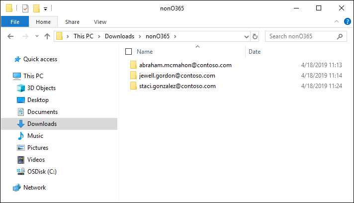
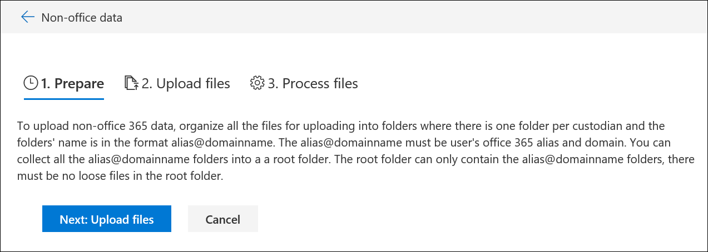
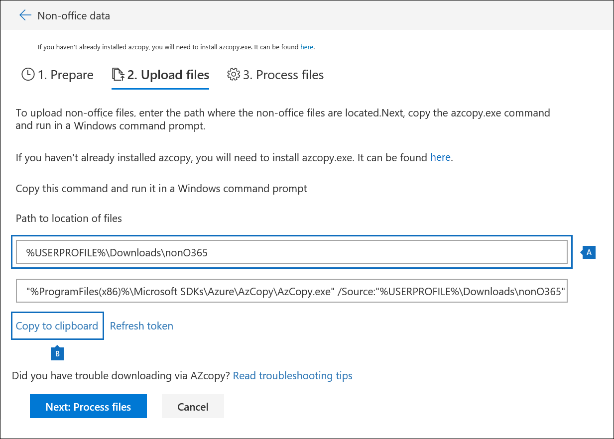

# Load non-Microsoft 365 data into a review set

Not all documents that you need to analyze in Advanced eDiscovery are located in Microsoft 365. With the non-Microsoft 365 data import feature in Advanced eDiscovery, you can upload documents that aren't located in Microsoft 365 to a review set. This article shows you how to bring your non-Microsoft 365 documents into Advanced eDiscovery for analysis.

## Requirements to upload non-Office 365 content

Using the upload non-Microsoft 365 feature described in this article requires that you have the following:

- All custodians that you want to associate non-Microsoft 365 content to must be assigned the appropriate license. For more information, see [Get started with Advanced eDiscovery](get-started-with-advanced-ediscovery.md#step-1-verify-and-assign-appropriate-licenses).

- An existing Advanced eDiscovery case.

- Custodians must be added to the case before you can upload and associate the non-Microsoft 365 data to them.

- Non-Microsoft 365 data must be a file type that's supported by Advanced eDiscovery. For more information, see [Supported file types in Advanced eDiscovery](supported-filetypes-ediscovery20.md).

- All files that are uploaded to a review set must be located in folders, where each folder is associated with a specific custodian. The names for these folders must use the following naming format: *alias@domainname*. The alias@domainname must be the user's Microsoft 365 alias and domain. You can collect all the alias@domainname folders in a root folder. The root folder can only contain the alias@domainname folders. Loose files in the root folder aren't supported.

   The folder structure for the non-Microsoft 365 data that you want to upload would be similar to the following example:

   - c:\nonO365\abraham.mcmahon@contoso.com
   - c:\nonO365\jewell.gordon@contoso.com
   - c:\nonO365\staci.gonzalez@contoso.com

   Where abraham.mcmahon@contoso.com, jewell.gordon@contoso.com, and staci.gonzalez@contoso.com are the SMTP addresses of custodians in the case.

   

- An account that is assigned to the eDiscovery Manager role group (and added as eDiscovery Administrator).

- The AzCopy v8.1 tool installed on a computer that has access to the non-Microsoft 365 content folder structure. To install AzCopy, see [Transfer data with the AzCopy v8.1 on Windows](/previous-versions/azure/storage/storage-use-azcopy). Be sure to install AzCopy in the default location, which is **%ProgramFiles(x86)%\Microsoft SDKs\Azure\AzCopy**. You must use AzCopy v8.1. Other versions of AzCopy may not work when loading non-Microsoft 365 data in Advanced eDiscovery.

## Upload non-Microsoft 365 content into Advanced eDiscovery

1. As an eDiscovery Manager or eDiscovery Administrator, open Advanced eDiscovery, and go to the case that the non-Microsoft 365 data will be uploaded to.  

2. Click **Review sets**, and then select the review set to upload the non-Microsoft 365 data to.  If you don't have a review set, you can create one. 
 
3. In the review set, click **Manage review set**, and then click **View uploads** on the **Non-Microsoft 365 data** tile.

4. Click **Upload files** to start the data import wizard.

   

   The first step in the wizard prepares a secure Microsoft-provided Azure Storage location to upload the files to.  When the preparation is completed, the **Next: Upload files** button becomes active.

   
 
5. Click **Next: Upload files**.

6. On the **Upload files** page, do the following:

   

   a. In the **Path to location of files** box, verify or type the location of the root folder where you've stored the non-Microsoft 365 data you want to upload. For example, for the location of the example files shown in the **Before you begin section**, you would type **%USERPROFILE\Downloads\nonO365**. Providing the correct location ensures the AzCopy command displayed in box under the path is properly updated.

   b. Click **Copy to clipboard** to copy the command that is displayed in the box.

7. Start a Windows command prompt, paste the command that you copied in the previous step, and then press **Enter** to start the AzCopy command.  After you start the command, the non-Microsoft 365 files will be uploaded to the Azure Storage location that was prepared in step 4.

   

   > [!NOTE]
   > As previously stated, you must use AzCopy v8.1 to successfully use the command that's provided on the **Upload files** page. If the supplied AzCopy command fails, please see [Troubleshoot AzCopy in Advanced eDiscovery](troubleshooting-azcopy.md).

8. Go back to the Security & Compliance Center, and click **Next: Process files** in the wizard.  This initiates processing, text extraction, and indexing of the non-Microsoft 365 files that were uploaded to the Azure Storage location.  

9. Track the progress of processing the files on the **Process files** page or on the **Jobs** tab by viewing a job named **Adding non-Microsoft 365 data to a review set**.  After the job is finished, the new files will be available in the review set.

   

10. After the processing is finished, you can close the wizard.