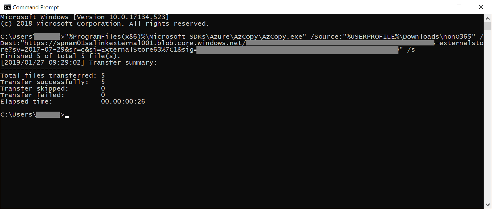

# Load non-Office 365 data into evidence

Not all documents that you may need to analyze with Office 365 Advanced eDiscovery will live in Office 365. With the Non-Office 365 content import feature in Advanced eDiscovery you can upload documents that don't live in Office 365 into a working set so it is analyzed with Advanced eDiscovery. This procedure shows you how to bring your non-Office 365 documents into Advanced eDiscovery for analysis.

>[!Note]
>Advanced eDiscovery requires an Office 365 E3 with the Advanced Compliance add-on or an E5 subscription for your organization. If you don't have that plan and want to try Advanced eDiscovery, you can sign up for a trial of Office 365 Enterprise E5.

## Before you begin
Using the upload Non-Office 365 feature as described in this procedure requires that you have:

- An Office 365 E3 with Advanced Compliance add-on or E5 subscription.

- All custodians whose non-Office 365 content will be uploaded must have E3 with Advanced Compliance add-on or E5 licenses.

- An existing eDiscovery case.

- All the files for uploading gathered into folders where there is one folder per custodian and the folders' name is in this format *alias@domainname* . The *alias@domainname* must be users Office 365 alias and domain. You can collect all the *alias@domainname* folders into a root folder. The root folder can only contain the *alias@domainname* folders, there must be no loose files in the root folder.

- An account that is either an eDiscovery Manager or eDiscovery Administrator
Microsoft Azure Storage Tools installed on a computer that has access to the non-Office 365 content folder structure.

- Install AzCopy, which you can do from here: https://docs.microsoft.com/en-us/azure/storage/common/storage-use-azcopy

## Upload non-Office 365 content into Advanced eDiscovery

1. As an eDiscovery Manager or eDiscovery Administrator, open Advanced eDiscovery, then the case that the non-Office 365 data will be uploaded to.  Click the **Working sets** tab, then select the working set you wish to load the Non-Office 365 data to.  If you have not already created a working set, you can do so now.  Finally, click **Manage workings set** then **View uploads** in the Non-Office 365 data section

2. Click the **Upload files** button to start the Non-Office 365 data import wizard.

3. The first step in the wizard simply prepares a secure Azure blob for the files to be uploaded.  Once preparation is compelted, click the **Next: Upload files** button.

 
4. In the **Upload files** step, specify the **Path to location of files**, this is where the Non-Office 365 data you plan on importing is located.  Setting the correct location ensures the AzCopy command is properly updated.

> [!NOTE]
> If you have not already installed AzCopy, you can do this from here: https://docs.microsoft.com/en-us/azure/storage/common/storage-use-azcopy

5. Copy the predefined command by clicking the **Copy to clipboard** link. Start a windows command prompt, paste the command and press enter.  The files will be uploaded to the secure Azure blob storage for the next step.

6. Finally, return back to the Security & Compliance and click the **Next: Process files** button.  This will initiate processing, text extraction and indexing of the uploaded files.  You can track the progress of processing here or in the **Jobs** tab.  Once completed, the new files will be available in the working set.  Once processing is complete, you can dismiss the wizard.

