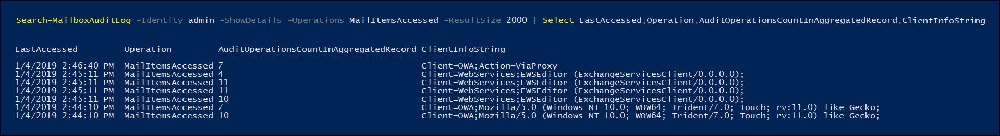

# Use Advanced Audit to investigate compromised accounts

A compromised user account (also called an *account takeover*) is a type of attack when an attacker gains access to a user account and operates as the user. These types of attacks sometimes cause more damage than the attacker may have intended. When investigating compromised email accounts, you have to assume that more mail data was compromised than may be indicated by tracing the attacker's actual presence. Depending on the type of data in email messages, you have to assume that sensitive information was compromised or face regulatory fines unless you can prove that sensitive information wasn't exposed. For example, HIPAA-regulated organizations face significant fines if there is evidence that patient health information (PHI) was exposed. In these cases, attackers are unlikely to be interested in PHI, but organizations still must report data breaches unless they can prove otherwise.

To help you with investigating compromise email accounts, we're now auditing accesses of mail data by mail protocols and clients with the *MailItemsAccessed* mailbox auditing action. This new audited action will help investigators better understand email data breaches and help you identify the scope of compromises to specific mail items that may been compromised. The goal of using this new auditing action is forensics defensibility to help assert that a specific piece of mail data was not compromised. If an attacker gained access to a specific piece of mail, Exchange Online audits the event even though there is no indication that the mail item was actually read.

## The MailItemsAccessed mailbox auditing action

The new MailItemsAccessed action is part of the new [Advanced Audit](advanced-audit.md) functionality. It's part of [Exchange mailbox auditing](/office365/securitycompliance/enable-mailbox-auditing#mailbox-auditing-actions) and is enabled by default for users that are assigned an Office 365 or Microsoft 365 E5 license or for organizations with a Microsoft 365 E5 Compliance add-on subscription.

The MailItemsAccessed mailbox auditing action covers all mail protocols: POP, IMAP, MAPI, EWS, Exchange ActiveSync, and REST. It also covers both types of accessing mail: *sync* and *bind*.

### Auditing sync access

Sync operations are only recorded when a mailbox is accessed by a desktop version of the Outlook client for Windows or Mac. During the sync operation, these clients typically download a large set of mail items from the cloud to a local computer. The audit volume for sync operations is huge. So, instead of generating an audit record for each mail item that's synched, we just generate an audit event for the mail folder containing items that were synched. This makes the assumption that *all* mail items in the synched folder have been compromised. The access type is recorded in the OperationProperties field of the audit record. 

See step 2 in the [Use MailItemsAccessed audit records for forensic investigations](#use-mailitemsaccessed-audit-records-for-forensic-investigations) section for an example of displaying the sync access type in an audit record.

### Auditing bind access

A bind operation is an individual access to an email message. For bind access, the InternetMessageId of individual messages will be recorded in the audit record. The MailItemsAccessed audit action records bind operations and then aggregates into a single audit record. All bind operations that occur within a 2-minute interval are aggregated in a single audit record in the Folders field within the AuditData property. Each message that was accessed is identified by its InternetMessageId. The number of bind operations that were aggregated in the record is displayed in the OperationCount field in the AuditData property.

See step 4 in the [Use MailItemsAccessed audit records for forensic investigations](#use-mailitemsaccessed-audit-records-for-forensic-investigations) section for an example of displaying the bind access type in an audit record.

### Throttling of MailItemsAccessed audit records

If more than 1,000 MailItemsAccessed audit records are generated in less than 24 hours, Exchange Online will stop generating auditing records for MailItemsAccessed activity. When a mailbox is throttled, MailItemsAccessed activity will not be logged for 24 hours after the mailbox was throttled. If this occurs, there's a potential that mailbox could have been compromised during this period. The recording of MailItemsAccessed activity will be resumed following a 24-hour period.  

Here's a few things to keep in mind about throttling:

- Less than 1% of all mailboxes in Exchange Online are throttled

- When a mailbox is throttling, only audit records for MailItemsAccessed activity are not audited. Other mailbox auditing actions aren't affected.

- Mailboxes are throttled only for Bind operations. Audit records for sync operations are not throttled.

- If a mailbox is throttled, you can probably assume there was MailItemsAccessed activity that wasn't recorded in the audit logs.

See step 1 in the [Use MailItemsAccessed audit records for forensic investigations](#use-mailitemsaccessed-audit-records-for-forensic-investigations) section for an example of displaying the IsThrottled property in an audit record.

## Use MailItemsAccessed audit records for forensic investigations

Mailbox auditing generates audit records for access to email messages so that you can be confident that email messages haven't been compromised. For this reason, in circumstances where we're not certain that some data has been accessed, we assume that it has by recording all mail access activity.

Using MailItemsAccessed audit records for forensics purposes is typically performed after a data breach has been resolved and the attacker has been evicted. To begin your investigation, you should identify the set of mailboxes that they have been compromised and determine the time frame when attacker had access to mailboxes in your organization. Then, you can use the **Search-UnifiedAuditLog** or **Search-MailboxAuditLog** cmdlets in [Exchange Online PowerShell](/powershell/exchange/connect-to-exchange-online-powershell) to search audit records that correspond to the data breach. 

You can run one of the following commands to search for MailItemsAccessed audit records:

**Unified audit log**

```powershell
Search-UnifiedAuditLog -StartDate 01/06/2020 -EndDate 01/20/2020 -UserIds <user1,user2> -Operations MailItemsAccessed -ResultSize 1000
```

**Mailbox audit log**

```powershell
Search-MailboxAuditLog -Identity <user> -StartDate 01/06/2020 -EndDate 01/20/2020 -Operations MailItemsAccessed -ResultSize 1000 -ShowDetails
```

> [!TIP]
> One primary difference between these two cmdlets in that you can use the **Search-UnifiedAuditLog** cmdlet to search for audit records for activity performed by one or more users. That's because *UserIds* is a multi-value parameter. The **Search-MailboxAuditLog** cmdlet searches the mailbox audit log for a single user.

Here are the steps for using MailItemsAccessed audit records to investigate a compromised user attack. Each step shows the command syntax for the **Search-UnifiedAuditLog** or **Search-MailboxAuditLog** cmdlets.

1. Check whether the mailbox has been throttled. If so, this would mean that some mailbox auditing records would not have been logged. In the case that any audit records have the "IsThrottled" is "True," you should assume that for a 24-hour period afterwards that record was generated, that any access to the mailbox was not audited and that all mail data has been compromised.

   To search for MailItemsAccessed records where the mailbox was throttled, run the following command:

   **Unified audit log**
 
   ```powershell
   Search-UnifiedAuditLog -StartDate 01/06/2020 -EndDate 01/20/2020 -UserIds <user1,user2> -Operations MailItemsAccessed -ResultSize 1000 | Where {$_.AuditData -like '*"IsThrottled","Value":"True"*'} | FL
   ```

   **Mailbox audit log**

   ```powershell
   Search-MailboxAuditLog -StartDate 01/06/2020 -EndDate 01/20/2020 -Identity <user> -Operations MailItemsAccessed -ResultSize 10000 -ShowDetails | Where {$_.OperationProperties -like "*IsThrottled:True*"} | FL
   ```

2. Check for sync activities. If an attacker uses an email client to downloaded messages in a mailbox, they can disconnect the computer from the Internet and access the messages locally without interacting with the server. This means that mailbox auditing would not be able to audit these activities.

   To search for MailItemsAccessed records where the mail items were accessed by a sync operation, run the following command:

   **Unified audit log**

   ```powershell
   Search-UnifiedAuditLog -StartDate 01/06/2020 -EndDate 02/20/2020 -UserIds <user1,user2> -Operations MailItemsAccessed -ResultSize 1000 | Where {$_.AuditData -like '*"MailAccessType","Value":"Sync"*'} | FL
   ```

   **Mailbox audit log**

   ```powershell
   Search-MailboxAuditLog -StartDate 01/06/2020 -EndDate 01/20/2020 -Identity <user> -Operations MailItemsAccessed -ResultSize 10000 -ShowDetails | Where {$_.OperationProperties -like "*MailAccessType:Sync*"} | FL
   ```

3. Check sync activities to determine in any of them have occurred in the same context as the one used by the attacker access the mailbox. Context is identified and differentiated by the IP address of the client computer used to access the mailbox and the mail protocol. For more information, see the [Identifying the access contexts of different audit records](#identifying-the-access-contexts-of-different-audit-records) section.

   Use the properties listed below to investigate. These properties are located in the AuditData or OperationProperties property. If any of the syncs occur in the same context as the attacker activity, assume the attacker has synced all mail items to their client, which means the entire mailbox has probably been compromised.

   |Property         | Description |
   |:---------------- | :----------|
   |ClientInfoString | Describes protocol, client (includes version)|
   |ClientIPAddress  | IP address of the client machine.|
   |SessionId        | Session ID helps to differentiate attacker actions vs day-to-day user activities on the same account (in the case of a compromised account)|
   |UserId           | UPN of the user reading the message.|
   |||

4. Check for bind activities. After performing steps 2 and step 3, you can be confident that all other access to email messages by the attacker will be captured in the MailItemsAccessed audit records that have a MailAccessType property with a value of "Bind".

   To search for MailItemsAccessed records where the mail items were accessed by a Bind operation, run the following command.

   **Unified audit log**

   ```powershell
   Search-UnifiedAuditLog -StartDate 01/06/2020 -EndDate 01/20/2020 -UserIds <user1,user2> -Operations MailItemsAccessed -ResultSize 1000 | Where {$_.AuditData -like '*"MailAccessType","Value":"Bind"*'} | FL
   ```
 
   **Mailbox audit log**
   
   ```powershell
   Search-MailboxAuditLog -StartDate 01/06/2020 -EndDate 01/20/2020 -Identity <user> -Operations MailItemsAccessed -ResultSize 10000 -ShowDetails | Where {$_.OperationProperties -like "*MailAccessType:Bind*"} | FL
   ```

   Email messages that were accessed are identified by their internet message Id. You can also check to see if any audit records have the same context as the ones for other attacker activity. For more information, see the [Identifying the access contexts of different audit records](#identifying-the-access-contexts-of-different-audit-records) section.
 
   You can use the audit data for bind operations in two different ways:

     - Access or collect all email messages the attacker accessed by using the InternetMessageId to find them and then checking to see if any of those messages contains sensitive information.

     - Use the InternetMessageId to search audit records related to a set of potentially sensitive email messages. This is useful if you're concerned only about a small number of messages.

## Filtering of duplicate audit records

Duplicate audit records for the same bind operations that occur within an hour of each other are filtered out to remove auditing noise. Sync operations are also filtered out at one-hour intervals. The exception to this de-duplication process occurs if, for the same InternetMessageId, any of the properties described in the following table are different. If one of these properties is different in a duplicate operation, a new audit record is generated. This process is described in more detail in the next section.

| Property| Description|
|:--------|:---------|
|ClientIPAddress | IP address of the client computer.|
|ClientInfoString| The client protocol, client used to access the mailbox.| 
|ParentFolder    | The full folder path of the mail item that was accessed. |
|Logon_type      | The logon type of the user who performed the action. The logon types (and their corresponding Enum value) are Owner (0), Admin (1), or Delegate (2).|
|MailAccessType  | Whether the access is a bind or a sync operation.|
|MailboxUPN      | The UPN of the mailbox where the message being read is located.|
|User            | The UPN of the user reading the message.|
|SessionId       | The Session Id helps to differentiate attacker actions and day-to-day user activities in the same mailbox (in the case of account compromise) For more information about sessions, see [Contextualizing attacker activity within sessions in Exchange Online](https://techcommunity.microsoft.com/t5/exchange-team-blog/contextualizing-attacker-activity-within-sessions-in-exchange/ba-p/608801).|
||||

## Identifying the access contexts of different audit records

It's common that an attacker may access a mailbox at the same time the mailbox owner is accessing it. To differentiate between access by the attacker and the mailbox owner, there are audit record properties that define the context of the access. As previously explained, when the values for these properties are different, even when the activity occurs within the aggregation interval, separate audit records are generated. In the following example, there are three different audit records. Each one is differentiated by the Session Id and ClientIPAddress properties. The messages that were accessed are also identified.

|Audit record 1  |Audit record 2  |Audit record 3|
|---------|---------|---------|
|ClientIPAddress**1**<br/>SessionId**2**|ClientIPAddress**2**<br/>SessionId**2**|ClientIPAddress**1**<br/>SessionId**3**|
|InternetMessageId**A**<br/>InternetMessageId**D**<br/>InternetMessageId**E**<br/>InternetMessageId**F**<br/>|InternetMessageId**A**<br/>InternetMessageId**C**|InternetMessageId**B** |
||||

If any of the properties listed in the table in the [previous section](#filtering-of-duplicate-audit-records) are different, a separate audit record is generated to track the new context. Accesses will be sorted into the separate audit records depending on the context in which the activity took place.

For example, in audit records shown in the following screenshot, though we are accessing mail from EWSEditor and OWA simultaneously, the access activity is collated in different audit records depending on the context in which the access took place. In this case, the context is defined by different values for the ClientInfoString property.



Here is the syntax for the command shown in the previous screenshot:

```powershell
Search-MailboxAuditLog -Identity admin -ShowDetails -Operations MailItemsAccessed -ResultSize 2000 | Select LastAccessed,Operation,AuditOperationsCountInAggregatedRecord,ClientInfoString
```