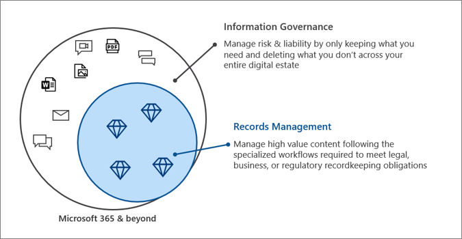

# Microsoft Information Governance in Microsoft 365

>*[Microsoft 365 licensing guidance for security & compliance](https://aka.ms/ComplianceSD).*

Use Microsoft Information Governance (sometimes abbreviated to MIG) capabilities to govern your data for compliance or regulatory requirements.

Looking to protect your data? See [Microsoft Information Protection in Microsoft 365](information-protection.md).

## Information governance

To keep what you need and delete what you don't:
 
|Capability|What problems does it solve?|Get started|
|:------|:------------|:--------------------|:-----------------------------|
|[Retention policies and retention labels](retention.md)| Retain or delete content with policy management and a deletion workflow for email, documents, instant messages, and more   Example scenario: [Apply a retention label to content automatically](apply-retention-labels-automatically.md) | [Get started with retention policies and retention labels](get-started-with-retention.md)|
|[Import service](importing-pst-files-to-office-365.md)| Bulk-import PST files to Exchange Online mailboxes to retain and search email messages for compliance or regulatory requirements | [Use network upload to import your organization's PST files to Microsoft 365](use-network-upload-to-import-pst-files.md)|
|[Archive third-party data](archiving-third-party-data.md)| Import, archive, and apply compliance solutions to third-party data from social media platforms, instant messaging platforms, and document collaboration platforms| [Third-party connectors](archiving-third-party-data.md#third-party-data-connectors)|
|[Inactive mailboxes](inactive-mailboxes-in-office-365.md)| Retain mailbox content after employees leave the organization | [Create and manage inactive mailboxes](create-and-manage-inactive-mailboxes.md)|

## Records management

To manage high-value content for legal, business, or regulatory obligations:

|Capability|What problems does it solve?|Get started|
|:------|:------------|---------------------|:----------------------------|
|[Records management](records-management.md)| A single solution for email and documents that incorporates retention schedules and requirements into a file plan that supports the full lifecycle of your content with records declaration, retention, and disposition   Example scenario: [Disposition of records](disposition.md#disposition-of-records)|[Get started with records management](get-started-with-records-management.md) |

