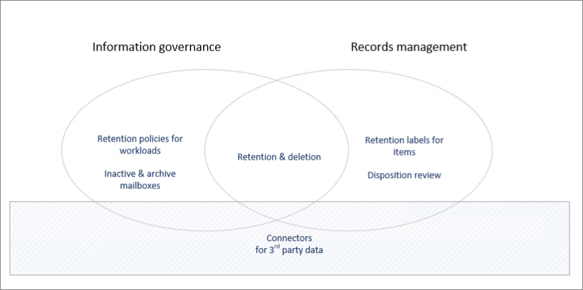

# Govern your data with Microsoft Purview

[!include[Purview banner](../includes/purview-rebrand-banner.md)]

>*[Microsoft 365 licensing guidance for security & compliance](/office365/servicedescriptions/microsoft-365-service-descriptions/microsoft-365-tenantlevel-services-licensing-guidance/microsoft-365-security-compliance-licensing-guidance).*

Use the capabilities from **Microsoft Purview Data Lifecycle Management** (formerly Microsoft Information Governance) and **Microsoft Purview Records Management** to govern your data for compliance or regulatory requirements.

From a [licensing perspective](#licensing-requirements), there can be considerable overlap between data lifecycle management and records management. Both solutions support retention and deletion of data for Microsoft 365 apps and services.

Use the following graphic to help you identify the main configurable components for these solutions that each have their own configuration area in the Microsoft Purview compliance portal:

Looking to protect your data? See [Protect your data with Microsoft Purview](information-protection.md).

## Microsoft Purview Data Lifecycle Management

To keep what you need and delete what you don't:
 
|Capability|What problems does it solve?|Get started|
|:------|:------------|:--------------------|:-----------------------------|
|[Retention policies for Microsoft 365 workloads, with retention labels for exceptions](retention.md) | Retain or delete content with policy management for email, documents, Teams and Yammer messages | [Create and configure retention policies](create-retention-policies.md)    [Create retention labels for exceptions to your retention policies](create-retention-labels-information-governance.md)|
|[Archive mailboxes](archive-mailboxes.md)| Provides users with additional mailbox storage space | [Enable archive mailboxes](enable-archive-mailboxes.md) |
|[Inactive mailboxes](inactive-mailboxes-in-office-365.md)| Retain mailbox content after employees leave the organization so that this content remains accessible to administrators, compliance officers, and records managers | [Create and manage inactive mailboxes](create-and-manage-inactive-mailboxes.md)|
|[Import service for PST files](importing-pst-files-to-office-365.md)| Bulk-import PST files to Exchange Online mailboxes to retain and search email messages for compliance or regulatory requirements | [Use network upload to import your organization's PST files to Microsoft 365](use-network-upload-to-import-pst-files.md)|

## Microsoft Purview Records Management

Lifecycle management of high-value items for legal, business, or regulatory obligations:

|Capability|What problems does it solve?|Get started|
|:------|:------------|---------------------|:----------------------------|
|[Records management](records-management.md)| A single solution for email and documents that incorporates flexible retention and deletion schedules and requirements to support the full lifecycle of your content with records declaration and defensible disposition when needed |[Get started with records management](get-started-with-records-management.md) |

## Licensing requirements

License requirements for Microsoft Purview Data Lifecycle Management and Microsoft Purview Records Management depend on the scenarios and features you use, rather than set licensing requirements for each capability listed on this page. To understand your licensing requirements and options, see the following sections from the [Microsoft 365 licensing documentation](/office365/servicedescriptions/microsoft-365-service-descriptions/microsoft-365-tenantlevel-services-licensing-guidance/microsoft-365-security-compliance-licensing-guidance): 
- [Information Governance](/office365/servicedescriptions/microsoft-365-service-descriptions/microsoft-365-tenantlevel-services-licensing-guidance/microsoft-365-security-compliance-licensing-guidance#information-governance) 
- [Records Management](/office365/servicedescriptions/microsoft-365-service-descriptions/microsoft-365-tenantlevel-services-licensing-guidance/microsoft-365-security-compliance-licensing-guidance#records-management) 

Any additional licensing requirements will be included in the documentation instructions. For example, licensing specific to managing mailboxes might require licenses from Exchange Online.