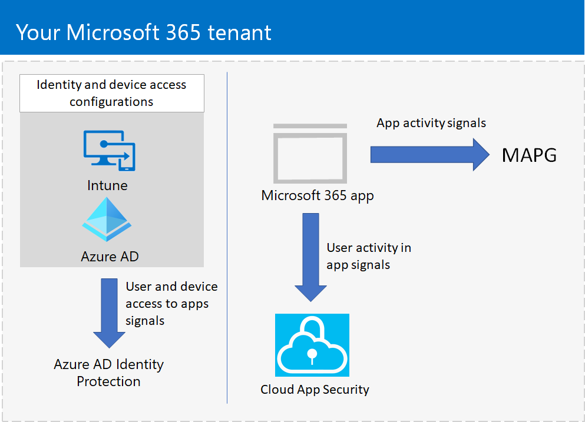

# Microsoft Application and Protection Governance in Microsoft 365 (in preview)

>*[Microsoft 365 licensing guidance for security & compliance](https://aka.ms/ComplianceSD).*

Microsoft Application Protection and Governance (MAPG) is a solution for Microsoft 365 applications that provides you with comprehensive: 

- **Insights**: See a view of all of your Microsoft 365 applications in your tenant in a single dashboard. You can see all the applications’ activities and react or respond to them.
- **Governance**: Create proactive or reactive policies for application and user patterns and behaviors and protect your users from using non-compliant or malicious apps and limiting access to data through risky apps.
- **Detection**: Be alerted and notified when there are anomalies in app activity and when non-compliant, malicious, or risky apps are used. 
- **Remediation**: Along with automatic remediation capabilities, use remediation tools and controls in a timely manner to respond to anomalous app activity detections.

Unlike other application governance products in the marketplace, MAPG is a platform-based solution that is an integral part of the Microsoft 365 app ecosystem. Today, Microsoft allows developers to build cloud applications using Azure AD, Microsoft’s cloud identity platform, and other resources and access to tenant data through the Microsoft Graph. With MAPG, developers can build high-quality productivity apps that are secure and compliant.

With MAPG, Microsoft 365 provides a comprehensive level of protection from malicious actors that use apps to access your tenant data:

- App access and restrictions based on user and device identity

  With Azure AD and Intune, you can configure identity and device access policies to enforce secure sign-ins and to allow and restrict app access. With Azure AD Identity Protection, you can monitor user and device access and respond to anomalous behavior.

- User activity within apps

  With Microsoft Cloud App Security, you can monitor user activity and respond to anomalous behavior.

- App activity within a Microsoft 365 tenant
 
  With MAPG, you can monitor what apps are doing and respond to anomalous behavior.

This figure shows the three levels of protection and governance for apps in Microsoft 365 with MAPG.

In this illustration:

- Identity and device access configurations with Intune and Azure AD provide a first layer of defense by enforcing secure sign-ins and restricted access to apps in your tenant.
- Microsoft Cloud App Security, included with Microsoft 365 E3 or Microsoft 365 E3 with the Identity & Threat Protection add-on, collects signals on user activity in Microsoft 365 apps and can detect and remediate anomalous user behavior.
- MAPG collects signals on Microsoft 365 app activity within a tenant and can detect and remediate anomalous app behavior.

## Licensing

MAPG has the following levels of functionality:

- Basic: Provided with all  Microsoft 365 products, from Microsoft 365 Business Premium to Microsoft 365 E5.
- Premium: Provided with Microsoft 365 E5 or Microsoft 365 E3 with the Microsoft 365 E5 Compliance add-on.
- Security: Provided with Microsoft Cloud App Security in Microsoft 365 E3 or Microsoft 365 E3 with the Identity & Threat Protection add-on.

## Administrator roles

The following administration roles are required to see MAPG pages and manage policies and settings:

- Security Administrator 
- Security Reader (read-only) 
- Security Operator 
- Compliance Administrator 
- Compliance Reader (read-only) 
- Global Administrator 
- Global Reader

REVIEWERS: I have plans to add the role/capabilities table from the onboarding guide.

## Using MAPG

Using MAPG to protect your tenant and its data from potentially malicious or ill-behaved apps falls into these three areas:

| Area | Description |
|:-------|:-----|
| App visibility and insights (add link to first article in **Visibility and insights** node) | Get a 360° view on traffic and activity of the Microsoft 365 applications in your tenant. |
| App policies for reinforced governance (add link to first article in **App policies** node) | Create proactive or reactive app policies, which will allow you to enforce governance for your Microsoft 3635 apps. |
| Detection and remediation (add link to first article in **Detection and remediation** node) | Based on the alerts generated through the settings on your app policies, monitor your apps for anomalous app behavior and remediate them, either automatically based on app policy settings or manually. |
|||

