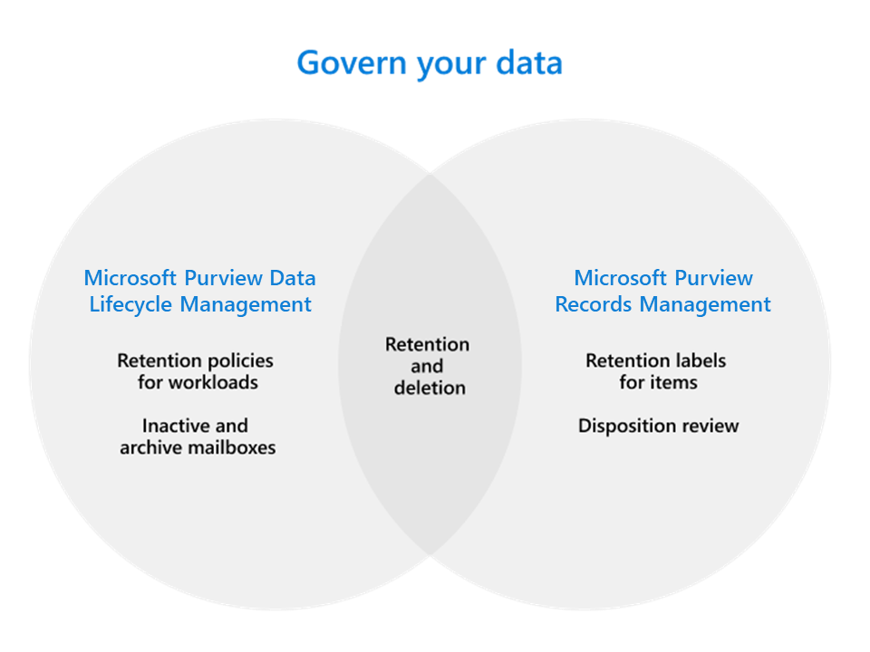

# Govern your data with Microsoft Purview

>*[Microsoft 365 licensing guidance for security & compliance](/office365/servicedescriptions/microsoft-365-service-descriptions/microsoft-365-tenantlevel-services-licensing-guidance/microsoft-365-security-compliance-licensing-guidance).*

Use the capabilities from **Microsoft Purview Data Lifecycle Management** (formerly Microsoft Information Governance) and **Microsoft Purview Records Management** to govern your data for compliance or regulatory requirements.

> [!TIP]
> Looking to map and manage your data across your entire data estate, including multi-cloud, and software-as-a-service (SaaS)? Use [Microsoft Purview Data Map, Microsoft Purview Data Catalog, and Microsoft Purview Data Estate Insights](/azure/purview/overview).

From a [licensing perspective](#licensing-requirements), there can be considerable overlap between data lifecycle management and records management. Both solutions support retention and deletion of data for Microsoft 365 apps and services.

Use the following graphic to help you identify the main configurable components for these solutions that each have their own configuration area in the Microsoft Purview compliance portal:

The following sections detail the main capabilities for each solution, with links to understand more. However, if you're looking for a guided deployment, see [Deploy a data governance solution with Microsoft Purview](data-governance-solution.md).

Looking for complementary capabilities to protect your data? See [Protect your data with Microsoft Purview](information-protection.md).

## Microsoft Purview Data Lifecycle Management

To keep what you need and delete what you don't:
 
|Capability|What problems does it solve?|
|:------|:------------|:----------------|
|[Retention policies for Microsoft 365 workloads, with retention labels for exceptions](retention.md) | Lets you retain or delete content with policy management for email, documents, Teams and Yammer messages. |
|[Inactive mailboxes](inactive-mailboxes-in-office-365.md)| Lets you retain mailbox content after employees leave the organization so that this content remains accessible to administrators, compliance officers, and records managers. |
|[Archive mailboxes](archive-mailboxes.md)| Provides additional mailbox storage space for users.|
|[Import service for PST files](importing-pst-files-to-office-365.md)| Supports bulk-importing PST files to Exchange Online mailboxes to retain and search email messages for compliance or regulatory requirements. |

Want to learn more? See [Learn about data lifecycle management](data-lifecycle-management.md).

Ready to start using some or all of these capabilities? See [Get started with data lifecycle management](get-started-with-data-lifecycle-management.md).

## Microsoft Purview Records Management

Manage high-value items for business, legal, or regulatory record-keeping requirements:

|Capability|What problems does it solve?|
|:---------|:---------------------------|
|[File plan](file-plan-manager.md)| Lets you create retention labels interactively or import in bulk, and export for analysis. Labels support additional administrative information (optional) to help you identify and track business or regulatory requirements. |
|[Retention labels for individual items, retention policies if needed for baseline retention](retention.md)| Labels support flexible retention and deletion schedules that can be applied manually or automatically, with records declaration when needed. |
|[Disposition review and proof of disposition](disposition.md)| Manual review of content before it's permanently deleted, with proof of disposition of records.|

Want to learn more? See [Learn about records management](records-management.md).

Ready to start using some or all of these capabilities? See [Get started with records management](get-started-with-records-management.md).

## Licensing requirements

To understand your licensing requirements and options, see the information from the Microsoft 365 guidance for security & compliance, [Microsoft Purview Data Lifecycle Management & Microsoft Purview Records Management](/office365/servicedescriptions/microsoft-365-service-descriptions/microsoft-365-tenantlevel-services-licensing-guidance/microsoft-365-security-compliance-licensing-guidance#microsoft-purview-data-lifecycle-management--microsoft-purview-records-management) section for feature-level licensing requirements.