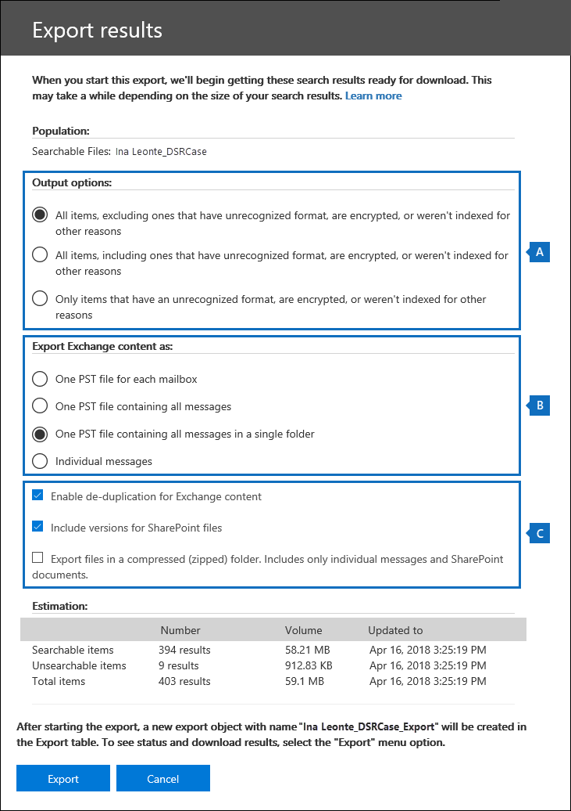
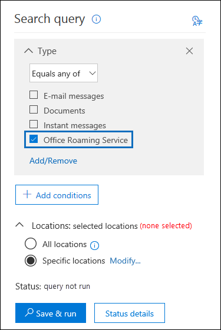
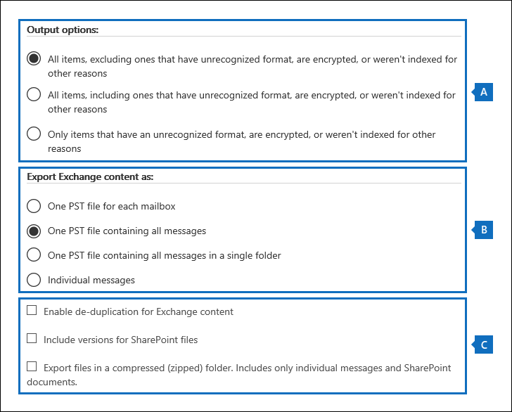

# Manage GDPR data subject requests with the DSR case tool in the Security & Compliance Center

The EU General Data Protection Regulation (GDPR) is about protecting and enabling individuals' privacy rights inside the European Union (EU). The GDPR gives individuals in the European Union (known as data subjects) the right to access, retrieve, correct, erase, and restrict processing of their personal data. Under the GDPR, personal data means any information relating to an identified or identifiable natural person. A formal request by a person to their organization to take an action on their personal data is called a Data Subject Request or DSR. For detailed information about responding to DSRs for data in Office 365, see [Office 365 Data Subject Request Guide](https://go.microsoft.com/fwlink/?linkid=871169 ).
  
To manage investigations in response to a DSR submitted by a person in your organization, you can use the DSR case tool in the Security & Compliance Center to find content stored in:
  
- Any user mailbox in your organization. This includes Skype for Business conversations and one-to-one chats in Microsoft Teams
    
- All mailboxes associated with an Office 365 Group and all team mailboxes in Microsoft Teams
    
- All SharePoint Online sites and OneDrive for Business accounts in your organization
    
- All Teams sites and Office 365 Group sites in your organization
    
- All public folders in Exchange Online
    
Using the DSR case tool you can:
  
- Create a separate case for each DSR investigation.
    
- Control who has access to the DSR case by adding people as members of the case; only members can access the case and can only see their cases in the list of cases on the **DSR cases** page in the Security & Compliance Center. Also, you can assign different permissions to different members of the same case. For example, you can allow some members to only view the case and search results and allow other members to create searches and export search results. 
    
- Use the built-in search to search for all content created or uploaded by a specific data subject.
    
- Optionally revise the built-in search query and rerun the search to narrow the search results.
    
- Add other content searches associated with the DSR case. This includes creating searches that return partially indexed items and system-generated logs from the Office Roaming Service.
    
- Export data in response to a DSR access or export request.
    
- Delete cases when the DSR investigation process is complete. This removes all searches and export jobs associated with the case.
    
Here's the high-level process for using the DSR case tool to manage DSR investigations:
  
[Step 1: Assign eDiscovery permissions to potential case members](#step-1-assign-ediscovery-permissions-to-potential-case-members)

[Step 2: Create a DSR case and add members](#step-2-create-a-dsr-case-and-add-members)

[Step 3: Run the search query](#step-3-run-the-search-query)

[Step 4: Export the data](#step-4-export-the-data)

[(Optional) Step 5: Revise the built-in search query](#optional-step-5-revise-the-built-in-search-query)

[More information about using the DSR case tool](#more-information-about-using-the-dsr-case-tool)
  
> [!IMPORTANT]
> Our tools can help admins perform DSR access or export requests by enabling them to utilize the built-in search and export functionality found in the DSR case tool. The tool helps to facilitate a best-effort method to export data that's relevant to a DSR request submitted by a data subject. However, it's important to note that search results can vary based on the data subject or the admin actions taken that may impact whether or not an item would be deemed as "personal data" for export purposes. For example, if the data subject was the last person to modify a file they didn't create, the file might not be returned in the search results. Similarly, an admin could export data without including partially indexed items or all versions of SharePoint documents. Therefore, the tools provided can help facilitate accessing and exporting data requests; however, the results are subject to specific admin and data subject usage scenarios. 
  
## Step 1: Assign eDiscovery permissions to potential case members

By default, a global administrator can access the DSR case tool in the Security & Compliance Center. By design, other users such as a data privacy officer, a human resources manager, or other people involved in DSR investigations don't have access to the DSR case tool and will have to be assigned the appropriate permissions to access the tool. The easiest way to do this is to go to the **Permissions** page in the Security & Compliance Center and add users to the eDiscovery Manager role group. You also have to assign these permissions so you can add them as members of the DSR case that you create in Step 2. 
  
For step-by-step instructions, see [Assign eDiscovery permissions in the Office‍ 365 Security & Compliance Center](assign-ediscovery-permissions.md).
  
> [!NOTE]
> By default, a global administrator (or other members of the Organization Management role group in the Security & Compliance Center don't have the necessary permissions to export Content Search results (see Step 4 in this article). To address this, an admin can add themselves as a member of the eDiscovery Manager role group. 
  
## Step 2: Create a DSR case and add members

The next step is to create a DSR case. When you create a case, you can choose to start the built-in search or you can create the case without starting the search. The following procedure instructs you to create the case without starting the search and then show you how to add members to the case.
  
1. Go to [https://protection.office.com](https://protection.office.com) and sign in using your work or school account. 
    
2. In the Security & Compliance Center, click **Data privacy** \> **Data subject requests**, and then click  **New DSR case**.
    
3. On the **New DSR case** flyout page, give the case a name, type an optional description, and then click **Next**. The name of the case must be unique in your organization.
    
    > [!TIP]
    > Consider adding the name of the person who submitted the DSR request that you're investigating in the name and/or description of the new case. Note that only members of this case (and eDiscovery Administrators) will be able to see the case in the list of cases on the **Data subject requests** page. 
  
4. On the **Request details** page, under **Data subject (the person who filed this request)**, select the person that you want to find and export data for and then click **Next**.
    
5. On the **Confirm your case settings** page, you can change the case name and description, and select a different data subject. Otherwise, click **Save**.
    
    A page is displayed that confirms the new DSR case has been created.
    
    
  
    At this point, you can do one of two things:
    
    a. Clicking **Show me search results** starts the search. This is the default selection. The built-in search that's run when you select this option and the results that are returned are discussed in Step 3.
    
    b. Clicking **Finish** closes the new DSR case without starting the built-in search. When you select this option, the new DSR case is displayed on the **Data subject requests** page.
    
6. Click **Finish** so that you can go in to the new DSR case and add members to it. 
    
7. On the **Data subject requests** page, click the name of the DSR case that you created. 
    
8. On the **Manage this case** flyout page, under **Manage members**, click **Add**. 
    
    Under **Users**, a list of people that are assigned the appropriate eDiscovery permissions is displayed. The people you assigned eDiscovery permissions to in Step 1 will be displayed in this list. 
    
9. Select the people to add as members of the DSR case, click **Add**, and then save your changes.
    
    You can also add role groups as members of DSR case by clicking **Add** under **Manage role groups**. 
    
## Step 3: Run the search query

After you create a DSR case and add members, the next step is to run the built-in search that's associated with the case. This default search query does the following things:
  
- Searches all mailboxes in your organization for all email items that were sent or received by the data subject. This is accomplished by using the  *Participants*  email property, which searches for the data subject in all the people fields in an email message. This property returns items in which the data subject is in the **From**, **To**, **CC**, and **BCC** fields. Public folders in Exchange Online are also searched for messages sent or received by the data subject. 
    
- Searches all sites in your organization for documents and items created or uploaded by the data subject. This is accomplished by using the following site properties:
    
  - The  *Author*  property returns items where the data subject is listed in the author field in Office documents. This value persists, even if the document is copied and uploaded by someone else. 
    
  - The  *CreatedBy*  property returns items that were created or uploaded by the data subject. 
    
Here's what the keyword query looks like for the built-in search that gets automatically created when you create a DSR case.
  
```powershell
participants:"<email address>" OR author:"<display name>" OR createdby:"<display name>"
```

For example, if the name of the data subject is Ina Leonte, the keyword query would look like this:
  
```powershell
participants:"ina@contoso.com" OR author:"Ina Leonte" OR createdby:"Ina Leonte"
```

 **To run the built-in search for a DSR case:**
  
1. In the Security & Compliance Center, click **Data privacy** \> **Data subject requests**, and then click **Open** next to the DSR case that you created in Step 2. 
    
    Click the **Search** tab at the top of the page, and then click the checkbox next to the built-in search that was created when you created the DSR case. The search has the same name as the DSR case. 
    
2. In the search flyout page, click **Open query**.
    
    When you open the query, the search is started and will complete in a few moments. 
    
3. When the search is complete, click **Preview results** to preview the search results. For more information, see [Preview search results](content-search.md#preview-search-results).
    
    > [!TIP]
    > You can also view the search query statistics to see the number of mailbox and site items that are returned by the search, and the top content locations that contain items that match the search query. For more information, see [View information and statistics about a search](content-search.md#view-information-and-statistics-about-a-search). 
  
You can edit the built-in search query, change the content locations that are searched, and then rerun the search. See [Step 5](#optional-step-5-revise-the-built-in-search-query) for more information. 
  
## Step 4: Export the data

After you run the built-in search, you can export the search results. Alternatively, before you export the data, you may want to revise the query to reduce the number of search results. See Step 5 for more information about narrowing the search results.
  
When you export search results, mailbox items can be downloaded in PST files or as individual messages. When you export content from SharePoint and OneDrive accounts, copies of native Office documents and other documents are exported. A results file that contains information about every exported item is included with the search results. For more detailed information about exporting, see [Export Content Search results](export-search-results.md).
  
> [!NOTE]
> By default, a global administrator (or other members of the Organization Management role group in the Security & Compliance Center) don't have the necessary permissions to export Content Search results. To address this, an admin can add themselves as a member of the eDiscovery Manager role group. 
  
The computer you use to export data has to meet the following system requirements:
  
- 32-bit or 64-bit versions of Windows 7 and later versions
    
- Microsoft .NET Framework 4.7
    
- A supported browser:
    
  - Microsoft Edge
    
    Or
    
  - Microsoft Internet Explorer 10 and later versions
    
    > [!NOTE]
    > Microsoft doesn't manufacture third-party extensions or add-ons for ClickOnce applications. Exporting data using an unsupported browser with third-party extensions or add-ons isn't supported. 
  
 **To export data from the built-in search in a DSR case:**
  
1. In the Security & Compliance Center, click **Data privacy** \> **Data subject requests**, and then click **Open** next to the DSR case that you want to export data from. 
    
2. Click the **Search** tab at the top of the page, and then click the checkbox next to the built-in search that was created when you created the DSR case. Or click another search to export data from that search. 
    
3. On the search flyout page, click  **More**, and then select **Export results** from the drop-down list. 
    
4. On the **Export results** page, select the following recommended options for DSR export requests. 
    
    
  
    a. Under **Output options**, select the first option (**All items, excluding ones that have ones that have an unrecognized format, are encrypted, or weren't indexed for other reasons**) to export indexed items only. The reason you don't want to export partially indexed items from the built-in search is because partially indexed items from other users will also be exported. To export only the partially indexed items for the data subject, we recommend that you create a separate search. For more information, see [Exporting partially indexed items](#exporting-partially-indexed-items) in the "More information about using the DSR case tool" section.
    
    b. Under **Export Exchange content as**, select the third option, **One PST file containing all messages in a single folder**. Because some of the results may be for items that originated in another user's mailbox, this option just lists the item in a single folder without indicating the actual mailbox and is the best option to use when you de-duplicate the results as recommended in the next item. This option also lets the data subject review items in chronological order (items are sorted by sent date) without having to navigate the original mailbox folder structure for each item.
    
    c. Select **Enable de-duplication** option to excludes duplicate email messages. We recommend this option because the built-in search searches all mailboxes in your organization. So if multiple copies of the same message are found in the mailboxes that were searched, this option means that only one copy of a message will be exported. This option, together will exporting messages in one PST file in a single folder, results in the best user experience for DSR export requests. The Results.csv export report lists all locations where duplicate messages were found.
    
    Optionally, you can select **Include versions for SharePoint documents** option to export all versions of SharePoint and OneDrive documents. This requires that versioning is turned on for document libraries. This option helps to ensure that all relevant data is exported.
    
5. After you choose the export settings, click **Export**.
    
    The search results are prepared for downloading, which means they're uploaded to the Azure Storage area for your organization in the Microsoft cloud. The next steps show you how to download this data to your local computer.
    
6. Click the **Export** tab to display the export job you created. Export jobs have the same name as the corresponding search with **_Export** appended to the end of search name. 
    
7. Click the export job that you just created to display the export flyout page. This page shows information about the search, such as the size and total number of items to be exported, and the percentage of the items that have been transferred to an Azure storage area. Click **Refresh** to update the upload status information. 
    
8. Under **Export key**, click **Copy to clipboard**. You use this key in step 11 to download the search results.
    
9. Click  **Download results** at the top of the export flyout page. 
    
10. In the pop-up window at the bottom of the page, click **Open** to open the **Microsoft Office 365 eDiscovery Export Tool**. The **eDiscovery Export Tool** will be installed the first time you download search results. 
    
11. In the **eDiscovery Export Tool**, paste the export key that you copied in step 8 in the appropriate box.
    
12. Click **Browse** to specify the location where you want to download the search result files. 
    
    > [!NOTE]
    > Due to the high amount of disk activity (reads and writes), you should download search results to a local disk drive; don't download them to a mapped network drive or other network location. 
  
13. Click **Start** to download the search results to your computer. 
    
    The **eDiscovery Export Tool** displays status information about the export process, including an estimate of the number (and size) of the remaining items to be downloaded. When the export process is complete, you can access the files in the location where they were downloaded. For more information about the reports that included when you download Content Search results, see the [More information](export-search-results.md#more-information) section in "Export Content Search results". 
    
After the data is exported, the search results and export reports are located in a folder that has the same name as the DSR case. The PST files that contain mailbox items are located in a subfolder named **Exchange**. Documents and other items from sites are located in a subfolder named **SharePoint**. 
  
## (Optional) Step 5: Revise the built-in search query

After you run the built-in search, you can revise it to narrow the scope to return fewer search results. You can do this by adding conditions to the query. A condition is logically connected to the keyword query by the **AND** operator. That means to be returned in the search results, items must satisfy both the keyword query and any conditions you add. This is how conditions help to narrow the results. If you add two or more unique conditions to a search query (conditions that specify different properties), those conditions are logically connected by the **AND** operator. That means only items that satisfy all the conditions (in addition to the keyword query) are returned. If you add multiple values (separated by commas or semi-colons) to a single condition, those values are connected by the **OR** operator. That means items are returned if they contain any of the specified values for the property in the condition. 
  
Here are some examples of the conditions that you can add to the built-in search query of a DSR case. The name of the actual property used in a search query is shown parentheses.
  
- **File type ( `filetype`)** – Specifies the extension of a document or file. Use this condition to search for documents and files created by specific Office applications, such as Word, Excel, and OneNote. 
    
- **Message type ( `kind`)** – Specifies the type of email item to search for. For example, you can use the syntax  `kind:email OR kind:im` to return only email messages and Skype for Business conversations or one-to-one chats in Microsoft Teams. 
    
- **Compliance tag (`compliancetag`)** – Specifies a label assigned to an email message or a document. This condition returns items that are classified with a specific label. Labels are used to classify email and documents for data governance and enforce retention rules based on the classification defined by the label. This is a useful condition for DSR investigations because your organization may be using labels to classify content related to data privacy or that contains personal data or sensitive information. For the value of this condition, use the complete label name or the first part of the label name with a wildcard. For more information, see [Overview of labels in Office 365](labels.md).
    
For a list and description of all the conditions available in the DSR case tool, see [Search conditions](keyword-queries-and-search-conditions.md#search-conditions) in the "Keyword queries and search conditions for Content Search" article. 
  
### Changing the content locations that are searched

In addition to revising the built-in search for a DSR case, you can also change the content locations that are searched. As previously explained, the built-in search searches every mailbox and site in the organization, and any Exchange Online public folders. For example, you could narrow the search to only search the data subject's mailbox and OneDrive account and selected SharePoint sites. If you choose to search specific sites, you have to add each site that you want to search.
  
To modify the content locations to search:
  
1. Open the built-in search that you want to change the content locations for.
    
2. In the search query, under **Locations**, click **Modify** next to the **Specific locations** option. 
    
    
  
    The **Modify locations** flyout page is displayed. Here's a description of the content locations in the built-in search and some information about modifying the locations that are searched. 
    
    
  
    a. The toggle under **Select all** in mailbox section at the top of the flyout page is selected, which indicates that all mailboxes are searched. To narrow the scope of the search, click the toggle to unselect it, and then click **Choose users, groups, or teams** and choose specific mailboxes to search.
    
    b. The toggle under **Select all** in the sites section in the middle of the flyout page is selected, which indicates that all sites are searched. To narrow the search to selected sites, you would unselect the toggle and then click **Choose sites**. You have to add each specific site that you want to search, including the data subject's OneDrive account.
    
    c. The toggle in the Exchange public folders section is selected, which means all Exchange public folders are searched. You can only search all Exchange public folders or none of them. You can't choose specific ones to search.
    
3. If you modify the content locations in the built-in search, click **Save &amp; run** to restart the search. 

> [!NOTE]
> When you search all mailbox locations or just specific mailboxes, data from other Office 365 applications that's saved to user mailboxes is included when you export the results of the search. This data won't be included in the estimated search results and isn't available for preview. But it's included when you export and download the search results. For more information the applications that store data in a user's mailbox, see [Content stored in Exchange Online mailboxes](what-is-stored-in-exo-mailbox.md).
  
## More information about using the DSR case tool

The following sections contain more information about using the DSR case tool to respond to DSR export requests.
  
[Exporting data from the Office Roaming Service](#exporting-data-from-the-office-roaming-service)

[Exporting partially indexed items](#exporting-partially-indexed-items)

[Searching and exporting data from Microsoft Teams and Office 365 Groups](#searching-and-exporting-data-from-microsoft-teams-and-office-365-groups)

[Searching Exchange public folders](#searching-exchange-public-folders)
  
### Exporting data from the Office Roaming Service

You can use the DSR case tool to search for and export usage data that's generated by the Office Roaming Service. Roaming is a service that stores Office-related settings, such as Office theme, custom dictionary, language settings, developer mode, and auto correct. 
    
The data from the Office Roaming service is stored in a data subject's mailbox in a hidden folder located in a non-interpersonal message (non-IPM) subtree of Exchange Online mailboxes. This means that the data is hidden from the user's view when they use Outlook or other mail clients to access their mailbox. For more information about hidden folders, see [MAPI Hidden Folders](https://go.microsoft.com/fwlink/?linkid=872758).
  
You can create a separate content search (and associate it with a DSR case) that returns the Office Roaming Service usage data in the data subject's mailbox. This data isn't included in the search statistics and it won't be available for preview. But you can export it and then give it to the data subject in response to a DSR export request.
  
When you export data from the Office Roaming Service, the data is saved to a separate folder that's located in the **ApplicationDataRoot** folder, which is under a folder that is name with the data subject's email address. This data is exported as JSON files, which are human-readable text files similar to XML or TXT files, that are attached to email messages. Currently, this folder is named with the globally unique identifier (GUID): **1caee58f-eb14-4a6b-9339-1fe2ddf6692b**. In future versions of the DSR case tool, the GUID will be replaced with the name of the actual application. 

   
 **To search for and export Office Roaming Service data:**
  
1. In the Security & Compliance Center, click **Data privacy** \> **Data subject requests**, and then click **Open** next to the DSR case for the data subject that you want to export usage data for. 
    
2. Click the **Search** tab at the top of the page, and then click  **Guided search**.
    
3. Click **Cancel** on the **Name your search** page. 
    
4. Under **Search query**, in the **Type** condition, select the check box next to **Office Roaming Service**. 
    
    
  
    The **Type** condition (which are email message classes) should be the only item in the search query. You can delete the **Keywords** box or leave it blank. 
    
5. Under **Locations**, make sure that **Specific locations** is selected, and then click **Modify**.
    
6. On top part of the **Modify locations** flyout page (the mailbox section), click **Choose users, groups, or teams**.
    
7. On the **Edit locations** page, click **Choose users, groups, or teams**, choose the data subject's mailbox, and then save your selection. 
    
8. Click **Save & run**, and then name the search and save it.
    
    The search is started.
    
 **To export Office Roaming Service data:**
  
1. When the search that you created in the previous step is complete, click the **Search** tab at the top of the page, and then click the checkbox next to the search. You may have to click  **Refresh** to display the search. 
    
2. On the search flyout page, click  **More**, and then select **Export results** from the drop-down list. 
    
3. On the **Export results** page, select the recommended options to export usage data. 
    
    
  
    a. Under **Output options**, select the first option (**All items, excluding ones that have ones that have an unrecognized format, are encrypted, or weren't indexed for other reasons**) to export indexed items only.
    
    b. Under **Export Exchange content as**, select the second option, **One PST file containing all messages**.
    
    c. Leave the remaining export options unselected.
    
4. After you choose the export settings, click **Export**.
    
    The search results are prepared for downloading, which means they're uploaded to the Azure storage area for your organization in the Microsoft cloud. The next steps show you how to download this data to your local computer.
    
5. Click the **Export** tab to display the export job you created. The export jobs have the same name as the corresponding search with **_Export** appended to the end of search name. 
    
6. Click the export job that you just created to display the export flyout page. 
    
7. Under **Export key**, click **Copy to clipboard**. You use this key in step 10 to download the search results.
    
8. Click  **Download results** at the top of the export flyout page. 
    
9. In the pop-up window at the bottom of the page, click **Open** to open the **Microsoft Office 365 eDiscovery Export Tool**. The **eDiscovery Export Tool** will be installed the first time you download search results. 
    
10. In the **eDiscovery Export Tool**, paste the export key that you copied in step 7 in the appropriate box.
    
11. Click **Browse** to specify the location where you want to download the search result files. 
    
    > [!NOTE]
    > Due to the high amount of disk activity (reads and writes), you should download search results to a local disk drive; don't download them to a mapped network drive or other network location. 
  
12. Click **Start** to download the search results to your computer. 
    
    The **eDiscovery Export Tool** displays status information about the export process, including an estimate of the number (and size) of the remaining items to be downloaded. When the export process is complete, you can open the Exchange PST file in Outlook and then go to the **ApplicationDataRoot** folder to access the subfolder for the Roaming service. 
    
    As previously explained, the JSON files that contain usage data are attached to messages. To view a JSON file, click a message and then open the attached JSON file. 
  
### Exporting partially indexed items

We recommend that you don't export partially indexed items (also called unindexed items) from the built-in search that's created when you create a DSR case. That's because the search results will more than likely include partially indexed items for other users in your organization, and not just partially indexed items for the data subject). Instead, we recommend that you create a separate Content Search that's associated with the DSR case that's designed to export only the partially indexed items related to the data subject. 
  
Here's a high-level process to export partially indexed items. After they're export, you can review them to determine if an item is responsive to a DSR access or export request.
  
1. Open the DSR case and create a search on the **Search** page. 
    
2. Use the following criteria for configuring the search query and the content locations to search:
    
    - Use an empty/blank keyword query. This returns all items in the content locations that are searched.
    
    - Search only the data subject's Exchange Online mailbox and their OneDrive account.
    
3. After you run the search and it completes, you can export and download the search results (as described in [Step 4](#step-4-export-the-data)). Use the following settings to export partially indexed items. 
    
    - Under **Output options**, select the third option (**Only items that have an unrecognized format, are encrypted, or weren't indexed for other reasons**) to export partially indexed items only.
    
    - Under **Export Exchange content as**, you can select any option based on your preferences. 
    
    - Selecting the **Include versions for SharePoint documents** option exports versions of documents if a version is partially indexed. 
    
For more information about partially indexed items, see: 
  
- [Partially indexed items in Content Search in Office 365](partially-indexed-items-in-content-search.md)

- [Exporting partially indexed items](export-search-results.md#exporting-partially-indexed-items)
    
### Searching and exporting data from Microsoft Teams and Office 365 Groups

Conversations that are part of the Chat list in Microsoft Teams (called Team chats or one-to-one chats) are stored in the Exchange Online mailbox of the users who participate in the chats. Also, the files a person shares in a one-to-one chat are stored in the OneDrive account of the person who shares the file. Because the built-in search searches all mailboxes and OneDrive accounts in the organization, team chats and documents shared in a chat session (that the data subject created or uploaded) are returned by built-in search in a DSR case.
  
Alternatively, conversations that are part of a Teams channel (also called channel messages) are stored in the mailbox that's associated with a team. These types of conversations that the data subject participated in are also returned by the built-in search because all mailboxes associated with Teams are searched. Additionally, files that a data subject shares in a Teams channel are stored on the team's SharePoint site. Files created or uploaded by the data subject are returned by the built-in search in a DSR case because the sites associated with Teams are included in the search.
  
Similarly, mailboxes and SharePoint sites that correspond to an Office 365 Group are also included in the built-in search. This means that email messages sent or received by the data subject and files created or uploaded by the data subject are returned. 
  
For more information about using Content Search to search for items in Microsoft Teams and Office 365 Groups or to see how to get a list of members, see the "Searching Microsoft Teams and Office 365 Groups" section in [Content Search in Office 365](content-search.md#searching-microsoft-teams-and-office-365-groups). 
  
### Searching Exchange public folders

The built-in search in a DSR case will only return email messages that the data subject sent to a mail-enabled public folder or messages that someone else sent to a public folder and also copied the data subject. It doesn't return messages that the data subject posted to a public folder. To search for items that the data subject posted to a public folder, you can create a separate create a separate Content Search that searches for any item posted to a public folder by the data subject.
  
Here's a high-level process to search for items that the data subject posted to a public folder. 
  
1. Open the DSR case and create a search on the **Search** page. 
    
2. Use the following criteria for configuring the search query and the content locations to search:
    
  - In the **Keywords** box, use the following search query: 
    
    ```powershell
    itemclass:ipm.post AND "<email address of the data subject>"
    ```

  - Search all Exchange public folders
    
  - After you run the search and it completes, you can export and download the search results (as described in [Step 4](#step-4-export-the-data)). Use the following settings to export partially indexed items. 
