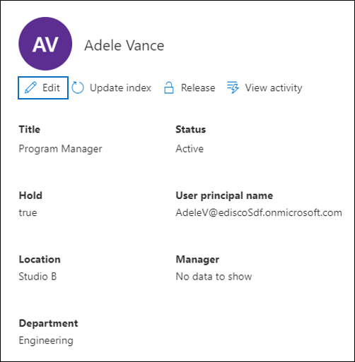

# Manage custodians in an Advanced eDiscovery case

The Custodians page on the **Sources** tab in an Advanced eDiscovery case contains a list of all custodians that have been added to the case. After you add custodians to a case, details about each custodian are automatically collected from Azure Active Directory and are viewable in Advanced eDiscovery.

## View custodian details

To view the details about a custodian, click the custodian from the list on the **Custodians** tab. A flyout page is displayed and contains the following information about the custodian:

- Contact information

  - **Display Name** - The name displayed in the address book for the custodian. This is usually the combination of the custodian's first name, middle initial, and last name.
  
   - **Mail/SMTP** - The primary SMTP address for the custodian, for example, brianj@contoso.onmicrosoft.com. The custodian's user principal name (UPN) is also listed.

  - **Title** - The custodian's job title.

  - **Department** - The name for the department in which the custodian works.

  - **Manager** - The custodian's manager. The designated manager will receive any escalation communications for this custodian.
  
- Location information

  - **City** - The city in which the custodian is located.

  - **State** - The state or province in the custodian's address.

  - **Country/Region** - The country/region where the custodian is located.

  - **Office** - The office location in the custodian's place of business.

- Case information

  - **Hold status** - Indicates if the custodian has been placed on hold. 

  - **Communication status**: Indicates if the custodian has been issued a hold notice. If the custodian has been issued a notice, this value of this property is **Published**. If the custodian has not been issued a notice, the status is **Un-published**. 

  - **Status** - The status of the custodian within the case. A status of **Active** indicates that the custodian is part of the case. If a custodian is released from a case, the status is changed to **Released**. 

- Data sources and indexing information

    - **Data sources** - Shows the count and type of data sources (mailboxes, sites, and Teams) that are associated with the custodian and are part of the case.

    - **Index updated time** - Indicates the time and date for when the advanced indexing job was last triggered. This property will also indicate when the advanced indexing process is currently in progress.

## Edit a custodian

As your case progresses, you may discover that there may be additional data sources relevant to a specific custodian & your case. In other scenarios, you may want to remove certain data sources that have been reviewed and deemed as not relevant.

To update the data sources that are associated with a custodian:

1. Go to  **eDiscovery > Advanced eDiscovery** and open the case.
  
2. Click the **Sources** tab.
  
3. On the **Custodians** page, select a custodian from the list and click **Edit** on the flyout page.

    
  
4. Click **Choose data sources** tab to change the settings for the custodian's Exchange mailbox and OneDrive account, click **Choose data sources**.
  
5. Click the **Select additional data sources** tab to add or remove Teams, SharePoint, or Exchange mailboxes associated with the custodian. 

    For more information about data sources associated with a custodian, see [Add custodians to a case](add-custodians-to-case.md). 
  
6. Click **Place custodial holds** to enable or disable the hold for the custodian.

## Re-index custodian data

In most eDiscovery workflows for legal investigations, a subset of a custodian's data is searched after the custodian is added to a legal case. Because of very large file sizes or possible data corruption, some items in the data sources associated with a custodian may be partially indexed. Using the [advanced indexing](indexing-custodian-data.md) capability in the Advanced eDiscovery, most partially indexed items can be automatically remediated by re-indexing these items on demand.

When a custodian is added to a case, the data located in the data sources associated with the custodian is automatically re-indexed (by the advanced indexing process). This means you can leave the data in-place instead of having to download and remediate it and then search it offline). However, during the lifecycle of a legal case new data sources might be associated with a custodian. In this case, you can re-index the custodian's data by re-running the advanced indexing process to remediate any partially indexed items and update the index for the custodian's data.

To trigger the re-indexing process to address partially indexed items:

1. Go to  **eDiscovery > Advanced eDiscovery** and open the case.

2. Click the **Sources** tab.

3. On the **Custodians** page, select a custodian whose data must be reindexed.

4. On the flyout page, click **Update index**.

   A dialog is displayed saying the index job has been created.

Re-indexing custodian data is a long-running process; the corresponding job that's created is named **Re-indexing custodian data**. You can track the progress on the **Jobs** tab or on the **Custodians** tab by monitoring the status in the **Indexing job status** column.

For more information, see:

- [Work with processing errors](processing-data-for-case.md)

- [Manage jobs](managing-jobs-ediscovery20.md)

## Release a custodian from a case

A custodian is released in situations where a case is closed, the custodian is no longer under obligation to preserve content for a case, or when the custodian is deemed to no longer be relevant to the case. 

If you release a custodian after a hold notice was published, a release notice will be sent to the custodian. Additionally, any holds placed on data sources that were associated with the custodian are removed. If the custodian was placed on a *silent hold*, where they weren't issued any legal hold notifications, a release notice will not be sent but any holds placed on data sources that were associated with that custodian are removed.

To release a custodian: 

1. Go to  **eDiscovery > Advanced eDiscovery** and open the case.

2. Click the **Sources** tab.

3. On the **Custodians** page, and then select the custodian who is being released from the case.

4. On the flyout page, click **Release custodian**.

   A warning page is displayed explaining that if a hold is placed on a data source associated with the custodian, the hold will be removed, and that any other hold associated with a different Advanced eDiscovery case will still apply. That includes other types of preservation and retention features (such as a Microsoft 365 retention policy).

5. Click **Yes** to confirm that you want to release the custodian. 

    The status for this user on the **Custodians** tab is set to **Released** and the **Hold status** on the flyout page is changed to **False**. 

> [!NOTE]
> A custodian might be simultaneously involved in several legal cases. When a custodian is released from a case, the holds and notifications across other matters won't be impacted.

## Bulk-edit custodians

You can use the bulk editor to edit multiple custodians as the same time. To do this, just select two or more custodians on the **Custodians** tab to display the bulk editor and then click one of tasks.

