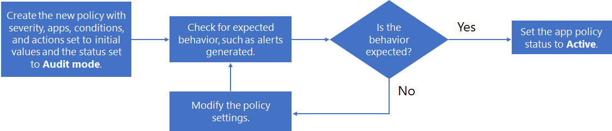

# Create app policies

>*[Microsoft 365 licensing guidance for security & compliance](https://aka.ms/ComplianceSD).*

Along with a built-in set of capabilities to detect anomalous app behavior and generate alerts, app policies in Microsoft app governance are a way for you to:

- Specify conditions by which app governance can alert you to app behavior for automatic or manual remediation.
- Implement the app compliance policies for your organization.

You can create app policies from provided templates that can be customized, or you can create your own custom app policy.

To create a new app policy, go to **Microsoft 365 Compliance Center > App protection & governance > Overview page > Policies**:

- To create a new app policy with templates designed for app usage, select **Create policy** under **Create an app usage policy**.
- To create a new app policy with templates designed for app permissions, select **Create policy** under **Create a permissions policy**.
- To create a new app policy for app certification or for a custom policy, select **Create new**.

## App policy templates

To create a new app policy based on an app policy template, on the **Choose App policy template page**, select a category of app template, select the name of the template, and then select **Next**.

App governance has three categories of app policy templates.

### App usage

App governance includes these templates to generate alerts for app usage.

| Template name | Description |
|:-------|:-----|
| Increase in app users | Highlights apps with recently increased users to identify apps that have recently gained a larger footprint in your tenant and that may need further investigation.    By default, this policy will flag all apps that have had a more than 50% increase in use in the last 7 days, and can be customized with extra conditions and actions. |
| New app with a high volume of data access | Highlights any recently registered apps with high volume data access to ensure those data patterns are expected.    By default, this policy will flag all apps that have been registered in the last 7 days and that have had more than 1 GB in data access over that period. This policy can be customized with more conditions and actions. |
|||

### App Permissions

App governance includes these templates to generate alerts for app permissions.

| Template name | Description |
|:-------|:-----|
| Overpermissioned apps | Highlights any apps with more granted permissions than are being used by those apps to identify opportunities for potential permission reduction.    By default, this policy will flag all apps that are marked as overpermissioned if not used for 90 days. This time period filter can be customized with more conditions and actions. |
| New app with high-privilege permissions | Highlights all new apps with high privilege permissions to identify potential high-footprint apps that may need further investigation.    By default, this policy will flag all apps registered within the last 7 days that have high-scoped permissions. |
| New app with app-only permissions | Highlights all new apps with permissions to access data across the tenant, which are potentially a higher risk set of permissions.    By default, this policy will flag all apps registered within the last 7 days that have app-only permissions. |
|||

### App certification

App governance includes these templates to generate alerts for app certification.

| Template name | Description |
|:-------|:-----|
| App certification loss | Highlights all previously certified apps that recently lost their app certification, enabling you to ensure that this status change is expected.    By default, this policy will flag all apps that are uncertified and have had their app certification changed in the last 7 days. |
| New uncertified app | Highlights new apps that haven't been through the app certification process to ensure that they are expected in the tenant.    By default, this policy will flag all apps that were registered in the last 7 days and are uncertified. |
|||

## Custom app policies

Use a custom app policy when you need to do something not already done by one of the built-in templates.

To create a new custom app policy, first select **Create new** on the **Policies** page. On the **Choose App policy template page**, select the **Custom** category, the **Custom policy** template, and then select **Next**.

On the **Name and description** page, configure the following:

- Policy Name

- Policy Description

- Select the policy severity, which sets the severity of alerts generated by this policy.

  - High
  - Medium
  - Low

On the **Choose Policy settings and conditions** page, for **Choose which apps this policy is applicable for**, select:

- All Apps
- Choose specific apps

  A pane allows you to select one or more apps.
  Select **Add**.

Select **Next**.

On the **Choose Policy settings and conditions** page, select **Set new conditions for policy**, and then select **Next**.

The **Create rule** pane allows you to select conditions for a new rule. Select **Add condition** and select from the list of conditions, and then specify the value of the condition. You can add multiple conditions.

Here are the available conditions for a custom app policy.

|Condition | Condition values accepted | More information |
|:-------|:-----|:-------|
| App registration age | Within last X days |  |
| App certification | Yes or No | [Microsoft 365 Certification](https://docs.microsoft.com/microsoft-365-app-certification/docs/enterprise-app-certification-guide) |
| App certification changed | Yes or No |  |
| Publisher verification | Yes or No | [Publisher Verification](https://docs.microsoft.com/azure/active-directory/develop/publisher-verification-overview) |
| Permission granted | Select one or more API permission from list | [Microsoft Graph permissions reference](https://docs.microsoft.com/graph/permissions-reference) |
| Has high scoped permission | Yes or No | This is an internal designation based on the same logic used by MCAS. |
| Overprivileged app | Yes or No | Apps with more granted permissions than are being used by those apps. |
| Last used | Within last X days |  |
| App data access | Greater than X GB data access per hour |  |
| App data access trend | X% increase in data usage in last 7 days |  |
| App API Access | Greater than X API calls per hour |  |
| App API Access trend | X% increase in API Calls in last 7 days	 |  |
| Users consented | (Greater than or Less than) X consented users |  |
| Users consented trend | X% increase in last 90 days |  |
| HVE user consented | Yes or No | A user with a [priority account](https://docs.microsoft.com/microsoft-365/admin/setup/priority-accounts). |
| Delegating user | Select user(s) from list |  |
| Delegating user’s role | Select one or more: Teams Administrator, Directory Readers, Security Reader, Compliance Administrator, Security Administrator, Helpdesk Administrator, SharePoint Administrator, Exchange Administrator, Global Reader, Global Administrator, Compliance Data Administrator, User Administrator, Service Support Administrator | Multiple selections allowed.    Any Azure AD role with assigned member should be made available in this list. |
| Workload accessed | OneDrive and/or SharePoint and/or Exchange | Multiple selections allowed. |
| Error rate | Error rate is greater than X% |  |
||||

<!--
NOTE TO WRITER: Replace X in the above table with correct values.
-->

All of the specified conditions must be met for this app policy to apply.

When you are done specifying the conditions, select **Save**, and then select **Next**.

On the **Define Policy Actions** page, select **Disable app** if you want MAPG to disable the app when an alert based on this policy is generated, and then select **Next**.

On the **Define Policy Status** page, select one of these options:

- **Test mode**: Policies are evaluated but configured actions will not occur. Test mode policies appear with the status of **Test** in the list of policies.
- **Active**: Policies are evaluated and configured actions will occur.
- **Inactive**: Policies are not evaluated and configured actions will not occur.

<!--
## Configure a user-based policy

## Create an app metadata-based policy

Publish metadata-based policies

## Configure access permissions
-->

## Test and monitor your new app policy

Now that your app policy is created, you should monitor it on the **Policies** page to ensure it is registering an expected number of active alerts and total alerts during testing. 

If the number of alerts is an unexpectedly low value, edit the settings of the app policy to ensure you've configured it correctly before setting its status.

Here is an example of a process for creating a new policy, testing it, and then making it active:

1. Create the new policy with severity, apps, conditions, and actions set to initial values and the status set to **Test mode**.
2. Check for expected behavior, such as alerts generated.
3. If the behavior is not expected, edit the policy apps, conditions, and action settings as needed and go back to step 2.
4. If the behavior is expected, edit the policy and change its status to **Active**.

## Next step

[Manage your app policies.](mapg-app-policies-manage.md)
