# Microsoft Compliance Manager (classic)

> [!IMPORTANT]
> **Compliance Manager (classic) will soon be removed from the Microsoft Service Trust Portal.** We recommend that you transition to the new [Compliance Manager in the Microsoft 365 compliance center](https://compliance.microsoft.com/), which provides an enhanced user experience and updated control mapping. Customers who have assessments in the classic version will need to create new assessments in the new Compliance Manager. Any existing data, including your assessments, controls, and other data, will not be transferred over to the new Compliance Manager. [Learn more about the transition](compliance-manager-faq.md#whats-happening-to-compliance-manager-classic-in-the-service-trust-portal).

*Compliance Manager isn't available in Office 365 operated by 21Vianet, Office 365 Germany, Office 365 U.S. Government Community High (GCC High), or Office 365 Department of Defense.*

Compliance Manager, a workflow-based risk assessment tool in the Microsoft [Service Trust Portal](./get-started-with-service-trust-portal.md), enables you to track, assign, and verify your organization's regulatory compliance activities related to Microsoft Professional Services and Microsoft cloud services, such as Microsoft Office 365, Microsoft Dynamics 365, and Microsoft Azure.

Compliance Manager:

- Combines the detailed information provided by Microsoft to auditors and regulators as part of various third-party audits of Microsoft 's cloud services against various standards (for example, ISO 27001, ISO 27018, and NIST) and information that Microsoft compiles internally for its compliance with regulations (such as HIPAA and the EU General Data Protection Regulation, or GDPR) with your own self-assessment of your organization's compliance with these standards and regulations.

- Enables you to assign, track, and record compliance and assessment-related activities, which can help your organization cross team barriers to achieve your organization's compliance goals.

- Provides a Compliance Score to help you track your progress and prioritize the auditing controls that will help reduce your organization's exposure to risk.

- Provides a secure repository for you to upload and manage evidence and other artifacts related to your compliance activities.

- Produces richly detailed reports in Microsoft Excel that document the compliance activities performed by Microsoft and your organization, which can be provided to auditors, regulators, and other compliance stakeholders.

> [!IMPORTANT]
> Compliance Manager is a dashboard that provides a summary of your data protection and compliance stature and recommendations to improve data protection and compliance. The Customer Actions provided in Compliance Manager are recommendations; it is up to each organization to evaluate the effectiveness of these recommendations in their respective regulatory environment prior to implementation. Recommendations found in Compliance Manager should not be interpreted as a guarantee of compliance.

## What is Compliance Manager?

Compliance Manager is a workflow-based risk assessment tool designed to help you manage regulatory compliance within the shared responsibility model of the cloud. Compliance Manager provides you with a dashboard view of standards and regulations and assessments that contain Microsoft's control implementation details and test results and customer control implementation guidance and tracking for your organization to enter. Compliance Manager provides certification assessment control definitions, guidance on implementation and testing of controls, risk-weighted scoring of controls, role-based access management, and an in-place control action assignment workflow to track control implementation, testing status and evidence management. Compliance Manager optimizes compliance workload by enabling customers to logically group assessments together and apply assessment control testing to identical or related controls, reducing the duplication of effort that might otherwise be required to satisfy identical control requirements across different certifications.

## Assessments in Compliance Manager

The core component of Compliance Manager is called an *Assessment*. An Assessment is an assessment of a Microsoft service against a certification standard or data protection regulation (such as ISO 27001:2013, and the GDPR). Assessments help you to discern your organization's data protection and compliance posture against the selected industry standard for the selected Microsoft cloud service. Assessments are completed by the implementation of the controls that map to the certification standard being assessed.

The structure of an Assessment is based on the responsibility that is shared between Microsoft and your organization for assessing security and compliance risks in the cloud and for implementing the data protection safeguards specified by a compliance standard, a data protection standard, a regulation, or a law.

An Assessment is made of several components, which are:

- **In-Scope Services** - Each assessment applies to a specific set of Microsoft services, which are listed in the In-Scope Cloud Services section.

- **Microsoft-Managed Controls** - For each cloud service, Microsoft implements and manages a set of  *controls*  as part of Microsoft's compliance with various standards and regulations. These controls are organized into  *control families*  that align with the structure from the corresponding certification or regulation that the Assessment is aligned to. For each Microsoft-managed control, Compliance Manager provides details about how Microsoft implemented the control, along with how and when that implementation was tested and validated by an independent third-party auditor.

  Here's an example of three Microsoft-managed controls in the **Security** control family from an Assessment of Office 365 and the GDPR.

    

  a. Specifies the following information from the certification or regulation that maps to the Microsoft-managed control.

  - **Control ID** - The section or article number from the certification or regulation that the control maps to.

  - **Title** - The title from the corresponding certification or regulation.

  - **Article ID** - This field is included only for GDPR assessments, as it specifies the corresponding GDPR article number.

  - **Description** - Text of the standard or regulation that maps to the selected Microsoft-managed control.

  b. The Compliance Score for the control, which indicates the level of risk (due to non-compliance or control failure) associated with each Microsoft-managed control. See [Understanding the Compliance Score](#understanding-the-compliance-score) for more information. Note that Compliance Scores are rated from 1 to 10 and are color-coded. Yellow indicates low risk controls, orange indicates medium-risk controls, and red indicated high-risk controls.

  c. Information about the implementation status of a control, the date the control was tested, who performed the test, and the test result.

  d. For each control, you can click **More** to see additional information, including details about Microsoft's implementation of the control and details about how the control was tested and validated by an independent third-party auditor.

- **Customer-Managed Controls** - This is the collection of controls that are managed by your organization. Your organization is responsible for implementing these controls as part of your compliance process for a given standard or regulation. Customer-managed controls are also organized into control families for the corresponding certification or regulation. Use the customer-managed controls to implement the recommended actions suggested by Microsoft as part of your compliance activities. Your organization can use the prescriptive guidance and recommended Customer Actions in each customer-managed control to manage the implementation and assessment process for that control.

  Customer-managed controls in Assessments also have built-in workflow management functionality that you can use to manage and track your organization's progress towards completing the Assessment. For example, a Compliance Officer in your organization can assign an Action Item to an IT admin who has the responsibility and necessary permissions to perform the actions that are recommended for the control. When that work is complete, the IT admin can upload evidence of their implementation tasks (for example, screenshots of configuration or policy settings) and then assign the Action Item back to the Compliance Officer to evaluate the collected evidence, test the implementation of the control, and record the implementation date and test results in Compliance Manager. For more information, see the [Managing the assessment process](#managing-the-assessment-process) section in the article.

## Permissions and role-based access control

Compliance Manager uses a role-based access control permission model. Only users who are assigned a user role may access Compliance Manager, and the actions allowed by each user are restricted by role type.

Note that there is no longer a default **Guest access** role. Each user must be assigned a role in order to access and work within Compliance Manager.

The following table describes each Compliance Manager permission and what it allows the user do. The table also indicates the role that each permission is assigned to.

|Permission|Compliance Manager Reader|Compliance Manager Contributor|Compliance Manager Assessor|Compliance Manager Administrator|Portal Admin|
|---|:---:|:---:|:---:|:---:|:---:|
|**Read data** - Users can read but not edit data.||||||
|**Edit data** - Users can edit all fields, except the Test Result and Test Date fields.||||||
|**Edit test results** - Users can edit the Test Result and Test Date fields.||||||
|**Manage assessments** - Users can create, archive, and delete Assessments.||||||
|**Manage users** - Users can add other users in their organization to the Reader, Contributor, Assessor, and Administrator roles. Only those users with the Global Administrator role in your organization can add or remove users from the Portal Admin role.||||||
|

## Understanding the Compliance Score

On the Dashboard, Compliance Manager displays a total score for Office 365 assessments in the upper right-hand corner of the tile. This is the overall total Compliance Score for the Assessment, and is the accumulation of points received for each control assessment that has been marked as Implemented and Tested in the Assessment. When adding an Assessment, you will see that the Compliance Score is already on the way towards completion because the points for the Microsoft-managed controls that have been implemented by Microsoft and tested by independent third parties are already applied.

The remaining points come from the successful customer control assessment, from the implementation and testing of the customer-managed controls, each of which has a specific value that contributes to the overall compliance score.

Each Assessment displays a risk-based Compliance Score to help you assess the level of risk (due to non-compliance or control failure) associated with each control (including both Microsoft managed and customer-managed controls) in an Assessment. Each customer-managed control is assigned a possible number of points (called a  *severity ranking) on a scale from 1 to 10, where more points are awarded for controls associated with a higher risk factor if the control fails, and fewer points are awarded for lower-risk controls.

For example, the User Access Management assessment control shown below has a very high severity risk ranking, and displays an assigned value of 10.

 By comparison, the Information Backup assessment control shown below has a lower severity risk ranking, and displays an assigned value of 3.

The Compliance Manager assigns a default severity ranking to each control. Risk rankings are calculated based on the following criteria:

- Whether a control prevents incidents from happening (highest ranking), detects incidents that have happened, or corrects the impact of an incident (lowest ranking). In terms of severity ranking, a mandatory control that prevents a threat is assigned the highest number of points; controls that are detective or corrective (regardless of whether they're mandatory or discretionary) are assigned the lowest number of points.

- Whether a control (after it's been implemented) is mandatory and therefore can't be by-passed by users (for example, users having to reset their password and meet password length and character requirements) or discretionary and can be by-passed by users (for example, business rules that require users to lock their screens when their computers are unattended).

- Controls related to risks to data confidentiality, integrity, and availability, whether these risks come from internal or external threats, and whether the threat is malicious or accidental. For example, controls that would help prevent an external attacker from breaching that network and gaining access to personally identifiable information would be assigned more points than a control related to preventing an employee from accidentally mis-configuring a network router setting that results in a network outage).

- Risks related to legal and external drivers, such as contracts, regulations, and public commitments, for each control.

The displayed Compliance Score values for the control are applied  *in their entirety*  to the Total Compliance Score on a pass/fail basis--either the control is implemented and passes the subsequent assessment test or it does not; there is no partial credit for a partial implementation. Only when the control has its **Implementation Status** set to **Implemented** or **Alternative Implementation** and the **Test Result** is set to **Passed** are the assigned points added to the Total Compliance Score.

Most importantly, the Compliance Score can help you prioritize which controls to focus on for implementation by indicating which controls that have a higher potential risk if there is a failure related to a control. In addition to risk-based prioritization, when assessment controls are related to other controls (either within the same assessment or in another assessment in the same assessment grouping), completing a single control successfully can result in a significant reduction of effort based on the synchronization of control test results.

For example, in the image below we see that the Office 365 - GDPR Assessment is currently 46% assessed, with 51 of 111 control assessments completed for a Total Compliance score of 289 out of a possible 600.

Within the assessment GDPR control 7.5.5 is related to 5 other controls (7.4.1, 7.4.3, 7.4.4, 7.4.8, and 7.4.9) each with a moderate to high severity risk rating score of 6 or 8). Using the assessment filter, we have selected all of these controls, making them visible in the assessment view, and can see below that none of them have been assessed.

 As those 6 controls are related, the completion of any one them will result in a synchronization of those test results across the related controls within this assessment (just as it will for any related controls in an assessment that is in the same assessment grouping). Upon completion of the implementation and testing of GDPR control 7.5.5, the control detail area refreshes to show that all 6 controls have been assessed, with a corresponding increase in the number of assessed controls to 57 and 51% assessed, and a change in total Compliance Score of +40.

This confirmation update dialog box will appear if you are about to change the Implementation Status of a related control in a way that will impact the other related controls.

> [!NOTE]
> Currently, only Assessments for Office 365 cloud services include a Compliance Score. Assessments for Azure and Dynamics show an assessment status.

## Compliance Score methodology

The Compliance Score, like the Microsoft Secure Score, is similar to other behavior-based scoring systems; your organization's activity can increase its Compliance Score by performing activities related to data protection, privacy, and security.

> [!NOTE]
> The Compliance Score does not express an absolute measure of organizational compliance with any particular standard or regulation. It expresses the extent to which you have adopted controls which can reduce the risks to personal data and individual privacy. No service can guarantee that you are compliant with a standard or regulation, and the Compliance Score should not be interpreted as a guarantee in any way.

Assessments in Compliance Manager are based on the shared responsibility model for cloud computing. In the shared responsibility model, Microsoft and each customer share responsibility for the protection of the customer's data when that data is stored in our cloud.

As shown in the Office 365 GDPR Assessment below, Microsoft and customers are each responsible for performing a variety of Actions that are designed to satisfy the requirements of the standard or regulation being assessed. To rationalize and understand the required. Actions across a variety of standards and regulations, Compliance Manager treats all standards and regulations as if they were control frameworks. Thus, the Actions performed by Microsoft and by customers for each Assessment involve the implementation and validation of various controls.

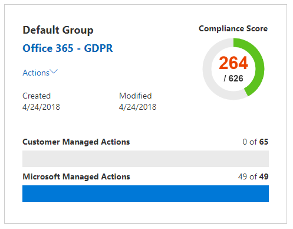

Here's the basic workflow for a typical Action:

1. The Compliance, Risk, Privacy, and/or Data Protection Officer of an organization assigns the task to someone in the organization to implement a control. That person could be:

   - A business policy owner

   - An IT implementer

   - Another individual in the organization who has responsibility for performing the task

2. That individual performs the tasks necessary to implement the control, uploads evidence of implementation into Compliance Manager, and marks the control(s) tied to the Action as implemented. Once these tasks are completed, they assign the Action to an Assessor for validation. Assessors can be:

   - Internal assessors that perform validation of controls within an organization

   - External assessors that examine, verify, and certify compliance, such as the third-party independent organizations that audit Microsoft's cloud services

3. The Assessor validates the control and examines the evidence and marks the control(s) as assessed and the results of the assessment (e.g., passed).

Once all the controls associated with an Assessment have been assessed, the Assessment is considered completed.

Every Assessment in Compliance Manager comes pre-loaded with information that provides details about the Actions taken by Microsoft to satisfy the requirements of the controls for which Microsoft is responsible. This information includes details about how Microsoft has implemented each control and how and when Microsoft's implementation was assessed and verified by a third-party auditor. For this reason, the Microsoft Managed Controls for each Assessment are marked as Assessed, and the Compliance Score for the Assessment reflects this.

Each Assessment includes a total Compliance Score based on the shared responsibility model. Microsoft's implementation and testing of controls for Office 365 contributes a portion of the total possible points associated with a GDPR assessment. As the customer implements and tests each of the customer Actions, the Compliance Score for the Assessment will increase by the value assigned to the control.

### Risk-based scoring methodology

Compliance Manager uses a risk-based scoring methodology with a scale from 1-10 that assigns a higher value to controls that represent a higher risk in the event the control fails or is non-compliant. The scoring system used by Compliance Score is based on several key factors, such as:

- The essence of the control

- The level of risk of the control based on the kinds of threats

- The external drivers for the control

### Essence of the control

The essence of the control is based on whether the control is Mandatory or Discretionary, and whether it is Preventative, Detective, or Corrective.

### Mandatory or discretionary

 *Mandatory controls*  are controls that cannot be bypassed either intentionally or accidentally. An example of a common mandatory control is a centrally-managed password policy that sets requirements for password length, complexity, and expiration. Users must comply with these requirements in order to access the system.

 *Discretionary controls*  rely upon users to understand policy and act accordingly. For example, a policy requiring users to lock their computer when they leave it is a discretionary control because it relies on the user.

### Preventative, detective, or corrective

*Preventative controls*  are those that prevent specific risks. For example, protecting information at rest using encryption is a preventative control against attacks, breaches, etc. Separation of duties is a preventative control to manage conflict of interest and to guard against fraud.

*Detective controls*  are those that actively monitor systems to identify irregular conditions or behaviors that represent risk or that can be used to detect intrusions or determine if a breach has occurred. System access auditing and privileged administrative actions auditing are types of detective monitoring controls; regulatory compliance audits are a type of detective control used to find process issues.

*Corrective controls*  are those that try to keep the adverse effects of a security incident to a minimum, take corrective action to reduce the immediate effect, and reverse the damage, if possible. Privacy incident response is a corrective control to limit damage and restore systems to an operational state after a breach.

By evaluating each control using these factors, we determine the essence of the control and assign it a value relative to the risk that it represents.

**Threat**:

|Control|Mandatory|Discretionary|
|---|---|----|
|**Preventative**|High risk|Medium risk|
|**Detective**|Medium risk|Low risk|
|**Corrective**|Medium risk|Low risk|

Threat refers to anything that poses a risk to the fundamental, universally-accepted security standard known as the CIA triad for data: Confidentiality, Integrity, and Availability:

- Confidentiality means that information can be read and understood only by trusted, authorized parties.

- Integrity means that information has not been modified or destroyed by unauthorized parties.

- Availability means that information can be accessed readily with a high level of quality of service.

A failure of any of these characteristics is considered a compromise of the system as a whole. Threats can come from both internal and external sources, and an actor's intent can be accidental or malicious. These factors are estimated in a threat matrix that assigns threat levels of either High, Moderate, or Low to each combination of scenarios.

|Factor|Internal|Internal|External|External|
|---|---|---|---|----|
||*Malicious*|*Accidental*|*Malicious*|*Accidental*|
|**Confidentiality**|(H, M, or L)|(H, M, or L)|(H, M, or L)|(H, M, or L)|
|**Integrity**|(H, M, or L)|(H, M, or L)|(H, M, or L)|(H, M, or L)|
|**Availability**|(H, M, or L)|(H, M, or L)|(H, M, or L)|(H, M, or L)|
|

**External drivers**:

|Contracts|Regulations|Public commitments|
|---|---|---|
|(H, M, or L)|(H, M, or L)|(H, M, or L)|

External factors such as applicable regulations, contracts, and public commitments can influence controls designed to protect data and prevent data breaches, and each of these factors are assigned risk values or High, Moderate or Low.

The estimated number of occurrences of these risk values of High, Moderate, or Low across the 15 possible risk scenarios represented in the CIA/Threat and Legal/External Drivers are combined to provide a risk weighting, which considers the likelihood and number of occurrences of risks at a given value as significant and is taken into consideration when calculating the severity ranking of the control.

Based on the control's severity ranking, the control is assigned its compliance score value, a number between 1 (low) and 10 (high), grouped into the following categories of risk:

|Risk level|Control value|
|---|:---:|
|Low|1-3|
|Moderate|6|
|High|8|
|Severe|10|

By prioritizing assessment controls with the highest compliance score values, the organization will be concentrating on the highest risk items and receive proportionally higher positive feedback in the form of more points added to the total compliance score for the assessment for each control assessment completed.

### Summary of scoring methodology

The Compliance Score is a core component of the way that Compliance Manager helps organizations understand and manage their compliance. The Compliance Score for an assessment is an expression of the company's compliance with a given standard or regulation as a number, where the higher the score (up to the maximum number of points allocated for the Assessment), the better the company's compliance posture. Understanding the compliance scoring methodology in which assessment controls are assigned risk severity values between 1- 10 (low to high), and how completed control assessments add to the total compliance score is crucial to organizations for prioritizing their actions.

## Grouping Assessments

When you create a new Assessment, you're prompted to create a group to assign the Assessment to or assign the Assessment to an existing group. Groups allow you to logically organize Assessments and share common information and workflow tasks between Assessments that have the same or related customer-managed controls.

For example, you could group Assessments by year or teams, departments, or agencies within your organization or group them by year. Here are some examples of groups and the Assessments they might contain.

- GDPR Assessments — 2018

  - Office 365 + GDPR

  - Azure + GDPR

  - Dynamics + GDPR

- Azure Assessments — 2018

  - Azure + GDPR

  - Azure + ISO 27001:2013

  - Azure + ISO 27018:2014

- Data Security and Privacy Assessments

  - Office 365 + ISO 27001:2013

  - Office 365 + ISO 27018:2014

  - Azure + ISO 27001:2013

  - Azure + ISO 27018:2014

> [!TIP]
> We recommend that your determine a grouping strategy for your organization before adding new assessments.

These are the requirements for grouping Assessments:

- Group names (also called  *Group IDs) must be unique within your organization.

- Groups can contain Assessments for the same certification/regulation, but each group can only contain one Assessment for a specific cloud service/certification pair. For example, a group can't contain two Assessments for Office 365 and GDPR. Similarly, a group can contain multiple Assessments for the same cloud service as long as the corresponding certification/regulation for each one is different.

Once an assessment has been added to an assessment grouping, the grouping cannot be changed. You can rename the assessment group, which changes the name of the assessment grouping for all of the assessments associated with that group. You can create an assessment and a new assessment group and copy information from an existing assessment, which effectively creates a duplicate of that assessment in a different assessment group. Archiving an assessment breaks the relationship between that assessment and the assessment group. Any further updates to other related assessments are no longer reflected in the archived assessment.

As previous explained, one key advantage of using groups is that when two different Assessments in the same group share the same customer-managed control (and therefore the customer actions would be the same for each control), then the completion of implementation details, testing information, and status for the control in one Assessment would be synchronized to the same control in any other Assessment in the group. In other words, if Assessments share the same control and those Assessments are in the same group, you'd only have to manage the assessment process for the control in one Assessment. The results for that control will be automatically synchronized to other Assessments. For example, ISO 27001 and ISO 27018 both have a control related to password policies. If the Test Status for the control is set to "Passed" in one Assessment, the control is updated (and marked as "Passed") in the other Assessment, as long as both assessments are part of the same Assessment Group.

As an example of this, consider these two related assessment controls, each having to do with encryption of data on public networks, control 6.10.1.2 in the Office 365 — GDPR assessment, and control SC-13 in the Office 365 — NIST 800-53 assessment. These are related assessment controls, in two different assessments, both in the Default Group. Initially, neither assessment has completed any customer control assessments, as is displayed on the Compliance Manager Dashboard that shows these two Assessments.

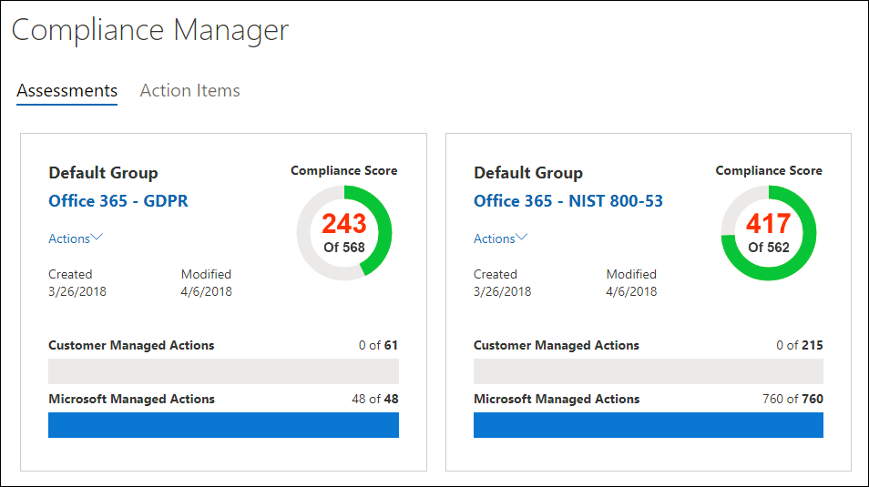

By clicking the **Office 365 — GDPR** assessment, and using the filter controls to view GDPR control 6.10.1.2, we see that NIST 800-53 control SC-13 is listed as a related control.

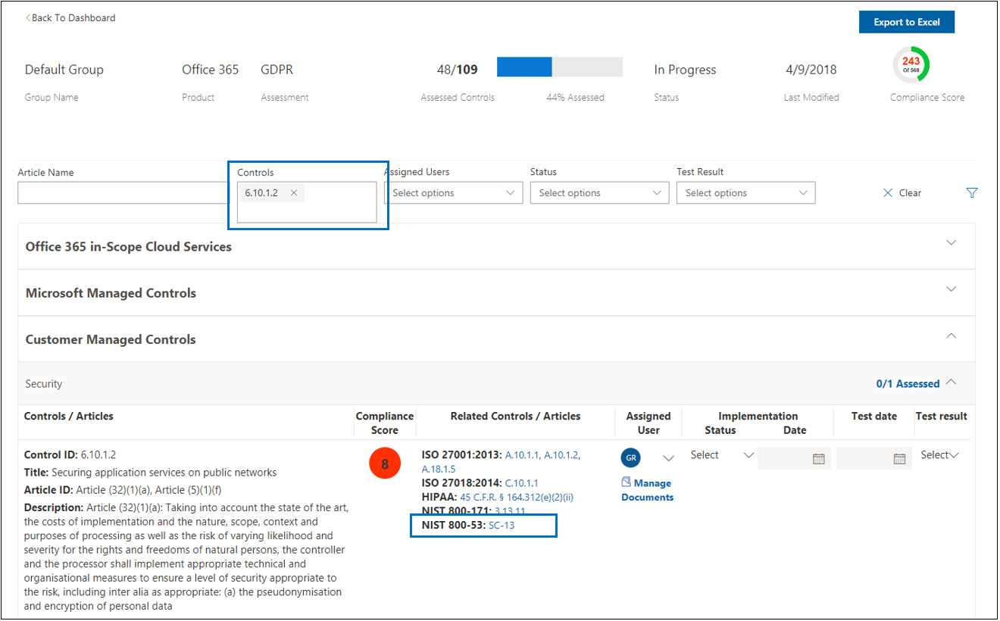

 Here we show the completion of the implementation and testing of GDPR control 6.10.1.2.

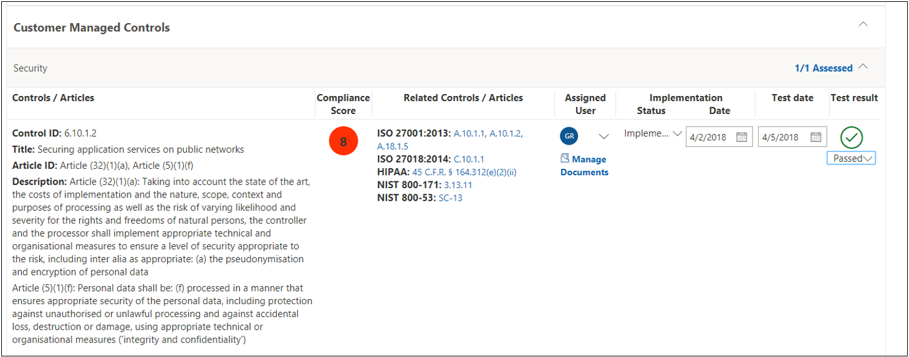

By navigating to the related control in the grouped assessment, we see that NIST 800-53 SC-13 has also been marked as completed with the same date and time, with no additional implementation or testing effort.

Back at the Dashboard, we can see that each assessment has one control assessment completed and that the total Compliance Score for each assessment has increased by 8 (the compliance score value of that shared control).

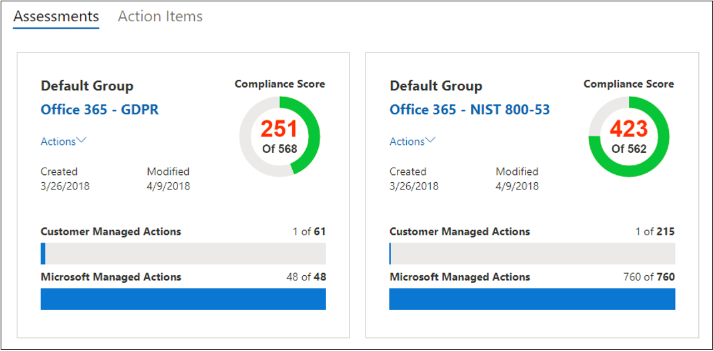

## Administrative functions

There are specific administrative functions that are only available to the tenant administrator account, and will only be visible when logged in as a global administrator.

> [!NOTE]
> The Access to Restricted Documents permission in the drop-down list will allow administrators to give users access to restricted documents that Microsoft shares on the Service Trust Portal. The Restricted Documents feature isn't available, but is coming soon.

### Assigning Compliance Manager roles to users

Each Compliance Manager role has slightly different permissions. You can view the permissions assigned to each role, see which users are in which roles, and add or remove users from that role through the Service Trust Portal by selecting the **Admin** menu item, and then choosing **Settings**.

To add or remove users from Compliance Manager roles.

1. Go to [https://servicetrust.microsoft.com](https://servicetrust.microsoft.com).

2. Sign in with your Azure Active Directory global administrator account.

3. On the Service Trust Portal top menu bar, click **Admin** and then choose **Settings**.

4. In the **Select Role** drop-down list, click the role that you want to manage.

5. Users added to each role are listed on the **Select Role** page.

6. To add users to this role, click **Add**. In the **Add Users** dialog, click the user field. You can scroll through the list of available users or begin typing the user name to filter the list based on your search term. Click the user to add that account to the **Add Users** list to be provisioned with that role. If you would like to add multiple users concurrently, begin typing a user name to filter the list, and then click the user to add to the list. Click **Save** to provision the selected role to these users.

   

7. To remove users from this role, select the user(s) and click **Delete**.

   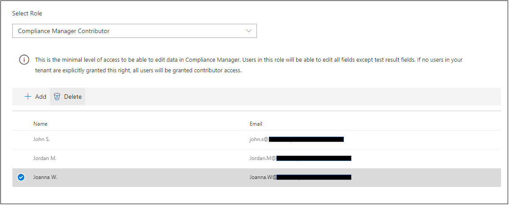

## User Privacy settings

Certain regulations require that an organization must be able to delete user history data. To enable this, Compliance Manager provides the **User Privacy Settings** functions, that allow administrators to:

- [Search for a user](#search-for-a-user)

- [Export a report of account data history](#export-a-report-of-account-data-history)

- [Reassign action items](#reassign-action-items)

- [Delete user data history](#delete-user-data-history)

### Search for a user

To search for a user account:

1. Enter the user email address by typing in the alias (the information to the left of the @ symbol) and choosing the domain name by clicking the domain suffix list on the right. If this is tenant with multiple registered domains, you can double check the email address domain name suffix to ensure that it is correct.

2. When you have the username correctly entered, click **Search**.

3. If the user account is not found, the error message 'User not found' will be displayed on the page. Check the user's email address information, make corrections as necessary and click **Search** to try again.

4. If user account is found, the text of the button changes from **Search** to **Clear**, which indicates that the returned user account is the operating context for the additional functions that will be displayed below, that running those functions will apply to this user account.

5. To clear search results and search for a different user, click **Clear**.

### Export a report of account data history

Once the user account has been identified, you may wish to generate a report of dependencies that exist linked to this account. This information allows you to reassign open action items or ensure access to previously uploaded evidence.

 To generate and export a report:

1. Click **Export** to generate and download a report of the Compliance Manager control action items currently assigned to the returned user account and the list of documents uploaded by that user. If there are no assigned actions or uploaded documents, an error message will state "No data for this user".

2. The report downloads in the background of the active browser window — if you don't see a download popup you want to check your browser download history.

3. Open the document to review the report data.

> [!NOTE]
> This is not a historical report that retains and displays state changes to action item assignment history. The generated report is a snapshot of the control action items assigned at the time that the report is run (date and time stamp written into the report). For instance, any subsequent reassignment of action items will result in different snapshot report data if this report is generated again for the same user.

### Reassign action items

This function enables an organization to remove any active or outstanding dependencies on the user account by reassigning all action item ownership (which includes both active and completed action items) from the returned user account to a new user selected below. This action does not change document upload history for the returned user account.

 To reassign action items to another user:

1. Click the input box to browse for and select another user within the organization to whom the returned user's action items should be assigned.

2. Select **Replace** to reassign all control action items from the returned user to the newly selected user.

3. A confirmation dialog box appears stating "This will reassign all control action items from the current user to the selected user. This action cannot be undone. Are you sure you want to continue?"

4. To continue click **OK**, otherwise click **Cancel**.

> [!NOTE]
> All action items (both active and completed) will be assigned to the newly selected user. However, this action does not affect the document upload history; any documents uploaded by the previously assigned user will still show the date/time and name of the previously assigned user.

Changing the document upload history to remove the previously assigned user will have to be done as a manual process. In that case, the administrator will need to:

1. Open the previously downloaded Export report.

2. Identify and navigate to the desired control action item.

3. Click **Manage Documents** to navigate to the evidence repository for that control.

4. Download the document.

5. Delete the document in the evidence repository.

6. Re-upload the document. The document will now have a new upload date, time and Uploaded By username.

### Delete user data history

This sets control action items to 'unassigned' for all action items assigned to the returned user. This also sets uploaded by value to 'user removed' for any documents uploaded by the returned user

 To delete the user account action item and document upload history:

1. Click **Delete**.

    A confirmation dialog will be displayed, stating "This will remove all control action item assignments and the document upload history for the selected user. This action cannot be undone. Are you sure you want to continue?"

2. To continue click **OK**, otherwise click **Cancel**.

## Using Compliance Manager

Compliance Manager provides you with tools to assign, track, and record compliance and assessment-related activities, and to help your organization cross team barriers to achieve your organization's compliance goals.

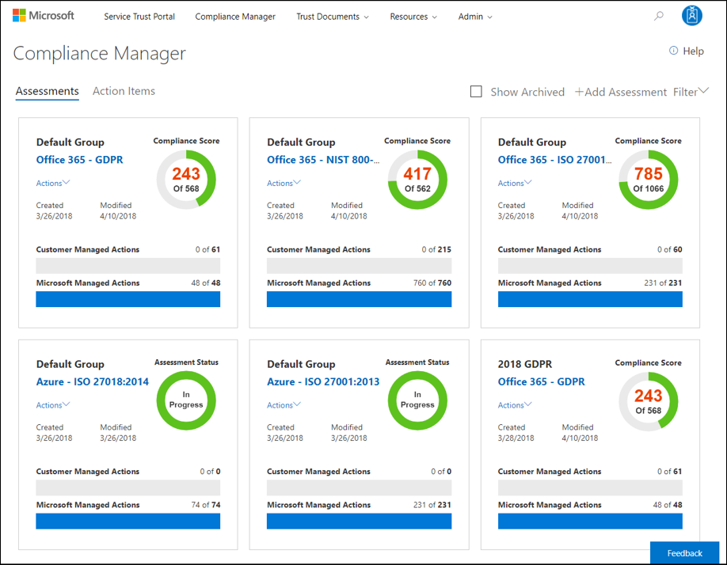

## Accessing Compliance Manager

You access Compliance Manager from the Service Trust Portal. Anyone with a Microsoft account or Azure Active Directory organizational account can access Compliance Manager.

1. Go to [https://servicetrust.microsoft.com](https://servicetrust.microsoft.com/).

2. Sign in with your Azure Active Directory (Azure AD) user account.

3. In the Service Trust Portal, click **Compliance Manager**.

4. When the Non-Disclosure Agreement is displayed, read it, and then click **Agree** to continue. You'll only have to do this once, and then the Compliance Manager dashboard is displayed.

   To get you started, we've added the following Assessments by default:

   

5. Click  **Help** to take a short tour of Compliance Manager.

## Viewing action items

Compliance Manager provides a convenient view of all your assigned control assessment action items, enabling you to quickly and easily take action on them. You can view all action items or select the action items that correspond with a specific certification by clicking the tab associated with that assessment. For instance, in the image below, the GDPR tab has been selected, showing controls that related to the GDPR assessment.

To view your action items:

1. Go to the Compliance Manager dashboard

2. Click the **Action Items** link, and the page will refresh to show the action items that have been assigned to you.

   By default, all action items are shown. If you have action items across multiple certifications, the names of the certifications will be listed in tabs across the top of the assessment control. To see the action items for a specific certification, click that tab.

## Adding an Assessment

To add an Assessment to Compliance Manager:

1. In the Compliance Manager dashboard, click  **Add Assessment**.

2. In the **Add an Assessment** window, you can create a new group to add the Assessment to or you can add it to an existing group (the built-in group is named "Initial Group".) Depending on the option you choose, either type the name of a new group or select an existing group from the drop-down list. For more information, see [Grouping Assessments](#grouping-assessments).

   If you create a group, you also have the option to copy information from an existing group to the new Assessment. That means any information that was added to the Implementation Details and Test Plan and Management Response fields of customer-managed controls from Assessments in the group that you're copying from are copied to the same (or related) customer-managed controls in the new Assessment. If you're adding a new Assessment to an existing group, common information from Assessments in that group will be copied to the new Assessment. For more information, see [Copying information from existing Assessments](#copying-information-from-existing-assessments).

3. Click **Next**, and do the following:

   a. Choose a Microsoft cloud service to assess for compliance from the **Select a product** drop-down list.

   b. Choose a certification to assess the selected cloud service against from the **Select a certification** drop-down list.

4. Click **Add to Dashboard** to create the Assessment; the assessment will be added to the Compliance Manager dashboard as a new tile at the end of the list of existing tiles.

   The **Assessment Tile** on the Compliance Manager dashboard, displays the assessment grouping, the name of the assessment (automatically created as a combination of the Service name and the certification selected), the date it was created and when it was last modified, the Total Compliance Score (which is the sum of all of the assigned control risk values that have been implemented, tested, and passed), and progress indicators along the bottom that show the number of controls that have been assessed.

5. Click the Assessment name to open it, and view the details of the Assessment.

6. Click the **Actions** menu to view your assigned action items, rename the assessment group, export the assessment report, or archive the assessment.

   

## Copying information from existing Assessments

As previously explained, when you create an assessment group, you have the option to copy information from Assessments in an existing group to the new Assessment in the new group. This allows you to apply the assessment and testing work that's been completed to the same customer-managed controls in the new Assessment. For example, if you have a group for all GDPR-related Assessments in your organization, you can copy common information from existing assessment work when add a new Assessment to the group.

You can copy the following information from customer to a new Assessment:

- Assessment Users. An Assessment user is a user who the control is assigned to.

- Status, Test Date, and Test Results.

- Implementation details and test plan information.

Similarly, information from shared customer-managed controls within the same Assessment group is synchronized. And information in related customer-managed controls within the same Assessment is also synchronized.

## Viewing Assessments

1. Locate the Assessment Tile corresponding to the assessment you wish to view, then click the assessment name to open it and view the Microsoft and customer-managed controls associated with the Assessment, along with a list of the cloud services that are in-scope for the Assessment. Here's an example of the Assessment for Office 365 and GDPR.

   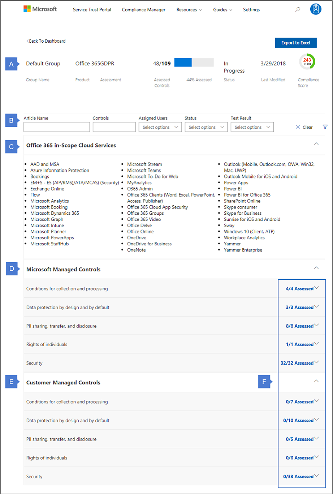

2. This section shows the Assessment summary information, including the name of the Assessment Grouping, Product, Assessment name, number of Assess controls

3. This section shows the Assessment Filter controls. For a more detailed explanation of how to use the Assessment Filter controls see the [Managing the assessment process](#managing-the-assessment-process) section.

4. This section shows the individual cloud services that are in-scope for the assessment.

5. This section contains Microsoft-managed controls. Related controls are organized by control family. Click a control family to expand it and display individual controls.

6. This section contains customer-managed controls, which are also organized by control family. Click a control family to expand it and display individual controls.

7. Displays the total number of controls in the control family, and how many of those controls have been assessed. A key capability of Compliance Manager is tracking your organization's progress on assessing the customer-managed controls. For more information, see the [Understanding the Compliance Score](#understanding-the-compliance-score) section.

## Managing the assessment process

The creator of an Assessment is initially the only Assessment User. For each customer-managed control, you can assign an Action Item to a person in your organization so that person becomes an Assessment User who can perform the recommended Customer Actions, and gather and upload evidence. When you assign an Action Item, you can choose to send an email to the person that contains details including the recommended Customer Actions and the Action Item priority. The email notification includes a link to the **Action Items** dashboard, which lists all Action Items assigned to that person.

Here's a list of tasks that you can perform using the workflow features of Compliance Manager.

1. **Use the Filter Options to find specific assessment controls** - Compliance Manager provides **Filter Options**, giving you highly granular selection criteria for displaying assessment controls, helping you to precisely target specific areas of your compliance efforts.

   Click the funnel icon on the right-hand side of the page to show or hide the **Filter Options** controls. These controls allow you to specify filter criteria, and only the assessment controls that fit those criteria will be displayed below. 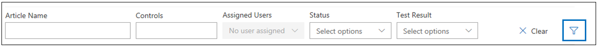

   - **Articles** - filters on the article name and returns the assessment controls associated to that article. For instance, typing in "Article (5)" returns a selection list of articles whose name includes that string, i.e. Article (5)(1)(a), Article (5)(1)(b), Article (5)(1)(c), etc. Selecting Article (5)(1)(c) will return the controls associated with Article (5)(1)(c). This is multiselect field that uses an OR operator with multiple values — for instance, if you select Article (5)(1)(a) and then add Article (5)(1)(c), the filter will return controls associated with either Article (5)(1)(a) or Article (5)(1)(c).

     

   - **Controls** - returns the list of controls whose names fit the filter, i.e. typing in 7.3 returns a selection list of items like 7.3.1, 7.3.4, 7.3.5, etc. This is multiselect field that uses an OR operator with multiple values — for instance, if you select 7.3.1 and then add 7.3.4, the filter returns controls associated with either 7.3.1 or 7.3.4.

     

   - **Assigned Users** - returns the list of controls who are assigned to the selected user.

   - **Status** - returns the list of controls with the selected status.

   - **Test Result** - returns the list of controls with the selected test result.

   As you apply filter conditions, the view of applicable controls will change to correspond to your filter conditions. Expand the control family sections to show the control details below.

   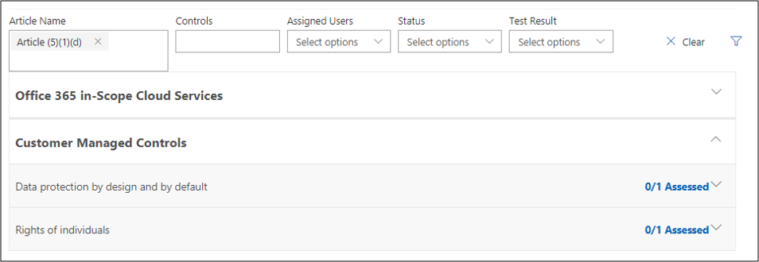

2. If after selecting the desired filters no results are shown, that means there are no controls that correspond to the specified filter conditions. For instance, if you select a particular **Assigned User** and then choose a **Control** name that does correspond to the control assigned to that user, no assessments will be shown in the page below.

3. **Assign an Action Item to a user** - You can assign an Action Item to a person to implement the requirements of a certification/regulation, or to test, verify, and document your organization's implementation requirements. When you assign an Action Item, you can choose to send an email to the person that contains details including the recommended Customer Actions and the Action Item priority. You can also unassign or reassign an Action Item to a different person.

4. **Manage documents** - Customer-managed controls also have a place to manage documents that are related to performing implementation tasks and for performing testing and validation tasks. Anyone with permissions to edit data in Compliance Manager can upload documents by clicking **Manage Documents**. After a documented has been uploaded, you can click **Manage Documents** to view and download files.

5. **Provide implementation and testing details** - Every customer-managed control has an editable field where users can add implementation details that document the steps taken by your organization to meet the requirements of the certification/regulation, and to validate and document how your organization meets those requirements.

6. **Set Status** - Set the Status for each item as part of the assessment process. Available status values are **Implemented**, **Alternative Implementation**, **Planned**, and **Not in Scope**.

7. **Enter test date and test result** - The person with the Compliance Manager Assessor role can verify that proper testing performed, review the implementation details, test plan, test results, and any uploaded evidence, and then set the Test Date and Test Result. Available test result values are **Passed**, **Failed-Low Risk**, **Failed-Medium Risk**, and **Failed-High Risk**.

## Managing action items

The people involved in the assessment process in your organization can use Compliance Manager to review the customer-managed controls from all Assessments for which they are users. When a user signs in to Compliance Manager and opens the **Action Items** dashboard, a list of Action Items assigned to them is displayed. Depending on the Compliance Manager role assigned to the user, they can provide implementation or test details, update the Status, or assign Action Items.

As certification controls are generally implemented by one person and tested by another, the control action item can be initially assigned to one person for implementation, and once that is complete, that person can reassign the control action item to the next person for control testing and uploading of evidence. This assignment/reassignment of control actions can be performed by any users who have a Compliance Manager role with sufficient permissions, allowing for central management of control assignments, or decentralized routing of control action items, from implementer to tester as appropriate.

To assign an action item:

1. On the Compliance Manager dashboard, locate the assessment tile of the assessment you wish to work with and click on the name of the assessment to go to the assessment details page.

2. You can click **Filter** and use the filter controls to find the specific assessment control you wish to assign, or

3. Scroll down to the Customer-Managed Controls section, expand the control family, and scroll through the list of control until you have located the assessment control to be assigned

4. Under the **Assigned User** column, click **Assign**.

5. In the Assign Action Item dialog box, click the **Assign To** field to populate the list of users to whom the action can be assigned. You can scroll through the list to find the target user or start typing in the field to search for the username.

6. Click the user to assign them this action item.

7. If you wish to send an email notification to the user notifying them, ensure that the **Send Email Notification** checkbox is checked.

8. Type any notes you wish to be displayed to that user and click **Assign**.

   The user will receive notification of their action item assignment and any notes you have provided.

The notes that are associated with the action item are persisted in the notes section, available for the next time the action item is assigned. These notes are not read-only, can be edited, replaced or removed by the person assigning the action item.

## Exporting information from an Assessment

You can export an Assessment to an Excel file, which can be reviewed by compliance stakeholders in your organization, and provided to auditors and regulators. This assessment report is a snapshot of the assessment as of the date and time that the report is created, and it contains the details of both the Microsoft-managed controls and the customer-managed controls for that assessment, including control implementation status, control test date and test results, and provides links to the uploaded evidence documents. It is recommended that you export the assessment report prior to archiving an assessment, as archived assessments do not retain their links to uploaded documents.

To export an Assessment report:

- On the Compliance Manager dashboard, click **Actions** on the tile of the assessment you wish to export, and then choose **Export to Excel**

  Or

- If you are viewing the Assessment details page, click on the **Export to Excel** button, which is located in the upper right-hand corner of the page above the assessment's Compliance Score.

The assessment report will be downloaded in your browser session. If you don't see a popup informing you of this, you may wish to check your browser's downloads folder.

## Archiving an Assessment

When you have completed an Assessment and no longer need it for compliance purposes, you can archive it. When an Assessment is archived, it is removed from Assessments dashboard.

> [!NOTE]
> When an Assessment is Archived, it cannot be 'unarchived' or restored to a read-write in progress state. Please note that Archived Assessments do not retain their links to uploaded evidence documents, so it is highly recommended that you perform an Export of the Assessment before archiving it, as the exported assessment report will contain links to the evidence documents, enabling you to continue to access them.

To archive an assessment:

1. On the dashboard tile of the desired assessment, click **Actions**.

2. Select **Archive Assessment**.

   The **Archive Assessments** dialog is displayed, asking you to confirm that you want to archive the assessment.

3. To continue with archiving, click **Archive**, or else click **Cancel**.

To view archived Assessments:

1. On the Compliance Manager dashboard, check the **Show Archived** checkbox.

   The archived assessments will appear in a newly visible section below the rest of the active assessments under a bar titled **Archived Assessments**.

2. Click the name of the assessment you wish to view.

When viewing an archived assessment, none of the normally editable controls (i.e. Implementation, Test Results) will be active, and the **Managed Documents** button will be absent.

## Using search

Click the magnifying glass in the upper right-hand corner of the page by to expand the Search input field, enter your search terms and press Enter. The Search control will appear, with the search term in the search pane input field, and search results will appear beneath.

By default, Search returns Document results, and you can use the Filter By dropdown lists to refine the list of documents displayed, to add or remove search results from view. You can use multiple filter attributes at the same time to narrow the returned documents to specific cloud services, categories of compliance or security practices, regions of the world, or industries. Click the document name link to download the document.

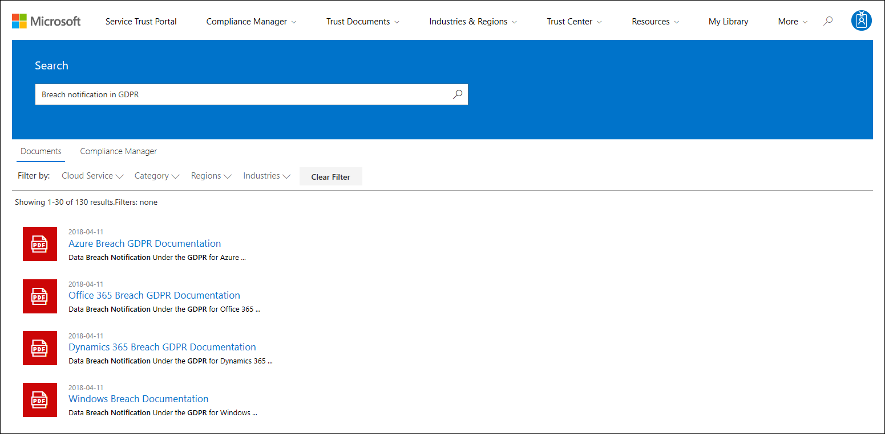

Click on the Compliance Manager link to display Search results for Compliance Manager assessment controls. The listed search results show the date the assessment was created, the name of the assessment grouping, the applicable cloud service, and whether the controls are Microsoft or Customer Managed.

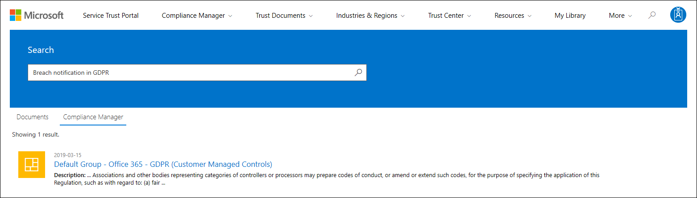

> [!NOTE]
> Service Trust Portal reports and documents are available to download for at least twelve months after publishing or until a new version of document becomes available.

## Localization support

Service Trust Portal enables you to view the page content in different languages. To change the page language, simply click on the globe icon in the lower left corner of the page and select the language of your choice.

## Change log for Customer-Managed Controls

Compliance Manager is designed to be regularly updated to keep pace with changes in regulatory requirements, as well as changes in our cloud services. These updates include changes to the Customer-Managed Controls. A Change Log is provided to help you understand the impact of these changes, including the details of the content being added or changed, and guidance as to what effect the changes have on existing Assessments. Generally, there are two types of changes:

- A **Major** change is a significant change to a Customer Action, such as the addition or removal of a control or specific numbered steps, or a change in the guidance around responsibilities, recommendations, or evidence. For Major changes, we recommend that you re-evaluate your implementation and/or assessment of the affected control.

- A **Minor** change is an insignificant change to a Customer Actions, such as fixing a typo or formatting issues, or updating or correcting hyperlinks. Minor changes generally do not require the control to be re-evaluated; however, we do recommend that you review the updated Customer Action.

### Customer-managed controls - Change Log for July 2018

|Control ID|Assessment|Type of change|Description of change|Recommended actions for customers|
|---|---|---|---|---|---|---|---|---|
|45 C.F.R. § 164.308(a)(7)(ii)(A)|Office 365: HIPAA|Major|Added HITECH control to HIPAA Assessment for Office 365 |Review the added control and recommended Customer Actions|
|45 C.F.R.  164.312(a)(6)(ii)|Office 365: HIPAA|Major|Added HITECH control to HIPAA Assessment for Office 365|Review the added control and recommended Customer Actions|
45 C.F.R. § 164.312(c)(1)| Office 365: HIPAA|Major| Added HITECH control to HIPAA Assessment for Office 365 |Review the added control and recommended Customer Actions|
45 C.F.R.  § 164.316(b)(2)(iii)| Office 365: HIPAA|Major|Added HITECH control to HIPAA Assessment for Office 365|Review the added control and recommended Customer Actions|
|

### Customer-managed controls - Change Log for April 2018

|GDPR|HIPAA|ISO 27001|ISO 27018|NIST 800-53|NIST 800-171|Type of change|Description of change|Recommended actions for customers|
|---|---|---|---|---|---|---|---|---|
|6.13.2|||C.16.1.1|||Major|Previously numbered as 6.12.1.1. 
 Added details to recommendations.|Re-assess the control: Review the updated guidance in the Customer Actions and follow the recommended steps for implementing and assessing the control.|
||||||3.1.6|Major|Added steps to guidance that include enabling auditing and searching audit logs.|Review the updated recommendations in the Customer Actions.|
|6.8.2|||A.10.2|||Major|Previously numbered as 6.7.2.9. 
 Updated guidance with additional recommendations and action items.|Re-assess the control: Review the updated guidance in the Customer Actions and follow the recommended steps for implementing and assessing the control.|
|6.6.4|45 C.F.R. § 164.312(a)(2)(i) 
 45 C.F.R. § 164.312(d)|A.9.4.2||IA-2|3.5.1|Major|Previously numbered as 6.5.2.3. 
 Updated guidance with additional recommendations and action items.|Re-assess the control: Review the updated guidance in the Customer Actions and follow the recommended steps for implementing and assessing the control.|
|6.13.1|45 C.F.R. § 164.308(a)(1)(i)|A.16.1|C.16.1|IR-4(a)|3.6.1|Major|Previously numbered as 6.12.1. 
 Updated guidance with additional recommendations and action items.|Re-assess the control: Review the updated guidance in the Customer Actions and follow the recommended steps for implementing and assessing the control.|
|6.7||||||Major|Previously numbered as 6.6.1.1.
 Updated guidance with additional recommendations and action items.|Re-assess the control: Review the updated guidance in the Customer Actions and follow the recommended steps for implementing and assessing the control.|
|6.6.5|||A.10.8|IA-3|3.5.2|Major|Previously numbered as 6.5.4.2. 
 Updated guidance with additional recommendations and action items.|Re-assess the control: Review the updated guidance in the Customer Actions and follow the recommended steps for implementing and assessing the control.|
|6.15.1||||||Major|Previously numbered as 6.14.1.3. 
 Updated guidance with additional recommendations and action items.|Re-assess the control: Review the updated guidance in the Customer Actions and follow the recommended steps for implementing and assessing the control.|
|||||AC-2(h)(2)||Minor|Added link to Enable Auditing blade.|No action necessary.|
|||||AC-2(7)(b)||Minor|Added link to Enable Auditing blade.|No action necessary.|
|||||AC-2(h)(1)||Minor|Added link to Enable Auditing blade.|No action necessary.|
||45 C.F.R. § 164.308(a)(5)(ii)(C)|||AC-2(g)||Minor|Added link to Enable Auditing blade.|No action necessary.|
|||||AC-2(12)||Minor|Added link to Enable Auditing blade.|No action necessary.|
||45 C.F.R. § 164.312(b)|A.12.4.3||AU-2(d)||Minor|Added link to Enable Auditing blade.|No action necessary.|
|||||AC-2(4)||Minor|Added link to Enable Auditing blade.|No action necessary.|
||||||3.1.7|Minor|Added link to Enable Auditing blade.|No action necessary.|
|||A.16.1.7|C.12.4.2, Part 2|||Minor|Added link to Enable Auditing blade.|No action necessary.|
|||||AC-2(h)(3)||Minor|Added link to Enable Auditing blade.|No action necessary.|
|||A.12.4.2||||Minor|Added link to Enable Auditing blade.|No action necessary.|
|||A.7.2.8||||Minor|Added links to Content Search blade and to DSR portal.|No action necessary.|
||45 C.F.R. § 164.308(a)(3)(ii)(C)|||||Minor|Added links to Enable Auditing blade and to Office 365 admin role support topics.|No action necessary.|
|5.2.1||||||Minor|Previously numbered as 5.2.2. 
 Clarified customer responsibilities within guidance.|Review the updated recommendations in the Customer Actions.|
|6.11.1|45 C.F.R. § 164.312(e)(2)(ii)|A.10.1.1   A.10.1.2   A.18.1.5|C.10.1.1|SC-13|3.13.11|Minor|Previously numbered as 6.10.1.2. 
 Fixed typo.|No action necessary.|
|7.5.1||||||Minor|Previously numbered as A.7.4.1. 
 Fixed typo.|No action necessary.|
|||A.8.2.3|||3.1.3|Minor|Removed extra unnecessary sentence.|No action necessary.|
||45 C.F.R. § 164.308(a)(4)(i)|A.6.1.2||AC-5(a)|3.1.2    3.1.4|Minor|Updated guidance with additional recommendations and action items.|Review the updated recommendations in the Customer Actions.|
||45 C.F.R. § 164.308(a)(7)(ii)(E)|||RA-2(a)||Minor|Updated import service help topic link to use FWLink.|No action necessary.|
|

### GDPR Assessment Control ID Change Reference - Change Log for February 2018

|Previous Control ID (November 2017 Preview)|New Control ID (February 2018 GA release)|
|---|---|
|5.2.2|5.2.1|
|5.2.3|5.2.2|
|5.2.4|5.2.3|
|6.1.1.1|6.2|
|6.10.1.2|6.11.1|
|6.10.2.5|6.11.2|
|6.11.1.2|6.12|
|6.12.1|6.13.1|
|6.12.1.1|6.13.2|
|6.12.1.5|6.13.3|
|6.14.1.3|6.15.1|
|6.14.2.1|6.15.2|
|6.14.2.3|6.15.3|
|6.2.1.1|6.3|
|6.3.2.2|6.4|
|6.4.3.1|6.5.2|
|6.4.3.2|6.8.1|
|6.4.3.3|6.5.3|
|6.5.2|6.6.1|
|6.5.2.1|6.6.2|
|6.5.2.2|6.6.3|
|6.5.2.3|6.6.4|
|6.5.4.2|6.6.5|
|6.6.1.1|6.7|
|6.7.2.7|6.8.1|
|6.7.2.9|6.8.2|
|6.8.1.4|6.9.1|
|6.8.4.1|6.9.3|
|6.8.4.2|6.9.4|
|6.9.2.1|6.10.1|
|6.9.2.3|6.10.2|
|A.7.1.1|7.2.1|
|A.7.1.2|7.2.2|
|A.7.1.3|7.2.3|
|A.7.1.4|7.2.4|
|A.7.1.5|7.2.5|
|A.7.1.6|7.2.6|
|A.7.1.7|7.2.7|
|A.7.2.1|7.3.1|
|A.7.2.10|7.3.9|
|A.7.2.11|7.3.10|
|A.7.2.2|7.3.2|
|A.7.2.3|7.3.3|
|A.7.2.4|7.3.4|
|A.7.2.5|7.3.5|
|A.7.2.6|7.3.6|
|A.7.2.7|7.3.7|
|A.7.2.8|7.3.8|
|A.7.3.1|7.4.1|
|A.7.3.10|7.4.10|
|A.7.3.2|7.4.2|
|A.7.3.3|7.4.3|
|A.7.3.4|7.4.4|
|A.7.3.5|7.4.5|
|A.7.3.6|7.4.6|
|A.7.3.7|7.4.7|
|A.7.3.8|7.4.8|
|A.7.3.9|7.4.9|
|A.7.4.1|7.5.1|
|A.7.4.2|7.5.2|
|A.7.4.3|7.5.3|
|A.7.4.4|7.5.4|
|A.7.4.5|7.5.5|
|B.8.1.1|8.2.1|
|B.8.1.2|8.2.2|
|B.8.1.3|8.2.3|
|B.8.1.4|8.2.4|
|B.8.1.5|8.2.5|
|B.8.1.6|8.2.6|
|B.8.2.1|8.3.1|
|B.8.3.1|8.4.1|
|B.8.3.2|8.4.2|
|B.8.3.3|8.4.3|
|B.8.4.1|8.5.1|
|B.8.4.2|8.5.2|
|B.8.4.3|8.5.4|
|B.8.4.4|8.5.5|
|B.8.4.5|8.5.3|
|B.8.4.6|8.5.6|
|B.8.4.7|8.5.7|
|B.8.4.8|8.5.8|
|