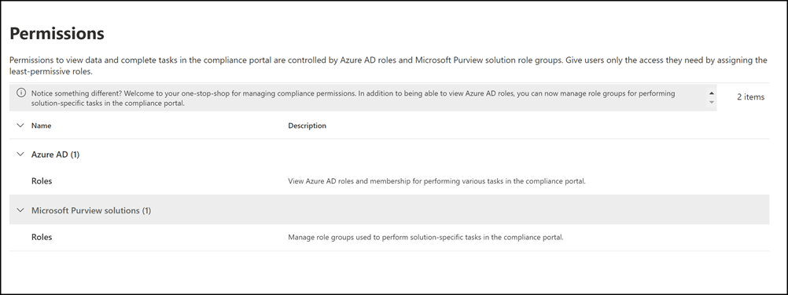

# Permissions in the Microsoft 365 compliance center

The Microsoft 365 compliance center has been recently updated and now supports directly  managing permissions for users who perform compliance tasks in Microsoft 365. This update means you'll no longer have to use the Office 365 Security & Compliance Center to manage permissions for compliance solutions. Using the new **Permissions** page in the Microsoft 365 compliance center, you can manage permissions to users for compliance tasks in features like device management, data loss prevention, eDiscovery, insider risk management, retention, and many others. Users can perform only the compliance tasks that you explicitly grant them access to.

To view the **Permissions** tab in the Microsoft 365 compliance center, users need to be a global administrator or need to be assigned the *Role Management* role (a role is assigned only to the *Organization Management* role group). The *Role Management* role allows users to view, create, and modify role groups.

Permissions in the Microsoft 365 compliance center are based on the role-based access control (RBAC) permissions model. RBAC is the same permissions model that's used by most Microsoft 365 services, so if you're familiar with the permission structure in these services, granting permissions in the Microsoft 365 compliance center will be familiar. It's important to remember that the permissions managed in the Microsoft 365 compliance center don't cover the management of all the permissions needed in each individual service. You'll still need to manage certain service-specific permissions in the admin center for the specific service. For example, if you need to assign permissions for archiving, auditing, and retention policies, you'll need to manage these permissions in the Exchange admin center.

## Relationship of members, roles, and role groups

A role grants permissions to do a set of tasks; for example, the Case Management role lets users work with eDiscovery cases.

A role group is a set of roles that enable users do their jobs across compliance solutions the Microsoft 365 compliance center. For example, by adding users to the *Insider Risk Management* role group, designated administrators, analysts, investigators, and auditors are configured for the necessary insider risk management permissions in a single group. The Microsoft 365 compliance center includes default role groups for tasks and functions for each compliance solution that you'll need to assign people to. Generally, we recommend simply adding individual users as members to the default compliance role groups as needed.

## Permissions needed to use features in the Microsoft 365 compliance center

To view all of the default role groups that are available in the Microsoft 365 compliance center and the roles that are assigned to the role groups by default, see the [Permissions in the Security & Compliance Center](/microsoft-365/security/office-365-security/permissions-in-the-security-and-compliance-center).

Managing permissions in the Microsoft 365 compliance center only gives users access to the compliance features that are available within the Microsoft 365 compliance center. If you want to grant permissions to other features that aren't in the Microsoft 365 compliance center, such as Exchange mail flow rules (also known as transport rules), you'll need to use the Exchange admin center.

## Azure roles in the Microsoft 365 compliance center

The roles that appear in the **Azure AD** > **Roles** section of the Microsoft 365 compliance center **Permissions** page are Azure Active Directory roles. These roles are designed to align with job functions in your organization's IT group, making it easy to give a person all the permissions necessary to get their job done. You can view the users currently assigned to each role by selecting an Admin role and viewing the role panel details. To manage members of an Azure AD role, select Manage members in Azure AD. This choice redirects you to the Azure management portal.

|Role|Description|
|:---|:----------|
|**Global administrator**|Access to all administrative features in all Microsoft 365 services. Only global administrators can assign other administrator roles. For more information, see [Global Administrator / Company Administrator](/azure/active-directory/roles/permissions-reference#global-administrator--company-administrator).|
|**Compliance data administrator**|Keep track of your organization's data across Microsoft 365, make sure it's protected, and get insights into any issues to help mitigate risks. For more information, see [Compliance Data Administrator](/azure/active-directory/roles/permissions-reference#compliance-data-administrator).|
|**Compliance administrator**|Help your organization stay compliant with any regulatory requirements, manage eDiscovery cases, and maintain data governance policies across Microsoft 365 locations, identities, and apps. For more information, see [Compliance Administrator](/azure/active-directory/roles/permissions-reference#compliance-administrator).|
|**Security operator**|View, investigate, and respond to active threats to your Microsoft 365 users, devices, and content. For more information, see [Security Operator](/azure/active-directory/roles/permissions-reference#security-operator).|
|**Security reader**|View and investigate active threats to your Microsoft 365 users, devices, and content, but (unlike the Security operator) they do not have permissions to respond by taking action. For more information, see [Security Reader](/azure/active-directory/roles/permissions-reference#security-reader).|
|**Security administrator**|Control your organization's overall security by managing security policies, reviewing security analytics and reports across Microsoft 365 products, and staying up-to-speed on the threat landscape. For more information, see [Security Administrator](/azure/active-directory/roles/permissions-reference#security-administrator).|
|**Global reader**|The read-only version of the **Global administrator** role. View all settings and administrative information across Microsoft 365. For more information, see [Global Reader](/azure/active-directory/roles/permissions-reference#global-reader).|
|**Attack simulation administrator**|Create and manage all aspects of [attack simulation](attack-simulation-training.md) creation, launch/scheduling of a simulation, and the review of simulation results. For more information, see [Attack Simulation Administrator](/azure/active-directory/roles/permissions-reference#attack-simulation-administrator).|
|**Attack payload author**|Create attack payloads but not actually launch or schedule them. For more information, see [Attack Payload Author](/azure/active-directory/roles/permissions-reference#attack-payload-author).|
|

## Add users to a compliance role group

Complete the following steps to add users to a compliance role group:

1. Sign into the permissions area of the [Microsoft 365 compliance center](https://compliance.microsoft.com/permissions) using credentials for an admin account in your Microsoft 365 organization.
2. In the Microsoft 365 compliance center, go to **Permissions**. Select the link to view and manage compliance roles in Microsoft 365.
3. Expand the **Compliance center** section and select **Roles**.
4. On the **Compliance center roles** page, select a compliance role group you want to add users to, then select **Edit role group** on the details pane.
5. Select **Choose members** from the left navigation pane, then select **Edit**.
6. Select **Add** and then select the checkbox for all users you want to add to the role group.
7. Select **Add**, then select **Done**.
8. Select **Save** to add the users to the role group. Select **Close** to complete the steps.

## Remove users from a compliance role group

Complete the following steps to remove users from a compliance role group:

1. Sign into the permissions area of the [Microsoft 365 compliance center](https://compliance.microsoft.com/permissions) using credentials for an admin account in your Microsoft 365 organization.
2. In the Microsoft 365 compliance center, go to **Permissions**. Select the link to view and manage compliance roles in Microsoft 365.
3. Expand the Compliance center section and select **Roles**.
4. On the **Compliance center roles** page, select a compliance role group you want to remove users from, then select **Edit role group** on the details pane.
5. Select **Choose members** from the left navigation pane, then select **Edit**.
6. Select **Remove** and then select the checkbox for all users you want to remove from the role group.
7. Select **Remove**, then select **Done**.
8. Select **Save** to remove the users from the role group. Select **Close** to complete the steps.
