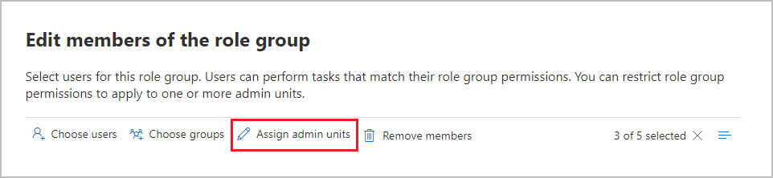

# Permissions in the Microsoft Purview compliance portal

The Microsoft Purview compliance portal supports directly  managing permissions for users who perform compliance tasks in Microsoft 365. This update means you'll no longer have to use the Office 365 Security & Compliance Center to manage permissions for compliance solutions. Using the new **Permissions** page in the compliance portal, you can manage permissions to users for compliance tasks in features like device management, Microsoft Purview Data Loss Prevention, eDiscovery, insider risk management, retention, and many others. Users can perform only the compliance tasks that you explicitly grant them access to.

To view the **Permissions** tab in the compliance portal, users need to be a global administrator or need to be assigned the *Role Management* role (a role is assigned only to the *Organization Management* role group). The *Role Management* role allows users to view, create, and modify role groups.

Permissions in the compliance portal are based on the role-based access control (RBAC) permissions model. RBAC is the same permissions model that's used by most Microsoft 365 services, so if you're familiar with the permission structure in these services, granting permissions in the compliance portal will be familiar. It's important to remember that the permissions managed in the compliance portal don't cover the management of all the permissions needed in each individual service. You'll still need to manage certain service-specific permissions in the admin center for the specific service. For example, if you need to assign permissions for archiving, auditing, and MRM retention policies, you'll need to manage these permissions in the <a href="https://go.microsoft.com/fwlink/p/?linkid=2059104" target="_blank">Exchange admin center</a>.

[!INCLUDE [purview-preview](../includes/purview-preview.md)]

## Relationship of members, roles, and role groups

A role grants permissions to do a set of tasks; for example, the Case Management role lets users work with eDiscovery cases.

A role group is a set of roles that enable users do their jobs across compliance solutions the compliance portal. For example, by adding users to the *Insider Risk Management* role group, designated administrators, analysts, investigators, and auditors are configured for the necessary insider risk management permissions in a single group. The compliance portal includes default role groups for tasks and functions for each compliance solution that you'll need to assign people to. Generally, we recommend simply adding individual users as members to the default compliance role groups as needed.

## Permissions needed to use features in the compliance portal

To view all of the default role groups that are available in the compliance portal and the roles that are assigned to the role groups by default, see [Roles and role groups in the Microsoft 365 Defender and Microsoft Purview compliance portals](/microsoft-365/security/office-365-security/scc-permissions).

Managing permissions in the compliance portal only gives users access to the compliance features that are available within the compliance portal. If you want to grant permissions to other features that aren't in the compliance portal, such as Exchange mail flow rules (also known as transport rules), you'll need to use the <a href="https://go.microsoft.com/fwlink/p/?linkid=2059104" target="_blank">Exchange admin center</a>.

## Azure roles in the compliance portal

The roles that appear in the **Azure AD** > **Roles** section of the compliance portal **Permissions** page are Azure Active Directory roles. These roles are designed to align with job functions in your organization's IT group, making it easy to give a person all the permissions necessary to get their job done. You can view the users currently assigned to each role by selecting an Admin role and viewing the role panel details. To manage members of an Azure AD role, select Manage members in Azure AD. This choice redirects you to the Azure management portal.

|Role|Description|
|:---|:----------|
|**Global administrator**|Access to all administrative features in all Microsoft 365 services. Only global administrators can assign other administrator roles. For more information, see [Global Administrator / Company Administrator](/azure/active-directory/roles/permissions-reference#global-administrator--company-administrator).|
|**Compliance data administrator**|Keep track of your organization's data across Microsoft 365, make sure it's protected, and get insights into any issues to help mitigate risks. For more information, see [Compliance Data Administrator](/azure/active-directory/roles/permissions-reference#compliance-data-administrator).|
|**Compliance administrator**|Help your organization stay compliant with any regulatory requirements, manage eDiscovery cases, and maintain data governance policies across Microsoft 365 locations, identities, and apps. For more information, see [Compliance Administrator](/azure/active-directory/roles/permissions-reference#compliance-administrator).|
|**Security operator**|View, investigate, and respond to active threats to your Microsoft 365 users, devices, and content. For more information, see [Security Operator](/azure/active-directory/roles/permissions-reference#security-operator).|
|**Security reader**|View and investigate active threats to your Microsoft 365 users, devices, and content, but (unlike the Security operator) they do not have permissions to respond by taking action. For more information, see [Security Reader](/azure/active-directory/roles/permissions-reference#security-reader).|
|**Security administrator**|Control your organization's overall security by managing security policies, reviewing security analytics and reports across Microsoft 365 products, and staying up-to-speed on the threat landscape. For more information, see [Security Administrator](/azure/active-directory/roles/permissions-reference#security-administrator).|
|**Global reader**|The read-only version of the **Global administrator** role. View all settings and administrative information across Microsoft 365. For more information, see [Global Reader](/azure/active-directory/roles/permissions-reference#global-reader).|
|**Attack simulation administrator**|Create and manage all aspects of attack simulation creation, launch/scheduling of a simulation, and the review of simulation results. For more information, see [Attack Simulation Administrator](/azure/active-directory/roles/permissions-reference#attack-simulation-administrator).|
|**Attack payload author**|Create attack payloads but not actually launch or schedule them. For more information, see [Attack Payload Author](/azure/active-directory/roles/permissions-reference#attack-payload-author).|
|

## Administrative units (preview)

> [!IMPORTANT]
> Administrative units are supported only in Microsoft 365 commercial cloud organizations for public preview.

Administrative units let you subdivide your organization into smaller units, and then assign specific administrators that can manage only the members of those units. They also allow you to assign administrative units to members of role groups in Microsoft Purview solutions, so that these administrators can manage only the members (and associated features) of those assigned administrative units.

For example, you could use administrative units to delegate permissions to administrators for each geographic region in a large multi-national organization or for grouping administrator access by department within your organization. You can create region or department-specific policies or view user activity as a result of those policies and administrative unit assignment. You can also use administrative units as an initial scope for a policy, where the selection of users eligible for the policy depends on membership in administrative units.

### Administrative units support in Microsoft Purview

The following Microsoft Purview compliance solutions support administrative units:

|**Solution**|**Configuration support**|
|:-----------|:-------------------------|
| [Data lifecycle management](data-lifecycle-management.md) | [Role groups, retention policies, and retention label policies](get-started-with-data-lifecycle-management.md#support-for-administrative-units) |
| [Data Loss Prevention (DLP)](/microsoft-365/compliance/dlp-learn-about-dlp) | Role groups and [DLP policies](/microsoft-365/compliance/dlp-create-deploy-policy) | 
| [Communication compliance](/microsoft-365/compliance/communication-compliance.md)|Adaptive scopes|
| [Records management](records-management.md) | [Role groups, retention policies, retention label policies](get-started-with-records-management.md#support-for-administrative-units), and [adaptive scopes](purview-adaptive-scopes.md)|
| [Sensitivity labeling](/microsoft-365/compliance/sensitivity-labels) | [Role groups, sensitivity label policies, and auto-labeling policies](/microsoft-365/compliance/get-started-with-sensitivity-labels#support-for-administrative-units) |

The configuration for administrative units automatically flows down to the following features:

- Alerts: [DLP](/microsoft-365/compliance/dlp-alerts-dashboard-get-started) alerts are visible only from users in assigned administrative units
- [Activity explorer](data-classification-activity-explorer.md): Activity events are visible only from users in assigned administrative units
- [Adaptive scopes](purview-adaptive-scopes.md): 
    - Restricted administrators can select, create, edit, and view adaptive scopes only for users in those administrators' assigned administrative units
    - When a restricted administrator configures a policy that's using adaptive scopes, that administrator can only select adaptive scopes that are assigned to their administrative units
- Data lifecycle management and records management:
    - [Policy lookup](retention.md#policy-lookup): Restricted administrators will see policies only from users within their assigned administrative units
    - [Disposition review and verification](disposition.md): Restricted administrators will be able to add reviewers only from within their assigned administrative units, and see disposition reviews and items disposed only from users within their assigned administrative units

You can add users and groups to administrative units by using the following built-in role groups:

- Compliance Administrator
- Compliance Data Administrators
- Global Reader
- Information Protection
- Information Protection Admins
- Information Protection Analyst
- Information Protection Investigators
- Information Protection Readers
- Organization Management
- Records Management
- Security Administrator
- Security Operator
- Security Reader

When you assign role groups, you can select individual members or groups, and then the **Assign admin units** option to select administrative units that have been defined in Azure Active Directory:

> [!IMPORTANT]
> **Assign admin units** is always available when you've created custom role groups. You can assign administrative units for any custom role group.

These administrators, referred to as restricted administrators, can now select one or more of their assigned administrative units to automatically define the initial scope of policies that they create or edit. Only if administrators don't have administrative units assigned (unrestricted administrators), will they be able to assign policies to the entire directory without selecting individual administrative units.

> [!IMPORTANT]
> After you've assigned administrative units to members of the role groups, these restricted administrators will no longer be able to see and edit existing policies. However, there's no operational change to these policies and they remain visible and can be edited by unrestricted administrators.
> 
> Restricted administrators will also no longer be able to see historical data using features that support administrative units, such as activity explorer and alerts. They remain visible to unrestricted administrators. Going forward, restricted administrators will be able to see this related data for their assigned administrative units only.

### Prerequisites for administrative units

Before configuring administrative units for Microsoft Purview compliance solutions, make sure your organization and users meet the following subscription and licensing requirements:

- [Azure Active Directory Premium licensing](/azure/active-directory/roles/admin-units-manage#prerequisites)
- Microsoft Purview licensing:

    - Microsoft 365 E5/A5
    - Microsoft 365 E5/A5/F5 Compliance and F5 Security & Compliance
    - Microsoft 365 E5/A5/F5 Information Protection & Governance

### Configure and use administrative units

Complete the following steps to configure and use administrative units with Microsoft Purview compliance solutions:

1. [Create administrative units](/azure/active-directory/roles/admin-units-manage#create-an-administrative-unit) to restrict the scope of role permissions in Azure Active Directory (Azure AD).
2. [Add users and distribution groups](/azure/active-directory/roles/admin-units-members-add) to administrative units.

    >[!IMPORTANT]
    >Members of [Dynamic Distribution Groups](/azure/active-directory/roles/administrative-units#groups) don't automatically become members of an administrative unit.

3. If creating a geographic region or department-based administrative units, configure administrative units with [dynamic membership rules](/azure/active-directory/roles/admin-units-members-dynamic).

    >[!NOTE]
    >You can't add groups to an administrative unit that uses dynamic membership rules. If needed, create two administrative units, one for users and one for groups.

4. Use any of the role groups from the Microsoft Purview compliance solutions that support administrative units to assign administrative units to members.

Now, when these restricted administrators create or edit policies that support administrative units, they can select administrative units so that only the users in those administrative units will be eligible for the policy:

- *Unrestricted administrators* don't have to select administrative units as part of the policy configuration. They can keep the default of the entire directory, or select one or more administrative units.
- *Restricted administrators* must now select one or more administrative units as part of the policy configuration.

Further into the policy configuration, administrators who selected administrative units must then include or exclude (if supported) individual users and groups from the administrative units that they previously selected for the policy.

For information about administrative units that is specific to each supported solution, see the following sections:

- For data lifecycle management: [Support for administrative units](get-started-with-data-lifecycle-management.md#support-for-administrative-units)
- For DLP: [Administrative Unit restricted policies](dlp-policy-reference.md#administrative-unit-restricted-policies-preview)
- For records management:[Support for administrative units](get-started-with-records-management.md#support-for-administrative-units)
- For sensitivity labeling: [Support for administrative units](get-started-with-sensitivity-labels.md#support-for-administrative-units)

## Add users or groups to a Microsoft Purview built-in role group

Complete the following steps to add users or groups to a Microsoft Purview role group:

1. Sign into the permissions area of the compliance portal using credentials for an admin account in your Microsoft 365 organization, and go to <a href="https://go.microsoft.com/fwlink/p/?linkid=2173597" target="_blank">**Permissions**</a> to select the link to view and manage compliance roles in Microsoft 365.
2. Expand the **Microsoft Purview solutions** section and select **Roles**.
3. On the **Role groups for Microsoft Purview solutions** page, select a Microsoft Purview role group you want to add users to, then select **Edit** on the control bar.
4. On the **Edit members of the role group** page, select **Choose users** or **Choose groups**.

    > [!IMPORTANT]
    > Security groups are supported only in Microsoft 365 commercial cloud organizations.

5. Select the checkbox for all users or groups you want to add to the role group.
6. Select **Select**.
7. If the selected users or groups need organization-wide access as part of this role group assignment, go to Step 10.
8. If the selected users or groups need to be assigned to administrative units, select the users or groups and select **Assign admin units**.

    > [!IMPORTANT]
    > Administrative units are supported only in Microsoft 365 commercial cloud organizations for public preview.

9. On the **Assign admin units (preview)** pane, select the checkbox for all the administrative units you want to assign to the users or groups. Select **Select**.
10. Select **Next** and **Save** to add the users or groups to the role group. Select **Done** to complete the steps.

## Remove users or groups from a Microsoft Purview built-in role group

Complete the following steps to remove users or groups rom a Microsoft Purview role group:

1. Sign into the permissions area of the compliance portal using credentials for an admin account in your Microsoft 365 organization, and go to <a href="https://go.microsoft.com/fwlink/p/?linkid=2173597" target="_blank">**Permissions**</a> to select the link to view and manage the Microsoft Purview compliance roles.
2. Expand the **Microsoft Purview solutions** section and select **Roles**.
3. On the **Role groups for Microsoft Purview solutions** page, select a Microsoft Purview role group you want to remove users or groups from, then select **Edit** on the control bar.
4. On the **Edit members of the role group** page, select the checkbox for all users or groups you want to remove to the role group.
5. Select **Remove members**, then select **Next**.
6. Select **Save** to remove the users or groups from the role group. Select **Done** to complete the steps.

## Create a custom Microsoft Purview role group

Complete the following steps to create a custom Microsoft Purview role group:

1. Sign into the permissions area of the compliance portal using credentials for an admin account in your Microsoft 365 organization, and go to <a href="https://go.microsoft.com/fwlink/p/?linkid=2173597" target="_blank">**Permissions**</a>.
2. Expand the **Microsoft Purview solutions** section and select **Roles**.
3. On the **Role groups for Microsoft Purview solutions** page, select **Create role group**.
4. On the **Name the role group** page, enter a name for the custom role group in the **Name** field. The name of the role group cannot be changed after creation of the role group. If needed, enter a description for the custom role group in the **Description** field. Select **Next** to continue.
5. On the **Add roles to the role group** page, select **Choose roles**.
6. Select the checkboxes for the roles to add to the custom role group. Select **Select**.
7. Select **Next** to continue.
8. On the **Add members to the role group** page, select **Choose users** (or **Choose groups** if applicable).

    > [!IMPORTANT]
    > Security groups are supported only in Microsoft 365 commercial cloud organizations.

9. Select the checkboxes for the users (or groups) to add to the custom role group. Select **Select**.
10. Select **Next** to continue.
11. If the selected users or groups need organization-wide access as part of this role group assignment, go to Step 14.
12. If the selected users or groups need to be assigned to administrative units, select the users or groups and select **Assign admin units**.

    > [!IMPORTANT]
    > Administrative units are supported only in Microsoft 365 commercial cloud organizations for public preview.

13. On the **Assign admin units (preview)** pane, select the checkbox for all the administrative units you want to assign to the users or groups. Select **Select**.
14. Select **Next**.
15. On the **Review the role group and finish** page, review the details for the custom role group. If you need to edit the information, select **Edit** in the appropriate section. When all the settings are correct, select **Create** to create the custom role group or select **Cancel** to discard the changes and not create the custom role group.

## Update a custom Microsoft Purview role group

Complete the following steps to update a custom Microsoft Purview role group:

1. Sign into the permissions area of the compliance portal using credentials for an admin account in your Microsoft 365 organization, and go to <a href="https://go.microsoft.com/fwlink/p/?linkid=2173597" target="_blank">**Permissions**</a>.
2. Expand the **Microsoft Purview solutions** section and select **Roles**.
3. On the **Role groups for Microsoft Purview solutions** page, select a Microsoft Purview role group you want to update, then select **Edit** on the control bar.
4. On the **Name the role group** page, update the description for the custom role group in the **Description** field. The name of the custom role group cannot be changed. Select **Next**.
5. On the **Edit roles of the role group** page, you can select **Choose roles** to add roles to update the roles assigned to the role group. You can also select any of the currently assigned roles and select **Remove roles** to remove the roles from the role group. After you've updated the roles, select **Next**.
6. On the **Edit members of the role group** page, you can select **Choose users** or **Choose groups** to add users or groups assigned to the role group. To update the administrative units for users or groups, select any of the currently assigned user or groups and select **Assign admin units**. You can also select any of the currently assigned users and groups and select **Remove members** to remove the users or groups from the role group. After you've updated the members, select **Next**.
7. On the **Review the role group and finish** page, review the details for the custom role group. If you need to edit the information, select **Edit** in the appropriate section. When all the settings are correct, select **Save** to update the custom role group or select **Cancel** to discard the changes and not update the custom role group.

## Delete a custom Microsoft Purview role group

Complete the following steps to delete a custom Microsoft Purview role group:

1. Sign into the permissions area of the compliance portal using credentials for an admin account in your Microsoft 365 organization, and go to <a href="https://go.microsoft.com/fwlink/p/?linkid=2173597" target="_blank">**Permissions**</a>.
2. Expand the **Microsoft Purview solutions** section and select **Roles**.
3. On the **Role groups for Microsoft Purview solutions** page, select a Microsoft Purview role group you want to delete, then select **Delete** on the control bar.
4. On the **Delete role group** dialog, select **Delete** to delete the role group or select **Cancel** to cancel the deletion process.
