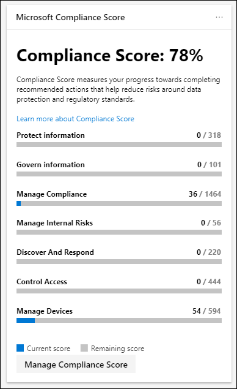
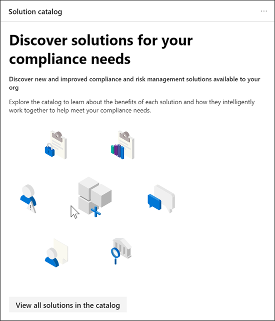
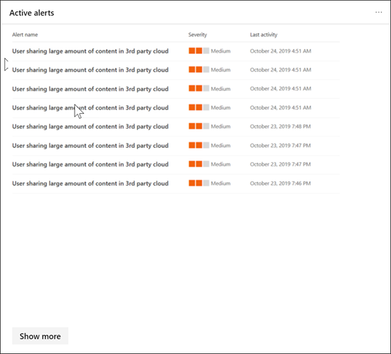
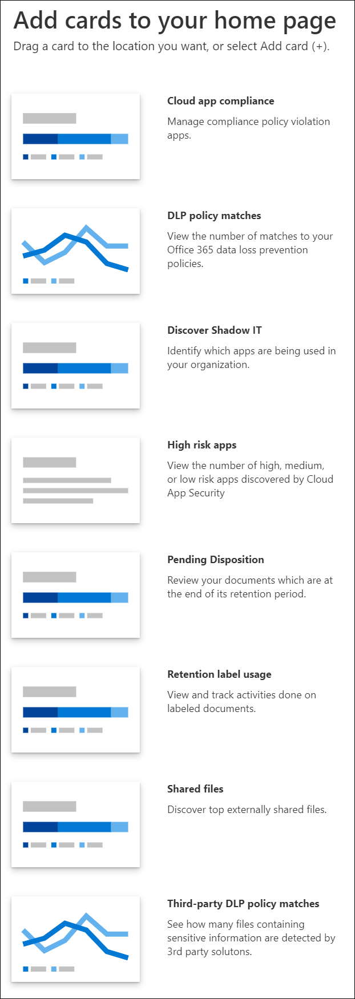

# Overview of the Microsoft 365 compliance center

## Overview

If you're interested in your organization's compliance posture, you're going to love the [Microsoft 365 compliance center](https://compliance.microsoft.com). The Microsoft 365 compliance center provides easy access to the data and tools you need to manage to your organization's compliance needs.

Read this article to get acquainted with the Microsoft 365 compliance center, [how to get it](#how-do-i-get-the-compliance-center), [frequently asked questions](#frequently-asked-questions), and your [next steps](#next-steps).

## Welcome to Microsoft 365 compliance

When you go to your Microsoft 365 compliance center for the first time, you are greeted with the following welcome message:

The welcome banner gives you some pointers on how to get started, with next steps, and an invitation for you to give us feedback.

## Card section

When you first visit the Microsoft 365 compliance center, the card section on the home page shows you at a glance how your organization is doing with data compliance, what solutions are available for your organization, and a summary of any active alerts.

From here, you can:

- Select the **Microsoft Compliance Score** card, which leads you to the new [Compliance Score](compliance-score.md) solution. It calculates a risk-based score that measures your progress toward completing recommended actions that help reduce risks around data protection and regulatory standards. It also provides workflow capabilities and built-in control mapping to help you efficiently carry out those actions.

    

- Select the new **Solution catalog** card, which links to collections of [integrated solutions](microsoft-365-solution-catalog.md) you can use to help you manage end-to-end compliance scenarios. A solution's capabilities and tools might include a combination of policies, alerts, reports, and more.

    

- Select the **Active alerts** card, which includes a summary of the most [active alerts]((../security/office-365-security/alerts.md)) and includes a link where you can view more detailed information, such as Severity, Status, Category, and more.

    

You'll also add many additional cards, such as one showing your organization's cloud app compliance, and another showing data about users with shared files, with links to [Cloud App Security](https://docs.microsoft.com/cloud-app-security/) or other tools where you can explore data.

## Easy navigation to more compliance features and capabilities

In addition to links in cards on the home page, you'll see a navigation pane on the left side of the screen that gives you easy access to your [alerts](../security/office-365-security/alerts.md), [reports](reports-in-security-and-compliance.md), [policies](alert-policies.md), compliance solutions, and more.

|  |  |
|---------|---------|
|  | Select **Home** to return to the Microsoft 365 compliance center main page.    Expand the **Data classification** section to access your [Trainable classifiers](), [Sensitive info types](what-the-sensitive-information-types-look-for.md), [Content explorer](), and Activity explorer.    Select **Data connectors** to configure connectors to import and archive data in your Microsoft 365 subscription.    Go to **Alerts** to view and resolve [alerts](../security/office-365-security/alerts.md)  Visit **Reports** to view data about [label usage and retention](sensitivity-labels.md), [DLP policy matches and overrides](view-the-dlp-reports.md), [shared files](https://docs.microsoft.com/cloud-app-security/file-filters), [third-party apps in use](https://docs.microsoft.com/cloud-app-security/discovered-apps), and more.    Go to **Policies** to set up policies to govern data, manage devices, and receive v[alerts](../security/office-365-security/alerts.md). You can also access your [DLP](data-loss-prevention-policies.md) and [retention](retention-policies.md) policies.   Select **Permissions** to manage who in your organization has access to the Microsoft 365 compliance center to view content and complete tasks.    Use the links in the **Solutions** section to access your organization's compliance solutions. These include:   [Catalog](microsoft-365-solutions-catalog.md)   [Information protection](protect-information.md)   [Data loss protection](data-loss-prevention-policies.md)   [Records management](records-management.md)   [Information governance](manage-information-governance.md)   [Data subject requests](manage-gdpr-data-subject-requests-with-the-dsr-case-tool.md)   [Content search](search-for-content.md)   [Audit](search-the-audit-log-in-security-and-compliance.md)   [eDiscovery](overview-ediscovery-20.md)   [Data investigations](overview-data-investigations.md)  [Communication compliance](communication-compliance.md)

## How do I get the compliance center?

- If you don't have the new Microsoft 365 compliance center already, you'll have it soon. The [new Microsoft 365 compliance center](../security/office-365-security/microsoft-security-and-compliance.md#microsoft-365-compliance-center) is generally available now.

- To visit the Microsoft 365 compliance center, as a global administrator or compliance administrator, go to [https://compliance.microsoft.com](https://compliance.microsoft.com) and sign in. 

- To learn more about requirements, see [Required licenses and permissions](../security/office-365-security/microsoft-security-and-compliance.md#required-licenses-and-permissions).

## Frequently asked questions

**Why am I taken to the Office 365 Security & Compliance Center to complete some tasks, such as defining certain policies?**

We're still developing the Microsoft 365 compliance center, and we'll be adding more functionality and solutions over the coming months. In the meantime, there are some tasks that must be completed in the Office 365 Security & Compliance Center ([https://protection.office.com](https://protection.office.com)). In those cases, you'll be directed automatically to the location where you can complete the task at hand, such as creating or editing a supervision policy.

**Why don't I see the new Microsoft 365 compliance center yet?**

First, make sure that you have the appropriate [licenses and permissions](../security/office-365-security/microsoft-security-and-compliance.md#required-licenses-and-permissions). Then, sign in at [https://compliance.microsoft.com](https://compliance.microsoft.com). If you don't see the new compliance center yet, you'll have it soon.

**Some of my compliance features aren't available in the Microsoft 365 compliance center. What do I do?**

We're still adding functionality to the Microsoft 365 compliance center. If you can't find something, such as audit log search, use the Office 365 Security & Compliance Center ([https://protection.office.com](https://protection.office.com)). Your configurations are saved in both the existing Office 365 Security & Compliance Center and in the new Microsoft 365 compliance center automatically.

To go there, in the Microsoft 365 compliance center, in the navigation pane on the left side of the screen, choose **More resources**, and then, under **Office 365 security & compliance center**, choose **Open**.

## Next steps

- **Review your Microsoft Compliance Score**, and use the new Compliance Manager (Preview) to improve your compliance score. To learn more, see [Compliance Manager (Preview)](compliance-manager-overview.md).

- **Review your organization's Data Loss Prevention policies** and make required changes as necessary. To learn more about, see [Overview of data loss prevention policies](data-loss-prevention-policies.md).

- **Get acquainted with and set up Microsoft Cloud App Security**. See [Quickstart: Get started with Microsoft Cloud App Security](https://docs.microsoft.com/cloud-app-security/getting-started-with-cloud-app-security).

- **Learn about and create Communication supervision policies**. See [Communication Supervision in Microsoft 365](supervision-policies.md).

- **Use Insider risk management to identify, triage, and remediate risks in your organization**. See [Insider risk management in Microsoft 365](insider-risk-overview.md)

- **Visit your Microsoft 365 compliance center often**, and make sure to review any alerts or potential risks that arise. Go to [https://compliance.microsoft.com](https://compliance.microsoft.com) and sign in.