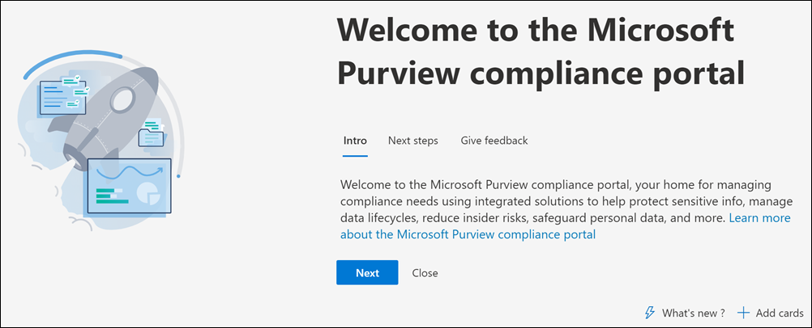

# Microsoft Purview compliance portal

If you're interested in your organization's compliance posture, you're going to love the <a href="https://go.microsoft.com/fwlink/p/?linkid=2077149" target="_blank">Microsoft Purview compliance portal</a>. The Microsoft Purview compliance portal provides easy access to the data and tools you need to manage to your organization's compliance needs.

Read this article to get acquainted with the compliance portal, [how to access it](#how-do-i-access-the-compliance-portal), and your [next steps](#next-steps).

## Welcome to Microsoft Purview

When you go to the compliance portal for the first time, you're greeted with the following welcome message:

The welcome banner gives you some pointers on how to get started, with next steps, and an invitation for you to give us feedback.

## Card section

When you first visit the compliance portal, the card section on the home page shows you at a glance how your organization is doing with data compliance, what solutions are available for your organization, and a summary of any active alerts.

From here, you can:

- Review the **Microsoft Purview Compliance Manager** card, which leads you to the [Compliance Manager](compliance-manager.md) solution. Compliance Manager helps simplify the way you manage compliance. It calculates a risk-based score measuring your progress toward completing recommended actions that help reduce risks around data protection and regulatory standards. It also provides workflow capabilities and built-in control mapping to help you efficiently carry out improvement actions.

    

- Review the new **Solution catalog** card, which links to collections of [integrated solutions](microsoft-365-solution-catalog.md) you can use to help you manage end-to-end compliance scenarios. A solution's capabilities and tools might include a combination of policies, alerts, reports, and more.

    

- Review the **Active alerts** card, which includes a summary of the most [active alerts](alert-policies.md) and includes a link where you can view more detailed information, such as Severity, Status, Category, and more.

    

You can also use the **Add cards** feature to add additional cards, such as one showing your organization's cloud app compliance, and another showing data about users with shared files, with links to [Defender for Cloud Apps](/cloud-app-security/) or other tools where you can explore data.

## Easy navigation to more compliance features and capabilities

In addition to links in cards on the home page, you'll see a navigation pane on the left side of the screen that gives you easy access to your [alerts](../security/office-365-security/alerts.md), [reports](reports-in-security-and-compliance.md), [policies](alert-policies.md), compliance solutions, and more. To add or remove options for a customized navigation pane, use the **Customize navigation** control on the navigation pane. This opens the **Customize your navigation pane** settings so you can configure which items appear in the navigation pane.

 

****

|Navigation|Comments|
|---|---|
||Select **Home** to return to the compliance portal main page. 
 Visit **Compliance Manager** to check your compliance score and start [managing compliance](compliance-manager.md) for your organization. 
 Select the **Data classification** section to access [trainable classifiers](classifier-learn-about.md), [Sensitive information type entity definitions](sensitive-information-type-entity-definitions.md), content and [activity](data-classification-activity-explorer.md) explorers. 
 Select **Data connectors** to [configure connectors](archiving-third-party-data.md) to import and archive data in your Microsoft 365 subscription. 
 Go to **Alerts** to view and resolve [alerts](alert-policies.md) 
Visit **Reports** to view data about [label usage and retention](sensitivity-labels.md), [DLP policy matches and overrides](view-the-dlp-reports.md), [shared files](/cloud-app-security/file-filters), [third-party apps in use](/cloud-app-security/discovered-apps), and more. 
 Go to **Policies** to set up policies to govern data, manage devices, and receive [alerts](../security/office-365-security/alerts.md). You can also access your [DLP](dlp-learn-about-dlp.md) and [retention](retention.md) policies. 
 Select **Permissions** to manage who in your organization has access to the compliance portal to view content and complete tasks. 
 Use the links in the **Solutions** section to access your organization's compliance solutions. These include: 
 [Catalog](microsoft-365-solution-catalog.md)   Discover, learn about, and start using the intelligent compliance and risk management solutions available to your organization. 
 [Audit](search-the-audit-log-in-security-and-compliance.md)   Use the Audit log to investigate common support and compliance issues. 
 [Content search](search-for-content.md)   Use Content search to quickly find email in Exchange mailboxes, documents in SharePoint sites and OneDrive locations, and instant messaging conversations in Microsoft Teams and Skype for Business. 
 [Communication compliance](communication-compliance.md)   Minimize communication risks by automatically capturing inappropriate messages, investigating possible policy violations, and taking steps to remediate. 
 [Learn about Microsoft Purview Data Loss Prevention](dlp-learn-about-dlp.md)   Detect sensitive content as it's used and shared throughout your organization, in the cloud and on devices, and helps prevent accidental data loss. 
 [Data subject requests](/compliance/regulatory/gdpr-manage-gdpr-data-subject-requests-with-the-dsr-case-tool)   Find and export a user's personal data to help you respond to data subject requests for the General Data Protection Regulation (GDPR). 
 [eDiscovery](overview-ediscovery-20.md)   Expand this section to use the core and eDiscovery (Premium) for preserving, collecting, reviewing, analyzing, and exporting content that's responsive to your organization's internal and external investigations. 
 [Data lifecycle management](manage-data-governance.md)   Manage the lifecycle of sensitive data by using features to import, store, and classify business-critical data so you can keep what you need and delete what you don't. 
 [Information protection](information-protection.md)   Discover, classify, and protect sensitive and business-critical data throughout its lifecycle across your organization. 
 [Insider risk management](insider-risk-management.md)   Detect risky activity across your organization to help you quickly identify, investigate, and take action on insider risks and threats. 
 [Records management](records-management.md)   Manage retention and deletion of high-value items for business, legal, or regulatory record-keeping requirements.|
|

## How do I access the compliance portal?

To access the compliance portal, go to [https://compliance.microsoft.com](https://compliance.microsoft.com) and sign in as a global administrator, compliance administrator, or compliance data administrator.

## Next steps

- **Visit Microsoft Purview Compliance Manager** to see your compliance score and start managing compliance for your organization. To learn more, see [Compliance Manager](compliance-manager.md).

- **Configure insider risk management policies** to help minimize internal risks and enable you to detect, investigate, and take action for risky activities in your organization. See [Learn about insider risk management](insider-risk-management.md).

- **Review your organization's data loss prevention policies** and make required changes as necessary. To learn more about, see [Learn about data loss prevention](dlp-learn-about-dlp.md).

- **Get acquainted with and set up Microsoft Defender for Cloud Apps**. See [Quickstart: Get started with Microsoft Defender for Cloud Apps](/cloud-app-security/getting-started-with-cloud-app-security).

- **Learn about and create communication compliance policies** to quickly identify and remediate corporate code-of-conduct policy violations. See [Learn about communication compliance](communication-compliance.md).

- **Visit your compliance portal often**, and make sure to review any alerts or potential risks that arise. Go to [https://compliance.microsoft.com](https://compliance.microsoft.com) and sign in.
