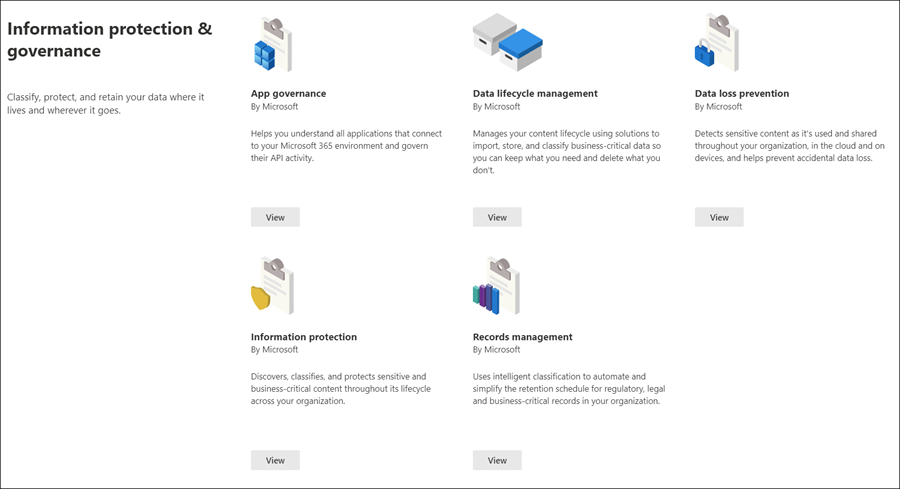

# Microsoft Purview solution catalog

Are you looking for a way to quickly get started with compliance tasks in Microsoft Purview? Check out the [Microsoft Purview solution catalog](https://compliance.microsoft.com/solutioncatalog) to discover, learn, and quickly get started with risk and compliance solutions.

Risk and compliance solutions in Microsoft Purview are collections of integrated capabilities you can use to help you manage end-to-end compliance scenarios. A solution's capabilities and tools might include a combination of policies, alerts, reports, and more.

Read this article to get acquainted with the solution catalog in the Microsoft Purview compliance portal, [how to access](#how-do-i-access) and your [next steps](#next-steps).

## Catalog organization

The solution catalog is organized into sections that contain information cards for each risk and compliance solution available in your Microsoft 365 subscription. Each section contains cards for solutions grouped by risk and compliance area.

When you select **View** for a solution card, you'll see detailed information about the solution and how to get started. This information includes an overview, pre-configuration requirements, learning resources, controls that allow you to pin the card to the navigation pane, and an option to share the solution as a link, email, or Microsoft Teams message.

## Information protection & governance section

The **Information protection & governance** section shows you at a glance how you can use Microsoft Purview solutions to protect and govern data in your organization.

From here, you'll see cards for the following solutions:

- [App governance](/defender-cloud-apps/app-governance-manage-app-governance): Helps you understand all applications that connect to your organization and govern their API activity.
- [Data Lifecycle Management](/microsoft-365/compliance/manage-data-governance): Manages your content lifecycle using solutions to import, store, and classify business-critical data so you can keep what you need and delete what you don't.
- [Data Loss Prevention](/microsoft-365/compliance/dlp-learn-about-dlp): Detects sensitive content as it's used and shared throughout your organization, in the cloud and on devices, and helps prevent accidental data loss.
- [Information protection](/microsoft-365/compliance/information-protection): Discovers, classifies, and protects sensitive and business-critical content throughout its lifecycle across your organization.
- [Records management](/microsoft-365/compliance/records-management): Uses intelligent classification to automate and simplify the retention schedule for regulatory, legal, and business-critical records in your organization.

## Privacy section

The **Privacy** section shows you at a glance how your organization can build a more privacy-resilient workplace.

From here, you'll see cards for the following solutions:

- [Privacy management](/privacy/priva/priva-overview): Generates actionable insights on enterprise personal data to help you spot issues and reduce risks. Provides easy-to-use policy templates that empower employees to safeguard data, and automation features for a smoother subject rights request process.

## Insider risk management section

The **Insider risk management** section shows you at a glance how your organization can identify, analyze, and take action on internal risks before they cause harm.

From here, you'll see cards for the following solutions:

- [Communication compliance](/microsoft-365/compliance/communication-compliance): Minimizes communication risks by helping you automatically capture inappropriate messages, investigate possible policy violations, and take steps to minimize harm.
- [Information barriers](/microsoft-365/compliance/information-barriers): Allows you to restrict two-way communication and collaboration between groups and users in Microsoft Teams, SharePoint Online, and OneDrive for Business.
- [Insider risk management](/microsoft-365/compliance/insider-risk-management): Detect risky activity across your organization to help you quickly identify, investigate, and take action on insider risks and threats.

## Discovery & response section

The **Discovery & response** section shows you at a glance how your organization can quickly find, investigate, and respond to compliance issues with relevant data.

From here, you'll see cards for the following solutions:

- [Audit](/microsoft-365/compliance/search-the-audit-log-in-security-and-compliance): Records user and admin activity from your organization so you can search the audit log and investigate a comprehensive list of activities across all locations and services.
- [Data subject requests](/compliance/regulatory/gdpr-manage-gdpr-data-subject-requests-with-the-dsr-case-tool): Finds and exports a user's personal data to help you respond to data subject requests for GDPR.
- [eDiscovery](/microsoft-365/compliance/manage-legal-investigations)
    - [eDiscovery (Standard)](/microsoft-365/compliance/get-started-core-ediscovery): Searches across content locations to identify, preserve, and export data in response to legal discovery requests and eDiscovery cases.
    - [eDiscovery (Premium)](/microsoft-365/compliance/overview-ediscovery-20): Builds on eDiscovery capabilities by providing intelligent analytics and  machine learning to help you further analyze data that's relevant to discovery requests.

## How do I access?

To visit the Microsoft Purview solution catalog, go to the [compliance portal](https://compliance.microsoft.com) and sign in as a global administrator, compliance administrator, or compliance data administrator. Select **Catalog** in the navigation pane on the left side of the screen to open the catalog home page.

## Next steps

- **Visit Microsoft Purview Compliance Manager**, which helps you understand your organization's state of compliance with key standards and regulations. It provides recommended actions you can take to strengthen your overall compliance posture, and provides workflow capabilities to help you efficiently carry out those actions. To learn more, see [Compliance Manager](/microsoft-365/compliance/compliance-manager).

- **Configure insider risk management policies** to help minimize internal risks and enable you to detect, investigate, and take action for risky activities in your organization. See [Learn about insider risk management](/microsoft-365/compliance/insider-risk-management).
- **Learn about and create Communication compliance policies** to quickly identify and remediate corporate code-of-conduct policy violations. See [Communication compliance](/microsoft-365/compliance/communication-compliance).
- **Microsoft Purview Information Protection**, learn how Microsoft Purview solutions help you discover, classify, and protect sensitive information wherever it lives or travels.
    - **Get acquainted with and set up Microsoft Defender for Cloud Apps**. See [Quickstart: Get started with Microsoft Defender for Cloud Apps](/cloud-app-security/getting-started-with-cloud-app-security).
    - **Get started with classifiers**. Classifying content and then labeling it so it can be protected and handled properly is the starting place for the information protection discipline. See [Learn about trainable classifiers (preview)](/microsoft-365/compliance/classifier-learn-about).
- **Visit your Microsoft Purview solution catalog often**, and make sure to review new solutions to help you with your compliance needs. Sign in at the [compliance portal](https://compliance.microsoft.com) and then select **Catalog** in the left navigation pane.
