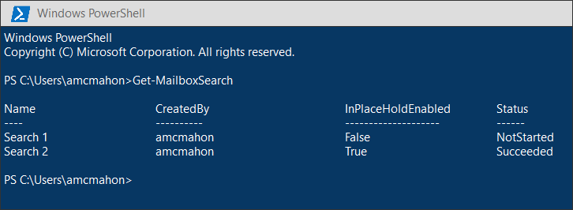
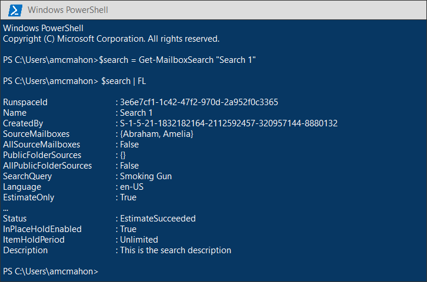
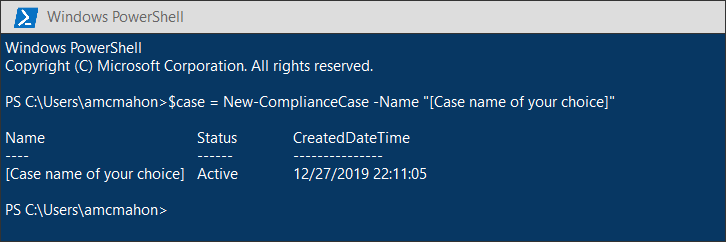
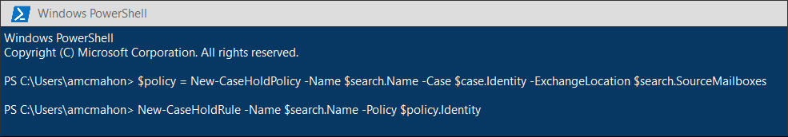
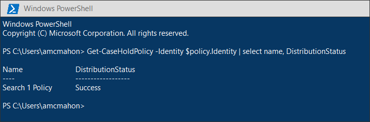
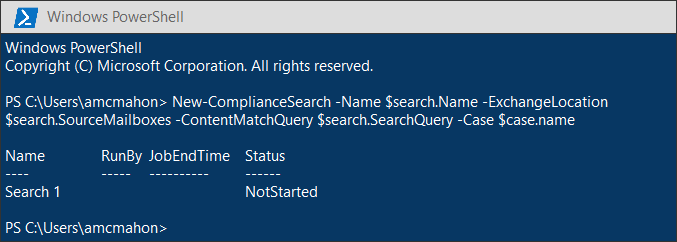
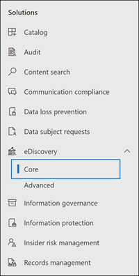
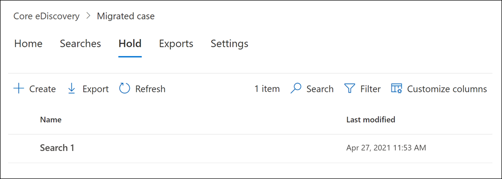
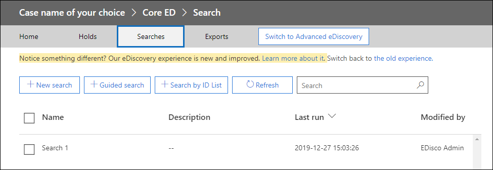

# Migrate legacy eDiscovery searches and holds to the Microsoft 365 compliance center

The Microsoft 365 compliance center provides an improved experience for eDiscovery usage, including: higher reliability, better performance, and many features tailored to eDiscovery workflows including cases to organize your content by matter, review sets to review content and analytics to help cull data for review such as near-duplicate grouping, email threading, themes analysis, and predictive coding.

To help customers take advantage of the new and improved functionality, this article provides basic guidance on how to migrate In-Place eDiscovery searches and holds from the Exchange admin center to the Microsoft 365 compliance center.

> [!NOTE]
> Because there are many different scenarios, this article provides general guidance to transition searches and holds to a core eDiscovery case in the Microsoft 365 compliance center. Using eDiscovery cases aren't always required, but they add an extra layer of security by letting you assign permissions to control who has access to the eDiscovery cases in your organization.

## Before you begin

- You have to be a member of the eDiscovery Manager role group in the Security & Compliance Center to run the PowerShell commands described in this article. You also have to be a member of the Discovery Management role group in the Exchange admin center.

- This article provides guidance on how to create an eDiscovery hold. The hold policy will be applied to mailboxes through an asynchronous process. When creating an eDiscovery hold, you must create both a CaseHoldPolicy and CaseHoldRule, otherwise the hold will not be created and content locations will not be placed on hold.

## Step 1: Connect to Exchange Online PowerShell and Security & Compliance Center PowerShell

The first step is to connect to Exchange Online PowerShell and Security & Compliance Center PowerShell. You can copy the following script, paste it into a PowerShell window and then run it. You'll be prompted for credentials for the organization that you want to connect to. 

```powershell
$UserCredential = Get-Credential
$sccSession = New-PSSession -ConfigurationName Microsoft.Exchange -ConnectionUri https://ps.compliance.protection.outlook.com/powershell-liveid -Credential $UserCredential -Authentication Basic -AllowRedirection
Import-PSSession $sccSession -DisableNameChecking
$exoSession = New-PSSession -ConfigurationName Microsoft.Exchange -ConnectionUri https://ps.outlook.com/powershell-liveid/ -Credential $UserCredential -Authentication Basic -AllowRedirection
Import-PSSession $exoSession -AllowClobber -DisableNameChecking
```

You need to run the commands in the following steps in this PowerShell session.

## Step 2: Get a list of In-Place eDiscovery searches by using Get-MailboxSearch

After you've authenticated, you can get a list of In-Place eDiscovery searches by running the **Get-MailboxSearch** cmdlet. Copy and paste the following command into PowerShell and then run it. A list of searches will be listed with their names and the status of any In-Place Holds.

```powershell
Get-MailboxSearch
```

The cmdlet output will be similar to the following:



## Step 3: Get information about the In-Place eDiscovery searches and In-Place Holds you want to migrate

Again you will use the **Get-MailboxSearch** cmdlet, but this time to get the properties of the search. You can store these properties in a variable for use later. The following example stores the results of the **Get-MailboxSearch** cmdlet in a variable and then displays the properties of the search.

```powershell
$search = Get-MailboxSearch -Identity "Search 1"
```

```powershell
$search | FL
```

The output of these two commands will be similar to the following:



> [!NOTE]
> The duration of the In-Place Hold in this example is indefinite (*ItemHoldPeriod: Unlimited*). This is typical for eDiscovery and legal investigation scenarios. If the hold duration has is different value than indefinite, the reason is likely because the hold is being used to retain content in a retention scenario. Instead of using the eDiscovery cmdlets in Security & Compliance Center PowerShell for retention scenarios, we recommend that you use [New-RetentionCompliancePolicy](/powershell/module/exchange/new-retentioncompliancepolicy) and [New-RetentionComplianceRule](/powershell/module/exchange/new-retentioncompliancerule) to retain content. The result of using these cmdlets will be similar to using **New-CaseHoldPolicy** and **New-CaseHoldRule**, but you'll able to specify a retention period and a retention action, such as deleting content after the retention period expires. Also, using the retention cmdlets don't require you to associate the retention holds with an eDiscovery case.

## Step 4: Create a case in the Microsoft 365 Compliance center

To create an eDiscovery hold, you have to create an eDiscovery case to associate the hold with. The following example creates an eDiscovery case using a name of your choice. We will store the properties of the new case in a variable for use later. You can view those properties by running the `$case | FL` command after you create the case.

```powershell
$case = New-ComplianceCase -Name "[Case name of your choice]"
```


## Step 5: Create the eDiscovery hold

After the case is created, you can create the hold and associate it with the case that you created in the previous step. It's important to remember that you must create both a case hold policy and a case hold rule. If the case hold rule isn't created after you created case hold policy, the eDiscovery hold will not be created and any content won't be placed on hold.

Run the following commands to re-create the eDiscovery hold that you want to migrate. These examples use the properties from In-Place Hold from Step 3 that you want to migrate. The first command creates a new case hold policy and saves the properties to a variable. The second command creates the corresponding case hold rule.

```powershell
$policy = New-CaseHoldPolicy -Name $search.Name -Case $case.Identity -ExchangeLocation $search.SourceMailboxes
```

```powershell
New-CaseHoldRule -Name $search.Name -Policy $policy.Identity
```



## Step 6: Verify the eDiscovery hold

To make sure there were no issues in creating the hold, it's good to check that the hold distribution status is successful. Distribution means that the hold has been applied to all the content locations specified in the *ExchangeLocation* parameter in the previous step. To do this, you can run the **Get-CaseHoldPolicy** cmdlet. Because the properties saved to the *$policy* variable that you created in the previous step aren't automatically updated in the variable, you need to rerun the cmdlet to verify that distribution is successful. It can take between 5 minutes and 24 hours for case hold policies to be successfully distributed.

Run the following command to verify that the eDiscovery hold has been successfully distributed.

```powershell
Get-CaseHoldPolicy -Identity $policy.Identity | Select name, DistributionStatus
```

The value of **Success** for the *DistributionStatus* property indicates the hold was successfully placed on the content locations. If the distribution is not yet complete, a value of **Pending** is displayed.



## Step 7: Create the search

The last step is to re-create the search that you identified in Step 3 and associate it with the case. After you create the search, you can run it by using the **Start-ComplianceSearch** cmdlet or run at a later time.

```powershell
New-ComplianceSearch -Name $search.Name -ExchangeLocation $search.SourceMailboxes -ContentMatchQuery $search.SearchQuery -Case $case.name
```



## Step 8: Verify the case, hold, and search in the Microsoft 365 compliance center

To make sure that everything is set up correctly, go to the Microsoft 365 compliance center at [https://compliance.microsoft.com](https://compliance.microsoft.com), and click **eDiscovery > Core**.



The case that you created in Step 3 is listed on the **Core eDiscovery** page. Open the case and then notice the hold that you created in Step 4 in listed on the **Hold** tab. You can select the hold to see details on the flyout page, including the number of mailboxes the hold is applied to and the distribution status.



The search that you created in Step 7 is listed on the **Searches** tab of the case.



If you migrate an In-Place eDiscovery search but don't associate it with an eDiscovery case, it will be listed on the Content search page in the Microsoft 365 compliance center.

## More information

- For more information about In-Place eDiscovery & Holds in the Exchange admin center, see:
  
  - [In-Place eDiscovery](/exchange/security-and-compliance/in-place-ediscovery/in-place-ediscovery)

  - [In-Place Hold and Litigation Hold](/exchange/security-and-compliance/in-place-and-litigation-holds)

- For more information about the PowerShell cmdlets used in the article, see:

  - [Get-MailboxSearch](/powershell/module/exchange/get-mailboxsearch)
  
  - [New-ComplianceCase](/powershell/module/exchange/new-compliancecase)

  - [New-CaseHoldPolicy](/powershell/module/exchange/new-caseholdpolicy)
  
  - [New-CaseHoldRule](/powershell/module/exchange/new-caseholdrule)

  - [Get-CaseHoldPolicy](/powershell/module/exchange/get-caseholdpolicy)
  
  - [New-ComplianceSearch](/powershell/module/exchange/new-compliancesearch)

  - [Start-ComplianceSearch](/powershell/module/exchange/start-compliancesearch)

- For more information about the Microsoft 365 compliance center, see [Overview of the Microsoft 365 compliance center](microsoft-365-compliance-center.md).