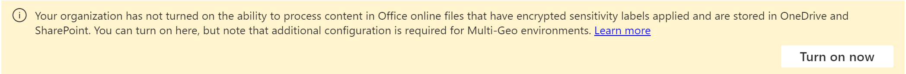

# Default labels and policies to protect your data

>*[Microsoft 365 licensing guidance for security & compliance](/office365/servicedescriptions/microsoft-365-service-descriptions/microsoft-365-tenantlevel-services-licensing-guidance/microsoft-365-security-compliance-licensing-guidance).*

Eligible customers can activate default labels and policies for Microsoft Purview Information Protection: 

- Sensitivity labels and a sensitivity label policy
- Client-side auto-labeling
- Service-side auto-labeling
- Data loss prevention (DLP) policies for Teams and devices

These default configurations help you get up and running quickly with Microsoft Purview Information Protection for Microsoft 365. You can use them as-is, make just a few changes, or fully customize them to better suit your business requirements. 

Eligibility includes customers who have a [free trial for Microsoft Purview](compliance-easy-trials.md) and some customers who already have a Microsoft 365 E5 plan:

- **New customers**: If you've had Microsoft Purview for less than 30 days, your tenant can activate all the listed default configurations. You can always disable, remove, or edit them.

- **Existing customers**: If you've had Microsoft Purview for more than 30 days, you can activate the default configurations if you haven't yet configured an equivalent:

    | Default configuration| Equivalent |
    |:-----|:-----|
    |Sensitivity labels and a sensitivity label policy | Published sensitivity labels |
    |Client-side auto-labeling | One or more sensitivity labels configured to automatically apply (or recommend to users) in Office apps|
    |Service-side auto-labeling | At least one auto-labeling policy that's turned on|
    |DLP for Teams | At least one DLP policy for Teams|
    |DLP for devices | At least one DLP policy for devices|

[!INCLUDE [purview-preview](../includes/purview-preview.md)]

## Activate the default labels and policies

To get these preconfigured labels and policies: 

1. From the [Microsoft Purview compliance portal](https://compliance.microsoft.com/), select **Solutions** > **Information protection**
    
    If you don't immediately see this option, first select **Show all** from the navigation pane. 
    
2. If you are eligible for the Microsoft Purview Information Protection default labels and policies, you'll see the following information, where you can activate the default labels and policies. For example:
    
    :::image type="content" alt-text="Microsoft Purview Information Protection activation for preconfigured labels and policies." source="../media/mip-preconfigured.png" lightbox="../media/mip-preconfigured.png":::
    
    If you don't see this information displayed with the activation option, you're not currently eligible for the automatic creation of sensitivity labels and policies. You can try checking back later to see if this status has changed, or you can use the settings information that follows to manually create the same labels and policies.

3. Now enable sensitivity labels for SharePoint and OneDrive. This step is a prerequisite to use sensitivity labels in Office for the web, and auto-labeling policies for SharePoint and OneDrive.
   
    Use the following banner at the top of the Information Protection **Overview** tab, and select **Turn on now**. If you don't see this banner, sensitivity labels for SharePoint and OneDrive have already been enabled for your tenant.
    
    
    
    For more information about this capability, see [Enable sensitivity labels for Office files in SharePoint and OneDrive](sensitivity-labels-sharepoint-onedrive-files.md).

## Default sensitivity labels

When you don't have sensitivity labels that are published, we'll create the following labels for you:

|Label name|Label description for users|Settings|
|-------------------------------|---------------------------|-----------------|
|Personal|Non-business data, for personal use only.|**Scope**: Items (File, Email)   **Content marking**: No  **Auto-labeling**: No   **Group settings**: No  **Site settings**: No   **Auto-labeling for database columns**: None|
|Public|Business data that is specifically prepared and approved for public consumption.|**Scope**: Items (File, Email)   **Content marking**: No  **Auto-labeling**: No   **Group settings**: No  **Site settings**: No   **Auto-labeling for database columns**: None|
|General|Business data that is not intended for public consumption. However, this can be shared with external partners, as required. Examples include a company internal telephone directory, organizational charts, internal standards, and most internal communication.|**Scope**: Items (File, Email)   **Content marking**: No  **Auto-labeling**: No   **Group settings**: No  **Site settings**: No   **Auto-labeling for database columns**: None|
|General   \ Anyone (unrestricted)|Organization data that isn’t intended for public consumption but can be shared with external partners if appropriate. Examples include customer conversations that don’t include sensitive info or released marketing materials.|**Scope**: Items (File, Email)   **Content marking**: No  **Auto-labeling**: No   **Group settings**: No  **Site settings**: No   **Auto-labeling for database columns**: None|
|General   \ All Employees (unrestricted)|Organization data that isn’t intended for public consumption. If you need to share this content with external partners, confirm with other data owners that it's OK to share and then change the label to General \ Anyone (unrestricted) . Examples include a company internal telephone directory, organizational charts, internal standards, and most internal communication.|**Scope**: Items (File, Email)   **Content marking**: No  **Auto-labeling**: No   **Group settings**: No  **Site settings**: No   **Auto-labeling for database columns**: None|
|Confidential|Sensitive business data that could cause damage to the business if shared with unauthorized people. Examples include contracts, security reports, forecast summaries, and sales account data.|**Scope**: Items (File, Email)   **Content marking**: No  **Auto-labeling**: No   **Group settings**: No  **Site settings**: No   **Auto-labeling for database columns**: None|
|Confidential   \ Anyone (unrestricted)|Confidential data that doesn’t need to be encrypted. Use this option with care and appropriate business justification.|This label is selected for [client-side auto-labeling](#client-side-auto-labeling) and [service-side auto-labeling](#service-side-auto-labeling).   **Scope**: Items (File, Email)   **Content marking**: Footer: Classified as Confidential  **Auto-labeling**: Recommend that users apply the label   **Group settings**: No  **Site settings**: No   **Auto-labeling for database columns**: None|
|Confidential   \ All Employees|Confidential data that requires protection, which allows all employees full permissions. Data owners can track and revoke content.|This label is selected for [client-side auto-labeling](#client-side-auto-labeling) and [service-side auto-labeling](#service-side-auto-labeling).   **Scope**: Items (File, Email)   **Encryption**: All users and groups in the org: Co-Author  **Content marking**: Footer: Classified as Confidential  **Auto-labeling**: Recommend that users apply the label   **Group settings**: No  **Site settings**: No   **Auto-labeling for database columns**: None |
|Confidential   \ Trusted People|Confidential data that can be shared with trusted people inside and outside your organization. These people can also reshare the data as needed.|**Scope**: Items (File, Email)   **Encryption**: Let users assign permissions:   - Encrypt-Only for Outlook  - Prompt users in Word, PowerPoint, and Excel  **Content marking**: Footer: Classified as Confidential  **Auto-labeling**: No   **Group settings**: No  **Site settings**: No   **Auto-labeling for database columns**: None|
|Highly Confidential|Very sensitive business data that would cause damage to the business if it was shared with unauthorized people. Examples include employee and customer information, passwords, source code, and pre-announced financial reports.|**Scope**: Items (File, Email)   **Content marking**: Watermark: HIGHLY CONFIDENTIAL  **Auto-labeling**: No   **Group settings**: No  **Site settings**: No   **Auto-labeling for database columns**: None|
|Highly Confidential   \ All Employees|Highly confidential data that allows all employees view, edit, and reply permissions to this content. Data owners can track and revoke content.|**Scope**: Items (File, Email)   **Encryption**: All users and groups in the org: Co-Author  **Content marking**: Footer: Classified as Highly Confidential  **Auto-labeling**: No   **Group settings**: No  **Site settings**: No   **Auto-labeling for database columns**: None|
|Highly Confidential   \ Specific People |Highly confidential data that requires protection and can be viewed only by people you specify and with the permission level you choose.|**Scope**: Items (File, Email)   **Encryption**: Let users assign permissions:  - Do Not Forward for Outlook  - Prompt users in Word, PowerPoint, and Excel  **Content marking**: Footer: Classified as Highly Confidential  **Auto-labeling**: No   **Group settings**: No  **Site settings**: No   **Auto-labeling for database columns**: None|

> [!NOTE]
> The label names and descriptions are automatically available for the following locales: US English, Chinese Simplified and Traditional, French, German, Italian, Japanese, Korean, Portuguese Brazilian, Russian, and Spanish.
> 
> If you need additional languages, you can specify your translations [by using PowerShell](create-sensitivity-labels.md#example-configuration-to-configure-a-sensitivity-label-for-different-languages).

For more information about these configuration settings and what sensitivity labels can do, see [What sensitivity labels can do](sensitivity-labels.md#what-sensitivity-labels-can-do).

If you need to edit these default sensitivity labels, see [Create and configure sensitivity labels](create-sensitivity-labels.md#create-and-configure-sensitivity-labels).

## Default sensitivity label policy

The default sensitivity label policy makes the labels available for users to start labeling their documents and emails with sensitivity labels. It has the following configuration:

- Publish the default labels to all users in your tenant
- Default label of **General** \ **All Employees (unrestricted)** for unlabeled documents and emails
- Users must provide a justification to remove a label or lower its classification

For more information about these policy settings, and other policy settings that are available, see [What label policies can do](sensitivity-labels.md#what-label-policies-can-do).

If you need to edit these default policy settings, see [Publish sensitivity labels by creating a label policy](create-sensitivity-labels.md#publish-sensitivity-labels-by-creating-a-label-policy).

When you use these labels in Office apps on Windows, macOS, iOS, and Android, users see new labels within four hours, and within one hour for Word, Excel, and PowerPoint on the web when you refresh the browser. However, you might need to allow up to 24 hours for changes to replicate to all apps and services.

## Client-side auto-labeling

The default client-side auto-labeling configuration automatically recommends users apply a sensitivity label when we detect credit card numbers in documents or emails they’re working with. As a recommendation rather than automatically applied, this configuration serves as a good first step for highlighting concerning content and introduces users to the practice of labeling their documents and emails.

Client-side auto-labeling only works for documents and emails in use by the Office apps Word, Excel, PowerPoint, and Outlook. 

The default client-side auto-labeling has the following configuration: 

- If there are 1-9 instances of credit card numbers found in a document or email, recommend the user applies the sensitivity label **Confidential** \ **Anyone (unrestricted)** 

- If there are 10 or more instances of credit card numbers found in a document or email, recommend the user applies the sensitivity label **Confidential** \ **All Employees** 

> [!NOTE]
> If we detected you have your own sensitivity labels published, we'll prompt you to select one of your own labels for auto-labeling and configure it for you.

If you want to edit the client-side auto-labeling configuration, see [How to configure auto-labeling for Office apps](apply-sensitivity-label-automatically.md#how-to-configure-auto-labeling-for-office-apps).

## Service-side auto-labeling 

Service-side auto-labeling helps label sensitive documents at rest, and emails in transit. The default service-side auto-labeling policy creates policies that run in simulation mode for documents stored in all SharePoint or OneDrive sites, and all emails that are sent via Exchange Online. 

In simulation mode, items aren't actually labeled until the policy is turned on. You can manually turn on the policy, or unless you change the default setting, the policy will be automatically turned on for you if there aren't any changes to the policy within a set number of days from when the simulation completes.

> [!NOTE]
> Automatically turning on auto-labeling policies is new and gradually rolling out for new auto-labeling policies. You might not see this configuration immediately, or for all policies.

In most cases, the number of days before an unedited policy is automatically turned on is 7. However, specific to new customers from June 23, 2022, the initial number of days is 25, and then 7 after the policy is edited.

Simulation mode allows you to preview what items would get labeled when the policy is turned on, so you have confidence in the labeling feature before you deploy the policy to your tenant for actual labeling. 

The default service-side auto-labeling policies have the following configuration: 

For all customers:

- If there are 1-9 instances of credit card numbers found in a document or email, apply the sensitivity label **Confidential** \ **Anyone (unrestricted)**
    
- If there are 10 or more instances of credit card numbers found in a document or email, apply the sensitivity label **Confidential** \ **All Employees** 

> [!NOTE]
> If we detected you have your own sensitivity labels published, we'll prompt you to select one of your own labels for your auto-labeling policy.

For new customers from June 23, 2022, and the Microsoft 365 tenant is in the US region:

- If there are 1-9 instances of US personal data and full names found in a document or email, apply the sensitivity label **Confidential** \ **Anyone (unrestricted)**

- If there are 10 or more instances of US personal data and full names found in a document or email, apply the sensitivity label **Confidential** \ **All Employees** 

New customers from June 23, 2022 have two auto-labeling policies for each setting. One policy is for the Exchange location, and the other for the SharePoint and OneDrive locations. Although the policies are created at the same time, simulation isn't immediately turned on for SharePoint and OneDrive:
- Exchange location: The auto-labeling policy is created and immediately starts simulation.
- SharePoint and OneDrive locations: The auto-labeling policy is created but waits 25 days before it automatically starts simulation. This delay gives you time for files to be created and saved to these locations. 

When the simulation is complete, review the results and if you are happy with them, turn on the policies. Slowly rolling out starting June 23, 2022, by default, the policies will be automatically turned on if they're not edited within the set time period (25 days initially for new customers, otherwise 7 days).

For more information about simulation mode, see [Learn about simulation mode](apply-sensitivity-label-automatically.md#learn-about-simulation-mode).

If you want to edit the service-side auto-labeling policy, see [How to configure auto-labeling policies for SharePoint, OneDrive, and Exchange](apply-sensitivity-label-automatically.md#how-to-configure-auto-labeling-policies-for-sharepoint-onedrive-and-exchange).

## DLP for Teams

The default DLP policy for Teams detects the presence of credit card numbers in all Teams chats and channel messages. When this sensitive information is detected, admins will get a low severity alert notification.

This policy is unobtrusive to users with no policy tip visible and no messages blocked, but admins will have records of the sensitive information shared in these messages. If required, you can edit the settings to change this default configuration.

To see the results of this policy, use [DLP Activity Explorer](dlp-learn-about-dlp.md#dlp-activity-explorer).

If you want to edit the DLP policy, see [Create, test, and tune a DLP policy](create-test-tune-dlp-policy.md).

## DLP for devices

The default DLP policy for devices detects the presence of credit card numbers on Windows 10 devices that have been onboarded into Microsoft Purview. It then audits (does not block) the following actions: 

- Upload to cloud service domains or access by unallowed browsers

- Copy to clipboard, USB, or network share 

- Access by unallowed apps 

- Print 

- Copy or move using unallowed Bluetooth app 

- Remote desktop services 

If content contains 10 or more instances of credit cards and one or more of the listed activities is detected, a medium severity alert notification is sent to admins.

This policy is unobtrusive to users with no policy tip visible and no actions blocked, but admins will have records of all suspicious activity. If required, you can edit these settings to change this default configuration.

To see the results of this policy, use [DLP Activity Explorer](dlp-learn-about-dlp.md#dlp-activity-explorer).

If you want to edit the DLP policy, see [Create, test, and tune a DLP policy](create-test-tune-dlp-policy.md).

## Additional resources

To learn more about sensitivity labels, data loss prevention, and all the capabilities available with Microsoft Purview Information Protection, see the following resources:

- [Learn about sensitivity labels](sensitivity-labels.md)
- [Learn about data loss prevention](dlp-learn-about-dlp.md)
- [Protect your data with Microsoft Purview](information-protection.md)
