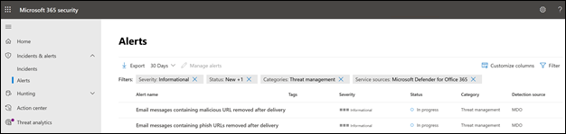
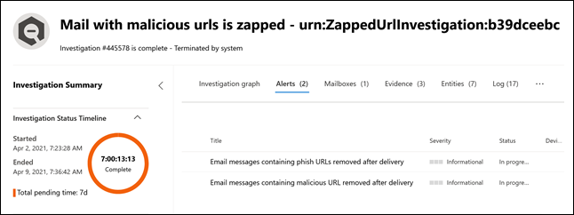
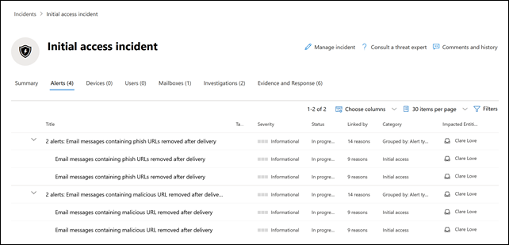

# New alert policies in Microsoft Defender for Office 365

Microsoft Defender for Office 365 is introducing new and improved alert policies related to post-delivery detections. This includes enhancements to the Automated Investigation & Response (AIR) playbooks associated with them. In addition, we're modifying the severity classification for six default alert policies to better align the alerts generated by these policies with their impact on your organization.

## Post-delivery detections

We'll be introducing four new default alert policies related to post-delivery detections after the Microsoft Defender for Office 365 Zero-hour auto purge (ZAP) removes messages from an inbox. These four new alert policies will replace two existing default alert policies that cover ZAP scenarios and will provide organizations enhanced details about the underlying detection and related indicators. These alerts (and the AIR playbooks that will be triggered from these alerts) will accurately capture the threats of the emails and entities, including if the URL points to a malicious file or if the file contains a malicious URL.

The following table lists the new alert policies and the existing alert policies that will be removed. See the [How this will affect your organization](#how-this-will-affect-your-organization) section for details about the rollout.

| New or existing alert policy | Alert policy name | Alert policy ID|
|:-----------------------------|:----------------|:--------------|
| New| **Email messages containing malicious URL removed after delivery**   | 0179B3F7-3FDA-40C3-8F24-278563978DBB |
| New| **Email messages containing malicious file removed after delivery**  | 8E6BA277-EF39-404E-AAF1-294F6D9A2B88 |
| New| **Email messages from a campaign were delivered and later removed** | ef850570-5624-42b2-ff0a-08d8d899d578 |
| New|**Malicious emails were delivered and later removed**                | a1f563cc-fb1f-466b-1fb5-08d8d71a3050 |
| Existing (will be removed)| **Email messages containing phish URLs removed after delivery**| EA8169FA-0678-4751-8854-AEBEA7ADECEB |
| Existing (will be removed)| **Email messages containing malware removed after delivery**| 0179B3F7-3FDA-40C3-8F24-278563978DBB |
||||

## Alert severity enhancements

For the following table identifies the default alert policies whose severity classifications are being modified. We're changing the severity classification for these alert policies to better align with the potential risk and impact on your organization and to help your security teams prioritize the alerts generated by these policies.

| Alert| Alert policy ID| Old severity| New severity  |
|:----------|:---------------|:------------|:--------------|
| **Suspicious email forwarding activity**| BFD48F06-0865-41A6-85FF-ADB746423EBF | Medium| High|
| **Email reported by user as malware or phish** | B26A5770-0C38-434A-9380-3A3C2C27BBB3 | Informational | Low|
| **Unusual increase in email reported as phish** | A00D8C62-9320-4EEA-A7E5-966B9AC09558 | High| Medium |
| **Admin Submission result completed** | AE9B83DD-6039-4EA9-B675-6B0AC3BF4A41 | Low| Informational |
| **Creation of forwarding/redirect rule** | D59A8FD4-1272-41EE-9408-86F7BCF72479 | Low| Informational |
| e**Discovery search started or exported**​| 6FDC5710-3998-47F0-AFBB-57CEFD7378AE | Medium| Informational |
|||||

## When will these changes happen

The following table identifies when the new alert policies will begin triggering post-delivery alerts. The table also identifies when the two existing alert policies will be removed.

| Alert policy| Date |
|:------------|:-----|
| **Email messages containing malicious URL removed after delivery** (new) | Alerts will start triggering on April 11, 2021|
| **Email messages containing malicious file removed after delivery** (new) | Alerts will start triggering on April 11, 2021 |
| **Emails messages from a campaign were delivered and later removed** (new) | Alerts will start triggering on May 14, 2021|
| **Malicious emails were delivered and later removed** (new) | Alerts will start triggering on May 14, 2021|
| **Email messages containing phish URLs removed after delivery** (existing, will be removed)| The alert policy will be removed on May 14, 2021. See the [What you need to do to prepare for these changes](#what-you-need-to-do-to-prepare-for-these-changes) section.|
| **Email messages containing malware removed after delivery** (existing, will be removed) | The alert policy will be removed on May 14, 2021. See the [What you need to do to prepare for these changes](#what-you-need-to-do-to-prepare-for-these-changes) section. |
|||

The alert severity changes will be rolled out to all organizations by May 14, 2021.

## How this will affect your organization

The new alerts will begin firing, and triggering the AIR investigations in your organization on the dates listed above. To reduce the impact on security organizations that have operationalized the two alerts that are to be removed, you will see alerts triggered by the existing alert policies *and* the alerts triggered by the new alert policies between April 5, 2021 and May 14, 2021. This is to provide security teams with time to handle the required changes. To help security teams with the increased alert volume during this short duration, both the existing alerts and the new alerts will be correlated into the same AIR investigation and correlated into a same Incident. More specifically, this includes the following behavior for alerts, AIR investigations, and Incidents:

- **Alerts**: By design, you will see the following alert pairs across the existing and new alerts:

  - **Email messages containing phish URLs removed after delivery** AND **Email messages containing malicious URL removed after delivery**

  - **Email messages containing malware removed after delivery** AND **Email messages containing malicious file removed after delivery**

  

   For more information about managing these alert pairs, see the [What you need to do to prepare for these changes](#what-you-need-to-do-to-prepare-for-these-changes) section.

- **AIR Investigations**: Alerts will be correlated into a single AIR Investigation, with one of the alerts classified as "triggering" and the other as "repeated".

  

- **Incidents**: Both alerts will correlate into the same Incident

  

## What you need to do to prepare for these changes

How your organization utilizes these alerts will determine what you need to do to prepare. If you have operationalized the alerts and are using or consuming them either through an API, an alert email notification, or in the Office 365 Security & Compliance Center (`https://protection.office.com/viewalerts`) or the Microsoft security center (`https://security.microsoft.com/viewalerts`), you'll need to modify your workflows.

**If you haven't operationalized these alerts, you can do one of the following:**

- Disable the following alert policies (that are being removed) to reduce alert volume in your organization:

  - **Email messages containing phish URLs removed after delivery**

  - **Email messages containing malware removed after delivery**

- Do nothing. We'll disable the existing alert policies on May 14, 2021.

**If you have operationalized these alerts:**

- Start consuming the new alerts as a part of your workflows, in anticipation of the existing alert policy removal on May 14, 2021. If you have custom logic in your ticketing system, a security mailbox where you receive alert email notifications, or a SIEM solution that depends on the alert name or alert policy Id (CorrelationId), you will need to modify the logic to accommodate the change.

  > [!NOTE]
  > The information in the alerts, investigations, and incidents has not changed. In fact, this information has been enhanced with additional detail about the threats associated with them.

- After you've made the modifications, you can disable the existing alert policies to reduce alert volume in your organization:

  - **Email messages containing phish URLs removed after delivery**

  - **Email messages containing malware removed after delivery**

  Alternatively, you can leave these alert policies enabled until we delete them on May 14, 2021.
