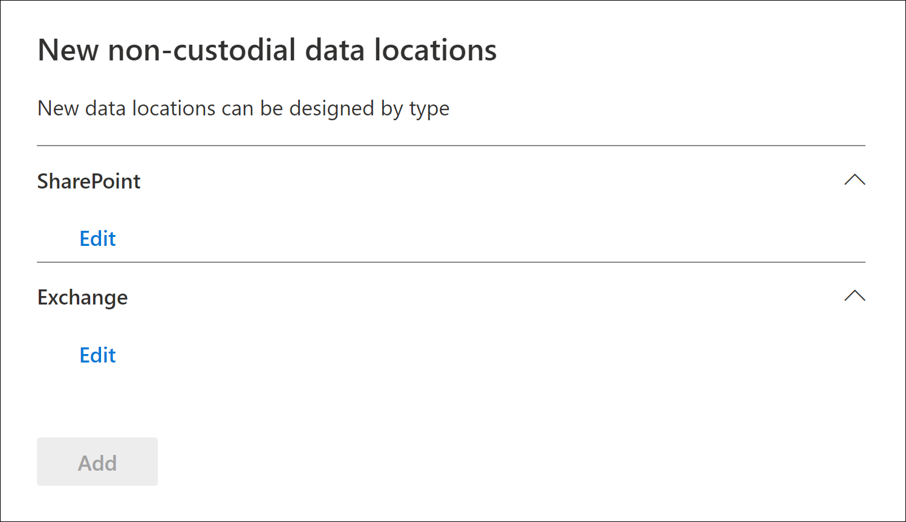
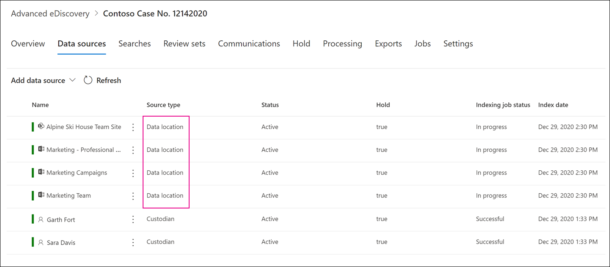

# Add non-custodial data sources to an Advanced eDiscovery case

In Advanced eDiscovery cases, it doesn't always meet your needs to associate a Microsoft 365 data source with a custodian in the case. But you may still need to associate that data with a case so that you can search it, add it to a review set, and analyze and review it. The feature in Advanced eDiscovery is called *non-custodial data sources* and lets you add data to a case without having to associate it to a custodian. It also applies the same Advanced eDiscovery functionality to non-custodial data that's available for data associated with custodian. Two of the most useful things that you can apply to non-custodial data is placing it on hold and processing it using [Advanced indexing](indexing-custodian-data.md).

## Add a non-custodial data source

Follow these steps to add and manage non-custodial data sources in an Advanced eDiscovery case.

1. On the **Advanced eDiscovery** home page, click the case that you want to add the data to.

2. Click the **Data sources** tab and then click **Add data source** > **Add data locations**

3. On the **New non-custodial data locations** flyout page, choose the data sources that you want to add to the case. You can add multiple mailboxes and sites by expanding the **SharePoint** or **Exchange** sections and then clicking **Edit**.

   

   - **SharePoint** - Click **Edit** to add sites. Select a site in the list or you can search for a site by typing the URL of the site in the search bar. Select the sites that you want to add as non-custodian data sources and click **Add**.

   - **Exchange** - Click **Edit** to add mailboxes. Type a name or alias (a minimum of 3 characters) in the search box for mailboxes or distribution groups. Select the mailboxes that you want to add as non-custodian data sources and click **Add**.

   > [!NOTE]
   > You can use the **SharePoint** and **Exchange** sections to add sites and mailboxes associated with a Team or Yammer group as non-custodia data sources. You have to separately add the mailbox and site associated with a Team or Yammer group.

4. After you add non-custodial data sources, you have the option to place those locations on hold or not. Select or unselect the **Hold** checkbox next to the data source to place it on hold.

5. Click **Add** at the bottom of the **New non-custodial data locations** flyout page to add the data sources to the case.

   Each non-custodial data source that you added is listed on the **Data sources** page. Non-custodial data sources are identified by the **Data location** value in the **Source type** column.

   

After you add non-custodial data sources to the case, a job named *Reindexing non-custodial data* is created and displayed on the **Jobs** tab of the case. After the job is created, the Advanced indexing process in initiated and the data sources are reindexed.

## Manage the hold for non-custodial data sources

After you place a hold on a non-custodial data source, a hold policy that contains the non-custodial data sources for the case is automatically created. When you place additional non-custodial data sources on hold, they are added to this hold policy.

1. Open the Advanced eDiscovery case and select the **Hold** tab.

2. Click **NCDSHold-\<GUID\>**, where the GUID value is unique to the case.

   The flyout page display information and statistics about the non-custodial data sources on hold.

   

4. Click **Edit hold** to view the non-custodial data sources placed on hold and perform the following management tasks:

   - On the **Locations** page, you can release a non-custodial data source by removing it from the hold. Releasing a data source doesn't remove the non-custodial data source from the case. It only removes the hold that was placed on the data source.

   - On the **Query** page, you can edit the hold to create a query-based hold that is applied to all tha non-custodial data sources in the case.
