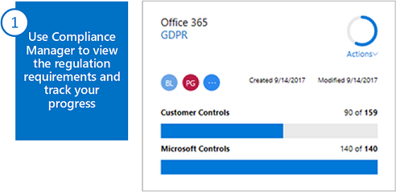

# Overview of Office 365 Information Protection for GDPR

This solution demonstrates how to protect sensitive data that is stored in Office 365 services. It includes prescriptive recommendations for discovering, classifying, protecting, and monitoring personal data. This solution uses General Data Protection Regulation (GDPR) as an example, but you can apply the same process to achieve compliance with many other regulations.

GDPR regulates the collection, storage, processing, and sharing of personal data. Personal data is defined very broadly under the GDPR as any data that relates to an identified or identifiable natural person that is a resident of the European Union (EU).

Article 4 – Definitions

> ‘personal data’ means any information relating to an identified or identifiable natural person (‘data subject’); an identifiable natural person is one who can be identified, directly or indirectly, in particular by reference to an identifier such as a name, an identification number, location data, an online identifier or to one or more factors specific to the physical, physiological, genetic, mental, economic, cultural or social identity of that natural person;

This solution is intended to help organizations discover and protect personal data in Office 365 that might be subject to the GDPR. It is not offered as a GDPR compliance attestation. Organizations are responsible for ensuring their own GDPR compliance and are advised to consult their legal and compliance teams or to seek guidance and advice from third parties that specialize in compliance.

[GDPR Assessment](https://www.microsoft.com/cyberassessment/en/gdpr/uso365?ls=Email&mkt_tok=eyJpIjoiTTJFeE5USXlOR1EwTWpJMiIsInQiOiJQTmdCYWR5NTlOd3JLWHZlb2NzNldKclQ4ZVBzVmhGeUhoUlFcL1pvSDIyXC9Ka05iTUR1aGpxT0YxQ0FUeGNDOUlkbWZLM1U4SUZWZmEyaGF6XC9ueUxkTHJzZnB3VDRMZlhPdkR4MzRLWkF5ckRNdWwxUkgzXC9yRU8yNkttSHhTb3VpZjNyVlJrNm9TTVZRYU5HR240a0FRPT0ifQ%3D%3D) is a quick, online self-evaluation tool available at no cost to help your organization review its overall level of readiness to comply with the GDPR.

## Assess and manage your compliance risk

The first step towards GDPR compliance is to assess whether the GDPR applies to your organization, and, if so, to what extent. This analysis includes understanding the data your organization processes and where it resides.

### Step 1 — Use Compliance Manager to view the regulation requirements and track your progress

Compliance Manager helps you track, implement, and manage the auditing controls to help your organization reach compliance against various standards, including GDPR.

For more information, see [Compliance Manager](compliance-manager.md).

### Step 2 — Use Content Search and sensitive information types to find personal data 

Discover personal data in your environment that is subject to the GDPR. Use Content Search together with sensitive information types to:

- Find and report on where personal data resides.

- Optimize sensitive data types and other queries to find all personal data in your environment.

Sensitive information types define how the automated process recognizes specific information types such as health service numbers and credit card numbers. This article includes a set you can use as a starting point. Many more sensitive information types are coming soon for personal data in EU countries.

For more information, see [Search for and find personal data](search-for-and-find-personal-data.md). 

## Classify, protect, and monitor personal data in Office 365 and other SaaS apps

Some of the capabilities used for information protection in Office 365 can also be used to protect sensitive data in other SaaS applications.

This illustration is described by the rest this section (steps 3-5).

### Step 3 — Decide if you want to use labels in addition to sensitive information types

Sensitive information types are a form of classification. See [Architect a classification schema for personal data](architect-a-classification-schema-for-personal-data.md), to decide if you also want to implement labels. To apply labels, see [Apply labels to personal data in Office 365](apply-labels-to-personal-data-in-office-365.md).

In the illustration, sensitive information types and labels work across Office 365. Coming soon, you can use these with Cloud App Security to find sensitive data in other SaaS apps, such as Box and Salesforce.

### Step 4 — Protect personal data in Office 365 

Protection for personal data starts with Office 365 data loss prevention. There are several other capabilities recommended for protecting access to personal data, including Office 365 Message Encryption for email.

These protections can be targeted to specific data sets:

- Site and library-level permissions

- Site-level external sharing policies

- Site-level device access policies

Protection for access to Office 365 and other cloud services include:

- Identity and device access protection in Enterprise Mobility + Security (EMS)

- Privileged access management

- Windows 10 security capabilities

For more information about applying protection, see [Apply protection to personal data in Office 365](apply-protection-to-personal-data-in-office-365.md).

### Step 5 — Monitor for leaks of personal data

Office 365 data loss prevention reports provide the greatest level of detail for monitoring sensitive data. You can setup automated alerts and investigate breaches by using the audit log. Cloud App Security extends the ability to find and monitor sensitive data to other SaaS providers. For more information on these tools, see [Monitor for breaches of personal data](/security/office-365-security/monitor-for-leaks-of-personal-data.md).
