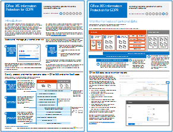

# Information Protection for GDPR

 **Summary:** This solution demonstrates how to protect sensitive data that is stored in Office 365 services.
  
This solution includes prescriptive recommendations for discovering, classifying, protecting, and monitoring personal data. This solution uses General Data Protection Regulation (GDPR) as an example, but you can apply the same process to achieve compliance with many other regulations.

[PDF](https://download.microsoft.com/download/E/C/D/ECD5A339-EF10-4420-B3A9-99098884D716/MSFT_Cloud_architecture_information%20protection%20for%20GDPR.pdf)  |  [Visio](https://download.microsoft.com/download/E/C/D/ECD5A339-EF10-4420-B3A9-99098884D716/MSFT_Cloud_architecture_information%20protection%20for%20GDPR.vsdx)
  
For information about performing data subject requests for the GDPR, see [Office 365 Data Subject Requests for the GDPR](https://docs.microsoft.com/microsoft-365/compliance/gdpr-dsr-office365). 

## See Also
  
[Microsoft Security Guidance for Political Campaigns, Nonprofits, and Other Agile Organizations](https://docs.microsoft.com/microsoft-365/security/office-365-security/microsoft-security-guidance-for-political-campaigns-nonprofits-and-other-agile-o)
