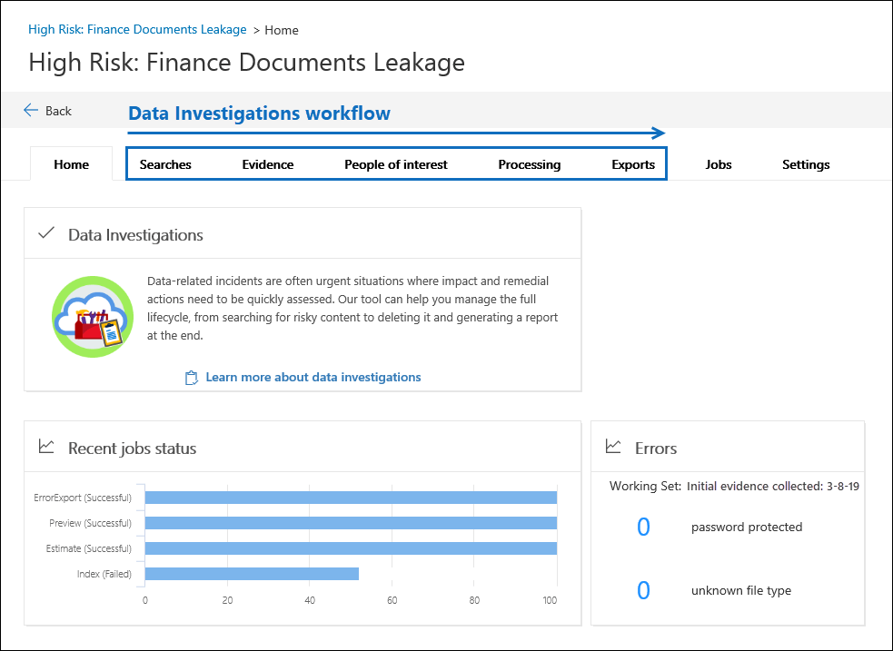

# Overview of Data Investigations (preview) in Microsoft 365

> [!IMPORTANT]
> After much deliberation and discussions with our customers, we've decided not to release the Data Investigations tool to General Availability. As a result, we will remove this tool and any data associated with existing Data Investigations cases on December 31, 2020.  To manage data investigations in your organization, we recommend that you use Core eDiscovery cases. If you need to search for and purge content from Microsoft 365, please see the following articles: 
> - [eDiscovery solution series: Data spillage scenario - Search and purge](data-spillage-scenariosearch-and-purge.md)
> - [Search for and delete email messages](search-for-and-delete-messages-in-your-organization.md)

A data spill occurs when a document containing confidential, sensitive, or malicious content is released into an untrusted environment. When a data spill is detected, it's important to quickly contain the environment, assess the size and locations of the spillage, examine user activities around it, and then delete the spilled data from the service. Using the new Data Investigations (preview) tool, you can search for sensitive, malicious, or misplaced data across Office 365, investigate what happened, and take the appropriate actions to remediate the spillage.  

This article describes using the capabilities in the new Data Investigations (preview) tool to address a data spillage scenario.

## Permissions

To access and conduct a data investigation, you need be a member of the Data investigator role group. For more information, see [Assign permissions for Data Investigations](data-investigations-permissions.md).

## Data Investigations (preview) workflow 

The following sections describe each step in the built-in workflow in Data Investigations (preview). The following screenshot shows the **Home** tab of an investigation named *High Risk: Finance Documents Leakage*. 

## Search for sensitive, malicious, or misplaced data

Use the **Searches** tab to create searches to find the Microsoft 365 for data that you want to remediate. You can create and run query-based searches to identify a set email messages and documents that might contain spilled data, and then collect them as evidence to review and analyze. Also, you can use the search tool to preview sample documents and view search statistics that can  help you refine and improve the search results. Once you're satisfied that the search results contain the all the data relevant to the investigation, you add the search results to the evidence set to further review, impact assessment, and taking remedial actions as necessary. For more information, see [Search for data in an investigation](search-for-data.md).

## Review and investigate evidence

Use the **Evidence** tab to investigate the data that you've collected from the live service, which in this case is Office 365. The data in the evidence set is a snapshot of search results that you collected. When you add search results as evidence a process is triggered to extract files, metadata, and text. When this process is complete, the Data Investigations tool builds a new index of all the data and adds it to an evidence set. For any time-sensitive investigations, this allows you to quickly contain the environment by deleting data located in the original content locations (in the live service) while investigating the evidence that you collected in a quarantined environment. After evidence is collected, you can run more queries to narrow the data by time range, file types, data owners, and other types of conditions. For example, by using the Author, Sender, and Recipient conditions you can quickly identify those who were are involved in the data spill and if any of the spilled data was shared with people outside of your organization.

You can also run advanced analytics on the evidence you collect. This can provide you with general themes, and organize evidence by email threads, exact duplicates, and near duplicates to facilitate your investigation. You can review documents in extracted text view or in the native file format, and tag them with investigation results. For more information, see:

  - [Review data in evidence](review-data-in-evidence.md)

  - [Run analytics to investigate faster](run-analytics-to-investigate-faster.md)

## Managing people of interest

Use the **People of interest** tab to add and manage the people that you've identified as persons of interest during your investigation of the evidence. When you add people of interest, their data sources, such as their mailbox and OneDrive account, are identified and mapped. Then you can scope searches by searching only the content locations of those people. When scoped by people of interest, searches are more efficient and accurate because the tool reprocesses any unindexed data such as images or unsupported file types. On the **People of interest** tab, you can also view and search the audit log activity of those people to further help your investigation. You can add more people of interest throughout the investigation. For more information, see [Manage people of interest an investigation](manage-people-of-interest.md).

## Indexing the data of people of interest

Adding a person of interest to an investigation re-indexes any partially indexed items from the person's data sources. This process is called *Advanced indexing*. Advanced indexing reprocesses data such as images and unsupported file types so that this data is fully discoverable when you run searches to collect data for an investigation. Use the **Processing** tab to monitor the status of Advanced indexing and fix any processing errors that may occur using a process called *error remediation*. For more information, see [Error remediation when processing data for an investigation](error-remediation.md).

## Exporting data

If you want to export data, use the **Exports** tab to manage an export job and download data from the evidence set. When you export evidence, the data is uploaded to an Azure Storage location and then is available to download to a local computer. On the **Exports** tab, you can obtain the Azure Storage location URL and the storage assess key, which are both necessary to download the exported data. For more information, see [Export data from an investigation](export-data.md).

## Managing jobs

Use the **Jobs** tab to monitor the long-running processes for tasks related to the investigation. This includes jobs for running searches, adding data to an evidence set, reindexing data, and exporting evidence. For example, you might create a search on the **Searches** tab that includes many data sources. The status of this search process is displayed on the **Jobs** tab. For more information, see [Manage jobs in a data investigation](manage-jobs.md).

## Configuring investigation settings

Use the **Settings** tab to configure investigation-wide settings. This includes adding members to an investigation, closing or deleting an investigation, and configuring search and analytics behavior.
