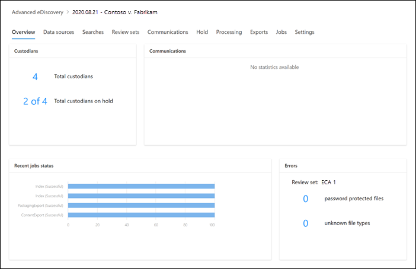

# Overview of the Advanced eDiscovery solution in Microsoft 365

The Advanced eDiscovery solution in Microsoft 365 builds on the existing eDiscovery and analytics capabilities in Office 365. This new solution, called *Advanced eDiscovery*, provides an end-to-end workflow to preserve, collect, review, analyze, and export content that's responsive to your organization's internal and external investigations. It also lets legal teams manage the entire legal hold notification workflow to communicate with custodians involved in a case. 

> [!NOTE]
> Advanced eDiscovery requires an Office 365 or Microsoft 365 E5 Enterprise subscription. For more information about Advanced eDiscovery licensing, see [Microsoft 365 licensing guidance for security & compliance](https://docs.microsoft.com/office365/servicedescriptions/microsoft-365-service-descriptions/microsoft-365-tenantlevel-services-licensing-guidance/microsoft-365-security-compliance-licensing-guidance#advanced-ediscovery).

## Alignment with EDRM

The built-in workflow of Advanced eDiscovery aligns with the eDiscovery process outlined by the Electronic Discovery Reference Model (EDRM). 

(Image source courtesy of edrm.net. The source image was made available under Creative Commons Attribution 3.0 Unported License.)

At a high level, here's how Advanced eDiscovery supports the EDRM workflow:

- **Identification.** After you identify potential persons of interest in an investigation, you can add them as custodians (also called *data custodians*, because they may possess information that's relevant to the case) to an Advanced eDiscovery case. After you identify custodians and add them to a case, you can preserve, collect, and review associated custodial data.

- **Preservation.** To preserve and protect data that's relevant to an investigation, Advanced eDiscovery lets you place a legal hold on the data sources associated with the custodians in a case. You can also place non-custodial data on hold. Advanced eDiscovery also has a built-in communications workflow so you can send legal hold notifications to custodians and track their acknowledgments.

- **Collection.** After you identified (and preserved) the data sources relevant to the investigation, you can use the built-in search tool in Advanced eDiscovery search for and collect live data from the custodial data sources (and non-custodial data sources, if applicable) that may be relevant to the case.

- **Processing.** After you've collected all data relevant to the case, the next step is process it for further review and analysis. In Advanced eDiscovery, the in-place data that you identified in the collection phase is copied to an Azure Storage location (called a *review set*), which provides you with a static view of the case data. 

- **Review.** After data has been added to a review set, you can view specific documents and run another queries to reduce the data to what is most relevant to the case. Also, can annotate and tag specific documents.

- **Analysis.** Advanced eDiscovery provides integrated analytics tool that helps you further cull data from the review set that you determine isn't relevant to the investigation. In addition to reducing the volume of relevant data, Advance eDiscovery also helps you save legal review costs by letting you organize content to make the review process easier and more efficient.

- **Production** and **Presentation.** When you're ready, you can export documents from a review set for legal review. You can export documents in their native format or in an EDRM-specified format so they can be imported into third-party review applications.

## Advanced eDiscovery architecture

Here's an Advanced eDiscovery architecture diagram that shows the end-to-end workflow in a single-geo environment and in a multi-geo environment, and the end-to-end data flow that's aligned with the EDRM.

[View as an image](../media/solutions-architecture-center/m365-advanced-ediscovery-architecture.png)

[Download as a PDF file](https://download.microsoft.com/download/d/1/c/d1ce536d-9bcf-4d31-b75b-fcf0dc560665/m365-advanced-ediscovery-architecture.pdf)

[Download as a Visio file](https://download.microsoft.com/download/d/1/c/d1ce536d-9bcf-4d31-b75b-fcf0dc560665/m365-advanced-ediscovery-architecture.vsdx)

For more information about the end-to-end workflow in Advanced eDiscovery, see this [Microsoft Mechanics video](https://go.microsoft.com/fwlink/?linkid=2066133).

The sections that follow describe each step in the built-in workflow in Advanced eDiscovery. The following screenshot shows the **Overview** tab of a case named *2020.11.03 - Contoso v. Fabrikam*.

## Managing custodians and non-custodial data sources

Use the **Data sources** tab to add and manage the people that you've identified as persons of interest in the case and other data sources that may not be associated with a custodian. When you add custodians or non-custodial data sources, you can quickly perform actions like placing a legal hold on custodian and non-custodial data sources, communicating with custodians, and searching custodian and non-custodial data sources to collect content that's relevant to the case. As the case progresses, it's easy to add new custodians or non-custodial date sources or release them from the case. For more information, see [Work with custodians in Advanced eDiscovery](managing-custodians.md).

## Managing legal hold notifications

Use the **Communications** tab to manage the process of communicating with the custodians in the case. A legal hold notice instructs custodians to preserve any content that's relevant to the case. Legal teams must be able to track the notices that have been received, read, and acknowledged by custodians. The communications workflow in Advanced eDiscovery allows you to create and send initial notifications, reminders, release notices, and escalations if custodians fail to acknowledge a hold notification. For more information, see [Work with communications in Advanced eDiscovery](managing-custodian-communications.md).

## Managing content preservation

When you add a custodian to a case, you can place a hold on custodial data. Use the **Hold** tab to manage the hold created when you add custodians, and to manage other legal holds associated with the case; for example, you can identify and place a hold on non-custodial data sources. You can also edit any hold in the case and make it a query-based hold to preserve only the content that matches the query. For example, you could add a date range to the hold so that only content created within a specific date ranged in preserved. You can also get statistics on content that's on hold, remove the hold after it's no longer relevant to the case, or delete it. For more information, see [Manage holds in Advanced eDiscovery](managing-holds.md).

## Indexing custodian data

When you add a custodian and the corresponding custodial data sources to a case, any partially indexed item from a custodian data source is reindexed by a process called *Advanced indexing*. This allows custodial content such as images, unsupported file types, and other potentially unindexed content to be fully searchable when you run searches to collect data for the case. Use the **Processing** tab to monitor the status of Advanced indexing and fix processing errors by using a process called *error remediation*. For more information, see [Fix processing errors in Advanced eDiscovery](processing-data-for-case.md).

## Collecting case data

Use the **Searches** tab to create searches to search the in-place custodial and non-custodial data sources for content relevant to the case. You can create and run query-based searches (using keywords and conditions) to identify a set of email messages and documents that are relevant to the case and that you want to further review and analyze in subsequent steps in the eDiscovery workflow. You can create one or more searches associated with the case. You can also use the search tool to preview sample documents and view search statistics to help you refine and improve the search results. After you're satisfied the search results contain the all data relevant to the case, you add the search results to a review set for further review, analysis, and culling. For more information, see [Collect data for a case in Advanced eDiscovery](collecting-data-for-ediscovery.md).

## Reviewing and analyzing case data

Use the **Review sets** tab to review and analyze the content that you've collected from the live system and added to a review set. A *review set* is a static collection of that data (in other words, an offline copy of data) of custodial data (and if applicable, non-custodial data) that you collected in the previous phase of the eDiscovery workflow. When you add search results to a review set, a process is triggered that extracts files from containers, extracts metadata, and extracts text. When this process is complete, the system builds a new index of all the data collected from custodians and adds it to the review set. After the data is added to the review set, you can run more queries to narrow the case data, view data as text or in the native file format, and annotate, redact, and tag documents in the review set. You can also perform advanced analytics such as identify document duplication, email threading, and themes. After you've culled the data to only what is relevant to the case, you can either download documents directly or export them along with file metadata, annotations, and any tags. For more information, see:

- [View documents in a review set](view-documents-in-review-set.md)

- [Query the data in a review set](review-set-search.md)

- [Tag documents in a review set](tagging-documents.md)

- [Analyze data in a review set](analyzing-data-in-review-set.md)

## Exporting data for review and presentation

After you export the data from a review set, use the **Exports** tab to manage an export job and download data from a review set. When you export a review set, the data is uploaded to a Microsoft-provided Azure Storage location (or an Azure Storage location managed by your organization). After it's uploaded to Azure, it's then and available to download to a local computer. You can obtain the storage assess key necessary to download the exported data on the **Exports** tab. For more information, see [Export case data in Advanced eDiscovery](exporting-data-ediscover20.md).

## Managing jobs

Use the **Jobs** tab to monitor long-running processes for case-related tasks that you've initiated. Examples of jobs include ones related to reindexing, searching, and exporting case data. For example, if you create a search on the **Searches** tab that includes many data sources, the status of this search process will be displayed on the **Jobs** tab. For more information, see [Manage jobs in Advanced eDiscovery](managing-jobs-ediscovery20.md).

## Configuring case settings

Use the **Settings** tab to configure case-wide settings. This includes adding members to a case, closing or deleting a case, and configuring search and analytics settings.
