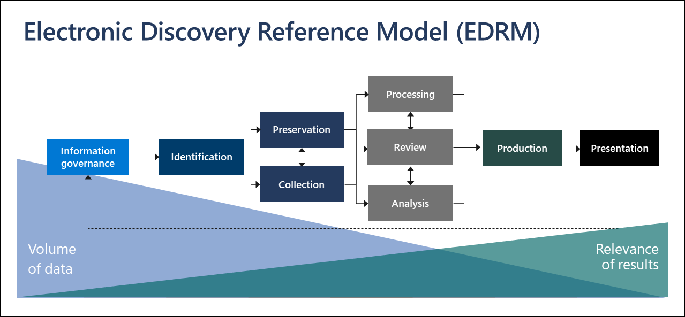

# Overview of Microsoft Purview eDiscovery (Premium)

The Microsoft Purview eDiscovery (Premium) solution builds on the existing Microsoft eDiscovery and analytics capabilities. eDiscovery (Premium) provides an end-to-end workflow to preserve, collect, analyze, review, and export content that's responsive to your organization's internal and external investigations. It also lets legal teams manage the entire legal hold notification workflow to communicate with custodians involved in a case.

## eDiscovery (Premium) capabilities

eDiscovery (Premium) can help your organization respond to legal matters or internal investigations by discovering data where it lives. You can seamlessly manage eDiscovery workflows by identifying persons of interest and their data sources, seamlessly apply holds to preserve data, and then manage the legal hold communication process. By collecting data from the source, you can search the live Microsoft 365 platform to quickly find what you need. Intelligent, machine learning capabilities such as deep indexing, email threading, and near duplicate detection also help you reduce large volumes of data to a relevant data set.

The following sections describe how these eDiscovery (Premium) capabilities can help your organization.

### Discover and collect data in-place

Traditionally, organizations that rely on multiple third-party eDiscovery solutions require copying large volumes of data out of Microsoft 365 to process and having to host duplicate data. This necessity increases the time to find relevant data and the risk, cost, and complexity of managing multiple solutions.

eDiscovery (Premium) in Microsoft 365 lets you discover data at the source and staying within your Microsoft 365 security and compliance boundary.  By collecting data in-place from the live system, eDiscovery (Premium) reduces the friction of going back to the source and reduces unnecessary work of having to find missing content, which often happens when journaling lags in traditional eDiscovery solutions.

Native search and collection capabilities for data in Teams, Yammer, SharePoint Online, OneDrive for Business, and Exchange Online further enhances data discovery. For example,  eDiscovery (Premium):

- Reconstructs Teams conversations (instead of returning individual messages from conversations).

- Collects cloud-based content shared with users by use of links or modern attachments in email message and Teams chats.

- Has built-in support for hundreds of non-Microsoft 365 file types.

- Collects data from third-party sources (such as Bloomberg, Facebook, Slack, and Zoom Meetings) that's imported and archived in Microsoft 365 by [data connectors](archiving-third-party-data.md).

### Manage eDiscovery workflow in one platform

eDiscovery (Premium) can help you reduce the number of eDiscovery solutions you need to rely on. It provides a streamlined, end-to-end workflow, all which occurs within Microsoft 365. eDiscovery (Premium) helps reduce the friction of identifying and collecting potential sources of relevant information by automatically mapping unique and shared data sources to the person of interest (known as a *custodian*), and by providing reporting and analytics on potentially relevant data prior to collecting it for analysis and review.

Additionally, Microsoft Graph APIs can help you automate the eDiscovery workflow and extend eDiscovery (Premium) for custom solutions.

### Cull data intelligently

Intelligent, machine learning capabilities in eDiscovery (Premium) help you reduce the amount of data to review. These intelligent capabilities help you reduce and cull large volumes of data to a relevant set. For example, a built-in review set query helps filter only for unique content by identifying near duplicates. This capability can substantially reduce the amount of data to review.

Additional machine learning capabilities can further refine and identify relevant data using smart tags and technology assisted review tools like the Relevance modules.

## eDiscovery (Premium) alignment with the Electronic Discovery Reference Model

The built-in workflow of eDiscovery (Premium) in Microsoft 365 aligns with the eDiscovery process outlined by the Electronic Discovery Reference Model (EDRM).

(Image based on the EDRM model on edrm.net)

At a high level, here's how eDiscovery (Premium) supports the EDRM workflow:

- **Identification.** After you identify potential persons of interest in an investigation, you can add them as custodians (also called *data custodians*, because they may possess information that's relevant to the investigation) to an eDiscovery (Premium) case. After users are added as custodians, it's easy to preserve, collect, and review custodian documents.

- **Preservation.** To preserve and protect data that's relevant to an investigation, eDiscovery (Premium) lets you place a legal hold on the data sources associated with the custodians in a case. You can also place non-custodial data on hold. eDiscovery (Premium) also has a built-in communications workflow so you can send legal hold notifications to custodians and track their acknowledgments.

- **Collection.** After you identified (and preserved) the data sources relevant to the investigation, you can use the built-in search tool in eDiscovery (Premium) search for and collect live data from the custodial data sources (and non-custodial data sources, if applicable) that may be relevant to the case.

- **Processing.** After you've collected all data relevant to the case, the next step is process it for further review and analysis. In eDiscovery (Premium), the in-place data that you identified in the collection phase is copied to an Azure Storage location (called a *review set*), which provides you with a static view of the case data.

- **Review.** After data has been added to a review set, you can view specific documents and run additional queries to reduce the data to what is most relevant to the case. Also, can annotate and tag specific documents.

- **Analysis.** eDiscovery (Premium) provides integrated analytics tool that helps you further cull data from the review set that you determine isn't relevant to the investigation. In addition to reducing the volume of relevant data, Advance eDiscovery also helps you save legal review costs by letting you organize content to make the review process easier and more efficient.

- **Production** and **Presentation.** When you're ready, you can export documents from a review set for legal review. You can export documents in their native format or in an EDRM-specified format so they can be imported into third-party review applications.

## Subscriptions and licensing

For information regarding what licenses provide the rights for a user to benefit from eDiscovery (Premium) please see [Microsoft 365 guidance for security & compliance](/office365/servicedescriptions/microsoft-365-service-descriptions/microsoft-365-tenantlevel-services-licensing-guidance/microsoft-365-security-compliance-licensing-guidance#microsoft-purview-ediscovery) and see the "eDiscovery and auditing" section in the [Microsoft 365 Comparison table](https://go.microsoft.com/fwlink/?linkid=2139145).

For information about how to assign licenses, see [Assign licenses to users](/microsoft-365/admin/manage/assign-licenses-to-users).

## Get started with eDiscovery (Premium)

There are two quick and easy steps to get started with eDiscovery (Premium).

|Steps  |Description  |
|:---------|:---------|
|[Set up eDiscovery (Premium)](get-started-with-advanced-ediscovery.md)| After verifying the subscription and licensing requirements, you can assign permissions and configure organization-wide settings to get started using eDiscovery (Premium).|
|[Create and manage cases](create-and-manage-advanced-ediscoveryv2-case.md) | Create cases to manage the eDiscovery (Premium) workflow for all legal and other types of investigations in your organization.|
|||

## eDiscovery (Premium) architecture

Here's an eDiscovery (Premium) architecture diagram that shows the end-to-end workflow in a single-geo environment and in a multi-geo environment, and the end-to-end data flow that's aligned with the [EDRM](#ediscovery-premium-alignment-with-the-electronic-discovery-reference-model).

[View as an image](../media/solutions-architecture-center/m365-advanced-ediscovery-architecture.png)

[Download as a PDF file](https://download.microsoft.com/download/d/1/c/d1ce536d-9bcf-4d31-b75b-fcf0dc560665/m365-advanced-ediscovery-architecture.pdf)

[Download as a Visio file](https://download.microsoft.com/download/d/1/c/d1ce536d-9bcf-4d31-b75b-fcf0dc560665/m365-advanced-ediscovery-architecture.vsdx)

## Training

Training your IT administrators, eDiscovery managers, and compliance investigation teams in the basics for eDiscovery (Premium) can help your organization get started more quickly using Microsoft 365 eDiscovery tools. Microsoft 365 provides the following resource to help these users in your organization getting started with eDiscovery: [Describe the eDiscovery and audit capabilities of Microsoft 365](/training/modules/describe-ediscovery-capabilities-of-microsoft-365).
