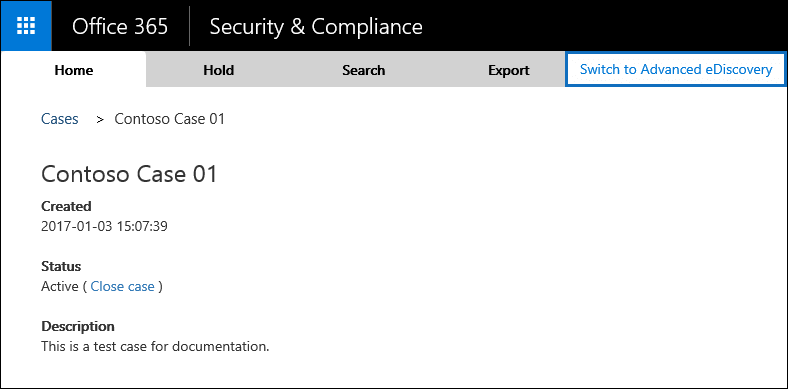

# Prepare search results for Advanced eDiscovery (classic)

> [!IMPORTANT]
> As we continue to invest in newer versions of Advanced eDiscovery, we are announcing the retirement of Advanced eDiscovery, also known as *Advanced eDiscovery (classic)* or *Advanced eDiscovery v1.0*. If you're still using Advanced eDiscovery v1.0, please transition to [Advanced eDiscovery v2.0](overview-ediscovery-20.md) (also known as the *Advanced eDiscovery solution in Microsoft 365*) as soon as possible. Advanced eDiscovery 2.0 contains similar functionality found in Advanced eDiscovery v1.0, but also offers many new features such as custodian management, communications management, and review sets. To learn more about the retirement of Advanced eDiscovery v1.0, see [Retirement of legacy eDiscovery tools](legacy-ediscovery-retirement.md#advanced-ediscovery-v10). 

After a search that's associated with an eDiscovery case in the Security & Compliance Center is successfully run, you can prepare the search results for further analysis with Advanced eDiscovery, which lets you analyze large, unstructured data sets and reduce the amount of data that's relevant to a legal case. Advanced eDiscovery features include:
  
- **Optical character recognition** - When you prepare search results for Advanced eDiscovery, optical character recognition (OCR) functionality automatically extracts text from images, and includes this with the search results that are loaded in to Advanced eDiscovery for analysis. OCR is supported for loose files, email attachments, and embedded images. This allows you to apply the text analytic capabilities of Advanced eDiscovery (near-duplicates, email threading, themes, and predictive coding) to the text content in image files. Advanced eDiscovery OCR supports the following formats for image files:

    - GIF
    - JPEG
    - JPG
    - PNG
    - TIFF
    
- **Near-duplicate detection** - Lets you structure your data review more efficiently, so one person reviews a group of similar documents. This helps prevent multiple reviewers from having to view different versions of the same document. 
    
- **Email threading** - Helps you identify the unique messages in an email thread so you can focus on only the new information in each message. In an email thread, the second message contains the first message. Likewise, later messages contain all the previous messages. Email threading removes the need to review every message in its entirety in an email thread. 
    
- **Themes** - Help you get valuable insight about your data beyond just keyword search statistics. Themes help investigations by grouping related documents so you can look at the documents in context. When using themes, you can view the related themes for a set of documents, determine any overlap, and then identify cross-sections of related data. 
    
- **Predictive coding** - Lets you train the system on what you're looking for, by allowing you to make decisions (about whether something is relevant or not) on a small set of documents. Advanced eDiscovery then applies that learning (based on your guidance) when analyzing all of the documents in the data set. Based on that learning, Advanced eDiscovery provides a relevance ranking so you can decide which documents to review based on what document are the most likely to be relevant to the case. 
    
- **Exporting data for review applications**  - You can export data from Advanced eDiscovery and Microsoft 365 after you've completed your analysis and reduced the data set. The export package includes a CSV file that contains the properties from the exported content and analytics metadata. This export package can then be imported to an eDiscovery review application. 
    
## Get licenses and permissions

- To analyze a user's data using Advanced eDiscovery, the user (the custodian of the data) must be assigned an Office 365 E5 license. Alternatively, users with an Office 365 E1 or E3 license can be assigned an Advanced eDiscovery standalone license. Administrators and compliance officers who are assigned to cases and use Advanced eDiscovery to analyze data don't need an E5 license. 
    
- You have to be an eDiscovery Manager or an eDiscovery Administrator in the Security & Compliance Center to prepare search results for Advanced eDiscovery. An eDiscovery Manager is a member of the eDiscovery Manager role group. An eDiscovery Administrator is also member of the eDiscovery Manager role group, but has been assigned additional eDiscovery privileges. For instructions about assigning eDiscovery Administrator permissions, see Step 1 in [eDiscovery cases](ediscovery-cases.md#step-1-assign-ediscovery-permissions-to-potential-case-members).
    
## Step 1: Prepare search results for Advanced eDiscovery

You can prepare the results of a search that's associated with an eDiscovery case. When you prepare search results for Advanced eDiscovery, the data is uploaded and temporarily stored in a unique Windows Azure storage area in the Microsoft cloud. It's at this point that the OCR functionality extracts text from images in the search results. In [Step 2](#step-2-add-the-search-results-data-to-the-case-in-advanced-ediscovery), this text and the other search results data is loaded in to the case in Advanced eDiscovery.
  
1. In the Security & Compliance Center, click **eDiscovery** \> **eDiscovery** to display the list of cases in your organization. 
    
2. Click **Open** next to the case that you want to prepare search results for analysis in Advanced eDiscovery. 
    
3. On the **Home** page for the case, click **Search**, and then select the search.
    
4. In the details pane, under **Analyze results with Advanced eDiscovery**, click **Prepare results for analysis**.
    
    > [!NOTE]
    > If the search results are older than 7 days, you will be prompted to update the search results. 
  
5. On the **Prepare results for analysis** page, do the following: 
    
    - Choose to prepare indexed items, indexed and unindexed items, or only unindexed items for analysis in Advanced eDiscovery.
    
    - Choose whether to include all versions of documents found on SharePoint that met the search criteria. This option appears only if the content sources for the search includes sites.
    
    - Specify whether you want a notification message sent (or copied) to a person when the preparation process is completed and the data is ready to be processed in Advanced eDiscovery.
    
6. Click **Prepare**.
    
    The search results are prepared for analysis with Advanced eDiscovery.
    
7. In the details pane, click **Check preparation status** to display information about the preparation process. When the preparation process is finished, you can go to the case in Advanced eDiscovery to process the data for analysis. 
    
## Step 2: Add the search results data to the case in Advanced eDiscovery

When the preparation is finished, the next step is to go to Advanced eDiscovery and load the search results data (which have been uploaded to an Azure storage area in the Microsoft cloud ) to the case in Advanced eDiscovery. As previously explained, to access Advanced eDiscovery you have to be an eDiscovery Administrator in the Security & Compliance Center or an administrator in Advanced eDiscovery.
  
> [!NOTE]
> The time it takes for the data from the Security & Compliance Center to be available to add to a case in Advanced eDiscovery varies, depending on the size of the results from the eDiscovery search. 
  
1. In the Security & Compliance Center, click **eDiscovery** \> **eDiscovery** to display the list of cases in your organization. 
    
2. Click **Open** next to the case that you want to load data in to in Advanced eDiscovery. 
    
3. On the **Home** page for the case, click **Switch to Advanced eDiscovery**. 
    
    
  
    The **Connecting to Advanced eDiscovery** progress bar is displayed. When you're connected to Advanced eDiscovery, a list of containers is displayed on the setup page for the case. 
    
    
  
     These containers represent the search results that you prepared for analysis in Advanced eDiscovery in Step 1. Note that the name of the container has the same name as the search in the case in the Security & Compliance Center. The containers in the list are the ones that you prepared. If a different user prepared search results for Advanced eDiscovery, the corresponding containers won't be included in the list. 
    
4. To load the search result data from a container in to the case in Advanced eDiscovery, select a container and then click **Process**.
    
## Next steps

After the results of an eDiscovery search are added to a case, the next step is to use the Advanced eDiscovery tools to analyze the data and identify the content that's responsive to a specific legal case. For information about using Advanced eDiscovery, see [Advanced eDiscovery (classic)](office-365-advanced-ediscovery.md).
  
## More information

Any RMS-encrypted email messages that are included in the search results will be decrypted when you prepare them for analysis in Advanced eDiscovery. This decryption capability is enabled by default for members of the eDiscovery Manager role group. This is because the RMS Decrypt management role is assigned to this role group. Keep the following things in mind about decrypting email messages:
  
- Currently, this decryption capability doesn't include encrypted content from SharePoint and OneDrive for Business sites. Only RMS-encrypted email messages will be decrypted when you export them.
    
- If an RMS-encrypted email message has an attachment (such as a document or another email message) that's also encrypted, only the top-level email message will be decrypted.
    
- If you need to prevent someone from decrypting RMS-encrypted messages when preparing search results for analysis in Advanced eDiscovery, you'll have to create a custom role group (by copying the built-in eDiscovery Manager role group) and then remove the RMS Decrypt management role from the custom role group. Then add the person who you don't want to decrypt messages as a member of the custom role group.
