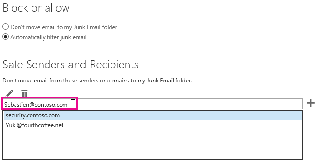

# How to prevent real email from being marked as spam in Office 365

 **Is your real email getting marked as spam in Office 365? Do this.**

If you get a false positive, you should report the message to Microsoft by using the [Use the Report Message add-in](https://support.office.com/article/b5caa9f1-cdf3-4443-af8c-ff724ea719d2). Additionally, you can submit the message using [Submissions Explorer](/security/office-365-security/admin-submission.md).

> [!NOTE]
> Any other fields in the header that are not mentioned below are exclusively used by the Microsoft anti-spam team for diagnostic purposes.

## Determine the reason why the message was marked as spam

Many issues with spam in Office 365 can be resolved by [View e-mail message headers](https://support.office.com/article/cd039382-dc6e-4264-ac74-c048563d212c) and determining what went wrong. You will need to look for a header named X-Forefront-Antispam-Report. You can [learn more about anti-spam message headers](https://technet.microsoft.com/library/dn205071%28v=exchg.150%29.aspx).

In the header, look for the following headings and values.

### X-Forefront-Antispam-Report

- **SFV:SPM**: Indicates that the message was marked as spam because of the EOP spam filters.

- **SFV:BLK**: Indicates that the message was marked as spam because the sending address is on the recipient's Blocked Senders List.

- **SFV:SKS**: Indicates that the message was marked as spam prior to the content filter. This could include a mail flow rule (also known as a transport rule) marking the message as spam. Run a message trace to see if a mail flow rule triggered which may have set a high spam confidence level (SCL).

- **SFV:SKB**: Indicates that the message was marked as spam because it matched a block list in the spam filter policy.

- **SFV:BULK**: Indicates that the Bulk Complaint Level (BCL) value located in the x-microsoft-antispam header is above the Bulk threshold that has been set for the content filter. Bulk email is email which users may have signed up for, but may still be undesirable. In the message header find the BCL (Bulk Confidence Level) property in the X-Microsoft-Antispam header. If the BCL value is less than the threshold set in the Spam Filter, you may want to adjust the threshold to instead mark these types of bulk messages as spam. Different users have different tolerances and preferences for [how bulk email is handled](https://docs.microsoft.com/microsoft-365/security/office-365-security/bulk-complaint-level-values). You can create different policies or rules for different user preferences.

- **CAT:SPOOF** or **CAT:PHISH**: Indicates that the message appears to be spoofed, meaning that the message source cannot be validated and could be suspicious. If valid, the sender will need to make sure that they have proper SPF and DKIM configuration. Check the Authentication-Results header for more information. Although it may be difficult to get all senders to use proper email authentication methods, bypassing these checks can be extremely dangerous and is the top cause of compromises.

### x-customspam

- The presence of this header indicates that the message was marked as spam because one of the [advanced spam options is enabled](https://technet.microsoft.com/library/jj200750%28v=exchg.150%29.aspx) in your spam filter. Unless you need these features, we recommend that you use the default settings.

## Solutions to additional causes of too much spam

In order to work effectively, Exchange Online Protection (EOP) requires that administrators complete a few tasks. If you are not the administrator for your Office 365 tenant and you are getting too much spam, then you may want to work with your administrator on these tasks. Otherwise, you can skip to the user section.

### For admins

- **Point your DNS records to Office 365**: In order for EOP to provide protection, your mail exchanger (MX) DNS record(s) for all domains must be pointed to Office 365 -- and only to Office 365. If your MX does not point to Office 365, then EOP will not provide spam filtering for your users. In the situation where you wish to use another service or appliance to provide spam filtering for your domain, you should consider disabling the spam protection in EOP. You can do this by creating a mail flow rule that sets the SCL value to -1. If you later decide to use EOP, make sure to remove this mail flow rule.

- **Turn on the report message add-in for users**: We strongly recommend that you [enable the report message add-in for you users](/security/office-365-security/enable-the-report-message-add-in.md).

- **Use [Submissions Explorer](/security/office-365-security/admin-submission.md)**: Admins can now send emails by using file or network message ID, URLs, and files for scanning by Microsoft in Office 365. As an administrator, you may also be able to view the feedback your users are sending and use any patterns to adjust any settings that may be causing problems.

- **Make sure that your users are inside the allowed limits** for sending and receiving emails as showed [here](https://docs.microsoft.com/en-us/office365/servicedescriptions/exchange-online-service-description/exchange-online-limits).

- **Double-check the bulk levels** as specified [here](/security/office-365-security/bulk-complaint-level-values.md).

### For users

- **Create a safe sender list**: Users can add addresses from senders that they trust to their safe sender list in [Outlook](https://go.microsoft.com/fwlink/p/?LinkId=270065) or [Outlook on the web](https://go.microsoft.com/fwlink/p/?LinkId=294862) (formerly known as Outlook Web App). To get started in Outlook on the web, choose **Settings**  \> **Options** \> **Block or allow**. The following diagram shows an example of adding something to a safe sender list.



EOP will honor your users' Safe Senders and Recipients, but not Safe Domains. This is true regardless of whether the domain is added through the Outlook on the web, or added in Outlook and synchronized using Directory Sync.

- **Disable SmartScreen filtering in Outlook**: If you are using an older Outlook desktop client, you should disable the SmartScreen filtering functionality, which has been discontinued. If enabled, it can cause false positives. This should not be required if running an updated desktop Outlook client.

## Troubleshooting: A message ends up in the Junk folder even though EOP marked the message as non-spam

If your users have the option in Outlook enabled for "Safe Lists Only: Only mail from people or domains on your Safe Senders list or Safe Recipients List will be delivered to your Inbox", then all email will go to the junk folder for a sender unless the sender is on the recipient's Safe Sender list. This will happen regardless of whether EOP marks a message as non-spam, or if you have set up a rule in EOP to mark a message as non-spam.

You can disable the Safe Lists Only option for your Outlook users by following the instructions in [Outlook: Policy setting to disable the Junk E-mail UI and filtering mechanism](https://support.microsoft.com/en-us/kb/2180568).

If you view the message in Outlook on the web, there will be a yellow safety tip that indicates that the message is in the Junk folder because the sender is not on the recipient's Safe Senders list.

If you look at the header of a message, it may include the stamp SFV:SKN (IP Allow or ETR Allow) or SFV:NSPM (non-spam), but the message is still placed in the user's junk folder. There is nothing in the message header that indicates that the user has "Safe Lists Only" enabled. This happens because the "Safe Lists Only" option set by users in Outlook overrides the EOP setting.

### To verify why a message from a safe sender is marked as non-spam in the message header, but still ends up in the user's Junk folder

1. To learn how to connect to Exchange Online PowerShell, see [Connect to Exchange Online PowerShell](https://go.microsoft.com/fwlink/p/?LinkId=396554).

2. Run the following command to view the user's junk email configuration settings:

  ```Powershell
  Get-MailboxJunkEmailConfiguration example@contoso.com | Format-List TrustedListsOnly,ContactsTrusted,TrustedSendersAndDomains
  ```

- If TrustedListsOnly is True, it means that this setting is enabled.

- If ContactsTrusted is True, it means that the user trusts both Contacts and Safe Senders.

- TrustedSendersAndDomains lists the contents of the user's Safe Senders list.

## EOP-only customers: use directory synchronization

If you're an EOP-only customer, that is, you subscribe to the EOP service for use with your on-premises (Exchange) email server, you should sync user settings with the service by using directory synchronization. Doing this ensures that your Safe Senders lists are respected by EOP. For more information, see "Use directory synchronization to manage mail users" in [Manage Mail Users in EOP](https://go.microsoft.com/fwlink/?LinkId=534098).
