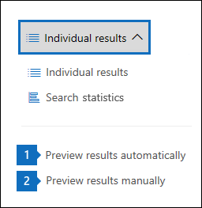

# Preview eDiscovery search results

There are two configuration settings for previewing search results. After you run a new search or open an existing search, click **Individual results** to view the following preview settings: 
  

  
1. **Preview results automatically:** This setting displays the search results after you run a search.
    
2. **Preview results manually:** This setting displays placeholders in the search results pane, and displays the **Preview results** button that you have to click to display the search results. This is the default setting. It helps enhance search performance by not automatically displaying the search results when you open an existing search. 
    
There are limits related to how many items are available to be previewed. For more information, see [Limits for Content Search](limits-for-content-search.md). 

## File types supported when previewing search results

You can preview supported file types in the preview pane. If a file type isn't supported, you have to download a copy of the file to your local computer (by clicking **Download original file**). For .aspx Web pages, the URL for the page is included though you might not have permissions to access the page. Also note that unindexed items aren't available for previewing.

The following file types are supported and can be previewed in the search results pane.
  
- .txt, .html, .mhtml

- .eml

- .doc, .docx, .docm

- .pptm, .pptx

- .pdf

Also, the following file container types are supported. You can view the list of files in the container in the preview pane.
  
- .zip

- .gzip
