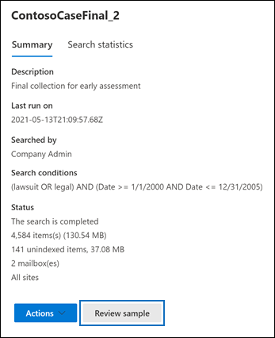
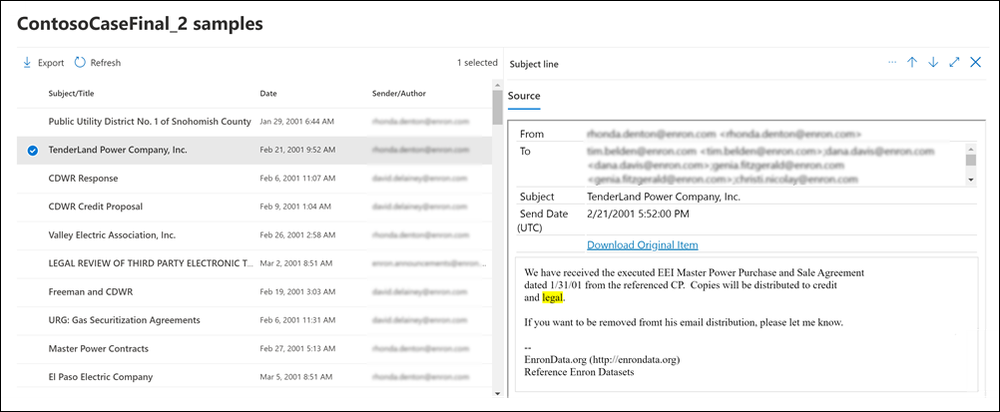

# Preview eDiscovery search results

After you run a Content search or a search associated with a Core eDiscovery case, you can preview a sample of the results returned by the search. Previewing items returned by the search query can help you determine if the search is returning the results you hope for or if you need to change the search query and rerun the search.

To preview a sample of results returned by a search:

1. In the Microsoft 365 compliance center, go to the Content search page or a Core eDiscovery case.

2. Select search to display the flyout page.

3. On the bottom of the flyout page, click **Review sample**.

   

   A page is displayed containing up a sample of the search results.

4. Select an item to view its contents in the reading pane.

   

   In the previous screenshot, notice that keywords from the search query are highlighted when previewing items.

## How the search result samples are selected

A maximum of 1,000 randomly selected items are available to preview. In addition to being randomly selected, items available for preview must also meet the following criteria:

- A maximum of 100 items from a single content location (a mailbox or a site) can be previewed. This means that it's possible that less than 1,000 items might be available for preview. For example, if you search four mailboxes and the search returns 1,500 estimated items, only 400 will be available for preview because only 100 items from each mailbox can be previewed.

- For mailbox items, only email messages are available to preview. Items like tasks, calendar items, and contacts can't be previewed.

- For site items, only documents are available to preview. Items like folders, lists, or list attachments can't be previewed.

## File types supported when previewing search results

You can preview supported file types in the preview pane. If a file type isn't supported, you have to download a copy of the file to your local computer (by clicking **Download original item**). For .aspx Web pages, the URL for the page is included though you may not have permissions to access the page. Unindexed items aren't available for previewing.

The following file types are supported and can be previewed in the search results pane.
  
- .txt, .html, .mhtml

- .eml

- .doc, .docx, .docm

- .pptm, .pptx

- .pdf

Also, the following file container types are supported. You can view the list of files in the container in the preview pane.
  
- .zip

- .gzip