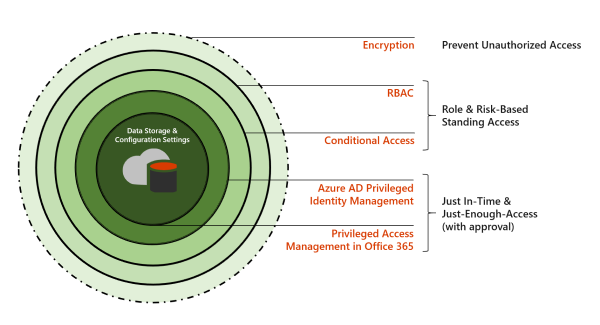
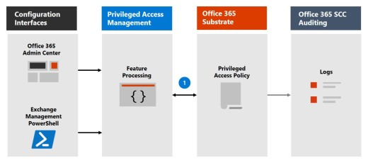
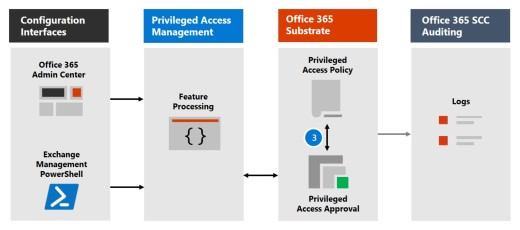
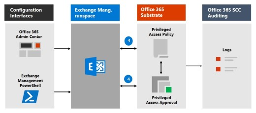

# Privileged access management

Privileged access management allows granular access control over privileged admin tasks in Office 365. It can help protect your organization from breaches that use existing privileged admin accounts with standing access to sensitive data or access to critical configuration settings. Privileged access management requires users to request just-in-time access to complete elevated and privileged tasks through a highly scoped and time-bounded approval workflow. This configuration gives users just-enough-access to perform the task at hand, without risking exposure of sensitive data or critical configuration settings. Enabling privileged access management in Microsoft 365 allows your organization to operate with zero standing privileges and provide a layer of defense against standing administrative access vulnerabilities.

For a quick overview of the integrated Customer Lockbox and privileged access management workflow, see this [Customer Lockbox and privileged access management video](https://go.microsoft.com/fwlink/?linkid=2066800).

## Layers of protection

Privileged access management complements other data and access feature protections within the Microsoft 365 security architecture. Including privileged access management as part of an integrated and layered approach to security provides a security model that maximizes protection of sensitive information and Microsoft 365 configuration settings. As shown in the diagram, privileged access management builds on the protection provided with native encryption of Microsoft 365 data and the role-based access control security model of Microsoft 365 services. When used with [Azure AD Privileged Identity Management](https://docs.microsoft.com/azure/active-directory/active-directory-privileged-identity-management-configure), these two features provide access control with just-in-time access at different scopes.

Privileged access management is defined and scoped at the **task** level, while Azure AD Privileged Identity Management applies protection at the **role** level with the ability to execute multiple tasks. Azure AD Privileged Identity Management primarily allows managing accesses for AD roles and role groups, while privileged access management in Microsoft 365 applies only at the task level.

- **Enabling privileged access management while already using Azure AD Privileged Identity Management:** Adding privileged access management provides another granular layer of protection and audit capabilities for privileged access to Microsoft 365 data.

- **Enabling Azure AD Privileged Identity Management while already using privileged access management in Office 365:**  Adding Azure AD Privileged Identity Management to privileged access management can extend privileged access to data outside of Microsoft 365 that's primarily defined by user roles or identity.  

## Privileged access management architecture and process flow

Each of the following process flows outline the architecture of privileged access and how it interacts with the Microsoft 365 substrate, auditing, and the Exchange Management runspace.

### Step 1: Configure a privileged access policy

When you configure a privileged access policy with the [Microsoft 365 admin center](https://admin.microsoft.com) or the Exchange Management PowerShell, you define the policy and the privileged access feature processes and the policy attributes in the Microsoft 365 substrate. The activities are logged in the Security &amp; Compliance Center. The policy is now enabled and ready to handle incoming requests for approvals.

### Step 2: Access request

In the [Microsoft 365 admin center](https://admin.microsoft.com) or with the Exchange Management PowerShell, users can request access to elevated or privileged tasks. The privileged access feature sends the request to the Microsoft 365 substrate for processing against the configured privilege access policy and records the Activity in the Security &amp; Compliance Center logs.

### Step 3: Access approval

An approval request is generated and the pending request notification is emailed to approvers. If approved, the privileged access request is processed as an approval and the task is ready to be completed. If denied, the task is blocked and no access is granted to the requestor. The requestor is notified of the request approval or denial via email message.

### Step 4: Access processing

For an approved request, the task is processed by the Exchange Management runspace. The approval is checked against the privileged access policy and processed by the Microsoft 365 substrate. All activity for the task is logged in the Security &amp; Compliance Center.

## Frequently asked questions

### What SKUs can use privileged access in Office 365?

Privileged access management is available for customers for a wide selection of Microsoft 365 and Office 365 subscriptions and add-ons. See [Get started with privileged access management](privileged-access-management-configuration.md) for details.

### When will privileged access support Office 365 workloads beyond Exchange?

Privileged access management will be available in other Office 365 workloads soon. Visit the [Microsoft 365 Roadmap](https://www.microsoft.com/microsoft-365/roadmap) for more details.

### My organization needs more than 30 privileged access policies, will this limit be increased?

Yes, raising the current limit of 30 privileged access policies per organization is on the feature roadmap.

### Do I need to be a Global Admin to manage privileged access in Office 365?

No, you need the Exchange Role Management role assigned to accounts that manage privileged access in Office 365. If you don't want to configure the Role Management role as a stand-alone account permission, the Global Administrator role includes this role by default and can manage privileged access. Users included in an approvers' group don't need to be a Global Admin or have the Role Management role assigned to review and approve requests with PowerShell.

### How is privileged access management related to Customer Lockbox?

[Customer Lockbox](https://docs.microsoft.com/office365/admin/manage/customer-lockbox-requests) allows a level of access control for organizations when Microsoft accesses data. Privileged access management allows granular access control within an organization for all Microsoft 365 privileged tasks.

## Ready to get started?

Start [configuring your organization for privileged access management](privileged-access-management-configuration.md).

## Learn more

[Interactive guide: Monitor and control administrator tasks with privileged access management](https://content.cloudguides.com/guides/Privileged%20Access%20Management)
