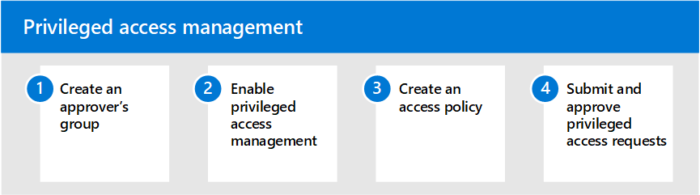

# Privileged access management in Microsoft 365

### Optional: Enable and configure privileged access management policies

Having standing access by some users to sensitive information or critical network configuration settings in Microsoft Exchange Online is a potential pathway for compromised accounts or internal threat activities. [Privileged access management](privileged-access-management-overview.md) helps protect your organization from breaches and helps to meet compliance best practices by limiting standing access to sensitive data or access to critical configuration settings. Instead of administrators having constant access, just-in-time access rules are implemented for tasks that need elevated permissions. Enabling privileged access management for Exchange Online in Microsoft 365 allows your organization to operate with zero standing privileges and provide a layer of defense against standing administrative access vulnerabilities.

#### To configure privileged access management for Microsoft 365

1. Create an [approver's group](privileged-access-management-configuration.md#step-1-create-an-approvers-group)
2. Enable [privileged access management](privileged-access-management-configuration.md#step-2-enable-privileged-access)
3. Create an [access policy](privileged-access-management-configuration.md#step-3-create-an-access-policy)
4. Submit/approve [privileged access requests](privileged-access-management-configuration.md#step-4-submitapprove-privileged-access-requests)

#### More information about privileged access management

- [Frequently asked questions about privileged access management](privileged-access-management-overview.md#frequently-asked-questions)