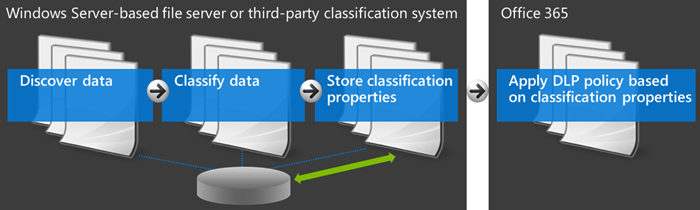
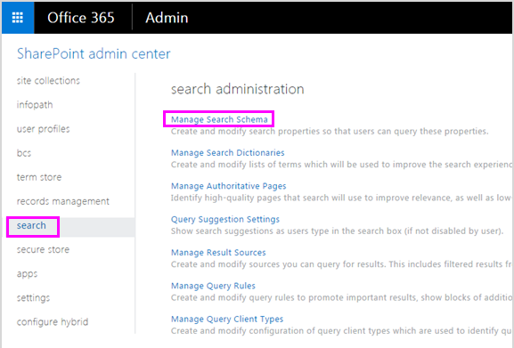
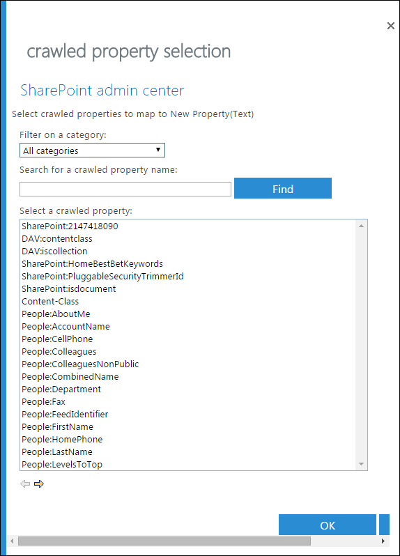
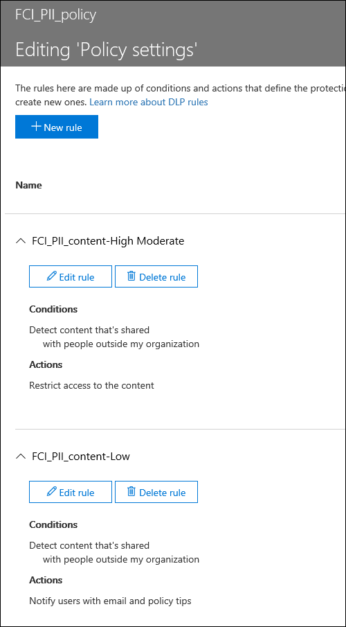

# Create a DLP policy to protect documents with FCI or other properties

Microsoft 365 data loss prevention (DLP) policies can use classification properties or item properties to identify sensitive items. For example you can use:

- Windows Server File Classification infrastructure (FCI) properties
- SharePoint document properties
- third-party system document properties



For example, your organization might use Windows Server FCI to identify items with personal data such as social security numbers, and then classify the document by setting the **Personally Identifiable Information** property to **High**, **Moderate**, **Low**, **Public**, or **Not PII** based on the type and number of occurrences of personal data found in the document.

In Microsoft 365, you can create a DLP policy that identifies documents that have that property set to specific values, such as **High** and **Medium**, and then takes an action such as blocking access to those files. The same policy can have another rule that takes a different action if the property is set to **Low**, such as sending an email notification. In this way, DLP integrates with Windows Server FCI and can help protect Office documents uploaded or shared to Microsoft 365 from Windows Server-based file servers.

A DLP policy simply looks for a specific property name/value pair. Any document property can be used, as long as the property has a corresponding managed property for SharePoint search. For example, a SharePoint site collection might use a content type named **Trip Report** with a required field named **Customer**. Whenever a person creates a trip report, they must enter the customer name. This property name/value pair can also be used in a DLP policy—for example, if you want a rule that blocks access to the document for guests when the **Customer** field contains **Contoso**.

If you want to apply your DLP policy to content with specific Microsoft 365 labels, you should not follow the steps here. Instead, learn how to [Using a retention label as a condition in a DLP policy](data-loss-prevention-policies.md#using-a-retention-label-as-a-condition-in-a-dlp-policy).

## Before you create the DLP policy

Before you can use a Windows Server FCI property or other property in a DLP policy, you need to create a managed property in the SharePoint admin center. Here's why.

In SharePoint Online and OneDrive for Business, the search index is built up by crawling the content on your sites. The crawler picks up content and metadata from the documents in the form of crawled properties. The search schema helps the crawler decide what content and metadata to pick up. Examples of metadata are the author and the title of a document. However, to get the content and metadata from the documents into the search index, the crawled properties must be mapped to managed properties. Only managed properties are kept in the index. For example, a crawled property related to author is mapped to a managed property related to author.

> [!NOTE]
> Be sure to use a managed property name and not a crawled property name when creating DLP rules using the `ContentPropertyContainsWords` condition.

This is important because DLP uses the search crawler to identify and classify sensitive information on your sites, and then store that sensitive information in a secure portion of the search index. When you upload a document to Office 365, SharePoint automatically creates crawled properties based on the document properties. But to use an FCI or other property in a DLP policy, that crawled property needs to be mapped to a managed property so that content with that property is kept in the index.

For more information on search and managed properties, see [Manage the search schema in SharePoint Online](/sharepoint/manage-search-schema).

### Step 1: Upload a document with the needed property to Office 365

You first need to upload a document with the property that you want to reference in your DLP policy. Microsoft 365 will detect the property and automatically create a crawled property from it. In the next step, you'll create a managed property, and then map the managed property to this crawled property.

### Step 2: Create a managed property

1. Sign in to the Microsoft 365 admin center.

2. In the left navigation, choose **Admin centers** \> **SharePoint**. You're now in the SharePoint admin center.

3. In the left navigation, choose **search** \> on the **search administration** page \> **Manage Search Schema**.

   

4. On the **Managed Properties** page \> **New Managed Property**.

   

5. Enter a name and description for the property. This name is what will appear in your DLP policies.

6. For **Type**, choose **Text**.

7. Under **Main characteristics**, select **Queryable** and **Retrievable**.

8. Under **Mappings to crawled properties** \> **Add a mapping**.

9. In the **crawled property selection** dialog box \> find and select the crawled property that corresponds to the Windows Server FCI property or other property that you will use in your DLP policy \> **OK**.

   

10. At the bottom of the page \> **OK**.

## Create a DLP policy that uses an FCI property or other property

In this example, an organization is using FCI on its Windows Server-based file servers; specifically, they're using the FCI classification property named **Personally Identifiable Information** with possible values of **High**, **Moderate**, **Low**, **Public**, and **Not PII**. Now they want to use their existing FCI classification in their DLP policies in Office 365.

First, they follow the steps above to create a managed property in SharePoint Online, which maps to the crawled property created automatically from the FCI property.

Next, they create a DLP policy with two rules that both use the condition **Document properties contain any of these values**:

- **FCI PII content - High, Moderate** The first rule restricts access to the document if the FCI classification property **Personally Identifiable Information** equals **High** or **Moderate** and the document is shared with people outside the organization.

- **FCI PII content - Low** The second rule sends a notification to the document owner if the FCI classification property **Personally Identifiable Information** equals **Low** and the document is shared with people outside the organization.

### Create the DLP policy by using PowerShell

The condition **Document properties contain any of these values** is temporarily not available in the UI of the Security &amp; Compliance Center, but you can still use this condition by using PowerShell. You can use the  `New\Set\Get-DlpCompliancePolicy` cmdlets to work with a DLP policy, and use the  `New\Set\Get-DlpComplianceRule` cmdlets with the  `ContentPropertyContainsWords` parameter to add the condition **Document properties contain any of these values**.

For more information on these cmdlets, see [Security &amp; Compliance Center cmdlets](/powershell/exchange/exchange-online-powershell).

1. [Connect to the Security &amp; Compliance Center using remote PowerShell](/powershell/exchange/connect-to-scc-powershell)

2. Create the policy by using  `New-DlpCompliancePolicy`.

This PowerShell creates a DLP policy that applies to all locations.

   ```powershell
   New-DlpCompliancePolicy -Name FCI_PII_policy -ExchangeLocation All -SharePointLocation All -OneDriveLocation All -Mode Enable
   ```

3. Create the two rules described above by using  `New-DlpComplianceRule`, where one rule is for the **Low** value, and another rule is for the **High** and **Moderate** values.

   Here is a PowerShell example that creates these two rules. The property name/value pairs are enclosed in quotation marks, and a property name may specify multiple values separated by commas with no spaces, like  `"<Property1>:<Value1>,<Value2>","<Property2>:<Value3>,<Value4>"....`

   ```powershell
   New-DlpComplianceRule -Name FCI_PII_content-High,Moderate -Policy FCI_PII_policy -AccessScope NotInOrganization -BlockAccess $true -ContentPropertyContainsWords "Personally Identifiable Information:High,Moderate" -Disabled $falseNew-DlpComplianceRule -Name FCI_PII_content-Low -Policy FCI_PII_policy -AccessScope NotInOrganization -BlockAccess $false -ContentPropertyContainsWords "Personally Identifiable Information:Low" -Disabled $false -NotifyUser Owner
   ```

   Windows Server FCI includes many built-in properties, including **Personally Identifiable Information** used in this example. The possible values for each property can be different for every organization. The **High**, **Moderate**, and **Low** values used here are only an example. For your organization, you can view the Windows Server FCI classification properties with their possible values in the file Server Resource Manager on the Windows Server-based file server. For more information, see [Create a classification property](/previous-versions/windows/it-pro/windows-server-2008-R2-and-2008/dd759215(v=ws.11)).

When you finish, your policy should have two new rules that both use the **Document properties contain any of these values** condition. This condition won't appear in the UI, though the other conditions, actions, and settings will appear.

One rule blocks access to content where the **Personally Identifiable Information** property equals **High** or **Moderate**. A second rule sends a notification about content where the **Personally Identifiable Information** property equals **Low**.



## After you create the DLP policy

Doing the steps in the previous sections will create a DLP policy that will quickly detect content with that property, but only if that content is newly uploaded (so that the content's indexed), or if that content is old but just edited (so that the content's re-indexed).

To detect content with that property everywhere, you may want to manually request that your library, site, or site collection be re-indexed, so that the DLP policy is aware of all the content with that property. In SharePoint Online, content is automatically crawled based on a defined crawl schedule. The crawler picks up content that has changed since the last crawl and updates the index. If you need your DLP policy to protect content before the next scheduled crawl, you can take these steps.

> [!CAUTION]
> Re-indexing a site can cause a massive load on the search system. Don't re-index your site unless your scenario absolutely requires it.

For more information, see [Manually request crawling and re-indexing of a site, a library or a list](/sharepoint/crawl-site-content).

### Reindex a site (optional)

1. On the site, choose **Settings** (gear icon in upper right) \> **Site Settings**.

2. Under **Search**, choose **Search and offline availability** \> **Reindex site**.

## More information

- [Learn about data loss prevention](dlp-learn-about-dlp.md)

- [Create a DLP policy from a template](create-a-dlp-policy-from-a-template.md)

- [Send notifications and show policy tips for DLP policies](use-notifications-and-policy-tips.md)

- [What the DLP policy templates include](what-the-dlp-policy-templates-include.md)

- [Sensitive information type entity definitions](sensitive-information-type-entity-definitions.md)