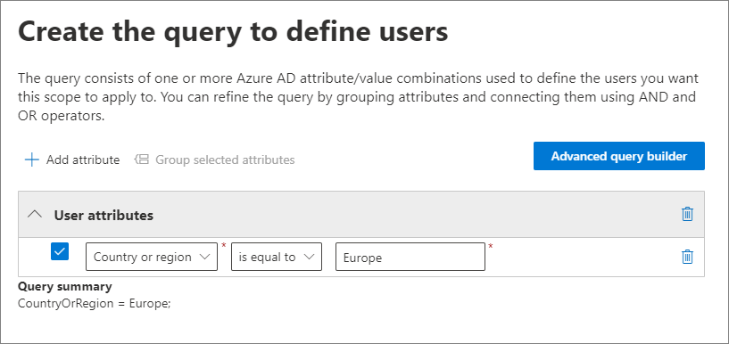
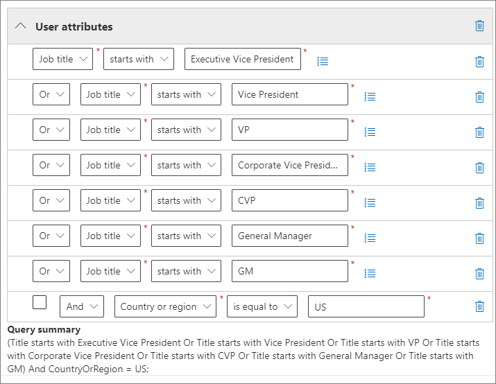
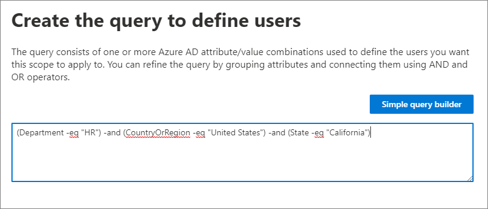

# Adaptive scopes

>*[Microsoft 365 licensing guidance for security & compliance](/office365/servicedescriptions/microsoft-365-service-descriptions/microsoft-365-tenantlevel-services-licensing-guidance/microsoft-365-security-compliance-licensing-guidance).*

When you create a [communication compliance policy](/microsoft-365/compliance/communication-compliance-policies) or a [policy for retention](retention.md#retention-policies-and-retention-labels), you can create or add an adaptive scope for your policy. A single policy can have one or many adaptive scopes.

- An adaptive scope uses a query that you specify, so you can define the membership of users or groups included in that query. These dynamic queries run daily against the attributes or properties that you specify for the selected scope. You can use one or more adaptive scopes with a single policy.
- For example, you can assign different policy settings to users according to their department by using existing Azure AD attributes without the administrative overhead of creating and maintaining groups for this purpose.

## Advantages of using adaptive scopes

The advantages of using adaptive scopes include:

- No limits on the number of items per policy. Although adaptive policies are still subject to the maximum number of policies per tenant limitations, the more flexible configuration will likely result in far fewer policies.
- More powerful targeting for your retention policies. For example, you can assign different settings to users according to their geographical location without the administrative overhead of creating and maintaining groups.
- Query-based scopes provide resilience against business changes that might not be reliably reflected in group membership or external processes that rely on cross-department communication.
- A single policy can include locations for both Microsoft Teams and Viva Engage, whereas when you don’t use an adaptive scope, each location requires its own policy.
- Support for [Azure AD administrative units](/azure/active-directory/roles/administrative-units).

For specific advantages of using adaptive scopes specific to policies for retention, see [Learn about retention policies and retention labels](retention.md#adaptive-or-static-policy-scopes-for-retention).

For configuration information, see [Configuring adaptive scopes](#configure-adaptive-scopes).

### Maximums for adaptive policy scopes

There's no limit to the number of adaptive policy scopes that you can add to a policy, but there are some maximum limits for the query that defines each adaptive scope:

- String length for attribute or property values: 200
- Number of attributes or properties without a group, or within a group: 10
- Number of groups: 10
- Number of characters in an advanced query: 10,000
- Grouping attributes or properties within a group isn't supported. This means that the maximum number of properties or attributes supported within a single adaptive scope is 100.

## Configure adaptive scopes

When you choose to use adaptive scopes, you're prompted to select what type of adaptive scope you want. There are three different types of adaptive scopes and each one supports different attributes or properties:

| Adaptive scope type | Attributes or properties supported include |
|:--------------------|:-------------------------------------------|
|**Users** - applies to:  <br/> - Exchange mailboxes <br/> - OneDrive accounts <br/> - Teams chats <br/> - Teams private channel messages <br/> - Viva Engage user messages| First Name <br/> Last name <br/>Display name <br/> Job title <br/> Department <br/> Office <br/>Street address <br/> City <br/>State or province <br/>Postal code <br/> Country or region <br/> Email addresses <br/> Alias <br/> Exchange custom attributes: CustomAttribute1 - CustomAttribute15|
|**SharePoint sites** - applies to:  <br/> - SharePoint sites <sup>\*</sup> <br/> - OneDrive accounts |Site URL <br/>Site name <br/> SharePoint custom properties: RefinableString00 - RefinableString99 |
|**Microsoft 365 Groups** - applies to:  <br/> - Microsoft 365 Group mailboxes & sites <br/> - Teams channel messages (standard and shared) <br/> - Viva Engage community messages <br> |Name <br/> Display name <br/> Description <br/> Email addresses <br/> Alias <br/> Exchange custom attributes: CustomAttribute1 - CustomAttribute15 |

<sup>\*</sup> Currently, [shared channel SharePoint sites](/microsoftteams/shared-channels#shared-channel-sharepoint-sites) aren't supported for adaptive scopes.

> [!NOTE]
> For communication compliance policies:
> - SharePoint sites and OneDrive accounts aren't supported.
> - Excluded users and Microsoft 365 groups are supported.

The property names for sites are based on SharePoint site managed properties. For information about the custom attributes, see [Using Custom SharePoint Site Properties to Apply Microsoft 365 Retention with Adaptive Policy Scopes](https://techcommunity.microsoft.com/t5/security-compliance-and-identity/using-custom-sharepoint-site-properties-to-apply-microsoft-365/ba-p/3133970).

The attribute names for users and groups are based on [filterable recipient properties](/powershell/exchange/recipientfilter-properties#filterable-recipient-properties) that map to Azure AD attributes. For example:

- **Alias** maps to the LDAP name **mailNickname** that displays as **Email** in the Azure AD admin center.
- **Email addresses** maps to the LDAP name **proxyAddresses** that displays as **Proxy address** in the Azure AD admin center.

The attributes and properties listed in the table can be easily specified when you configure an adaptive scope by using the simple query builder. Additional attributes and properties are supported with the advanced query builder, as described in the following section.

### How to configure an adaptive scope

Before you configure your adaptive scope, use the previous section to identify what type of scope to create and what attributes and values you'll use. You might need to work with other administrators to confirm this information. 

You'll need to assign the correct role groups to admins to create an adaptive scope. Any role group with the *Scope Manager* role is allowed to create an adaptive scopes. The *Scope Manger* role is included in the following [built-in role groups](/microsoft-365/security/office-365-security/scc-permissions):

- Compliance Administrator
- Compliance Data Administrator
- eDiscovery Manager
- Organization Management
- Records Management
- Communication Compliance
- Communication Compliance Admins

Specifically for SharePoint sites, there might be additional SharePoint configuration needed if you plan to use [custom site properties](https://techcommunity.microsoft.com/t5/security-compliance-and-identity/using-custom-sharepoint-site-properties-to-apply-microsoft-365/ba-p/3133970).

1. Sign into [Microsoft Purview compliance portal](https://compliance.microsoft.com/) using credentials for an admin account in your Microsoft 365 organization.
2. In the compliance portal, select **Roles and Scopes**.
3. Select **Adaptive scopes**, and then **+ Create scope**.
4. Follow the prompts in the configuration where you'll first be asked to assign an administrative unit. If your account has been [assigned administrative units](microsoft-365-compliance-center-permissions.md#administrative-units), you must select one administrative unit that will restrict the scope membership.
    
    > [!NOTE]
    > Because administrative units don't yet support SharePoint sites, you won't be able to create an adaptive scope for SharePoint sites if you select administrative units.
    
    If you don't want to restrict the adaptive scope by using administrative units, or your organization hasn't configured administrative units, keep the default of **Full directory**.

5. Select the type of scope, and then select the attributes or properties you want to use to build the dynamic membership, and type in the attribute or property values.

    For example, to configure an adaptive scope that will be used to identify users in Europe, first select **Users** as the scope type, and then select the **Country or region** attribute, and type in **Europe**:

    

    Once daily, this query will run against Azure AD and identify all users who have the value **Europe** specified for in their account for the **Country or region** attribute.

    > [!IMPORTANT]
    > Because the query doesn't run immediately, there's no validation that you typed in the value correctly.

    Select **Add attribute** (for users and groups) or **Add property** (for sites) to use any combination of attributes or properties that are supported for their scope type, together with logical operators to build queries. The operators supported are **is equal to**, **is not equal to**, **starts with** and **not starts with**, and you can group selected attributes or properties. For example:

    

    Alternatively, you can select **Advanced query builder** to specify your own queries:

    - For **User** and **Microsoft 365 Group** scopes, use [OPATH filtering syntax](/powershell/exchange/recipient-filters). For example, to create a user scope that defines its membership by department, country, and state:

        

        One of the advantages of using the advanced query builder for these scopes is a wider choice of query operators:
        - **and**
        - **or**
        - **not**
        - **eq** (equals)
        - **ne** (not equals)
        - **lt** (less than)
        - **gt** (greater than)
        - **like** (string comparison)
        - **notlike** (string comparison)

    - For **SharePoint sites** scopes, use Keyword Query Language (KQL). You might already be familiar with using KQL to search SharePoint by using indexed site properties. To help you specify these KQL queries, see [Keyword Query Language (KQL) syntax reference](/sharepoint/dev/general-development/keyword-query-language-kql-syntax-reference).

        For example, because SharePoint site scopes automatically include all SharePoint site types, which include Microsoft 365 group-connected and OneDrive sites, you can use the indexed site property **SiteTemplate** to include or exclude specific site types. The templates you can specify:
        - `SITEPAGEPUBLISHING` for modern communication sites
        - `GROUP` for Microsoft 365 group-connected sites
        - `TEAMCHANNEL` for Microsoft Teams private channel sites
        - `STS` for a classic SharePoint team site
        - `SPSPERS` for OneDrive sites

        So to create an adaptive scope that includes only modern communication sites and excludes Microsoft 365 goup-connected and OneDrive sites, specify the following KQL query:

        ````console
        SiteTemplate=SITEPAGEPUBLISHING
        ````

    You can [validate these advanced queries](#validate-advanced-queries) independently from the scope configuration.

    > [!TIP]
    > You must use the advanced query builder if you want to exclude inactive mailboxes. Or conversely, target just inactive mailboxes. For this configuration, use the OPATH property *IsInactiveMailbox*:
    >
    > - To exclude inactive mailboxes, make sure the query includes: `(IsInactiveMailbox -eq "False")`
    > - To target just inactive mailboxes, specify: `(IsInactiveMailbox -eq "True")`

6. Create as many adaptive scopes as you need. You can select one or more adaptive scopes when you create your policy.

> [!NOTE]
> It can take up to five days for the queries to fully populate and changes will not be immediate. Factor in this delay by waiting a few days before you add a newly created scope to a policy.

<a name="confirm-scope-membership"></a>To confirm the current membership and membership changes for an adaptive scope:

1. Double-click (or select and press Enter) the scope on the **Adaptive scopes** page

2. From the flyout **Details** pane, select **Scope details**. 

    Review the information that identifies all the users, sites, or groups currently in the scope, if they were automatically added or removed, and the date and time of that membership change.

> [!TIP]
> Use the policy lookup option to help you identify the policies that are currently assigned to specific users, sites, and Microsoft 365 groups.

### Validate advanced queries

You can manually validate advanced queries by using PowerShell and SharePoint search:

- Use PowerShell for the scope types **Users** and **Microsoft 365 Groups**
- Use SharePoint search for the scope type **SharePoint sites**

To run a query using PowerShell:

1. [Connect to Exchange Online PowerShell](/powershell/exchange/connect-to-exchange-online-powershell) using an account with [appropriate Exchange Online Administrator permissions](/powershell/exchange/find-exchange-cmdlet-permissions#use-powershell-to-find-the-permissions-required-to-run-a-cmdlet).

2. Use either [Get-Recipient](/powershell/module/exchange/get-recipient), [Get-Mailbox](/powershell/module/exchange/get-mailbox), or [Get-User](/powershell/module/exchange/get-user) with the *-Filter* parameter and your [OPATH query](/powershell/exchange/filter-properties) for the adaptive scope enclosed in curly brackets (`{`,`}`). If your attribute values are strings, enclose these values in double or single quotes.

    You can determine whether to use Get-Mailbox, Get-Recipient, or Get-User for validation by identifying which cmdlet is supported by the [OPATH property](/powershell/exchange/filter-properties) that you choose for your query.

    > [!IMPORTANT]
    > Get-Mailbox does not support the *MailUser* recipient type, so Get-Recipient or Get-User must be used to validate queries that include on-premises mailboxes in a hybrid environment.

    To validate a **User** scope, use the appropriate command:
    - `Get-Mailbox` with *-RecipientTypeDetails UserMailbox,SharedMailbox,RoomMailbox,EquipmentMailbox*
    - `Get-Recipient` with *-RecipientTypeDetails UserMailbox,MailUser,SharedMailbox,RoomMailbox,EquipmentMailbox*

    To validate a **Microsoft 365 Group** scope, use:
    - `Get-Mailbox` with *-GroupMailbox* or `Get-Recipient` with *-RecipientTypeDetails GroupMailbox*

    For example, to validate a **User** scope, you could use:

    ````PowerShell
    Get-Recipient -RecipientTypeDetails UserMailbox,MailUser -Filter {Department -eq "Marketing"} -ResultSize Unlimited
    ````

    To validate a **Microsoft 365 Group** scope, you could use:

    ```PowerShell
    Get-Mailbox -RecipientTypeDetails GroupMailbox -Filter {CustomAttribute15 -eq "Marketing"} -ResultSize Unlimited
    ```

    > [!TIP]
    > When you use these commands to validate a user scope, if the number of recipients returned is higher than expected, it might be because it includes users who don't have a valid license for adaptive scopes. These users won't have the policy settings applied to them.
    >
    > For example, in a hybrid environment, you might have unlicensed synchronized user accounts without an Exchange mailbox on-premises or in Exchange Online. You can identify these users by running the following command: `Get-User -RecipientTypeDetails User`

3. Verify that the output matches the expected users or groups for your adaptive scope. If it doesn't, check your query and the values with the relevant administrator for Azure AD or Exchange.

To run a query using SharePoint search:

1. Using a global admin account or an account that has the SharePoint admin role, go to `https://<your_tenant>.sharepoint.com/search`.
2. Use the search bar to specify your KQL query.
3. Verify that the search results match the expected site URLs for your adaptive scope. If they don't, check your query and the URLs with the relevant administrator for SharePoint.
