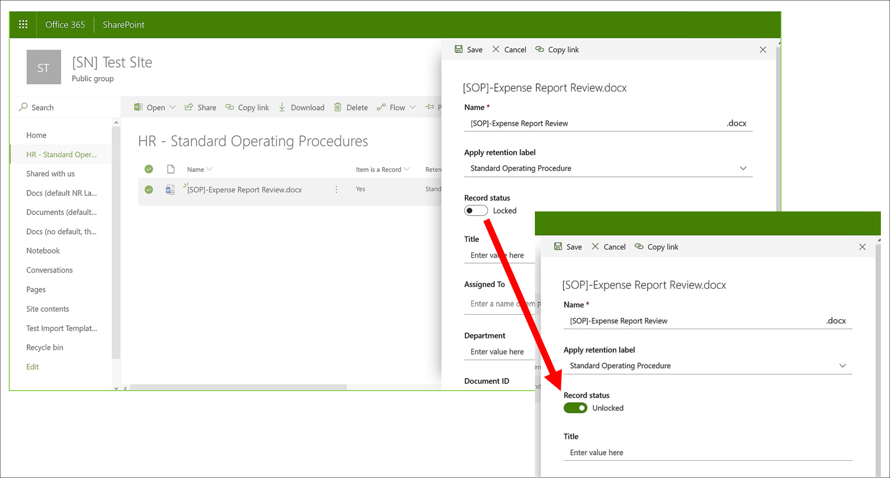
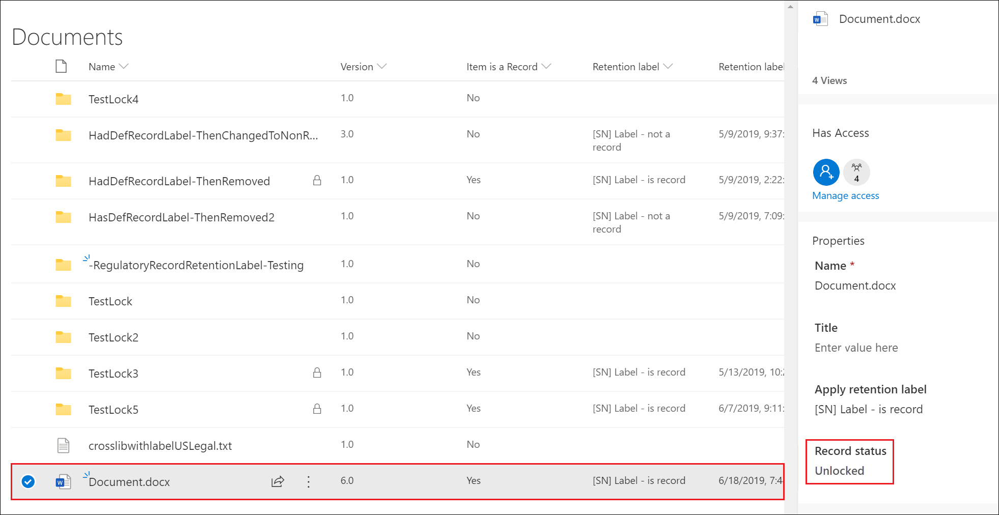
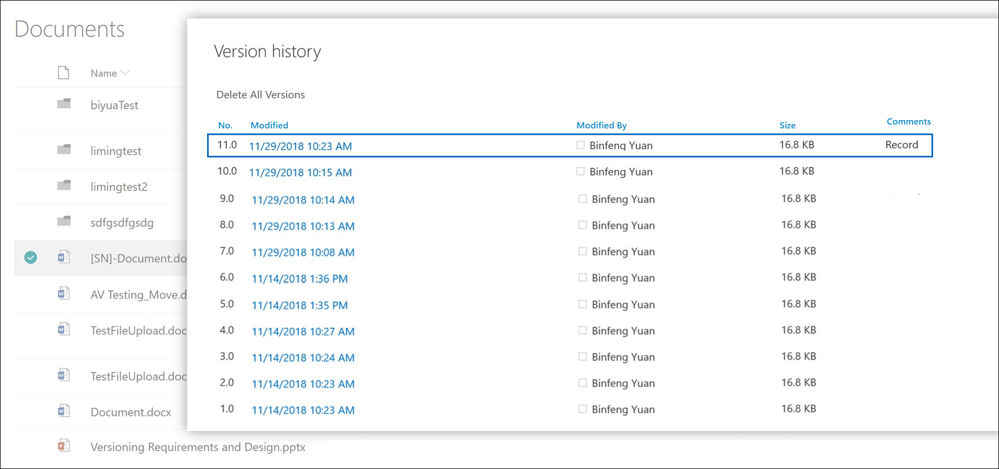
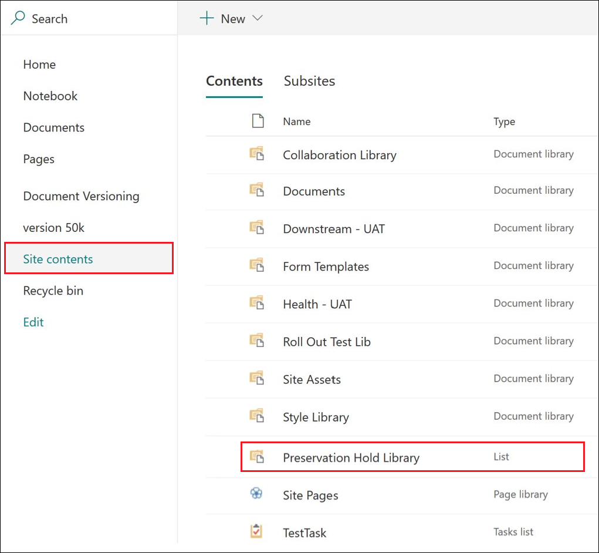

# Use record versioning to update records stored in SharePoint or OneDrive

>*[Microsoft 365 licensing guidance for security & compliance](/office365/servicedescriptions/microsoft-365-service-descriptions/microsoft-365-tenantlevel-services-licensing-guidance/microsoft-365-security-compliance-licensing-guidance).*

>[!NOTE] 
> Because regulatory records block editing, record versioning is not available for regulatory records.

The ability to mark a document as a [record](records-management.md#records) and restrict actions that can be performed on the record is an essential goal for any records management solution. However, collaboration might also be needed for people to create subsequent versions.

For example, you might mark a sales contract as a record, but then need to update the contract with new terms and mark the latest version as a new record while still retaining the previous record version. For these types of scenarios, SharePoint and OneDrive support *record versioning*. OneNote notebook folders don't support record versioning.

To use record versioning, you first [label the document and mark it as a record](declare-records.md). At this point, a document property, called *Record status* is displayed next to the retention label, and the initial record status is **Locked**. 

You can now do the following things:

  - **Continually edit and retain individual versions of the document as records, by unlocking and locking the Record status property.** Only when the **Record status** property is set to **Locked** is a new version of the record retained. This toggle of locked and unlocked reduces the risk of retaining unnecessary versions and copies of the document.

  - **Have the records automatically stored in an in-place records repository located within the site collection.** Each site collection in SharePoint and OneDrive preserves content in its Preservation Hold library. Record versions are stored in the Records folder in this library.

  - **Maintain an evergreen document that contains all versions.** By default, each SharePoint and OneDrive document has a version history available on the item menu. In this version history, you can easily see which versions are records and view those documents.

> [!TIP]
> When you use record versioning with a retention label that has a delete action, consider configuring the retention setting **Start the retention period based on:** to be **When items were labeled**. With this label setting, the start of the retention period is reset for each new record version, which ensures that older versions will be deleted before newer versions.

Record versioning is automatically available for any document that has a retention label that marks the item as a record. When a user views the document properties by using the details pane, they can toggle the **Record status** from **Locked** to **Unlocked**. This action creates a record in the Records folder in the Preservation Hold library, where it resides for the remainder of its retention period. 

While the document is unlocked, any user with standard edit permissions can edit the file. However, users can't delete the file, because it's still a record. When editing is complete, a  user can then toggle the **Record status** from **Unlocked** to **Locked**, which prevents further edits while in this status.
  

## Locking and unlocking a record

After a retention label that marks content as a record is applied to a document, any user with Contribute permissions or a narrower permission level can unlock a record or lock an unlocked record.
  

When a user unlocks a record, the following actions occur:

1. If the current site collection doesn't have a Preservation Hold library, one is created.

2. If the Preservation Hold library doesn't have a Records folder, one is created.

3. A **Copy to** action copies the latest version of the document to the Records folder. The **Copy to** action includes only the latest version and no prior versions. This copied document is now considered a record version of the document, and its file name has the format: \[Title GUID Version\#\]

4. The copy created in the Records folder is added to the version history of the original document, and this version shows the word **Record** in the comments field.

5. The original document is a new version that can be edited, but not deleted. The document library column **Item is a Record** still shows the **Yes** value because the document is still a record, even if it can now be edited.

When a user locks a record, the original document again can't be edited. But it is the action of unlocking a record that copies a version to the Records folder in the Preservation Hold library.

## Record versions

Each time a user unlocks a record, the latest version is copied to the Preservation Hold library, and that version contains the value of **Record** in the **Comments** field of the version history.
  

To view the version history, select a document in the document library and then click **Version history** in the item menu.

## Where records are stored

Records are stored in the Records folder in the Preservation Hold library in the top-level site in the site collection. In the left navigation on the top-level site, choose **Site contents** \> **Preservation Hold Library**.
  

  

For more information about how the Preservation Hold library works, see [How retention works for SharePoint and OneDrive](retention-policies-sharepoint.md#how-retention-works-for-sharepoint-and-onedrive).

## Searching the audit log for record versioning events

The actions of locking and unlocking records are logged in the audit log. From **File and page activities**, select **Changed record status to locked** and **Changed record status to unlocked**.

For more information about searching for these events, see [Search the audit log in the Security & Compliance Center](search-the-audit-log-in-security-and-compliance.md#file-and-page-activities).

## Next steps

For other scenarios supported by records management, see [Common scenarios for records management](get-started-with-records-management.md#common-scenarios-for-records-management).