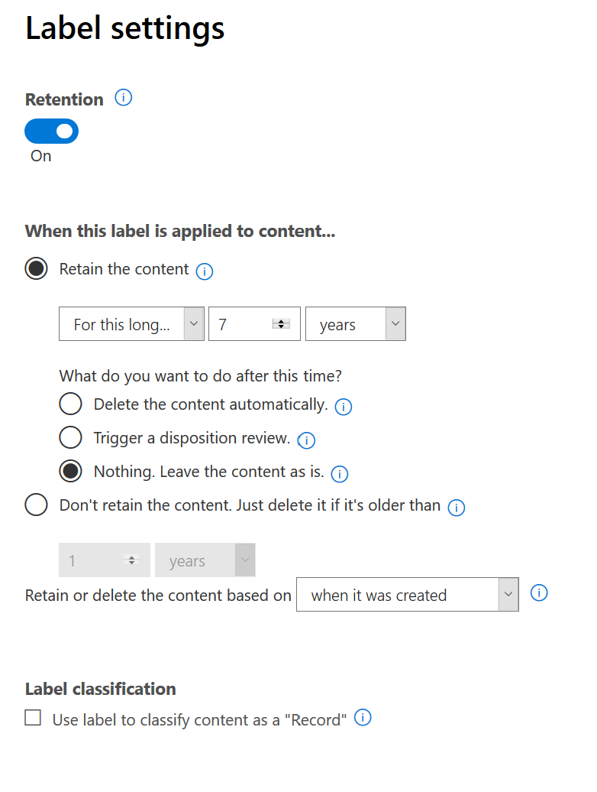

# Overview of records

<Roberto, please review the overview and revise as necessary>

At a high level, records management means that:
  
- Important content is classified as a record by users.
    
- A record can't be modified or deleted.
    
- Records are finally disposed of after their stated lifetime is past.
    
You use retention labels to classify content as a record. After you create retention labels that to declare records, you can either publish those labels or auto-apply those labels to content that you want to classify as a record. By using retention labels to declare records, you can implement a single, consistent records-management strategy across Office 365, whereas other records-management features such as the Record Center apply only to SharePoint content. And you can enforce retention actions on records, so that they're disposed of automatically at the end of their lifecycle.

Keep the following things in mind about records:

  - **Records in Exchange are immutable.** A retention label that declares content as a record can be applied to content in Exchange, in addition to SharePoint and OneDrive. However, [record versioning](#record-versioning) is available only in SharePoint and OneDrive, not Exchange.

    In Exchange, content labeled as a record is immutable. When an Exchange item is labeled as a record, four things happen:

    - The item can't be permanently deleted.

    - The item can't be edited.

    - The label can't be changed.

    - The label can't be removed.

  - **Records and folders.** You can apply a retention label to a folder in Exchange, SharePoint, or OneDrive. If a folder is labeled as a record, and you move an item into the folder, the item is labeled as a record. When you move the item out of the folder, the item remains labeled as a record.

  - **Records can't be deleted**. If you attempt to delete a record in Exchange, the item is moved to the Recoverable Items folder as described in [How a retention policy works with content in place](https://docs.microsoft.com/en-us/office365/securitycompliance/retention-policies#how-a-retention-policy-works-with-content-in-place).

    If you attempt to delete a record in a SharePoint, you see an error that the item wasn't deleted, and the item remains in the library.

    

    If you attempt to delete a record in OneDrive, the item is moved to the Preservation Hold library as described in [How a retention policy works with content in place](https://docs.microsoft.com/en-us/office365/securitycompliance/retention-policies#how-a-retention-policy-works-with-content-in-place).

## Using retention labels to declare records

When you create a retention label, you have the option to use the retention label to classify the content as a record. To declare content as a record, you need to do the following:

1. Create a retention label. In the Microsoft 365 compliance center, go to **Records Management** \> **File Plan**. On the **File plan** page, click **File plan actions** \> **Create a label**.

2. On the **Label settings** page in the wizard, choose the option to set the retention label to declare content as a record. 

   

3. [Publish](labels.md#how-retention-labels-work-with-retention-label-policies) or [auto-apply](labels.md#applying-a-retention-label-automatically-based-on-conditions) the retention label to SharePoint sites and/or OneDrive accounts. 

### Applying a retention label to content

For SharePoint and OneDrive content, any user in the default Members group (the Contribute permission level) can apply a record retention label to content. Only the site collection administrator can remove or change that retention label after it's been applied. As previously explained, a retention label that classifies content as a record can be auto-applied to content. In either case, whether applied manually or automatically, the **Record status** property of the document is always initially set to **Locked** by default.

Here’s what this looks like when a record label is applied to a document on a SharePoint site or OneDrive account.
  

:::image type="content" source="media/recordversioning7.png" alt-text="Details pane for document tagged as a record":::

## Record versioning

An essential part of records management is the ability to declare a document as a record, and have that record be immutable. At the same time, record immutability prevents collaboration on the document if people need to create subsequent versions. For example, you might declare a sales contract as a record, but then need to update the contract with new terms and declare the latest version as a new record while still retaining the previous record version. SharePoint Online and OneDrive for Business now support *record versioning*.

To use record versioning, the first step is to use the Microsoft 365 compliance center to create and publish retention labels that declare records to all of SharePoint and/or OneDrive for Business or to specific SharePoint sites or specific OneDrive for Business users. The next step is to apply a published retention record label to a document. When this is done, a document property, called *Record status* is displayed next to the retention label, and the initial record status will be **Locked**. At this point, you can do the following things:

  - **Continually edit and declare individual versions of the document as records, by unlocking and locking the Record status property.** Only the versions declared as records are retained when the **Record status** property is set to **Locked**. This reduces the risk of retaining unnecessary versions and copies of the document.

  - **Have the records stored automatically in an in-place records repository located within the site collection.** Each site collection in SharePoint and OneDrive for Business preserves content in its Preservation Hold library. Record versions are stored in the Records folder within this library.

  - **Maintain an evergreen document** **containing all versions.** By default, each SharePoint and OneDrive document has a version history available on the item menu. In this version history, you can easily see which versions are records and view those documents.

> [!NOTE]
> Record versioning requires an Office 365 Enterprise E5 license for each user who has permissions to edit content that's been declared as a record in a SharePoint site or OneDrive account. Users who simply have read-only access don’t require a license.

Record versioning is automatically available for any document that has a retention label that declares the item as a record. When a user views the document properties through the details pane, they toggle the **Record status** from **Locked** to **Unlocked**. This single click creates a record in the Records folder in the Preservation Hold library, where it resides for the remainder of its retention period. While the document is unlocked, any user with permissions can edit the file. However, users can’t delete the file, because it is considered a declared record. After all the necessary changes are made, the user can then toggle the **Record status** from **Unlocked** to **Locked**, so that the document is again declared a record and can’t be edited.
  

:::image type="content" source="media/recordversioning8.png" alt-text="Record status property on document tagged as a record":::

## Locking and unlocking a record

After a record label is assigned to a document, any user in the default Members group (the Contribute permission level) can unlock (or lock an unlocked record). An unlocked record can be edited but not deleted.
  

:::image type="content" source="media/recordversioning9.png" alt-text="Record status shows record document is unlocked":::

When a user unlocks a record, the following actions occur:

1. If the current site collection does not yet contain a Preservation Hold library, one is created.

2. If the Preservation Hold library does not yet contain a Records folder, one is created.

3. A **Copy to** action copies the latest version of the document to the Records folder. The **Copy to** action includes only the latest version and no prior versions. This copied document is now considered a record version of the document, and its file name has the format: \[Title GUID Version\#\]

4. The copy created in the Records folder is updated into the version history of the original document, and this version shows the word “Record” in the comments field.

5. The original document is a new version that can be edited (but not deleted). The document library column **Item is a Record** still shows **Yes** because the document is still considered a record, even if it can now be edited.

When a user locks a record, the original document again can’t be edited. But it is the action of unlocking a record that copies a version to the Records folder in the Preservation Hold library.

## About record versions

Each time you unlock a record, the latest version is copied to the Records folder in the Preservation Hold library, and that version contains the value of **Record** in the **Comments** field of the version history.
  

:::image type="content" source="media/recordversioning10.png" alt-text="Record shown in the Preservation Hold library":::

To view the version history, select a document in the document library \> item menu \> **Version history.**

## Where records are stored

Records are stored in a Records folder in the Preservation Hold library in the top-level site in the site collection. In the left nav on the top-level site, choose **Site contents** \> **Preservation Hold Library**.
  

:::image type="content" source="media/recordversioning11.png" alt-text="Preservation Hold library":::

  

:::image type="content" source="media/recordversioning12.png" alt-text="The Records folder in the Preservation Hold library":::

The Preservation Hold library is visible only to site collection administrators. Also, the Preservation Hold library doesn't exist by default. It’s created only when content subject to a retention label or retention policy is deleted for the first time in the site collection.

## Searching the audit log for record versioning events

The actions of locking and unlocking records are logged in the Office 365 audit log. You can search for the specific activities **Changed record status to locked** and **Changed record status to unlocked**, which are located in the **File and page activities** section in the **Activities** dropdown list on the Audit log search page in the security and compliance center.
  

:::image type="content" source="media/recordversioning13.png" alt-text="Search the audit log for record versioning events":::

For more information about searching for these events, see the "File and page activities" section in [Search the audit log in the Security & Compliance Center](search-the-audit-log-in-security-and-compliance.md#file-and-page-activities).
