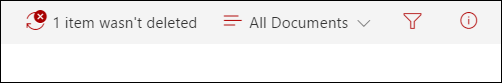
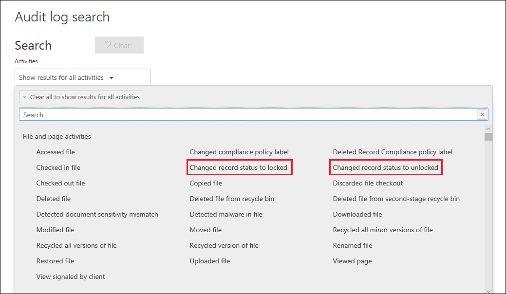

# Overview of records

>*[Microsoft 365 licensing guidance for security & compliance](https://aka.ms/ComplianceSD).*

Managing records in Microsoft 365 helps an organization comply with their corporate policies, legal and regulatory obligations while reducing risk and legal liability.

At a high level, declaring content as a record means that:

- The item becomes immutable (a record can't be modified or deleted)

- Additional activities about the item are logged

- Records are disposed of after their stated retention period is past

You can use [retention labels](labels.md) to classify content as a record. After you create retention labels that declare records, you can either [publish](labels.md#how-retention-labels-work-with-retention-label-policies) those labels (so that users can use them to classify content as records) or [auto-apply those labels](labels.md#applying-a-retention-label-automatically-based-on-conditions) to content that you want to classify as a record. By using retention labels to declare records, you can implement a single, consistent records-management strategy across all of Office 365, whereas other records-management features such as the Record Center apply only to content in SharePoint Online.

Keep the following things in mind about records:

  - **Records are immutable.** A retention label that declares content as a record can be applied to content in Exchange, in addition to SharePoint and OneDrive for Business. However, [record versioning](#record-versioning) is available only in SharePoint and OneDrive, and not for Exchange.

    In Exchange, content labeled as a record is immutable until its final deletion. When an Exchange item is labeled as a record, four things happen:

    - The item can't be permanently deleted.

    - The item can't be edited.

    - The label can't be changed.

    - The label can't be removed.

  - **Records and folders.** You can apply a retention label to a folder in Exchange, SharePoint, and OneDrive. If a folder is labeled as a record, and you move an item into the folder, the item is labeled as a record. When you move the item out of the folder, the item remains labeled as a record.

    Also, if you change the record label that's applied to a folder (in SharePoint and OneDrive) to a retention label that does not declare content as a record, then items in the folder keep their existing  record label.

    For more information about applying retention labels to SharePoint and OneDrive folders, see [Applying a default retention label to all content in a SharePoint library, folder, or document set](labels.md#applying-a-default-retention-label-to-all-content-in-a-sharepoint-library-folder-or-document-set).

  - **Records can't be deleted**. If a user attempts to delete a record in Exchange, the item is moved to the Recoverable Items folder as described in [How a retention policy works with content in place](retention-policies.md#content-in-mailboxes-and-public-folders).

    If a user attempts to delete a record in a SharePoint, an error is displayed say that the item wasn't deleted, and remains in the library.

    

    If a user attempts to delete a record in OneDrive, the item is moved to the Preservation Hold library as described in [How a retention policy works with content in place](retention-policies.md#content-in-onedrive-accounts-and-sharepoint-sites).

  - **Records labels can't be removed.** Once a record label has been applied to an item, only the admin of that location (for example, a site collection admin of a SharePoint site) can remove that record label.

## Using retention labels to declare records

When you create a retention label, you have the option to use the retention label to classify the content as a record. To declare content as a record, follow these steps:

1. Create a retention label. In the Microsoft 365 compliance center, go to **Records Management** \> **File Plan**. On the **File plan** page, click  **Create a label**.

2. On the **Label settings** page in the wizard, choose the option to set the retention label to declare content as a record. 

   

3. [Publish](labels.md#how-retention-labels-work-with-retention-label-policies) or [auto-apply](labels.md#applying-a-retention-label-automatically-based-on-conditions) the retention label to SharePoint sites and/or OneDrive accounts.

> [!NOTE]
> Declaring an item as a record using [retention labels](labels.md) requires an Office 365 Enterprise E5 license or equivalent for each user who has permissions to edit content in this location. Users who have read-only access don't require a license.

### Applying a retention label to content

For Exchange, any user with write-access to the mailbox can apply a record label to an email message. For content in SharePoint and OneDrive, any user in the default Members group (the Contribute permission level) can apply a record label to content. Only a site collection admin can remove or change that record label after it's been applied. As previously explained, a retention label that classifies content as a record can be auto-applied to content.

Here's what this looks like when a record label is applied to a document on a SharePoint site or OneDrive account.
  

## Record versioning

An essential part of records management is the ability to declare a document as a record and have that record be immutable. At the same time, record immutability prevents collaboration on the document if people need to create subsequent versions. For example, you might declare a sales contract as a record, but then need to update the contract with new terms and declare the latest version as a new record while still retaining the previous record version. For these types of scenarios, SharePoint Online and OneDrive for Business now support *record versioning*. OneNote notebook folders are not supported.

To use record versioning, the first step is to use the Microsoft 365 compliance center to create and publish retention labels that declare records to all SharePoint sites and/or OneDrive accounts, or publish them to specific SharePoint sites and/or OneDrive accounts. The next step is to apply a published retention record label to a document. When this is done, a document property, called *Record status* is displayed next to the retention label, and the initial record status will be **Locked**. At this point, you can do the following things:

  - **Continually edit and declare individual versions of the document as records, by unlocking and locking the Record status property.** Only the versions declared as records are retained when the **Record status** property is set to **Locked**. This reduces the risk of retaining unnecessary versions and copies of the document.

  - **Have the records automatically stored in an in-place records repository located within the site collection.** Each site collection in SharePoint and OneDrive preserves content in its Preservation Hold library. Record versions are stored in the Records folder in this library.

  - **Maintain an evergreen document that contains all versions.** By default, each SharePoint and OneDrive document has a version history available on the item menu. In this version history, you can easily see which versions are records and view those documents.

Record versioning is automatically available for any document that has a retention label that declares the item as a record. When a user views the document properties through the details pane, they toggle the **Record status** from **Locked** to **Unlocked**. This single click creates a record in the Records folder in the Preservation Hold library, where it resides for the remainder of its retention period. While the document is unlocked, any user with permissions can edit the file. However, users can't delete the file, because it's considered a declared record. After the necessary changes are made, the user can then toggle the **Record status** from **Unlocked** to **Locked**, so that the document is again declared a record and can't be edited.
  

> [!NOTE]
> Record versioning requires an Office 365 Enterprise E5 license for each user who has permissions to edit content that's been declared a record in a SharePoint site or OneDrive account. Users who have read-only access don't require this license.

### Locking and unlocking a record

After a record label is assigned to a document, any user with Contribute permissions or a narrower permission level can unlock a record or lock an unlocked record.
  

When a user unlocks a record, the following actions occur:

1. If the current site collection doesn't have a Preservation Hold library, one is created.

2. If the Preservation Hold library doesn't have a Records folder, one is created.

3. A **Copy to** action copies the latest version of the document to the Records folder. The **Copy to** action includes only the latest version and no prior versions. This copied document is now considered a record version of the document, and its file name has the format: \[Title GUID Version\#\]

4. The copy created in the Records folder added to the version history of the original document, and this version shows the word **Record** in the comments field.

5. The original document is a new version that can be edited (but not deleted). The document library column **Item is a Record** still shows the **Yes** value because the document is still considered a record, even if it can now be edited.

When a user locks a record, the original document again can't be edited. But it is the action of unlocking a record that copies a version to the Records folder in the Preservation Hold library.

### Record versions

Each time a user unlocks a record, the latest version is copied to the Records folder in the Preservation Hold library, and that version contains the value of **Record** in the **Comments** field of the version history.
  

To view the version history, select a document in the document library and then click **Version history** in the item menu.

### Where records are stored

Records are stored in the Records folder in the Preservation Hold library in the top-level site in the site collection. In the left nav on the top-level site, choose **Site contents** \> **Preservation Hold Library**.
  

  

The Preservation Hold library is visible only to site collection admins. Also, the Preservation Hold library doesn't exist by default. It's created only when content subject to a retention label or retention policy is deleted for the first time in the site collection.

### Searching the audit log for record versioning events

The actions of locking and unlocking records are logged in the Office 365 audit log. You can search for the specific activities **Changed record status to locked** and **Changed record status to unlocked**, which are located in the **File and page activities** section in the **Activities** dropdown list on the **Audit log search** page in the security and compliance center.
  

For more information about searching for these events, see the "File and page activities" section in [Search the audit log in the Security & Compliance Center](search-the-audit-log-in-security-and-compliance.md#file-and-page-activities).
