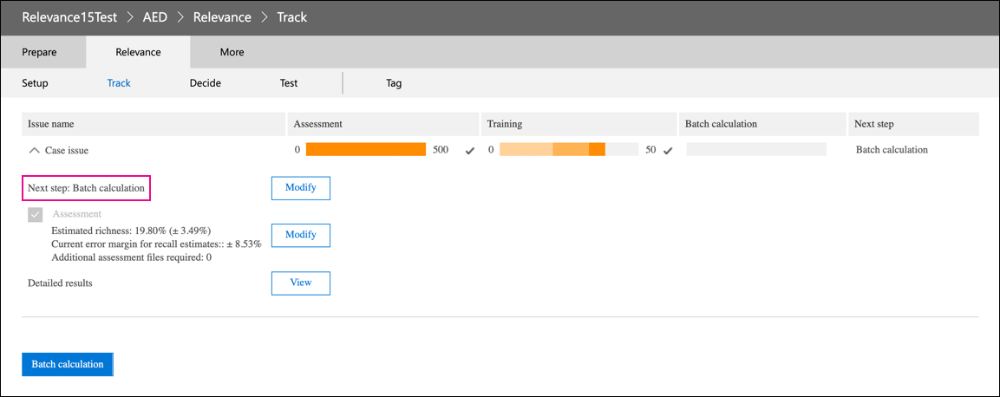

# Retirement of the Relevance module in Advanced eDiscovery

On March 10, 2021, we are retiring the Relevance module in Advanced eDiscovery. This retirement means that organizations will no longer have access to the Relevance module (by going to **Manage review set** > **Relevance** in an Advanced eDiscovery case) or be able to access any existing Relevance models. The current Relevance module that is being retired will be replaced with a new predictive coding solution in Q2 CY 2021. This new functionality will let organizations build their own predictive coding models in an easier and more intuitive workflow.

To prepare for this upcoming retirement, we recommend that organizations who use the Relevance module export their model’s output before the retirement date by running a Batch calculation for all existing models. All Relevance scores from your model will be permanently stored in the corresponding review set and accessible when documents are exported. Relevance scores are also retained as metadata in the load file. Also, you will still be able to filter content in the review set based on relevance score and have access to all metadata produced by your Relevance models.

## Complete unfinished models

For any unfinished Relevance models, please complete assessment, training, and Batch calculation so that you can apply the model to the documents in a review set. Completing the Batch calculation will preserve the information after the retirement date of the Relevance module.

Here are the steps to complete any unfinished models:

1. Train your model until it is stabilized and ready for Batch calculation. See [Tagging and Relevance training](tagging-and-relevance-training-in-advanced-ediscovery.md).

   The following screenshot shows a module that is ready for a Batch calculation. Notice that the Assessment and Training is complete, and the next step is to run Batch calculation.

   

2. Run the Batch calculation. See [Performing Batch calculation](track-relevance-analysis-in-advanced-ediscovery.md#performing-batch-calculation).

3. Verify that Batch calculation was successful. See [Batch calculation results](track-relevance-analysis-in-advanced-ediscovery.md#batch-calculation-results).

For help with completing unfinished Relevance models, contact Microsoft Support.
