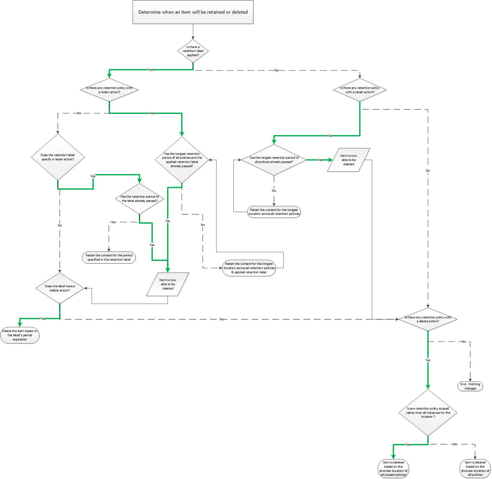

# Flowchart to determine when an item will be retained or permanently deleted

>*[Microsoft 365 licensing guidance for security & compliance](/office365/servicedescriptions/microsoft-365-service-descriptions/microsoft-365-tenantlevel-services-licensing-guidance/microsoft-365-security-compliance-licensing-guidance).*

Use the following flowchart to apply the [principles of retention](retention.md#the-principles-of-retention-or-what-takes-precedence) to an item to determine if it will be retained or permanently deleted. This logic flow is used for an item when either of the following conditions apply:

- There is more than one retention policy applied

- There is a retention label and one or more retention policies

   
