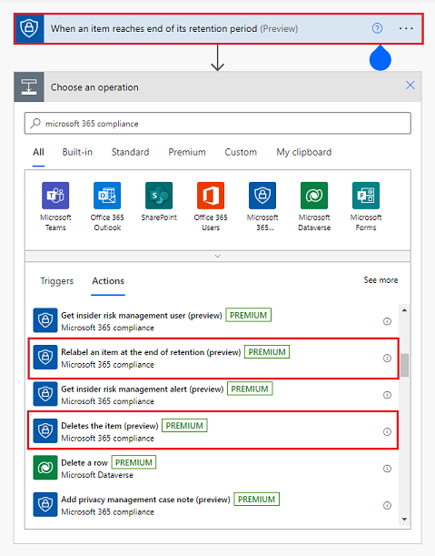
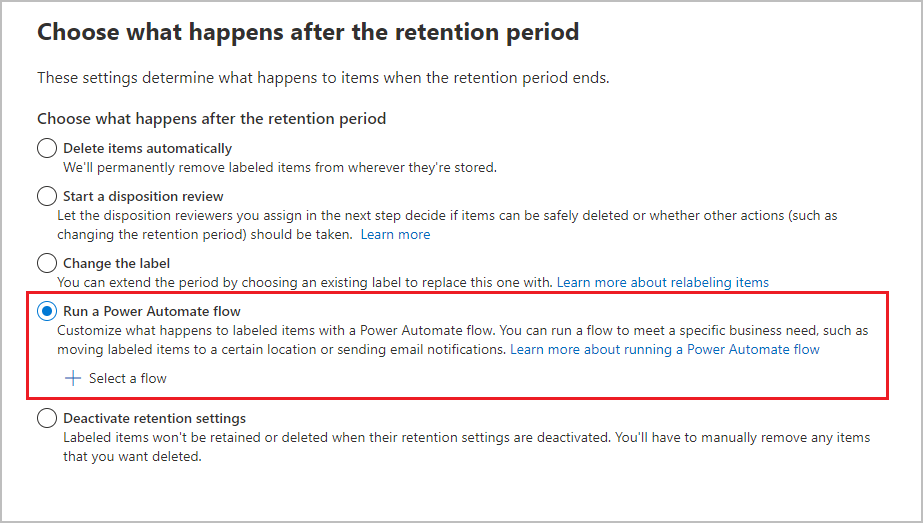

# Customize what happens at the end of the retention period

>*[Microsoft 365 licensing guidance for security & compliance](/office365/servicedescriptions/microsoft-365-service-descriptions/microsoft-365-tenantlevel-services-licensing-guidance/microsoft-365-security-compliance-licensing-guidance).*

> [!NOTE]
> This scenario is rolling out in preview and subject to change.

When you configure a [retention label](retention.md) to retain items for a specific period, you specify what action to take at the end of that retention period. You can choose from the built-in actions of permanently deleting the item, relabeling the item, deactivating the label, and starting a disposition review.

However, if you choose the option to run a Power Automate flow, currently rolling out in preview, this label configuration supports custom actions such as:

- Send an email notification to a records manager, or to the person who created or last modified a document
- Move a document item to a SharePoint location where you centrally store records

You can also select the Microsoft 365 compliance label-specific actions of relabel the item or permanently delete it:

For example, a flow can move the item, relabel it, and then send an email notification.

The actions also allow integration with other apps and services. For example, you have another solution that starts your own customized disposition review process when an email notification is received, or your flow adds a new entry into a table and this change automatically starts an existing records management procedure.

It's outside the scope of this article to document all the ways in which you can configure a flow and integrate with other solutions. However, to learn more about Microsoft Power Automate, see [Get started with Power Automate](/power-automate/getting-started) and [Overview of cloud flows](/power-automate/overview-cloud). In this article we'll cover:

- [Overview of using retention labels with a Power Automate flow](#overview-of-using-retention-labels-with-a-power-automate-flow)
- [Limitations](#limitations-for-this-scenario)
- [Power Automate dependency](#power-automate-dependency)
- [How to configure a retention label to run a Power Automate flow](#how-to-configure-a-retention-label-to-run-a-power-automate-flow)
- [When the flow is triggered](#when-the-flow-is-triggered)
 

## Overview of using retention labels with a Power Automate flow

The following processes show the high-level overview of how retention labels work with a Power Automate flow:

In Power Automate, you create an automated cloud flow from blank that uses the trigger **When the retention period expires**. Then, add one or more steps and specify the operations that run your choice of actions.

Next, in the Microsoft Purview compliance portal, create a new retention label with the following configuration:
- Retain the item for a specified period of time
- At the end of the retention period, run the flow that you just created

Apply the label using either of the following methods:
- [Publish retention labels and apply them in apps](create-apply-retention-labels.md)
- [Apply a retention label to content automatically](apply-retention-labels-automatically.md)

When the retention period expires, your configured flow runs.

## Limitations for this scenario

- Not currently supported for [Microsoft 365 Multi-Geo](/microsoft-365/enterprise/microsoft-365-multi-geo).

- You must create a new retention label to run a flow at the end of the retention period. You can't edit an existing retention label for this configuration.

- By default, the account that creates the Power Automate flow must be the same account that creates the retention label. If you share the flow in Power Automate, the people you share it with can also select the flow when they create a retention label.

- If you select the relabel action in the flow, the retention label that you select as the replacement can't be [configured to mark the item as a regulatory record](declare-records.md#configuring-retention-labels-to-declare-records). It can be configured to mark the item as a record, or not mark the item as a record.

## Power Automate dependency

Power Automate is a workflow service that automates actions across applications and services. Specific to running a Power Automate flow at the end of the retention period:

- You must have a Power Automate per user plan that includes premium connectors, separate from your Microsoft 365 compliance plan. For more information, see the [Power Automate per user plan](https://admin.microsoft.com/AdminPortal/Home?ref=/catalog/offer-details/power-automate-per-user-plan/7CF37992-A897-4DB2-82C1-BDA8C1C3EB76) details in the Microsoft 365 admin center, where you can also start a free trial.

- The Power Automate flow must be an automated cloud flow that is created from blank, and configured to use the trigger **When the retention period expires**.

For more information about how to use and configure the dependent automated cloud flows, see the [Microsoft Power Automate Documentation](/power-automate).

## How to configure a retention label to run a Power Automate flow

1. In the [Microsoft Purview compliance portal](https://go.microsoft.com/fwlink/p/?linkid=2077149), create a new retention label with your preferred name and settings. For more information, see [Use file plan to create and manage retention labels](file-plan-manager.md).

2. Specific to this scenario:
    
    1. On the **Define label settings** page, select **Retain items indefinitely or for a specific period** and specify the retention period.
    
    2. On the **Choose what happens after the retention period** page, select **Run a Power Automate flow**, and then **Select a flow**:
        
        
        
    
    3. From the **Select a Power Automate flow** flyout pane, you'll see any automated cloud flows that you created (or somebody has shared with you) and that have the **When the retention period expires** trigger.
        
        Select the flow you want, and complete the configuration to create the retention label.

A retention label can be configured for only one Power Automate flow, but the same flow can be used by more than one retention label.

## When the flow is triggered

Just as it can take up to 7 days to automatically apply a retention label or display it so you can apply it, so you should allow up to 7 days after the expiration period expires before the Power Automate flow is triggered. The initiation of the flow can then take a few hours. 

For the Microsoft 365 compliance actions of delete and relabel, then allow up to 7 days for these actions to complete. Specific for Exchange and the Microsoft 365 compliance actions of delete, allow up to 14 days.

Both the flow itself and the Microsoft 365 compliance actions in the flow are queued so that if there are any network or service delays, the flow and actions are automatically retried.

The [principles of retention](retention.md#the-principles-of-retention-or-what-takes-precedence) still apply to retention labels that are configured to run a flow at the end of the retention period, in that an item is always retained for the longest period if there is a conflict with one or more retention policies. However, the flow is always triggered at the end of the label's retention period.

## Next steps

To help you track the retention labels with this configuration:

- [Monitoring retention labels](retention.md#monitoring-retention-labels)
- [Using Content Search to find all content with a specific retention label](retention.md#using-content-search-to-find-all-content-with-a-specific-retention-label)
- [Auditing retention actions](retention.md#auditing-retention-actions)

To confirm there weren't any failures or errors with your flow, go to the [Power Automate dashboard](https://flow.microsoft.com), select **My flows**, and then select your flow to review the 28-day run history.

