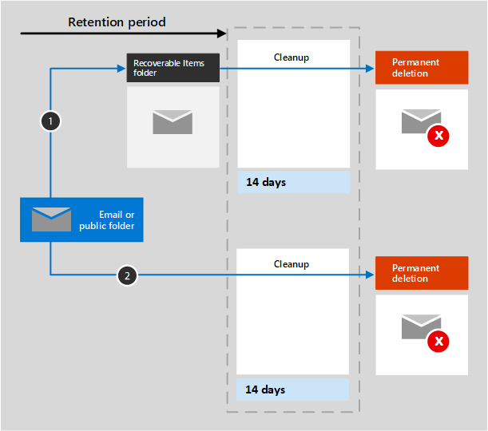

# Learn about retention for Exchange

The information in this article supplements [Learn about retention](retention.md) because it has information that's specific to Exchange.  For other workloads, see:

- [Learn about retention for SharePoint and OneDrive](retention-policies-sharepoint.md)
- [Learn about retention for Microsoft Teams](retention-policies-teams.md)
- [Learn about retention for Yammer](retention-policies-yammer.md)

## What's included for retention and deletion

The following Exchange items can be retained and deleted by using retention policies and retention labels: Mail messages (includes drafts) with any attachments, tasks when they have an end date, and notes. 

Calendar items that have an end date are supported for retention policies but aren't supported for retention labels.

Contacts, and any tasks and calendar items that don't have an end date are not supported.

Other items stored in a mailbox, such as Skype and Teams messages, aren't included in retention policies or labels for Exchange. These items have their own retention policies.

## How retention works for Exchange

Both a mailbox and a public folder use the [Recoverable Items folder](/exchange/security-and-compliance/recoverable-items-folder/recoverable-items-folder) to retain items. Only people who have been assigned eDiscovery permissions can view items in another user's Recoverable Items folder.
  
When a person deletes a message in a folder other than the Deleted Items folder, by default, the message moves to the Deleted Items folder. When a person deletes an item in the Deleted Items folder, the message is moved to the Recoverable Items folder. However, a user can soft delete an item (Shift+Delete) in any folder, which bypasses the Deleted Items folder and moves the item directly to the Recoverable Items folder.
  
When you apply retention settings to Exchange data, a timer job periodically evaluates items in the Recoverable Items folder. If an item doesn't match the rules of at least one retention policy or retention label to retain the item, it is permanently deleted (also called hard deleted) from the Recoverable Items folder.

> [!NOTE]
> Because of the [first principle of retention](retention.md#the-principles-of-retention-or-what-takes-precedence), permanent deletion is always suspended if the same item must be retained because of another retention policy or retention label, or it is under eDiscovery holds for legal or investigative reasons.

The timer job can take up to seven days to run and the Exchange location must contain at least 10 MB.
  
When a user attempts to change properties of a mailbox item—such as the subject, body, attachments, senders and recipients, or date sent or received for a message—a copy of the original item is saved to the Recoverable Items folder before the change is committed. This action happens for each subsequent change. At the end of the retention period, copies in the Recoverable Items folder are permanently deleted.

After retention settings are applied to Exchange content, the paths the content takes depend on whether the retention settings are to retain and delete, to retain only, or delete only.

When the retention settings are to retain and delete:

1. **If the item is modified or permanently deleted** by the user (either SHIFT+DELETE or deleted from Deleted Items) during the retention period: The item is moved (or copied, in the case of edit) to the Recoverable Items folder. There, a timer job runs periodically and identifies items whose retention period has expired, and these items are permanently deleted within 14 days of the end of the retention period. Note that 14 days is the default setting, but it can be configured up to 30 days.

2. **If the item is not modified or deleted** during the retention period: The same process runs periodically on all folders in the mailbox and identifies items whose retention period has expired, and these items are permanently deleted within 14 days of the end of the retention period. Note that 14 days is the default setting, but it can be configured up to 30 days. 

When the retention settings are retain-only, or delete-only, the contents paths are variations of retain and delete:

### Content paths for retain-only retention settings

1. **If the item is modified or deleted** during the retention period: A copy of the original item is created in the Recoverable Items folder and retained until the end of the retention period, when the copy in the Recoverable Items folder is permanently deleted within 14 days after the item expires. 

2. **If the item is not modified or deleted** during the retention period: Nothing happens before and after the retention period; the item remains in its original location.

### Content paths for delete-only retention settings

1. **If the item is not deleted** during the configured period: At the end of the configured period in the retention policy, the item is moved to the Recoverable Items folder. 

2. **If the item is deleted** during the configured period: The item is immediately moved to the Recoverable Items folder. If a user deletes the item from there or empties the Recoverable Items folder, the item is permanently deleted. Otherwise, the item is permanently deleted after being in the Recoverable Items folder for 14 days. 

## When a user leaves the organization 

If a user leaves your organization and the user's mailbox is included in a retention policy, the mailbox becomes an inactive mailbox when the user's Microsoft 365 account is deleted. The contents of an inactive mailbox are still subject to any retention policy that was placed on the mailbox before it was made inactive, and the contents are available to an eDiscovery search. For more information, see [Inactive mailboxes in Exchange Online](inactive-mailboxes-in-office-365.md).

## Configuration guidance

If you're new to configuring retention in Microsoft 365, see [Get started with retention policies and retention labels](get-started-with-retention.md).

If you're ready to configure a retention policy or retention label for Exchange, see the following instructions:
- [Create and configure retention policies](create-retention-policies.md)
- [Create retention labels and apply them in apps](create-apply-retention-labels.md)
- [Apply a retention label to content automatically](apply-retention-labels-automatically.md)