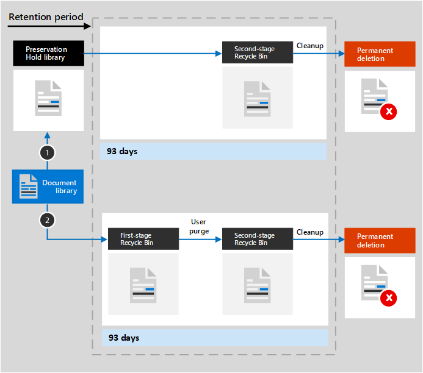

# Learn about retention for SharePoint and OneDrive

>*[Microsoft 365 licensing guidance for security & compliance](/office365/servicedescriptions/microsoft-365-service-descriptions/microsoft-365-tenantlevel-services-licensing-guidance/microsoft-365-security-compliance-licensing-guidance).*

The information in this article supplements [Learn about retention](retention.md) because it has information that's specific to SharePoint and OneDrive.

For other workloads, see:

- [Learn about retention for Microsoft Teams](retention-policies-teams.md)
- [Learn about retention for Yammer](retention-policies-yammer.md)
- [Learn about retention for Exchange](retention-policies-exchange.md)

## What's included for retention and deletion

All files stored in SharePoint or OneDrive sites can be retained by applying a retention policy or retention label. 

The following files can be deleted:

- When you use a retention policy: All files in document libraries, which include any automatically created SharePoint document libraries, such as **Site Assets**.
    
- When you use retention labels: All files in all document libraries, and all files at the root level that aren't in a folder.
    
> [!TIP]
> When you use a [query with an auto-apply policy for a retention label](apply-retention-labels-automatically.md#auto-apply-labels-to-content-with-keywords-or-searchable-properties), you can exclude specific document libraries by using the following entry: `NOT(DocumentLink:"<URL to document library>")`

List items are not supported by retention policies but are supported by retention labels with the exception of items in system lists. These are hidden lists used by SharePoint to manage the system and include the master page catalog, solution catalog, and data sources. When you apply a retention label to a supported list item that has a document attachment:
- For a standard retention label (doesn't declare the item to be a record):
    - The document attachment doesn't automatically inherit the retention settings of the label, but can be labeled independently.
- For a retention label that declares the item a record: 
    - The document attachment automatically inherits the retention settings from the label if the document isn't already labeled.

Retention settings from both retention policies and retention labels do not apply to organizing structures that include libraries, lists, and folders.

> [!NOTE]
> For retention policies and auto-apply label policies: SharePoint sites must be indexed for the retention settings to be applied. However, if items in SharePoint document libraries are configured to not appear in search results, this configuration doesn't exclude files from the retention settings.

## How retention works for SharePoint and OneDrive

To store content that needs to be retained, SharePoint and OneDrive create a Preservation Hold library if one doesn't exist. You can view this library on the **Site contents** page in the top-level site of the site collection. Most users can't view the Preservation Hold library because it's visible only to site collection administrators.

Items in SharePoint that have a standard retention label (doesn't declare the item to be a record) don't need the Preservation Hold library because these items remain in their original location. SharePoint prevents users from deleting items when the applied retention label is configured to retain the content, and SharePoint versioning preserves older versions when items are edited. But for other scenarios, the Preservation Hold library is used when items must be retained:
- Items in OneDrive that have standard retention labels
- Items in SharePoint or OneDrive that have retention labels that declares them a record, and the item is unlocked for editing
- Items that are subject to retention policies

To retain this content when a user attempts to change or delete it, a check is made whether the content's been changed since the retention settings were applied. If this is the first change since the retention settings were applied, the content is copied to the Preservation Hold library, which allows the person to change or delete the original content. Any content in a site collection can be copied to the Preservation Hold library, independently from retention settings.
  
A timer job periodically cleans up the Preservation Hold library. For content that has been in the Preservation Hold library for more than 30 days, this job compares the content to all queries used by the retention settings for that content. Content that is older than their configured retention period is then deleted from the Preservation Hold library, and the original location if it is still there. This timer job runs every seven days, which means that together with the minimal 30 days, it can take up to 37 days for content to be deleted from the Preservation Hold library.

This behavior for copying files into the Preservation Hold library applies to content that exists when the retention settings were applied. In addition, for retention policies, any new content that's created or added to the site after it was included in the policy will be retained in the Preservation Hold library. However, new content isn't copied to the Preservation Hold library the first time it's edited, only when it's deleted. To retain all versions of a file, you must turn on [versioning](#how-retention-works-with-document-versions).
  
Users see an error message if they try to delete a library, list, folder, or site that's subject to retention. They can delete a folder if they first move or delete any files in the folder that are subject to retention.

> [!NOTE]
> Because the Preservation Hold library is created only when it's needed, and not when you apply a retention policy or retention label, to see this working, you must first edit or delete an item that's subject to retention. Then browse to the Preservation Hold library to view the retained copy.
  
After retention settings are assigned to content in a OneDrive account or SharePoint site, the paths the content takes depend on whether the retention settings are to retain and delete, to retain only, or delete only.

When the retention settings are to retain and delete:

  
1. **If the content is modified or deleted** during the retention period, a copy of the original content as it existed when the retention settings were assigned is created in the Preservation Hold library. There, the timer job identifies items whose retention period has expired. Those items are moved to the second-stage Recycle Bin, where they're permanently deleted at the end of 93 days. The second-stage Recycle Bin is not visible to end users (only the first-stage Recycle Bin is), but site collection admins can view and restore content from there.

    > [!NOTE]
    > To help prevent inadvertent data loss, we no longer permanently delete content from the Preservation Hold library. Instead, we permanently delete content only from the Recycle Bin, so all content from the Preservation Hold library now goes through the second-stage Recycle Bin.
    
2. **If the content is not modified or deleted** during the retention period, the timer job moves this content to the first-stage Recycle Bin at the end of the retention period. If a user deletes the content from there or empties this Recycle Bin (also known as purging), the document is moved to the second-stage Recycle Bin. A 93-day retention period spans both the first- and second-stage recycle bins. At the end of 93 days, the document is permanently deleted from wherever it resides, in either the first-stage or second-stage Recycle Bin. The Recycle Bin is not indexed and therefore unavailable for searching. As a result, an eDiscovery search can't find any Recycle Bin content on which to place a hold.

> [!NOTE]
> Because of the [first principle of retention](retention.md#the-principles-of-retention-or-what-takes-precedence), permanent deletion is always suspended if the same item must be retained because of another retention policy or retention label, or it is under eDiscovery holds for legal or investigative reasons.

When the retention settings are retain-only, or delete-only, the contents paths are variations of retain and delete:

### Content paths for retain-only retention settings

1. **If the content is modified or deleted** during the retention period: A copy of the original document is created in the Preservation Hold library and retained until the end of the retention period, when the copy in the Preservation Hold library is moved to the second-stage Recycle Bin and is permanently deleted after 93 days.

2. **If the content is not modified or deleted** during the retention period: Nothing happens before and after the retention period; the document remains in its original location.

### Content paths for delete-only retention settings

1. **If the content is deleted** during the configured period: The document is moved to first-stage Recycle Bin. If a user deletes the document from there or empties this Recycle Bin, the document is moved to the second-stage Recycle Bin. A 93-day retention period spans both the first-stage and second-stage recycle bins. At the end of 93 days, the document is permanently deleted from wherever it resides, in either the first-stage or second-stage Recycle Bin. If the content is modified during the configured period, it follows the same deletion path after the configured period.

2. **If the content is not deleted** during the configured period: At the end of the configured period in the retention policy, the document is moved to the first-stage Recycle Bin. If a user deletes the document from there or empties this Recycle Bin (also known as purging), the document is moved to the second-stage Recycle Bin. A 93-day retention period spans both the first-stage and second-stage recycle bins. At the end of 93 days, the document is permanently deleted from wherever it resides, in either the first-stage or second-stage Recycle Bin. The Recycle Bin is not indexed and therefore unavailable for searching. As a result, an eDiscovery search can't find any Recycle Bin content on which to place a hold.

## How retention works for OneNote content

When you apply a retention policy to a location that includes OneNote content, behind the scenes, the different OneNote sections are individual files. This means that each section will be individually retained and deleted, according to the retention settings you specify.

## How retention works with document versions

Versioning is a feature of all document lists and libraries in SharePoint and OneDrive. By default, versioning retains a minimum of 500 major versions, although you can increase this limit. For more information, see [Enable and configure versioning for a list or library](https://support.office.com/article/1555d642-23ee-446a-990a-bcab618c7a37) and [How versioning works in lists and libraries](https://support.microsoft.com/office/how-versioning-works-in-lists-and-libraries-0f6cd105-974f-44a4-aadb-43ac5bdfd247).
  
When a document with versions is subject to retention settings to retain that content, versions that get copied to the Preservation Hold library exist as a separate item. If the retention settings are configured to delete at the end of the retention period:

- If the retention period is based on when the content was created, each version has the same expiration date as the original document. The original document and its versions all expire at the same time.

- If the retention period is based on when the content was last modified, each version has its own expiration date based on when the original document was modified to create that version. The original document and its versions expire independently of each other.

> [!NOTE]
> The retained versions of these SharePoint and OneDrive documents are not searchable by eDiscovery tools.

When the retention action is to delete the document, all versions not in the Preservation Hold library are deleted at the same time according to the current version.

For items that are subject to a retention policy (or an eDiscovery hold), the versioning limits for the document library are ignored until the retention period of the document is reached (or the eDiscovery hold is released). In this scenario, old versions are not automatically purged and users are prevented from deleting versions.

That's not the case for retention labels when the content isn't subject to a retention policy (or an eDiscovery hold). Instead, the versioning limits are honored so that older versions are automatically deleted to accommodate new versions, but users are still prevented from deleting versions.

## When a user leaves the organization

**SharePoint**:

When a user leaves your organization, any content created by that user is not affected because SharePoint is considered a collaborative environment, unlike a user's mailbox or OneDrive account.

**OneDrive**:

If a user leaves your organization, any files that are subject to a retention policy or has a retention label will remain for the duration of the policy or label. During that time period, all sharing access continues to work. When the retention period expires, content moves into the Site Collection Recycle Bin and is not accessible to anyone except the admin. If a document is marked by a retention label as a record, the document will not be deleted until the retention period is over, after which time the content is permanently deleted.

## Configuration guidance

If you're new to configuring retention in Microsoft 365, see [Get started with retention policies and retention labels](get-started-with-retention.md).

If you're ready to configure a retention policy or retention label for Exchange, see the following instructions:
- [Create and configure retention policies](create-retention-policies.md)
- [Create retention labels and apply them in apps](create-apply-retention-labels.md)
- [Apply a retention label to content automatically](apply-retention-labels-automatically.md)
