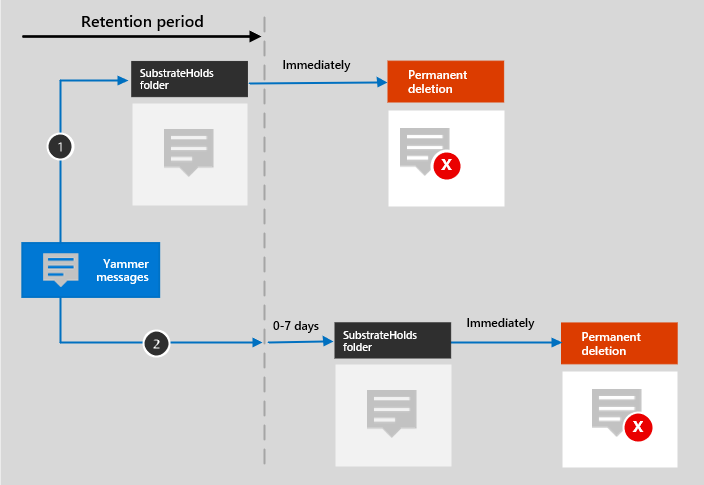

# Learn about retention for Yammer

>*[Microsoft 365 licensing guidance for security & compliance](/office365/servicedescriptions/microsoft-365-service-descriptions/microsoft-365-tenantlevel-services-licensing-guidance/microsoft-365-security-compliance-licensing-guidance).*

> [!NOTE]
> This feature is in preview and not yet available for all customers.

The information in this article supplements [Learn about retention](retention.md) because it has information that's specific to Yammer.

For other workloads, see:

- [Learn about retention for SharePoint and OneDrive](retention-policies-sharepoint.md)
- [Learn about retention for Microsoft Teams](retention-policies-teams.md)
- [Learn about retention for Exchange](retention-policies-exchange.md)

## What's included for retention and deletion

The following Yammer items can be retained and deleted by using retention policies for Yammer: Community messages and private messages.

Reactions from others in the form of emoticons are not included in these messages.

## How retention works with Yammer

You can use a retention policy to retain and delete community messages and private messages in Yammer. Private messages are stored in a hidden folder in the mailbox of each user included in the message, and community messages are stored in a similar hidden folder in the group mailbox for the community.

Yammer messages are not affected by retention policies that are configured for user or group mailboxes. Even though Yammer messages are stored in Exchange, this Yammer data is included only by a retention policy that's configured for the **Yammer community messages** and **Yammer user messages** locations.

> [!NOTE]
> If a user is included in an active retention policy that retains Yammer data and you a delete a mailbox of a user who is included in this policy, to retain the Yammer data, the mailbox is converted into an [inactive mailbox](inactive-mailboxes-in-office-365.md). If you don't need to retain this Yammer data for the user, exclude the user account from the retention policy before you delete their mailbox.

After a retention policy is configured for Yammer messages, a timer job from the Exchange service periodically evaluates items in the hidden folder where these Yammer messages are stored. The timer job takes up to seven days to run. When these items have expired their retention period, they are moved to the SubstrateHolds folder—a hidden folder that's in every user or group mailbox to store "soft-deleted" items before they are permanently deleted.

After a retention policy is configured for Yammer messages, the paths the content takes depend on whether the retention policy is to retain and then delete, to retain only, or delete only.

When the retention policy is to retain and then delete:

For the two paths in the diagram:

1. **If a Yammer message is edited or deleted** by the user during the retention period, the original message is immediately copied (if edited) or moved (if deleted) to the SubstrateHolds folder. The message is stored there until the retention period expires and then the message is immediately permanently deleted.

2. **If a Yammer message is not deleted** and for current messages after editing, the message is moved to the SubstrateHolds folder after the retention period expires. This action takes up to seven days from the expiry date. When the message is in the SubstrateHolds folder, it is then immediately permanently deleted. 

> [!NOTE]
> Messages in the SubstrateHolds folder are searchable by eDiscovery tools. Until messages are permanently deleted (in the SubstrateHolds folder), they remain searchable by eDiscovery tools.

When the retention policy is retain-only, or delete-only, the content's paths are variations of retain and delete.

### Content paths for retain-only retention policy

1. **If a Yammer message is edited or deleted**: A copy of the original message is immediately created in the SubstrateHolds folder and retained there until the retention period expires. Then the message is immediately permanently deleted from the SubstrateHolds folder.

2. **If the Yammer message is not modified or deleted** and for current messages after editing during the retention period: Nothing happens before and after the retention period; the message remains in its original location.

### Content paths for delete-only retention policy

1. **If the Yammer message is not deleted** during the retention period: At the end of the retention period, the message is moved to the SubstrateHolds folder. This action takes up to seven days from the expiry date. Then the message is immediately permanently deleted from the SubstrateHolds folder.

2. **If the Yammer message is deleted by the user** during the period, the item is immediately moved to the SubstrateHolds folder where it is immediately permanently deleted.

## Messages and external users

By default, a retention policy for Yammer user messages applies to all users in your organization, but not external users. You can apply a retention policy to external users if you use the **Choose user** and specify their account. 

At this time, Azure B2B guest users are not supported.

## When a user leaves the organization 

If a user leaves your organization and their Microsoft 365 account is deleted, their Yammer user messages that are subject to retention are stored in an inactive mailbox. These messages remain subject to any retention policy that was placed on the user before their mailbox was made inactive, and the contents are available to an eDiscovery search. For more information, see [Inactive mailboxes in Exchange Online](inactive-mailboxes-in-office-365.md). 

If the user stored any files in Yammer, see the [equivalent section](retention-policies-sharepoint.md#when-a-user-leaves-the-organization) for SharePoint and OneDrive.

## Limitations

Yammer retention policies are currently in preview and we're continuously working on optimizing retention functionality. In the meantime, be aware of the following limitation when you use retention for Yammer community messages and private messages:

- When you select **Choose users** for the **Yammer user messages** location, you might see guests and non-mailbox users. Retention policies aren't designed for these users, so don't select them.

## Configuration guidance

If you're new to configuring retention in Microsoft 365, see [Get started with retention policies and retention labels](get-started-with-retention.md).

If you're ready to configure a retention policy for Yammer, see [Create and configure retention policies](create-retention-policies.md).