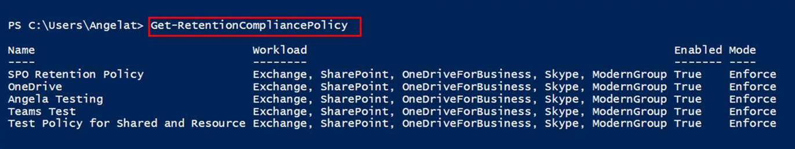
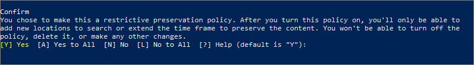
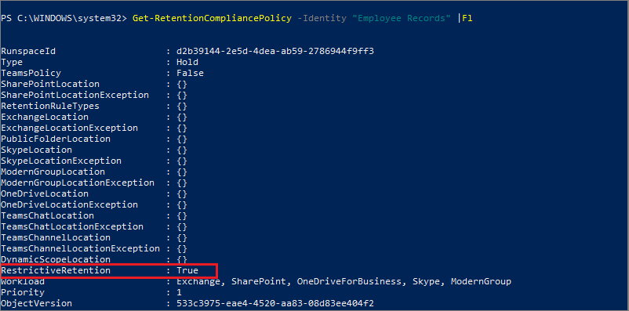

# Use Preservation Lock to restrict changes to retention policies and retention label policies

>*[Microsoft 365 licensing guidance for security & compliance](/office365/servicedescriptions/microsoft-365-service-descriptions/microsoft-365-tenantlevel-services-licensing-guidance/microsoft-365-security-compliance-licensing-guidance).*

Preservation Lock locks a retention policy or retention label policy so that no one—including a global admin—can turn off the policy, delete the policy, or make it less restrictive. This configuration might be needed for regulatory requirements and can help safeguard against rogue administrators.

When a retention policy is locked:

- No one can disable the policy or delete it
- Locations can be added but not removed
- You can extend the retention period but not decrease it

When a retention label policy is locked:

- No one can disable the policy or delete it
- Locations can be added but not removed
- Labels can be added but not removed

In summary, a locked policy can be increased or extended, but it can't be reduced or turned off.

> [!IMPORTANT]
> Before you lock a retention policy or retention label policy, it's critical that you understand the impact and confirm whether it's required for your organization. For example, it might be needed to meet regulatory requirements. Administrators won't be able to disable or delete these policies after the preservation lock is applied.

Configure Preservation Lock after you've created a [retention policy](create-retention-policies.md), or a retention label policy that you [publish](create-apply-retention-labels.md) or [auto-apply](apply-retention-labels-automatically.md). 

> [!NOTE]
> Locking a label policy doesn't prevent an administrator from reducing the retention period in a label that is included in the locked policy. That requirement, with other restrictions, can be met when you configure a label to mark items as a [regulatory record](records-management.md#records).

## How to lock a retention policy or retention label policy

You must use PowerShell if you need to use Preservation Lock. Because administrators can't disable or delete a policy for retention after this lock is applied, enabling this feature is not available in the UI to safeguard against accidental configuration.

All policies for retention and with any configuration support Preservation Lock.

1. [Connect to Security & Compliance Center PowerShell](/powershell/exchange/connect-to-scc-powershell).

2. Find the name of the policy that you want to lock by running [Get-RetentionCompliancePolicy](/powershell/module/exchange/get-retentioncompliancepolicy). For example:
    
   

3. To place a Preservation Lock on your policy, run the [Set-RetentionCompliancePolicy](/powershell/module/exchange/set-retentioncompliancepolicy) cmdlet with the name of the policy, and the *RestrictiveRetention* parameter set to true:
    
    ```powershell
    Set-RetentionCompliancePolicy -Identity "<Name of Policy>" –RestrictiveRetention $true
    ```
    
    For example:
    
    
    
     When prompted, read and acknowledge the restrictions that come with this configuration by entering **Y**:
    
   

A Preservation Lock is now placed on the policy. To confirm, run `Get-RetentionCompliancePolicy` again, but specify the policy name and display the policy parameters:

```powershell
Get-RetentionCompliancePolicy -Identity "<Name of Policy>" |Fl
```

You should see **RestrictiveRetention** is set to **True**. For example:



## See also

[Resources to help you meet regulatory requirements for information governance and records management](retention-regulatory-requirements.md)