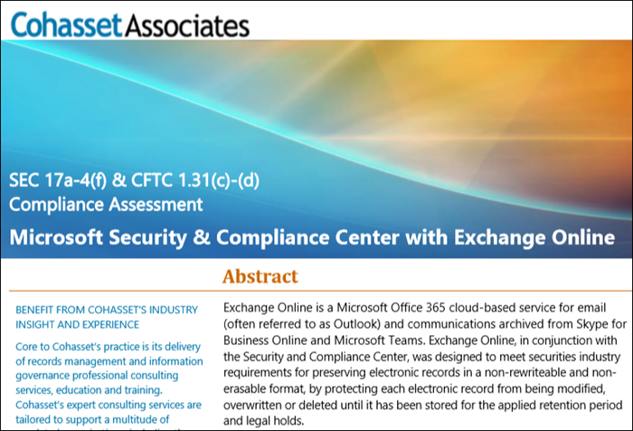

# Configure retention policies and retention labels for regulatory requirements

>*[Microsoft 365 licensing guidance for security & compliance](https://aka.ms/ComplianceSD).*

If your organization needs to comply with regulatory standards for retaining your data, the retention policies and retention labels that you can configure for your data in Microsoft 365 are sufficient for most organizations.

However, some organizations in highly regulated industries are subject to more stringent regulatory requirements, such as the requirement to store electronic communications to meet the WORM (write once, read many). The WORM requirement dictates a storage solution in which a record:

- Must be retained for a required retention period that cannot be shortened, only increased.
- Cannot be overwritten, erased, or altered during the required retention period.

Another example is for financial institutions such as banks or broker dealers are subject to Rule 17a-4 issued by the Securities and Exchange Commission (SEC). Rule 17a-4 has specific requirements for electronic data storage, including many aspects of record management, such as the duration, format, quality, availability, and accountability of records retention.

Use the following features and resources to help your organization meet its regulatory requirements.

## Retention policies: Use Preservation Lock

When you apply Preservation Lock to a retention policy, the policy can be increased or extended, but it can't be reduced or turned off, even by a global admin.

For more information about Preservation Lock, see [Use Preservation Lock to comply with regulatory requirements](retention-policies.md#use-preservation-lock-to-comply-with-regulatory-requirements).

For instructions, see [Lock a retention policy by using PowerShell](create-retention-policies.md#lock-a-retention-policy-by-using-powershell).

## Retention labels: Use regulatory records

When you configure retention labels, you can configure the label to mark the content as a regulatory record. When the label with this configuration is applied to items, they can't be edited or deleted, and the label can't be changed or removed. In addition, admins won't be able to modify or delete this label after it's created. They'll only be able to increase the retention period or publish it to other locations.

For more information about the actions that are blocked by regulatory records, see [Compare restrictions for what actions are allowed or blocked](records-management.md#compare-restrictions-for-what-actions-are-allowed-or-blocked).

For instructions, see [Declare records by using retention labels](declare-records.md).

## Cohasset assessment 

To help you comply with your regulatory requirements, you can download an assessment that's been produced in partnership with Cohasset Associates. 

This Cohasset assessment is available from the [Data Protection Resources, FAQ and White Papers](https://servicetrust.microsoft.com/ViewPage/TrustDocuments?command=Download&downloadType=Document&downloadId=9fa8349d-a0c9-47d9-93ad-472aa0fa44ec&docTab=6d000410-c9e9-11e7-9a91-892aae8839ad_FAQ_and_White_Papers) page of the Service Trust Portal.

