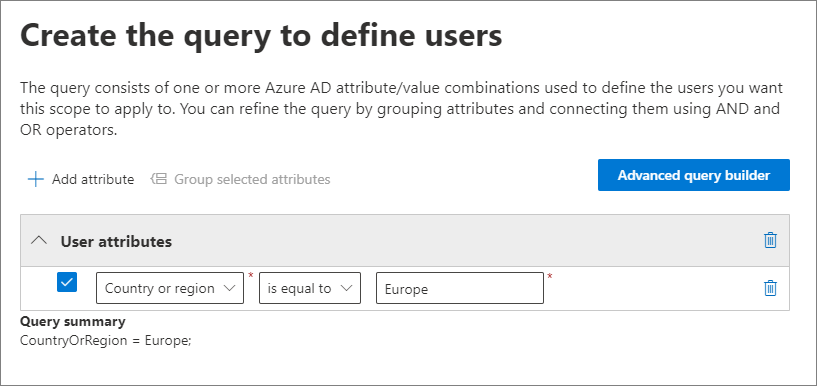
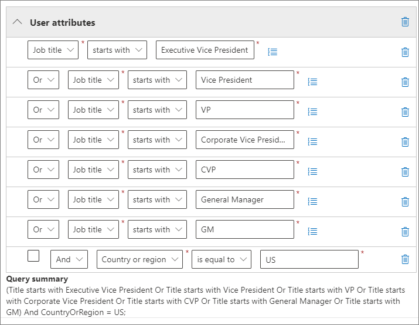
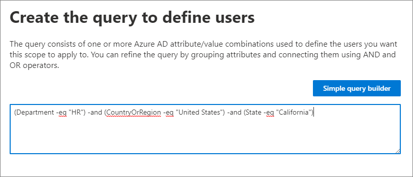
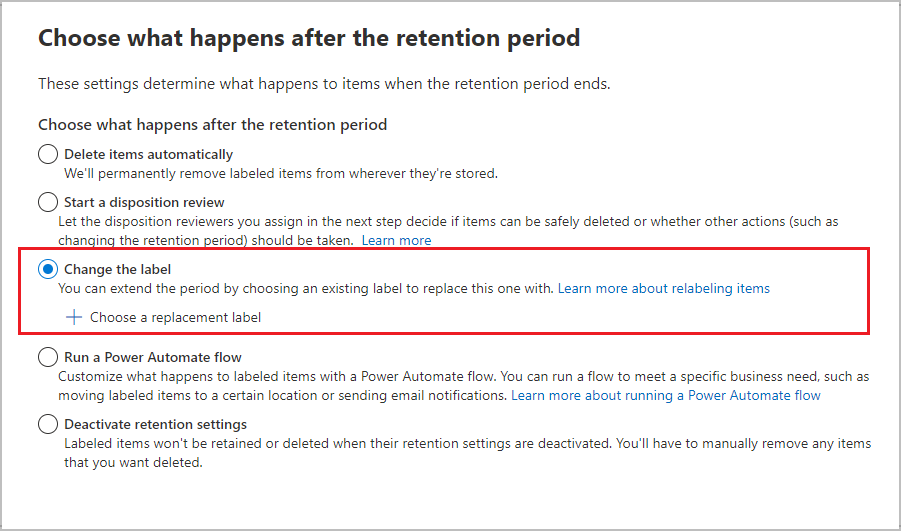

# Common settings for retention policies and retention label policies

>*[Microsoft 365 licensing guidance for security & compliance](https://aka.ms/ComplianceSD).*

Many settings for retention are common to both retention policies and retention label policies. Use the following information to help you configure these settings to proactively retain content, delete content, or both—retain and then delete the content.

For the scenarios that support these policies for retention, see:

- [Create and configure retention policies](create-retention-policies.md).
- [Publish retention labels and apply them in apps](create-apply-retention-labels.md)
- [Apply a retention label to content automatically](apply-retention-labels-automatically.md)

Settings that are specific to each scenario are explained in their respective documentation.

For overview information about policies for retention and how retention works in Microsoft 365, see [Learn about retention policies and retention labels](retention.md).

[!INCLUDE [purview-preview](../includes/purview-preview.md)]

## Scopes - adaptive and static

If you're unfamiliar with adaptive and static scopes, and to help you choose which one to use when you configure a policy for retention, see [Adaptive or static policy scopes for retention](retention.md#adaptive-or-static-policy-scopes-for-retention). 

When you've decided whether to use an adaptive or static scope, use the following information to help you configure it:
- [Configuration information for adaptive scopes](#configuration-information-for-adaptive-scopes)
- [Configuration information for static scopes](#configuration-information-for-static-scopes)

> [!TIP]
> If you have policies that use static scopes and you want to convert them to adaptive scopes, leave your existing policies in place while you create new policies that use adaptive scopes with the same retention settings. Validate these new policies are targeting the correct users, sites, and groups before you disable or delete the old policies with static scopes.

### Configuration information for adaptive scopes

When you choose to use adaptive scopes, you're prompted to select what type of adaptive scope you want. There are three different types of adaptive scopes and each one supports different attributes or properties:

| Adaptive scope type | Attributes or properties supported include |
|:-----|:-----|
|**Users** - applies to:  <br/> - Exchange email <br/> - OneDrive accounts <br/> - Teams chats <br/> - Teams private channel messages <br/> - Yammer user messages| First Name <br/> Last name <br/>Display name <br/> Job title <br/> Department <br/> Office <br/>Street address <br/> City <br/>State or province <br/>Postal code <br/> Country or region <br/> Email addresses <br/> Alias <br/> Exchange custom attributes: CustomAttribute1 - CustomAttribute15|
|**SharePoint sites** - applies to:  <br/> - SharePoint sites <br/> - OneDrive accounts |Site URL <br/>Site name <br/> SharePoint custom properties: RefinableString00 - RefinableString99 |
|**Microsoft 365 Groups** - applies to:  <br/> - Microsoft 365 Groups <br/> - Teams channel messages (standard and shared) <br/> - Yammer community messages |Name <br/> Display name <br/> Description <br/> Email addresses <br/> Alias <br/> Exchange custom attributes: CustomAttribute1 - CustomAttribute15 |

The property names for sites are based on SharePoint site managed properties. For information about the custom attributes, see [Using Custom SharePoint Site Properties to Apply Microsoft 365 Retention with Adaptive Policy Scopes](https://techcommunity.microsoft.com/t5/security-compliance-and-identity/using-custom-sharepoint-site-properties-to-apply-microsoft-365/ba-p/3133970).

The attribute names for users and groups are based on [filterable recipient properties](/powershell/exchange/recipientfilter-properties#filterable-recipient-properties) that map to Azure AD attributes. For example:

- **Alias** maps to the LDAP name **mailNickname** that displays as **Email** in the Azure AD admin center.
- **Email addresses** maps to the LDAP name **proxyAddresses** that displays as **Proxy address** in the Azure AD admin center.

The attributes and properties listed in the table can be easily specified when you configure an adaptive scope by using the simple query builder. Additional attributes and properties are supported with the advanced query builder, as described in the following section.

> [!TIP]
> For more information about using the advanced query builder, see the following webinars: 
> - [Building Advanced Queries for Users and Groups with Adaptive Policy Scopes](https://mipc.eventbuilder.com/event/52683/occurrence/49452/recording?rauth=853.3181650.1f2b6e8b4a05b4441f19b890dfeadcec24c4325e90ac492b7a58eb3045c546ea)
> - [Building Advanced Queries for SharePoint Sites with Adaptive Policy Scopes](https://aka.ms/AdaptivePolicyScopes-AdvancedSharePoint)

A single policy for retention can have one or many adaptive scopes.

#### To configure an adaptive scope

Before you configure your adaptive scope, use the previous section to identify what type of scope to create and what attributes and values you'll use. You might need to work with other administrators to confirm this information. 

Specifically for SharePoint sites, there might be additional SharePoint configuration needed if you plan to use [custom site properties](https://techcommunity.microsoft.com/t5/security-compliance-and-identity/using-custom-sharepoint-site-properties-to-apply-microsoft-365/ba-p/3133970).

1. In the [Microsoft Purview compliance portal](https://compliance.microsoft.com/), navigate to one of the following locations:
    
    - If you're using the records management solution:
        - **Solutions** \> **Records management** \> **Adaptive scopes** tab \> + **Create scope**
        
    - If you're using the data lifecycle management solution:
       - **Solutions** \> **Data lifecycle management** \> **Microsoft 365** \> **Adaptive scopes** tab \> + **Create scope**
    
    Don't immediately see your solution in the navigation pane? First select **Show all**. 

2. Follow the prompts in the configuration to first select the type of scope, and then select the attributes or properties you want to use to build the dynamic membership, and type in the attribute or property values.
    
    For example, to configure an adaptive scope that will be used to identify users in Europe, first select **Users** as the scope type, and then select the **Country or region** attribute, and type in **Europe**:
    
    
    
    Once a day, this query will run against Azure AD and identify all users who have the value **Europe** specified for in their account for the **Country or region** attribute.
    
    > [!IMPORTANT]
    > Because the query doesn't run immediately, there's no validation that you typed in the value correctly.
    
    Select **Add attribute** (for users and groups) or **Add property** (for sites) to use any combination of attributes or properties that are supported for their scope type, together with logical operators to build queries. The operators supported are **is equal to**, **is not equal to**, **starts with** and **not starts with**, and you can group selected attributes or properties. For example:
    
    
    
    Alternatively, you can select **Advanced query builder** to specify your own queries:
    
    - For **User** and **Microsoft 365 Group** scopes, use [OPATH filtering syntax](/powershell/exchange/recipient-filters). For example, to create a user scope that defines its membership by department, country, and state:
    
        
        
        One of the advantages of using the advanced query builder for these scopes is a wider choice of query operators:
        - **and**
        - **or**
        - **not**
        - **eq** (equals)
        - **ne** (not equals)
        - **lt** (less than)
        - **gt** (greater than)
        - **like** (string comparison)
        - **notlike** (string comparison)
    
    - For **SharePoint sites** scopes, use Keyword Query Language (KQL). You might already be familiar with using KQL to search SharePoint by using indexed site properties. To help you specify these KQL queries, see [Keyword Query Language (KQL) syntax reference](/sharepoint/dev/general-development/keyword-query-language-kql-syntax-reference).
        
        For example, because SharePoint site scopes automatically include all SharePoint site types, which include Microsoft 365 group-connected and OneDrive sites, you can use the indexed site property **SiteTemplate** to include or exclude specific site types. The templates you can specify:
        - `SITEPAGEPUBLISHING` for modern communication sites
        - `GROUP` for Microsoft 365 group-connected sites
        - `TEAMCHANNEL` for Microsoft Teams private channel sites
        - `STS` for a classic SharePoint team site
        - `SPSPERS` for OneDrive sites
        
        So to create an adaptive scope that includes only modern communication sites and excludes Microsoft 365 goup-connected and OneDrive sites, specify the following KQL query:
        ````console
        SiteTemplate=SITEPAGEPUBLISHING
        ````
    
    You can [validate these advanced queries](#validating-advanced-queries) independently from the scope configuration.
    
    > [!TIP]
    > You must use the advanced query builder if you want to exclude inactive mailboxes. Or conversely, target just inactive mailboxes. For this configuration, use the OPATH property *IsInactiveMailbox*:
    > 
    > - To exclude inactive mailboxes, make sure the query includes: `(IsInactiveMailbox -eq "False")`
    > - To target just inactive mailboxes, specify: `(IsInactiveMailbox -eq "True")`

3. Create as many adaptive scopes as you need. You can select one or more adaptive scopes when you create your policy for retention.

> [!NOTE]
> It can take up to five days for the queries to fully populate and changes will not be immediate. Factor in this delay by waiting a few days before you add a newly created scope to a policy for retention.

To confirm the current membership and membership changes for an adaptive scope:

1. Double-click (or select and press Enter) the scope on the **Adaptive scopes** page

2. From the flyout **Details** pane, select **Scope details**. 
    
    Review the information that identifies all the users, sites, or groups currently in the scope, if they were automatically added or removed, and the date and time of that membership change.

> [!TIP]
> Use the [policy lookup](retention.md#policy-lookup) option to help you identify the policies that are currently assigned to specific users, sites, and Microsoft 365 groups.

#### Validating advanced queries

You can manually validate advanced queries by using PowerShell and SharePoint search:
- Use PowerShell for the scope types **Users** and **Microsoft 365 Groups**
- Use SharePoint search for the scope type **SharePoint sites**

To run a query using PowerShell:

1. [Connect to Exchange Online PowerShell](/powershell/exchange/connect-to-exchange-online-powershell) using an account with [appropriate Exchange Online Administrator permissions](/powershell/exchange/find-exchange-cmdlet-permissions#use-powershell-to-find-the-permissions-required-to-run-a-cmdlet).

2. Use either [Get-Recipient](/powershell/module/exchange/get-recipient), [Get-Mailbox](/powershell/module/exchange/get-mailbox), or [Get-User](/powershell/module/exchange/get-user) with the *-Filter* parameter and your [OPATH query](/powershell/exchange/filter-properties) for the adaptive scope enclosed in curly brackets (`{`,`}`). If your attribute values are strings, enclose these values in double or single quotes.

    You can determine whether to use Get-Mailbox, Get-Recipient, or Get-User for validation by identifying which cmdlet is supported by the [OPATH property](/powershell/exchange/filter-properties) that you choose for your query.

    > [!IMPORTANT]
    > Get-Mailbox does not support the *MailUser* recipient type, so Get-Recipient or Get-User must be used to validate queries that include on-premises mailboxes in a hybrid environment.

    To validate a **User** scope, use the appropriate command:
    - `Get-Mailbox` with *-RecipientTypeDetails UserMailbox,SharedMailbox,RoomMailbox,EquipmentMailbox*
    - `Get-Recipient` with *-RecipientTypeDetails UserMailbox,MailUser,SharedMailbox,RoomMailbox,EquipmentMailbox*
    
    To validate a **Microsoft 365 Group** scope, use:
    - `Get-Mailbox` with *-GroupMailbox* or `Get-Recipient` with *-RecipientTypeDetails GroupMailbox*

    For example, to validate a **User** scope, you could use:
    
    ````PowerShell
    Get-Recipient -RecipientTypeDetails UserMailbox,MailUser -Filter {Department -eq "Marketing"} -ResultSize Unlimited
    ````
    
    To validate a **Microsoft 365 Group** scope, you could use:
    
    ```PowerShell
    Get-Mailbox -RecipientTypeDetails GroupMailbox -Filter {CustomAttribute15 -eq "Marketing"} -ResultSize Unlimited
    ```
    
    > [!TIP]
    > When you use these commands to validate a user scope, if the number of recipients returned is higher than expected, it might be because it includes users who don't have a valid license for adaptive scopes. These users won't have the retention settings applied to them.
    > 
    > For example, in a hybrid environment, you might have unlicensed synchronized user accounts without an Exchange mailbox on-premises or in Exchange Online. You can identify these users by running the following command: `Get-User -RecipientTypeDetails User`

3. Verify that the output matches the expected users or groups for your adaptive scope. If it doesn't, check your query and the values with the relevant administrator for Azure AD or Exchange.
 
To run a query using SharePoint search:

1. Using a global admin account or an account that has the SharePoint admin role, go to `https://<your_tenant>.sharepoint.com/search`.

2. Use the search bar to specify your KQL query.

3. Verify that the search results match the expected site URLs for your adaptive scope. If they don't, check your query and the URLs with the relevant administrator for SharePoint.

### Configuration information for static scopes

When you choose to use static scopes, you must then decide whether to apply the policy to all instances for the selected location (the entire location) or to include or exclude specific instances (specific inclusions or exclusions).

#### A policy that applies to entire locations

Except Skype for Business, the default is that all instances for the selected locations are automatically included in the policy without you having to specify them as included.

For example, **All recipients** for the **Exchange email** location. With this default setting, all existing user mailboxes will be included in the policy, and any new mailboxes created after the policy is applied will automatically inherit the policy.

#### A policy with specific inclusions or exclusions

Be aware that if you use the optional configuration to scope your retention settings to specific users, specific Microsoft 365 groups, or specific sites, there are some limits per policy to be aware of. For more information, see [Limits for retention policies and retention label policies](retention-limits.md). 

To use the optional configuration to scope your retention settings, make sure the **Status** of that location is **On**, and then use the links to include or exclude specific users, Microsoft 365 groups, or sites.

> [!WARNING]
> If you configure instances to include and then remove the last one, the configuration reverts to **All** for the location.  Make sure this is the configuration that you intend before you save the policy.
>
> For example, if you specify one SharePoint site to include in your retention policy that's configured to delete data, and then remove the single site, by default all SharePoint sites will then be subject to the retention policy that permanently deletes data. The same applies to includes for Exchange recipients, OneDrive accounts, Teams chat users, and so on.
>
> In this scenario, toggle the location off if you don't want the **All** setting for the location to be subject to the retention policy. Alternatively, specify exclude instances to be exempt from the policy.

## Locations

Locations in policies for retention identify specific Microsoft 365 services that support retention settings, such as Exchange email and SharePoint sites. Use the following section for the locations that have configuration details and possible exceptions that you need to be aware of when you select them for your policy.

### Configuration information for Exchange email and Exchange public folders

Both the **Exchange email** location and the **Exchange public folders** location require mailboxes to have at least 10 MB of data before retention settings will apply to them.

The **Exchange email** location supports retention for users' email, calendar, and other mailbox items, by applying retention settings at the level of a mailbox. Shared mailboxes and resource mailboxes for equipment and rooms are also supported.

Email contacts and Microsoft 365 group mailboxes aren't supported for Exchange email. For Microsoft 365 group mailboxes, select the **Microsoft 365 Groups** location instead. Although the Exchange location initially allows a group mailbox to be selected for a static scope, when you try to save the retention policy, you receive an error that "RemoteGroupMailbox" isn't a valid selection for this location.

Depending on your policy configuration, [inactive mailboxes](inactive-mailboxes-in-office-365.md) might be included or not:

- Static policy scopes include inactive mailboxes when you use the default **All recipients** configuration but aren't supported for [specific inclusions or exclusions](#a-policy-with-specific-inclusions-or-exclusions). However, if you include or exclude a recipient that has an active mailbox at the time the policy is applied and the mailbox later goes inactive, the retention settings continue to be applied or excluded.

- Adaptive policy scopes, by default, include inactive mailboxes when they meet the scope's query. You can exclude them by using the advanced query builder and the OPATH property *IsInactiveMailbox*:
    
    ```console
    (IsInactiveMailbox -eq "False")
    ```

If you use a static policy scope and choose recipients to include or exclude, you can select distribution groups and email-enabled security groups as an efficient way to select multiple recipients instead of selecting them one-by-one. When you use this option, behind the scenes, these groups are automatically expanded at the time of configuration to select the mailboxes of the users in the group. If the membership of those groups later change, your existing retention policy isn't automatically updated, unlike adaptive policy scopes.

For detailed information about which mailbox items are included and excluded when you configure retention settings for Exchange, see [What's included for retention and deletion](retention-policies-exchange.md#whats-included-for-retention-and-deletion).

The **Exchange public folders** location applies retention settings to all public folders and can't be applied at the folder or mailbox level.

#### Exceptions for auto-apply policies configured for sensitive information types

When you configure an auto-apply policy that uses sensitive information types and select the **Exchange email** location:

- Microsoft 365 group mailboxes are included.

- All mailboxes are automatically included, even if you configure an adaptive scope to identify specific mailboxes. If you've chosen a static policy scope, you won't be able to specify recipients to include or exclude.

### Configuration information for SharePoint sites and OneDrive accounts

When you choose the **SharePoint sites** location, the policy for retention can retain and delete documents in SharePoint communication sites, team sites that aren't connected by Microsoft 365 groups, and classic sites. Unless you're using [adaptive policy scopes](#exceptions-for-adaptive-policy-scopes), team sites connected by Microsoft 365 groups aren't supported with this option and instead, use the **Microsoft 365 Groups** location that applies to content in the group's mailbox, site, and files.

> [!TIP]
> You can use a [filter in the SharePoint admin center](/sharepoint/customize-admin-center-site-list) or a [SharePoint PowerShell command](/powershell/module/sharepoint-online/get-sposite#example-10) to confirm whether a site is group-connected. For static scopes, these sites are supported with the **Microsoft 365 Groups** location.

For detailed information about what's included and excluded when you configure retention settings for SharePoint and OneDrive, see [What's included for retention and deletion](retention-policies-sharepoint.md#whats-included-for-retention-and-deletion).

When you specify your locations for SharePoint sites or OneDrive accounts, you don't need permissions to access the sites. For static scopes, no validation is done at the time you specify the URL on the **Edit locations** page. However, the SharePoint sites that you specify are checked that they exist on the final page of the configuration. If this check fails, you see a message that validation failed for the URL you entered, and the retention policy can't be created until the validation check passes. If you see this message, go back in the configuration process to change the URL or remove the site from the retention policy.

To specify individual OneDrive accounts, see [Get a list of all user OneDrive URLs in your organization](/onedrive/list-onedrive-urls).

> [!NOTE]
> When you specify individual OneDrive accounts, be aware that unless OneDrive accounts are [pre-provisioned](/onedrive/pre-provision-accounts), the URL isn't created until a user accesses their OneDrive for the first time.
>
> Also, the OneDrive URL will [automatically change](/onedrive/upn-changes) if there is a change in the user's UPN. For example, a name-changing event such as marriage, or a domain name change to support an organization's rename or business restructuring. If the UPN changes, you will need to update the OneDrive URLs you specify for retention settings.
>
> Because of the challenges of reliably specifying URLs for individual users to include or exclude for static scopes, [adaptive scopes](retention.md#adaptive-or-static-policy-scopes-for-retention) with the **User** scope type are better suited for this purpose.

#### Exceptions for adaptive policy scopes

When you configure a policy for retention that uses adaptive policy scopes and select the **SharePoint sites** location:

- OneDrive sites and Microsoft 365 group-connected sites are included in addition to SharePoint communication sites, team sites that aren't connected by Microsoft 365 groups, and classic sites.

### Configuration information for Microsoft 365 Groups

To retain or delete content for a Microsoft 365 group (formerly Office 365 group), use the **Microsoft 365 Groups** location. For retention policies, this location includes the group mailbox and SharePoint teams site. For retention labels, this location includes the SharePoint teams site only.

For detailed information about which items are included and excluded for Microsoft 365 Groups:
- For group mailboxes, see [What's included for retention and deletion](retention-policies-exchange.md#whats-included-for-retention-and-deletion) for Exchange retention.
- For SharePoint teams sites, see [What's included for retention and deletion](retention-policies-sharepoint.md#whats-included-for-retention-and-deletion) for SharePoint retention.

Mailboxes that you target with this policy location require at least 10 MB of data before retention settings will apply to them.

> [!NOTE]
> Even though a Microsoft 365 group has an Exchange mailbox, a retention policy for the **Exchange email** location won't include content in Microsoft 365 group mailboxes.

If you use static scopes: Although the **Exchange email** location for a static scope initially allows you to specify a group mailbox to be included or excluded, when you try to save the retention policy, you'll see an error that "RemoteGroupMailbox" isn't a valid selection for the Exchange location.

By default, a retention policy applied to a Microsoft 365 group includes the group mailbox and SharePoint teams site. Files stored in the SharePoint teams site are covered with this location, but not Teams chats or Teams channel messages that have their own retention policy locations.

To change the default because you want the retention policy to apply to either just the Microsoft 365 mailboxes, or just the connected SharePoint teams sites, use the [Set-RetentionCompliancePolicy](/powershell/module/exchange/set-retentioncompliancepolicy) PowerShell cmdlet and the *Applications* parameter with one of the following values:

- `Group:Exchange` for just Microsoft 365 mailboxes that are connected to the group.
- `Group:SharePoint` for just SharePoint sites that are connected to the group.

To return to the default value of both the mailbox and SharePoint site for the selected Microsoft 365 groups, specify `Group:Exchange,SharePoint`.

#### Exceptions for auto-apply policies configured for sensitive information types

When you configure an auto-apply policy that uses sensitive information types and select the **Microsoft 365 Groups** location:

- Microsoft 365 group mailboxes aren't included. To include these mailboxes in your policy, select the **Exchange email** location instead.

#### What happens if a Microsoft 365 group is deleted after a policy is applied

When a policy for retention (static policy scope or adaptive) is applied to a Microsoft 365 group, and that group is then deleted from Azure Active Directory:

- The group-connected SharePoint site is preserved and continues to be managed by the retention policy with the **Microsoft 365 Groups** location. The site is still accessible to the people who had access to it before the group was deleted, and any new permissions must now be managed via SharePoint.
    
    At this point, you can't exclude the site from the Microsoft 365 Groups location, because you can't specify the deleted group. If you need to release the retention policy from this site, contact Microsoft Support. For example, [open a support request in the Microsoft 365 Admin Center](/microsoft-365/admin/get-help-support#online-support).

- The mailbox for the deleted group becomes inactive and like the SharePoint site, remains subject to retention settings. For more information, see [Inactive mailboxes in Exchange Online](inactive-mailboxes-in-office-365.md).

### Configuration information for Skype for Business

> [!NOTE]
> Skype for Business was [retired July 31, 2021](https://techcommunity.microsoft.com/t5/microsoft-teams-blog/skype-for-business-online-to-be-retired-in-2021/ba-p/777833) and we encourage customers to migrate to Microsoft Teams. However, retention policies for Skype for Business continues to be supported for existing customers.

Unlike Exchange email, you can't toggle the status of the Skype location on to automatically include all users, but when you turn on that location, you must then manually choose the users whose conversations you want to retain:


After you select this **Edit** option, in the **Skype for Business** pane you can quickly include all users by selecting the hidden box before the **Name** column. However, it's important to understand that each user counts as a specific inclusion in the policy. So if you include 1,000 users by selecting this box, it's the same as if you manually selected 1,000 users to include, which is the maximum supported for Skype for Business.

Be aware that **Conversation History**, a folder in Outlook, is a feature that has nothing to do with Skype archiving. **Conversation History** can be turned off by the end user, but archiving for Skype is done by storing a copy of Skype conversations in a hidden folder that is inaccessible to the user but available to eDiscovery.

## Settings for retaining and deleting content

By choosing the settings for retaining and deleting content, your policy for retention will have one of the following configurations for a specified period of time:

- Retain-only
    
    For this configuration, choose the following options:
    
    - For retention policies: On the **Decide if you want to retain content, delete it, or both** page, select **Retain items for a specific period**, specify the retention period and then for **At end of the retention period** select **Do nothing** for the retention settings to be removed.  Or to retain without an end date, select **Retain items forever** on this page.
    
    - For retention labels: On the **Define label settings page**, select **Retain items indefinitely or for a specific period**, and then:
        - For the retention settings to no longer be in effect on the labeled content after a specific time: On the **Define the retention period** page, for **Retain items for**, specify the time period. Then on the **Choose what happens after the retention period** page, select **Deactivate retention settings**. The label remains on the content but with no restrictions, as if it's a [label that just classifies](retention.md#classifying-content-without-applying-any-actions).
        - To retain without an end date: On the **Define the retention period** page, for **Retain items for**, select **An indefinite period**. The label remains on the content with any [existing restrictions](records-management.md#compare-restrictions-for-what-actions-are-allowed-or-blocked ).

- Retain and then delete

    For this configuration, choose the following options:
    
    - For retention policies: On the **Decide if you want to retain content, delete it, or both** page, select **Retain items for a specific period**, specify the retention period and then for **At end of the retention period** select **Delete items automatically**.
    
    - For retention labels: On the **Define label settings** page, select **Retain items indefinitely or for a specific period**, specify the retention period and then for **Choose what happens after the retention period**, select either **Delete items automatically** or **Start a disposition review**. For information about disposition reviews, see [Disposition review](disposition.md#disposition-reviews).

- Delete-only

    For this configuration, choose the following options:
    
    - For retention policies: On the **Decide if you want to retain content, delete it, or both** page, select **Only delete items when they reach a certain age**, and specify the time period.
    
    - For retention labels: On the **Define label settings** page, select **Enforce actions after a specific period** and specify the time period, still referred to as the retention period. The option **Choose what happens after the period** is automatically set to **Delete items automatically**.

### Retaining content for a specific period of time

When you configure a retention label or policy to retain content, you choose to retain items for a specific number of days, months (assumes 30 days for a month), or years. Or alternatively, retain the items forever. The retention period isn't calculated from the time the policy was assigned, but according to the start of the retention period specified.

For the start of the retention period, you can choose when the content was created or, supported only for files and the SharePoint, OneDrive, and Microsoft 365 Groups, when the content was last modified. For retention labels, you can start the retention period from the content was labeled, and when an event occurs.

Examples:

- SharePoint: If you want to retain items in a site collection for seven years after this content is last modified, and a document in that site collection hasn't been modified in six years, the document will be retained for only another year if it's not modified. If the document is edited again, the age of the document is calculated from the new last modified date, and it will be retained for another seven years.

- Exchange: If you want to retain items in a mailbox for seven years, and a message was sent six years ago, the message will be retained for only one year. For Exchange items, the age is based on the date received for incoming email, or the date sent for outgoing email. Retaining items based on when it was last modified applies only to site content in OneDrive and SharePoint.

At the end of the retention period, you choose whether you want the content to be permanently deleted. For example, for retention policies:


Retention labels have two more options. As described in the next section, they can apply another retention label with its own retention period. Or, they can [trigger a Power Automate flow](retention-label-flow.md) for custom actions.

Before you configure retention, first familiarize yourself with capacity and storage limits for the respective workloads:

- For SharePoint and OneDrive, retained items are stored in the site's Preservation Hold library, which is included in the site's storage quota. For more information, see [Manage site storage limits](/sharepoint/manage-site-collection-storage-limits) from the SharePoint documentation.

- For Exchange, Teams, and Yammer, where retained messages are stored in mailboxes, see [Exchange Online limits](/office365/servicedescriptions/exchange-online-service-description/exchange-online-limits) and enable [auto-expanding archiving](autoexpanding-archiving.md).
    
    In extreme cases where a high volume of email is deleted in a short time period, either by users or automatically from policy settings, you might also need to configure Exchange to more frequently move items from the Recoverable Items folder in the user's primary mailbox to the Recoverable Items folder in their archive mailbox. For step-by-step instructions, see [Increase the Recoverable Items quota for mailboxes on hold](increase-the-recoverable-quota-for-mailboxes-on-hold.md).

#### Relabeling at the end of the retention period

When you configure a retention label to automatically apply a different retention label at the end of the retention period, the item is then subject to the retention settings of the newly selected retention label. This option lets you automatically change the retention settings for the item.

You can change the replacement label after you've created and saved the primary retention label. For items that already have the primary retention label applied and within the configured retention period, the change of replacement label will synchronize to these items. As with other label changes, allow up to 7 days for this synchronization period.

For the replacement label, you'll typically choose a label that has a longer retention period than the primary retention label. However, that  isn't necessarily the case because of the label setting when to start the retention period. For example, the primary retention label is configured to start the retention period when the item is created, and the replacement label starts the retention period when labeled, or when an event occurs.

If there's also a change in whether the label [marks the item as a record or a regularly record](declare-records.md), the replacement retention label can also change the [restrictions for what action are allowed or blocked](records-management.md#records) for that item.

##### Relabeling example configuration

You create and configure a retention label for an industry-compliance requirement to retain content for three years after it's created, and mark the item as a record. When this label is applied, users won't be able to delete the item from their app, because that's one of the restrictions of a record.

At the end of the three years, you want to automatically retain the content for two more years because of internal compliance policies, but there's no need to mark it as a record with the restrictions that this configuration applies.

To complete the configuration, you select the label setting to change the label at the end of the retention period, and choose a label that retains content for five years after the content was created, and doesn't mark the item as a record. 

With these concatenated settings, users will be able to delete the item from their app after three years but it remains accessible for eDiscovery searches for five years.

##### Considerations for the relabeling option

- You can't relabel a regulatory record but the replacement label can be configured to mark the content as a regulatory record.

- You won't be able to delete a retention label that's selected as a replacement label.

- You can choose a replacement label that's configured to apply another replacement label. There's no limit to the number of replacement labels an item can have.

- If the replacement label marks the item as a record or regulatory record but can't be applied because the file is currently checked out, the relabel process is retried when the file is checked back in again, or checkout is discarded.

- As a known issue for this preview, a replacement label is visible to users in Outlook only when that label is included in a published label policy for the same location, or it's configured for delete-only.

##### Configuration paths for relabeling

The option to relabel at the end of the retention period has two configuration paths when you create a retention label:

- If you need to initially retain content with the primary label (most typical): On the **Define label settings** page, select **Retain items indefinitely or for a specific period** and specify the retention period. Then on the **Choose what happens after the retention period** page, select **Change the label** > **Choose a replacement label**.

- If you don't need to initially retain content with the primary label: On the **Define label settings** page, select **Enforce actions after a specific period**, specify the retention period, and then select **Change the label** > **Choose a replacement label**.

In both cases, the replacement label must already be created but doesn't need to be included in an existing label policy.



Alternatively, disposition reviewers can manually select a replacement label as part of the [disposition review process](disposition.md#disposition-reviews) if the label setting **Start a disposition review** is selected on this **Choose what happens after the retention period** page.

### Deleting content that's older than a specific age

Retention settings can retain and then delete items, or delete old items without retaining them.

In both cases, if your retention settings delete items, it's important to understand that the time period you specify isn't calculated from the time the policy was assigned, but according to the start of the retention period specified. For example, from the time when the item was created or modified, or labeled.

For this reason, first consider the age of the existing content and how the settings might impact that content. Consider communicating your chosen settings to your users and help desk before the settings are applied to content, which gives them time to assess the possible impact.

### A policy that applies to entire locations

When you choose locations, except for Skype for Business, the default setting is **All** when the status of the location is **On**.

When a retention policy applies to any combination of entire locations, there is no limit to the number of recipients, sites, accounts, groups, etc., that the policy can include.

For example, if a policy includes all Exchange email and all SharePoint sites, all sites and recipients will be included, no matter how many. And for Exchange, any new mailbox created after the policy is applied will automatically inherit the policy.

### A policy with specific inclusions or exclusions

Be aware that if you use the optional configuration to scope your retention settings to specific users, specific Microsoft 365 groups, or specific sites, there are some limits per policy to be aware of. For more information, see [Limits for retention policies and retention label policies](retention-limits.md). 

To use the optional configuration to scope your retention settings, make sure the **Status** of that location is **On**, and then use the links to include or exclude specific users, Microsoft 365 groups, or sites.

> [!WARNING]
> If you configure includes and then remove the last one, the configuration reverts to **All** for the location.  Make sure this is the configuration that you intend before you save the policy.
>
> For example, if you specify one SharePoint site to include in your retention policy that's configured to delete data, and then remove the single site, by default all SharePoint sites will then be subject to the retention policy that permanently deletes data. The same applies to includes for Exchange recipients, OneDrive accounts, Teams chat users etc.
>
> In this scenario, toggle the location off if you don't want the **All** setting for the location to be subject to the retention policy. Alternatively, specify excludes to be exempt from the policy.

## Updating policies for retention

Some settings can't be changed after a policy for retention is created and saved, which include:
- The policy name and the retention settings except the retention period and when to start the retention period.

If you edit a retention policy and items are already subject to the original settings in your retention policy, your updated settings will be automatically applied to these items in addition to items that are newly identified.

Usually this update is fairly quick but can take several days. When the policy replication across your Microsoft 365 locations is complete, you'll see the status of the retention policy in the Microsoft Purview compliance portal change from **On (Pending)** to **On (Success)**.

## Locking the policy to prevent changes

If you need to ensure that no one can turn off the policy, delete the policy, or make it less restrictive, see [Use Preservation Lock to restrict changes to retention policies and retention label policies](retention-preservation-lock.md).
