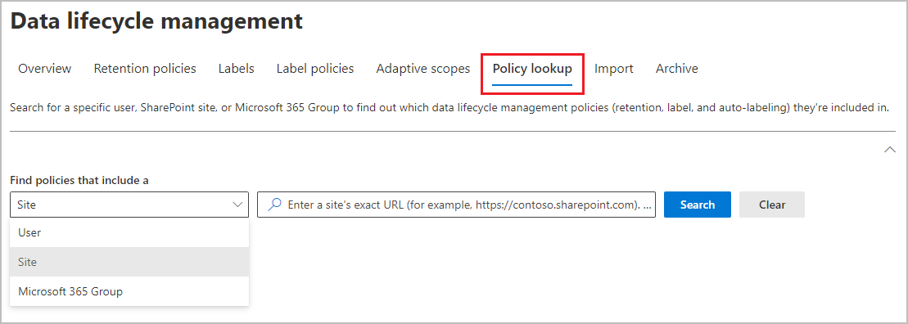

# Learn about retention policies and retention labels

>*[Microsoft 365 licensing guidance for security & compliance](/office365/servicedescriptions/microsoft-365-service-descriptions/microsoft-365-tenantlevel-services-licensing-guidance/microsoft-365-security-compliance-licensing-guidance).*

> [!NOTE]
> If you're seeing messages about retention policies in Teams or have questions about retention labels in your apps, contact your IT department for information about how they have been configured for you. In the meantime, you might find the following articles helpful:
>
> - [Teams messages about retention policies](https://support.microsoft.com/office/teams-messages-about-retention-policies-c151fa2f-1558-4cf9-8e51-854e925b483b)
> - [Apply retention labels to files in SharePoint or OneDrive](https://support.microsoft.com/office/apply-retention-labels-to-files-in-sharepoint-or-onedrive-11a6835b-ec9f-40db-8aca-6f5ef18132df)
>
> The information on this page is for IT administrators who can create retention policies and retention labels for compliance reasons.

For most organizations, the volume and complexity of their data is increasing daily—email, documents, instant messages, and more. Effectively managing or governing this information is important because you need to:

- **Comply proactively with industry regulations and internal policies** that require you to retain content for a minimum period of time—for example, the Sarbanes-Oxley Act might require you to retain certain types of content for seven years.

- **Reduce your risk in the event of litigation or a security breach** by permanently deleting old content that you're no longer required to keep.

- **Help your organization to share knowledge effectively and be more agile** by ensuring that your users work only with content that's current and relevant to them.

Retention settings that you configure can help you achieve these goals. Managing content commonly requires two actions:

| Action| Purpose |
|:-----|:-----|
|Retain content | Prevent permanent deletion and remain available for eDiscovery |
|Delete content | Permanently delete content from your organization|

With these two retention actions, you can configure retention settings for the following outcomes:

- Retain-only: Retain content forever or for a specified period of time.
- Delete-only: Permanently delete content after a specified period of time.
- Retain and then delete: Retain content for a specified period of time and then permanently delete it.

These retention settings work with content in place that saves you the additional overheads of creating and configuring additional storage when you need to retain content for compliance reasons. In addition, you don't need to implement customized processes to copy and synchronize this data.

Use the following sections to learn more about how retention policies and retention labels work, when to use them, and how they supplement each other. But if you're ready to get started and deploy retention settings for some common scenarios, see [Get started with data lifecycle management](get-started-with-data-lifecycle-management.md).

## How retention settings work with content in place

When content has retention settings assigned to it, that content remains in its original location. Most of the time, people continue to work with their documents or mail as if nothing's changed. But if they edit or delete content that's included in the retention policy, a copy of the content is automatically retained.

- For SharePoint and OneDrive sites: The copy is retained in the **Preservation Hold** library.

- For Exchange mailboxes: The copy is retained in the **Recoverable Items** folder.

- For Teams and Yammer messages: The copy is retained in a hidden folder named **SubstrateHolds** as a subfolder in the Exchange **Recoverable Items** folder.

> [!NOTE]
> Because the Preservation Hold library is included in the site's storage quota, you might need to increase your storage when you use retention settings for SharePoint and Microsoft 365 groups.
>
These secure locations and the retained content are not visible to most people. In most cases, people do not even need to know that their content is subject to retention settings.

For more detailed information about how retention settings work for different workloads, see the following articles:

- [Learn about retention for SharePoint and OneDrive](retention-policies-sharepoint.md)
- [Learn about retention for Microsoft Teams](retention-policies-teams.md)
- [Learn about retention for Yammer](retention-policies-yammer.md)
- [Learn about retention for Exchange](retention-policies-exchange.md)

## Retention policies and retention labels

To assign your retention settings to content, use **retention policies** and **retention labels with label policies**. You can use just one of these methods, or combine them.

Use a retention policy to assign the same retention settings for content at a site or mailbox level, and use a retention label to assign retention settings at an item level (folder, document, email).

For example, if all documents in a SharePoint site should be retained for 5 years, it's more efficient to do this with a retention policy than apply the same retention label to all documents in that site. However, if some documents in that site should be retained for 5 years and others retained for 10 years, a retention policy wouldn't be able to do this. When you need to specify retention settings at the item level, use retention labels.

Unlike retention policies, retention settings from retention labels travel with the content if it's moved to a different location within your Microsoft 365 tenant. In addition, retention labels have the following capabilities that retention policies don't support:

- Options to start the retention period from when the content was labeled or based on an event, in addition to the age of the content or when it was last modified.

- Use [trainable classifiers](classifier-learn-about.md) to identify content to label.

- Apply a default label for SharePoint items or Exchange messages.

- Supported actions at the end retention period:
  - [Disposition review](./disposition.md) to review the content before it's permanently deleted.
  - Automatically apply another retention label

- Mark the content as a [record](records-management.md#records) as part of the label settings, and always have [proof of disposition](disposition.md#disposition-of-records) when content is deleted at the end of its retention period.

### Retention policies

Retention policies can be applied to the following locations:

- Exchange email
- SharePoint site
- OneDrive accounts
- Microsoft 365 Groups
- Skype for Business
- Exchange public folders
- Teams channel messages
- Teams chats
- Teams private channel messages
- Yammer community messages
- Yammer user messages

> [!NOTE]
> Teams channel messages now include [shared channels](/MicrosoftTeams/shared-channels) (currently in preview) as well as standard channels.

You can very efficiently apply a single policy to multiple locations, or to specific locations or users.

For the start of the retention period, you can choose when the content was created or, supported only for files and the SharePoint, OneDrive, and Microsoft 365 Groups locations, when the content was last modified.

Items inherit the retention settings from their container specified in the retention policy. If they are then moved outside that container when the policy is configured to retain content, a copy of that item is retained in the workload's secured location. However, the retention settings don't travel with the content in its new location. If that's required, use retention labels instead of retention policies.

### Retention labels

Use retention labels for different types of content that require different retention settings. For example:

- Tax forms that need to be retained for a minimum period of time.

- Press materials that need to be permanently deleted when they reach a specific age.

- Competitive research that needs to be retained for a specific period and then permanently deleted.

- Work visas that must be marked as a record so that they can't be edited or deleted.

In all these cases, retention labels let you apply retention settings for governance control at the item level (document or email).

With retention labels, you can:

- **Enable people in your organization to apply a retention label manually** to content in Outlook and Outlook on the web, OneDrive, SharePoint, and Microsoft 365 groups. Users often know best what type of content they're working with, so they can classify it and have the appropriate retention settings applied.

- **Apply retention labels to content automatically** if it matches specific conditions, that includes cloud attachments that are shared in email or Teams, or when the content contains:
  - Specific types of sensitive information.
  - Specific keywords that match a query you create.
  - Pattern matches for a trainable classifier.

- **Start the retention period from when the content was labeled** for documents in SharePoint sites and OneDrive accounts, and for email items.

- **Start the retention period when an event occurs**, such as employees leave the organization, or contracts expire.

- **Apply a default retention label to a document library, folder, or document set** in SharePoint, so that all documents that are stored in that location inherit the default retention label.

- **Mark items as a record** as part of your [records management](records-management.md) strategy. When this labeled content remains in Microsoft 365, further restrictions are placed on the content that might be needed for regulatory reasons. For more information, see [Compare restrictions for what actions are allowed or blocked](records-management.md#compare-restrictions-for-what-actions-are-allowed-or-blocked).

Retention labels, unlike [sensitivity labels](sensitivity-labels.md), do not persist if the content is moved outside Microsoft 365.

#### Classifying content without applying any actions

Although the main purpose of retention labels is to retain or delete content, you can also use retention labels without turning on any retention or other actions. In this case, you can use a retention label simply as a text label, without enforcing any actions.

For example, you can create and apply a retention label named "Review later" with no actions, and then use that label to find that content later.

#### Using a retention label as a condition in a DLP policy

You can specify a retention label as a condition in a Microsoft Purview Data Loss Prevention (DLP) policy for documents in SharePoint. For example, configure a DLP policy to prevent documents from being shared outside the organization if they have a specified retention label applied to it.

For more information, see [Using a retention label as a condition in a DLP policy](data-loss-prevention-policies.md#using-a-retention-label-as-a-condition-in-a-dlp-policy).

#### Retention labels and policies that apply them

When you publish retention labels, they're included in a **retention label policy** that makes them available for admins and users to apply to content. As the following diagram shows:

1. A single retention label can be included in multiple retention label policies.

2. Retention label policies specify the locations to publish the retention labels. The same location can be included in multiple retention label policies.

You can also create one or more **auto-apply retention label policies**, each with a single retention label. With this policy, a retention label is automatically applied when conditions that you specify in the policy are met.

#### Retention label policies and locations

Retention labels can be published to different locations, depending on what the retention label does.

| If the retention label is... | Then the label policy can be applied to... |
|:-----|:-----|
|Published to admins and end users  |Exchange, SharePoint, OneDrive, Microsoft 365 Groups  |
|Auto-applied based on sensitive information types or trainable classifiers  |Exchange, SharePoint, OneDrive  |
|Auto-applied based on keywords or a query  |Exchange, SharePoint, OneDrive, Microsoft 365 Groups  |
|Auto-applied to cloud attachments  |SharePoint, OneDrive, Microsoft 365 Groups  |

Exchange public folders, Skype, Teams and Yammer messages do not support retention labels. To retain and delete content from these locations, use retention policies instead.

#### Only one retention label at a time

An email or document can have only a single retention label applied to it at a time. A retention label can be applied [manually](create-apply-retention-labels.md#manually-apply-retention-labels) by an end user or admin, or automatically by using any of the following methods:

- [Auto-apply label policy](apply-retention-labels-automatically.md)
- [Document understanding model for SharePoint Syntex](../contentunderstanding/apply-a-retention-label-to-a-model.md)
- [Default label for SharePoint](create-apply-retention-labels.md#applying-a-default-retention-label-to-all-content-in-a-sharepoint-library-folder-or-document-set) or [Outlook](create-apply-retention-labels.md#applying-a-default-retention-label-to-an-outlook-folder)
- [Outlook rules](create-apply-retention-labels.md#automatically-applying-a-retention-label-to-email-by-using-rules)

For standard retention labels (they don't mark items as a [record or regulatory record](records-management.md#records)):

- Admins and end users can manually change or remove an existing retention label that's applied on content.

- When content already has a retention label applied, the existing label won't be automatically removed or replaced by another retention label with one possible exception: The existing label was applied as a default label. When you use a default label, there are some scenarios when it can be replaced by another default label, or automatically removed.

- When content already has a retention label applied, the existing label won't be automatically removed or replaced by another retention label with two possible exceptions:

  - The existing label is configured to automatically apply a different retention label at the end of the retention period.
  - The existing label was applied as a default label. When you use a default label, there are some scenarios when it can be replaced by another default label, or automatically removed.

  For more information about the label behavior when it's applied by using a default label:

  - Default label for SharePoint: [Label behavior when you use a default label for SharePoint](create-apply-retention-labels.md#label-behavior-when-you-use-a-default-label-for-sharepoint)
  - Default label for Outlook: [Applying a default retention label to an Outlook folder](create-apply-retention-labels.md#applying-a-default-retention-label-to-an-outlook-folder)

- If there are multiple auto-apply label policies that could apply a retention label, and content meets the conditions of multiple policies, the retention label for the oldest auto-apply label policy (by date created) is applied.

When retention labels mark items as a record or a regulatory record, these labels are never automatically changed during their configured retention period. Only admins for the container can manually change or remove retention labels that mark items as a record, but not regulatory records. For more information, see [Compare restrictions for what actions are allowed or blocked](records-management.md#compare-restrictions-for-what-actions-are-allowed-or-blocked).

#### Monitoring retention labels

From the Microsoft Purview compliance portal, select **Data classification** and the **Overview** page to monitor how your retention labels are being used in your tenant, and identify where your labeled items are located. For more information, including important prerequisites, see [Learn about data classification](data-classification-overview.md).

You can then drill down into details by using [content explorer](data-classification-content-explorer.md) and [activity explorer](data-classification-activity-explorer.md).

> [!TIP]
>Consider using some of the other data classification insights, such as trainable classifiers and sensitive info types, to help you identify content that you might need to retain or delete, or manage as records.

#### Using Content Search to find all content with a specific retention label

After retention labels are applied to content, either by users or auto-applied, you can use content search to find all items that have a specific retention label applied.

When you create a content search, choose the **Retention label** condition, and then enter the complete retention label name or part of the label name and use a wildcard. For more information, see [Keyword queries and search conditions for Content Search](keyword-queries-and-search-conditions.md).

## Compare capabilities for retention policies and retention labels

Use the following table to help you identify whether to use a retention policy or retention label, based on capabilities.

|Capability|Retention policy |Retention label|
|:-----|:-----|:-----|:-----|
|Retention settings that can retain and then delete, retain-only, or delete-only |Yes |Yes |
|Workloads supported:  - Exchange  - SharePoint  - OneDrive  - Microsoft 365 groups  - Skype for Business  - Teams - Yammer|  Yes   Yes   Yes   Yes   Yes   Yes   Yes |   Yes, except public folders   Yes   Yes   Yes   No   No   No |
|Retention applied automatically | Yes | Yes |
|Automatically apply different retention settings at the end of the retention period | No | Yes |
|Retention applied based on conditions   - sensitive info types, KQL queries and keywords, trainable classifiers, cloud attachments| No | Yes |
|Retention applied manually | No | Yes |
|End-user interaction | No | Yes |
|Persists if the content is moved | No | Yes, within your Microsoft 365 tenant |
|Declare item as a record| No | Yes |
|Start the retention period when labeled or based on an event | No | Yes |
|Run a Power Automate flow at the end of the retention period | No | Yes|
|Disposition review | No| Yes |
|Proof of disposition for up to 7 years | No |Yes, when you use disposition review or item is marked a record|
|Audit admin activities| Yes | Yes|
|Audit retention actions| No | Yes \* |
|Identify items subject to retention:   - Content Search   - Data classification page, content explorer, activity explorer |   No   No |   Yes   Yes|

**Footnote:**

\*
For retention labels that don't mark the content as a record or regulatory record, auditing events are limited to when an item in SharePoint or OneDrive has a label applied, changed, or removed. For auditing details for retention labels, see the [Auditing retention actions](#auditing-retention-actions) section on this page.

### Combining retention policies and retention labels

You don't have to choose between using retention policies only or retention labels only. Both methods can be used together and in fact, complementary each other for a more comprehensive solution.

The following examples are just some of the ways in which you can combine retention policies and retention labels for the same location.

For more information about how retention policies and retention labels work together and how to determine their combined outcome, see the section on this page that explains the [principles of retention and what takes precedence](#the-principles-of-retention-or-what-takes-precedence).

#### Example for users to override automatic deletion

Scenario: By default, content in users' OneDrive accounts is automatically deleted after five years but users must have the option to override this for specific documents.

1. You create and configure a retention policy that automatically deletes content five years after it's last modified, and apply the policy to all OneDrive accounts.

2. You create and configure a retention label that keeps content forever and add this to a label policy that you publish to all OneDrive accounts. You explain to users how to manually apply this label to specific documents that should be excluded from automatic deletion if not modified after five years.

#### Example to retain items for longer

Scenario: By default, SharePoint items are automatically retained and then deleted after five years, but documents in specific libraries must be retained for ten years.

1. You create and configure a retention policy that automatically retains and then deletes content after five years, and apply the policy to all SharePoint and Microsoft 365 Groups instances.

2. You create and configure a retention label that automatically retains content for ten years. You add this label to a label policy that you publish to all SharePoint and Microsoft 365 Groups instances so that SharePoint admins can then apply it as a default label to be inherited by all items in specific document libraries.

#### Example to delete items in a shorter time period

Scenario: By default, emails aren't retained but are automatically deleted after ten years. However, emails related to a specific project that has a prerelease code name must be automatically deleted after one year.

1. You create and configure a retention policy that automatically deletes content after ten years, and apply the policy to all Exchange recipients.

2. You create and configure a retention label that automatically deletes content after one year. Options for applying this label to relevant emails include:
    - You create an auto-labeling policy that identifies content by using the project code name as the keyword, and apply the policy to all Exchange recipients
    - You publish the label and instruct users involved in the project how to create an automatic rule in Outlook that applies this label
    - You publish the label and instruct users to create a folder in Outlook for all emails related to the project and they apply the published label to the folder, and then create an Outlook rule to move all project-related emails to this folder

## How long it takes for retention settings to apply

When you submit retention policies for workloads and label policies to automatically apply a retention label, allow up to 7 days for the retention settings to be applied to content:

- [How long it takes for retention policies to take effect](create-retention-policies.md#how-long-it-takes-for-retention-policies-to-take-effect)
- [How long it takes for retention labels to take effect](apply-retention-labels-automatically.md#how-long-it-takes-for-retention-labels-to-take-effect)

Similarly, allow up to 7 days for retention labels to be visible in apps after you publish the labels:

- [When retention labels become available to apply](create-apply-retention-labels.md#when-retention-labels-become-available-to-apply)

Often, the policies will take effect and labels will be visible quicker than 7 days. But with many potential variables that can impact this process, it's best to plan for the maximum of 7 days.

## Adaptive or static policy scopes for retention

When you create a retention policy or retention label policy, you must choose between adaptive and static to define the scope of the policy.

- An **adaptive scope** uses a query that you specify, so the membership isn't static but dynamic by running daily against the attributes or properties that you specify for the selected locations. You can use multiple adaptive scopes with a single policy.

    Example: Emails and OneDrive documents for executives require a longer retention period than standard users. You create a retention policy with an adaptive scope that uses the Azure AD attribute job title of "Executive", and then select the Exchange email and OneDrive accounts locations for the policy. There's no need to specify email addresses or OneDrive URLs for these users because the adaptive scope automatically retrieves these values. For new executives, there's no need to reconfigure the retention policy because these new users with their corresponding values for email and OneDrive are automatically picked up.

- A **static scope** doesn't use queries and is limited in configuration in that it can apply to all instances for a specified location, or use inclusion and exclusions for specific instances for that location. These three choices are sometimes referred to as "org-wide", "includes", and "excludes" respectively.

    Example: Emails and OneDrive documents for executives require a longer retention period than standard users. You create a retention policy with a static scope that selects the Exchange email and OneDrive accounts locations for the policy. For the Exchange email location, you're able to identify a group that contains just the executives, so you specify this group for the retention policy, and the group membership with the respective email addresses is retrieved when the policy is created. For the OneDrive accounts location, you must identify and then specify individual OneDrive URLs for each executive. For new executives, you must reconfigure the retention policy to add the new email addresses and OneDrive URLs. You must also update the OneDrive URLs anytime there is a change in an executive's UPN.

    OneDrive URLs are particularly challenging to reliably specify because by default, these URLs aren't created until the user accesses their OneDrive for the first time. And if a user's UPN changes, which you might not know about, their OneDrive URL automatically changes.

Advantages of using adaptive scopes:

- No limits on the [number of items per policy](retention-limits.md#maximum-number-of-items-per-policy). Although adaptive policies are still subject to the [maximum number of policies per tenant](retention-limits.md#maximum-number-of-policies-per-tenant) limitations, the more flexible configuration will likely result in far fewer policies.

- More powerful targeting for your retention requirements. For example, you can assign different retention settings to users according to their geographical location by using existing Azure AD attributes without the administrative overhead of creating and maintaining groups for this purpose.

- Query-based membership provides resilience against business changes that might not be reliably reflected in group membership or external processes that rely on cross-department communication.

- A single retention policy can include locations for both Microsoft Teams and Yammer, whereas when you use a static scope, these locations require their own retention policy.

- You can apply specific retention settings to just inactive mailboxes. This configuration isn't possible with a static scope because at the time the policy is assigned, static scopes don't support the specific inclusion of recipients with inactive mailboxes.

Advantages of using static scopes:

- Simpler configuration if you want all instances automatically selected for a workload.

    For "includes" and "excludes", this choice can be a simpler configuration initially if the numbers of instances that you have to specify are low and do not change. However, when these number of instances start to increase and you have frequent changes in your organization that require you to reconfigure your policies, adaptive scopes can be simpler to configure and much easier to maintain.

- The **Skype for Business** and **Exchange public folders** locations don't support adaptive scopes. For those locations, you must use a static scope.

For configuration information, see [Configuring adaptive scopes](retention-settings.md#configuration-information-for-adaptive-scopes).

To watch a recorded webinar (requires registration), visit [Deep Dive on Adaptive Scopes](https://mipc.eventbuilder.com/event/45703).

> [!IMPORTANT]
> Currently, adaptive scopes don't support [Preservation Lock to restrict changes to retention policies and retention label policies](#use-preservation-lock-to-restrict-changes-to-policies).

## Policy lookup

You can configure multiple retention policies for Microsoft 365 locations, as well as multiple retention label policies that you publish or auto-apply. To find the policies for retention that are assigned to specific users, sites, and Microsoft 365 groups, use **Policy lookup** from the **Data lifecycle management** or **Records management** solutions in the Microsoft Purview compliance portal.

For example:

You must specify the exact email address for a user, exact URL for a site, or exact email address for a Microsoft 365 group. You can't use wildcards, or partial matches, for example.

The option for sites includes OneDrive accounts. For information how to specify the URL for a user's OneDrive account, see [Get a list of all user OneDrive URLs in your organization](/onedrive/list-onedrive-urls).

## The principles of retention, or what takes precedence?

Unlike retention labels, you can apply more than one retention policy to the same content. Each retention policy can result in a retain action and a delete action. Additionally, that item could also be subject to these actions from a retention label.

In this scenario, when items can be subject to multiple retention settings that could conflict with one another, what takes precedence to determine the outcome?

The outcome isn't which single retention policy or single retention label wins, but how long an item is retained (if applicable) and when an item is deleted (if applicable). These two actions are calculated independently from each other, from all the retention settings applied to an item.

For example, an item might be subject to one retention policy that is configured for a delete-only action, and another retention policy that is configured to retain and then delete. Consequently, this item has just one retain action but two delete actions. The retention and deletion actions could be in conflict with one another and the two deletion actions might have a conflicting date. The principles of retention explain the outcome.

At a high level, you can be assured that retention always takes precedence over permanent deletion, and the longest retention period wins. These two simple rules always decide how long an item will be retained.

There are a few more factors that determine when an item will be permanently deleted, which include the delete action from a retention label always takes precedence over the delete action from a retention policy.

Use the following flow to understand the retention and deletion outcomes for a single item, where each level acts as a tie-breaker for conflicts, from top to bottom. If the outcome is determined by the first level because there are no further conflicts, there's no need to progress to the next level, and so on.

> [!IMPORTANT]
> If you are using retention labels: Before applying the principles to determine the outcome of multiple retention settings on the same item, make sure you know [which retention label is applied](#only-one-retention-label-at-a-time).

Before explaining each principle in more detail, it's important to understand the difference between the retention period for the item vs. the specified retention period in the retention policy or retention label. That's because although the default configuration is to start the retention period when an item is created, so that the end of the retention period is fixed for the item, files also support the configuration to start the retention period from when the file is last modified. With this alternative configuration, every time the file is modified, the start of the retention period is reset, which extends the end of the retention period for the item. Retention labels also support starting the retention period when labeled and at the start of an event.

To apply the principles in action with a series of Yes and No questions, you can also use the [retention flowchart](retention-flowchart.md).

Explanation for the four different principles:

1. **Retention wins over deletion.** Content won't be permanently deleted when it also has retention settings to retain it. While this principle ensures that content is preserved for compliance reasons, the delete process can still be initiated (user-initiated or system-initiated) and consequently, might remove the content from users' main view. However, permanent deletion is suspended. For more information about how and where content is retained, use the following links for each workload:

    - [How retention works for SharePoint and OneDrive](retention-policies-sharepoint.md#how-retention-works-for-sharepoint-and-onedrive)
    - [How retention works with Microsoft Teams](retention-policies-teams.md#how-retention-works-with-microsoft-teams)
    - [How retention works with Yammer](retention-policies-yammer.md#how-retention-works-with-yammer)
    - [How retention works for Exchange](retention-policies-exchange.md#how-retention-works-for-exchange)

    **Example for this first principle**: An email message is subject to a retention policy for Exchange that is configured to delete items three years after they are created, and it also has a retention label applied that is configured to retain items five years after they are created.

    The email message is retained for five years because this retention action takes precedence over deletion. The email message is permanently deleted at the end of the five years because of the delete action that was suspended while the retention action was in effect.

2. **The longest retention period wins.** If content is subject to multiple retention settings that retain content for different periods of time, the content will be retained until the end of the longest retention period for the item.

    > [!NOTE]
    > It's possible for a retention period of 5 years in a retention policy or label wins over a retention period of 7 years in a retention policy or label, because the 5-year period is configured to start based on when the file is last modified, and the 7-year period is configured to start from when the file is created.

    **Example for this second principle**: Documents in the Marketing SharePoint site are subject to two retention policies. The first retention policy is configured for all SharePoint sites to retain items for five years after they are created. The second retention policy is configured for specific SharePoint sites to retain items for ten years after they are created.

    Documents in this Marketing SharePoint site are retained for ten years because that's the longest retention period for the item.

3. **Explicit wins over implicit for deletions.** With conflicts now resolved for retention, only conflicts for deletions remain:

    1. A retention label (however it was applied) provides explicit retention in comparison with retention policies, because the retention settings are applied to an individual item rather than implicitly assigned from a container. This means that a delete action from a retention label always takes precedence over a delete action from any retention policy.

        **Example for this third principle (label)**: A document is subject to two retention policies that have a delete action of five years and ten years respectively, and also a retention label that has a delete action of seven years.

        The document is permanently deleted after seven years because the delete action from the retention label takes precedence.

    2. When you have retention policies only: If a retention policy for a location uses an adaptive scope or a static scope that includes specific instances (such as specific users for Exchange email) that retention policy takes precedence over a static scope that is configured for all instances for the same location.

        A static scope that is configured for all instances for a location is sometimes referred to as an "org-wide policy". For example, **Exchange email** and the default setting of **All recipients**. Or, **SharePoint sites** and the default setting of **All sites**. When retention policies aren't org-wide but have been configured with an adaptive scope or a static scope that includes specific instances, they have equal precedence at this level.

        **Example 1 for this third principle (policies)**: An email message is subject to two retention policies. The first retention policy is unscoped and deletes items after ten years. The second retention policy is scoped to specific mailboxes and deletes items after five years.

        The email message is permanently deleted after five years because the deletion action from the scoped retention policy takes precedence over the org-wide retention policy.

        **Example 2 for this third principle (policies)**: A document in a user's OneDrive account is subject to two retention policies. The first retention policy is scoped to include this user's OneDrive account and has a delete action after 10 years. The second retention policy is scoped to include this user's OneDrive account and has a delete action after seven years.

        When this document will be permanently deleted can't be determined at this level because both retention policies are scoped to include specific instances.

4. **The shortest deletion period wins.** Applicable to determine when items will be deleted from retention policies and the outcome couldn't be resolved from the previous level: Content is permanently deleted at the end of the shortest retention period for the item.

    > [!NOTE]
    > It's possible that a retention policy that has a retention period of 7 years wins over a retention policy of 5 years because the first policy is configured to start the retention period based on when the file is created, and the second retention policy from when the file is last modified.

    **Example for this fourth principle**: A document in a user's OneDrive account is subject to two retention policies. The first retention policy is scoped to include this user's OneDrive account and has a delete action of 10 years after the file is created. The second retention policy is scoped to include this user's OneDrive account and has a delete action of seven years after the file is created.

    This document will be permanently deleted after seven years because that's the shortest retention period for the item from these two scoped retention policies.

Items subject to eDiscovery hold also fall under the first principle of retention; they cannot be permanently deleted by any retention policy or retention label. When that hold is released, the principles of retention continue to apply to them. For example, they could then be subject to an unexpired retention period or a delete action.

### Principles of retention examples that combine retain and delete actions

The following examples are more complex to illustrate the principles of retention when different retain and delete actions are combined. To make the examples easier to follow, all retention policies and labels use the default setting of starting the retention period when the item is created so the end of the retention period is the same for the item.

1. An item has the following retention settings applied to it:

    - A retention policy for delete-only after five years
    - A retention policy that retains for three years and then deletes
    - A retention label that retains-only for seven years

    **Outcome**: The item is retained for seven years because retention takes precedence over deletion and seven years is the longest retention period for the item. At the end of this retention period, the item is permanently deleted because of the delete action from the retention policies.

    Although the two retention policies have different dates for the delete actions, the earliest that the item can be permanently deleted is at the end of the longest retention period, which is longer than both deletion dates.

2. An item has the following retention settings applied to it:

    - An org-wide retention policy that deletes-only after ten years
    - A retention policy scoped with specific instances that retains for five years and then deletes
    - A retention label that retains for three years and then deletes

    **Outcome**: The item is retained for five years because that's the longest retention period for the item. At the end of that retention period, the item is permanently deleted because of the delete action of three years from the retention label. Deletion from retention labels takes precedence over deletion from all retention policies. In this example, all conflicts are resolved by the third level.

## Use Preservation Lock to restrict changes to policies

Some organizations might need to comply with rules defined by regulatory bodies such as the Securities and Exchange Commission (SEC) Rule 17a-4, which requires that after a policy for retention is turned on, it cannot be turned off or made less restrictive.

Preservation Lock ensures your organization can meet such regulatory requirements because it locks a retention policy or retention label policy so that no one—including an administrator—can turn off the policy, delete the policy, or make it less restrictive.

You apply Preservation Lock after the retention policy or retention label policy is created. For more information and instructions, see [Use Preservation Lock to restrict changes to retention policies and retention label policies](retention-preservation-lock.md).

## Releasing a policy for retention

Providing your policies for retention don't have a Preservation Lock, you can delete your policies at any time, which effectively turns off the retention settings for a retention policy, and retention labels can no longer be applied from retention label policies. Any previously applied retention labels remain with their configured retention settings and for these labels, you can still update the retention period when it's not based on when items were labeled.

You can also keep a policy, but change the location status to off, or disable the policy. Another option is to reconfigure the policy so it no longer includes specific users, sites, groups, and so on.

Additional information for specific locations:

- **SharePoint sites and OneDrive accounts:**

    When you release a retention policy for SharePoint sites and OneDrive accounts, any content that's subject to retention from the policy continues to be retained for 30 days to prevent inadvertent data loss. During this 30-day grace period deleted files are still retained (files continue to be added to the Preservation Hold library), but the timer job that periodically cleans up the Preservation Hold library is suspended for these files so you can restore them if necessary.

    An exception to this 30-day grace period is when you update the policy to exclude one or more sites for SharePoint or accounts for OneDrive; in this case, the timer job deletes files for these locations in the Preservation Hold library without the 30-day delay.

    For more information about the Preservation Hold library, see [How retention works for SharePoint and OneDrive](retention-policies-sharepoint.md#how-retention-works-for-sharepoint-and-onedrive).

    Because of the behavior during the grace period, if you re-enable the policy or change the location status back to on within 30 days, the policy resumes without any permanent data loss during this time.

- **Exchange email and Microsoft 365 Groups**

  When you release a retention policy for mailboxes that are [inactive](inactive-mailboxes-in-office-365.md) at the time the policy is released:

  - If the retention policy is explicitly applied to a mailbox, the retention settings no longer apply. With no retention settings applied, an inactive mailbox becomes eligible for automatic deletion in the usual way.

    An explicit retention policy requires either an adaptive policy scope, or a static policy scope with an include configuration that specified an active mailbox at the time the policy was applied and later became inactive

  - If the retention policy is implicitly applied to a mailbox and the configured retention action is to retain, the retention policy continues to apply and an inactive mailbox never becomes eligible for automatic deletion. When the retain action no longer applies because the retention period has expired, the Exchange admin can now [manually delete the inactive mailbox](delete-an-inactive-mailbox.md)

    An implicit retention policy requires a static policy scope with the **All recipients** (for Exchange email) or **All groups** (for Microsoft 365 Groups) configuration.

    For more information about inactive mailboxes that have retention policies applied, see [Inactive mailboxes and Microsoft 365 retention](inactive-mailboxes-in-office-365.md#inactive-mailboxes-and-microsoft-365-retention).

## Auditing retention configuration and actions

When [auditing is enabled](turn-audit-log-search-on-or-off.md), auditing events for retention are supported for both administration configuration (retention policies and retention labels) and retention actions (retention labels only).

### Auditing retention configuration

Administrator configuration for retention policies and retention labels is logged as auditing events when a retention policy or label is created, reconfigured, or deleted.

For the full list of auditing events, see [Retention policy and retention label activities](search-the-audit-log-in-security-and-compliance.md#retention-policy-and-retention-label-activities).

### Auditing retention actions

Retention actions that are logged as auditing events are available only for retention labels and not for retention policies:

- When a retention label is applied, changed, or removed from an item in SharePoint or OneDrive:
  - From **File and page activities**, select **Changed retention label for a file**

- When a labeled item in SharePoint is marked as a record, and it is unlocked or locked by a user:
  - From **File and page activities**, select **Changed record status to unlocked** and **Changed record status to locked**

- When a retention label that marks content as a record or regulatory record is applied to an item in Exchange:
  - From **Exchange mailbox activities**, select **Labeled message as a record**

- When a labeled item in SharePoint, OneDrive, or Exchange is marked as a record or regulatory record, and it is permanently deleted:
  - From **File and page activities**, select **Deleted file marked as a record**

- When a disposition reviewer takes action for an item that's reached the end of its retention period:
  - From **Disposition review activities**, select **Approved disposal**, **Extended retention period**, **Relabeled item**, or **Added reviewers**

## PowerShell cmdlets for retention policies and retention labels

Use [Office 365 Security & Compliance Center PowerShell](/powershell/exchange/scc-powershell) for Purview retention cmdlets that support configuration at scale, scripting for automation, or might be necessary for advanced configuration scenarios.

For a list of available cmdlets, and to identify which ones are supported for the different locations, see [PowerShell cmdlets for retention policies and retention labels](retention-cmdlets.md).

## When to use retention policies and retention labels or eDiscovery holds

Although retention settings and [holds that you create with an eDiscovery case](create-ediscovery-holds.md) can both prevent data from being permanently deleted, they are designed for different scenarios. To help you understand the differences and decide which to use, use the following guidance:

- Retention settings that you specify in retention policies and retention labels are designed for a long-term data lifecycle management strategy to retain or delete data for compliance requirements. The scope is usually broad with the main focus being the location and content rather than individual users. The start and end of the retention period is configurable, with the option to automatically delete content without additional administrator intervention.

- Holds for eDiscovery (either eDiscovery (Standard) or eDiscovery (Premium) cases) are designed for a limited duration to preserve data for a legal investigation. The scope is specific with the focus being content owned by identified users. The start and end of the preservation period isn't configurable but dependent on individual administrator actions, without an option to automatically delete content when the hold is released.

Summary to compare retention with holds:

|Consideration|Retention |eDiscovery holds|
|:-----|:-----|:-----|:-----|
|Business need: |Compliance |Legal |
|Time scope: |Long-term |Short-term |
|Focus: |Broad, content-based |Specific, user-based |
|Start and end date configurable: |Yes |No |
|Content deletion: |Yes (optional) |No |
|Administrative overheads: |Low |High |

If content is subject to both retention settings and an eDiscovery hold, preserving content for the eDiscovery hold always takes precedence. In this way, the [principles of retention](#the-principles-of-retention-or-what-takes-precedence) expand to eDiscovery holds because they preserve data until an administrator manually releases the hold. However, despite this precedence, don't use eDiscovery holds for long-term data lifecycle management. If you are concerned about automatic deletion of data, you can configure retention settings to retain items forever, or use [disposition review](disposition.md#disposition-reviews) with retention labels.

If you are using older eDiscovery tools to preserve data, see the following resources:

- Exchange:
  - [In-Place Hold and Litigation Hold](/exchange/security-and-compliance/in-place-and-litigation-holds)
  - [How to identify the type of hold placed on an Exchange Online mailbox](./identify-a-hold-on-an-exchange-online-mailbox.md)

- SharePoint and OneDrive:
  - [Add content to a case and place sources on hold in the eDiscovery Center](/SharePoint/governance/add-content-to-a-case-and-place-sources-on-hold-in-the-ediscovery-center)

- [Retirement of legacy eDiscovery tools](legacy-ediscovery-retirement.md)

## Use retention policies and retention labels instead of older features

If you need to proactively retain or delete content in Microsoft 365 for data lifecycle management, we recommend that you use Microsoft 365 retention policies and retention labels instead of the following older features.

If you currently use these older features, they will continue to work side by side with Microsoft 365 retention policies and retention labels. However, we recommend that going forward, you use Microsoft 365 retention policies and retention labels to benefit from a single solution to manage both retention and deletion of content across multiple workloads in Microsoft 365.

**Older features from Exchange Online:**

- [Retention tags and retention policies](/exchange/security-and-compliance/messaging-records-management/retention-tags-and-policies), also known as [messaging records management (MRM)](/exchange/security-and-compliance/messaging-records-management/messaging-records-management) (deletion only)

  However, if you use the following MRM features, be aware that they aren't currently supported by Microsoft 365 retention policies:

  - An archive policy for [archive mailboxes](enable-archive-mailboxes.md) to automatically move emails from a user's primary mailbox to their archive mailbox after a specified period of time. An archive policy (with any settings) can be used in conjunction with a Microsoft 365 retention policy that applies to a user's primary and archive mailbox.

  - Retention policies applied by an admin to specific folders within a mailbox. A Microsoft 365 retention policy applies to all folders in the mailbox. However, an admin can configure different retention settings by using retention labels that a user can apply to folders in Outlook as a [default retention label](create-apply-retention-labels.md#applying-a-default-retention-label-to-an-outlook-folder).

- [Journaling](/exchange/security-and-compliance/journaling/journaling) (retention and archive)
    
    Might be required to integrate with third-party solutions and copies of email messages and their data communication are stored outside Exchange Online. Because you're moving data outside Microsoft 365, you must take extra precautions to secure it and also resolve any duplications that might result from this solution. It will be your responsibility to monitor and follow up on any non-delivery receipts to the journaling mailbox that can occur because of external and dependent services. You don't have these additional administrative overheads when you use Microsoft 365 retention and other Microsoft Purview compliance solutions that also aren't limited to just email messages.

- [Litigation hold](create-a-litigation-hold.md) (retention only)

   Although Litigation holds are still supported, we recommend you use Microsoft 365 retention or eDiscovery holds, [as appropriate](#when-to-use-retention-policies-and-retention-labels-or-ediscovery-holds).

**Older features from SharePoint and OneDrive:**

- [Document deletion policies](https://support.office.com/article/Create-a-document-deletion-policy-in-SharePoint-Server-2016-4fe26e19-4849-4eb9-a044-840ab47458ff) (deletion only)

- [Configuring in place records management](https://support.office.com/article/7707a878-780c-4be6-9cb0-9718ecde050a) (retention only)

- [Use policies for site closure and deletion](https://support.microsoft.com/en-us/office/use-policies-for-site-closure-and-deletion-a8280d82-27fd-48c5-9adf-8a5431208ba5) (deletion only)

- [Information management policies](intro-to-info-mgmt-policies.md) (deletion only)

If you have configured SharePoint sites for content type policies or information management policies to retain content for a list or library, those policies are ignored while a retention policy is in effect.

## Related information

- [SharePoint Online Limits](/office365/servicedescriptions/sharepoint-online-service-description/sharepoint-online-limits)
- [Limits and specifications for Microsoft Teams](/microsoftteams/limits-specifications-teams) 
- [Resources to help you meet regulatory requirements for data lifecycle management and records management](retention-regulatory-requirements.md)

## Configuration guidance

See [Get started with data lifecycle management](get-started-with-data-lifecycle-management.md). This article has information about subscriptions, permissions, and links to end-to-end configuration guidance for retention scenarios.
