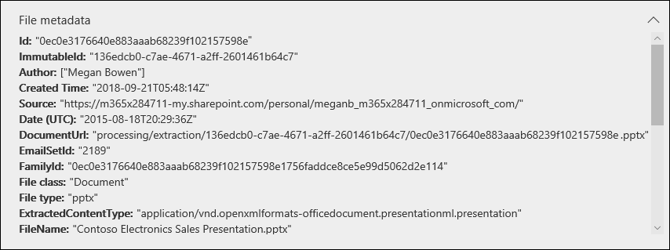
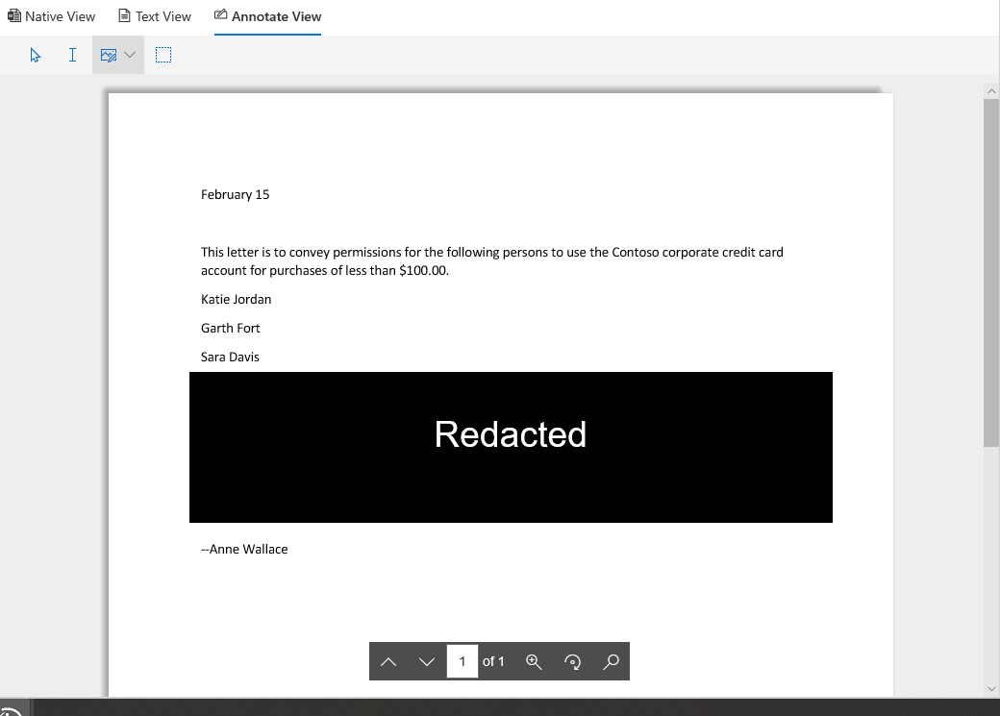

# Review the data in evidence

The data in an evidence set in a data investigation is a snapshot of the search results that you collected and added to the evidence set. When you add search results to evidence, a process is triggered to extract files, metadata, and text from the items returned by the search. Then the Data Investigations (preview) tool then builds a new index (by a process called *Advanced indexing*) of all the data and adds to an evidence set on the **Evidence** tab. 

For time-sensitive investigations, this allows you to quickly contain the environment by deleting the actual spilled or malicious data located in the at original data source, while at the same time allowing you to investigate the re-created evidence in a quarantined environment, which in this case is the data copied to the evidence set). After the evidence is collected and added to the evidence set, you can review individual documents in their native format, text format, or a near-native format that you can use to annotate and redact documents. Additionally, you can run queries to narrow the data set by time range, file types, data owners, and many other properties and search conditions. For example, by using the Author, Sender, or Recipient conditions, you can quickly identify the people are involved in the incident and if any data from your organization has been shared with external users. For more information about searching through data in an evidence set, see [Query the data in evidence](evidence-query.md).

To group documents and get more assistance for your review, select an evidence set on the **Evidence** tab, and then click **Manage evidence**. In the **Analytics** tile, click **Rebuild analytics for the whole set**. This will run advanced analytics such as duplicate detection, email threading, and theme analysis. Afterwards, you can see the general themes of the data and also organize documents by email threads, near duplicates, and exact duplicates to help your investigation. For more information, see [Run analytics to investigate faster](run-analytics-to-investigate-faster.md).

## View documents in evidence

The Data Investigations (preview) tool allows you to display content in several different viewers, with each viewer having a different purpose. These viewers are:

- File metadata
- Native view
- Text view
- Annotate view

To access any of these viewers, just select a document in an evidence set.

## File metadata

This view displays various metadata properties associated with the selected document. You can toggle this view on and off by clicking **File metadata**. When reviewing a document, you can view the file metadata and still change between the different viewers.

Here's an example of the file metadata for a document. For more information about the metadata fields, see [Document metadata fields in Data Investigations (preview)](document-metadata-fields.md).

## Native view

The Native viewer displays the most accurate view of a document in its native format. Native view is supported for hundreds of file types and is meant to display documents in the truest native experience possible. For Microsoft Office files, the Native viewer uses the web version of Office apps. This allows you to view content such as comments in different Office documents, formulas and hidden rows/columns in Excel, and the Notes view in PowerPoint.

## Text view

The Text viewer provides a view of the extracted text of a file. It ignores any embedded images and formatting, but this view is useful if you're trying to quickly review and understand the content in a document. Text view also includes these features:

  - A line counter, which makes it easier to reference specific portions of a document.

  - Search hit highlighting that highlight terms in the document as well as on the scrollbar

  - A diff view provides a comparison view that highlights the text differences when viewing documents using the **Near duplicates** panel.

**Example of line counter and search hit highlighting in text and scrollbar**

**Example of the diff view**

## Annotate view

The Annotate view provides features that allow you to apply markup on a document during the review process; this  includes these tools:

  - **Area redactions** – You can draw an opaque box on the document that hides sensitive content.

  - **Pencil** – You can free-hand draw on a document to bring attention to certain portions of the content

  - **Select annotations** - You can select and delete annotations in a document.

  - **Toggle annotation transparency** – You can toggle the transparency of annotations (between opaque and semi-transparent) so you can view the content behind the annotation. This includes toggling the transparency of pencil annotations and redactions.

The Annotate view also provides the following navigation functionality:

  - **Previous page**, **Next page**, and **Go to page** - Navigation controls to use for multi-page documents.

  - **Zoom** – Increases or decreases the size of documents in Annotate view.

  - **Rotate** – Rotate documents clockwise.

  - **Search** – Search for keywords in a document, and then use Previous and Next controls to view the hits (which are highlighted) within the document.

**Example of Annotate view**

> [!NOTE]
> Annotations are applied to a copy of the document that was added to the evidence set. The original documents in the live service aren't annotated.
