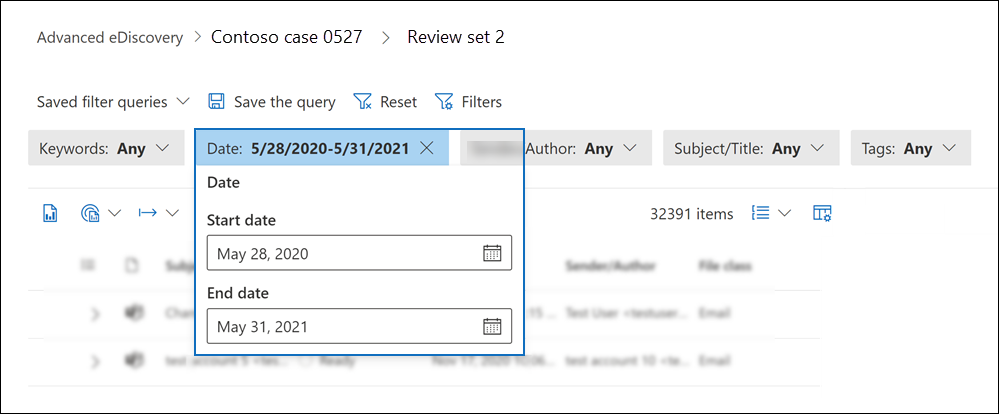
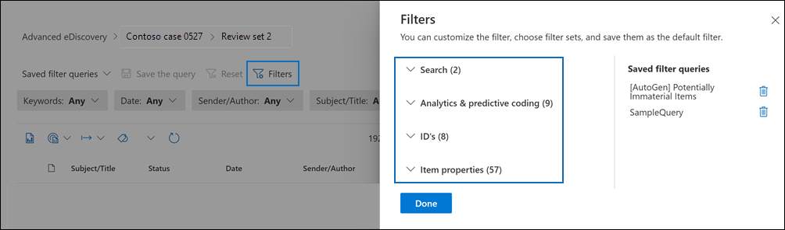
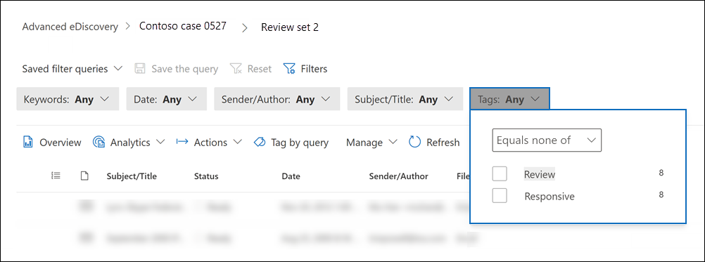
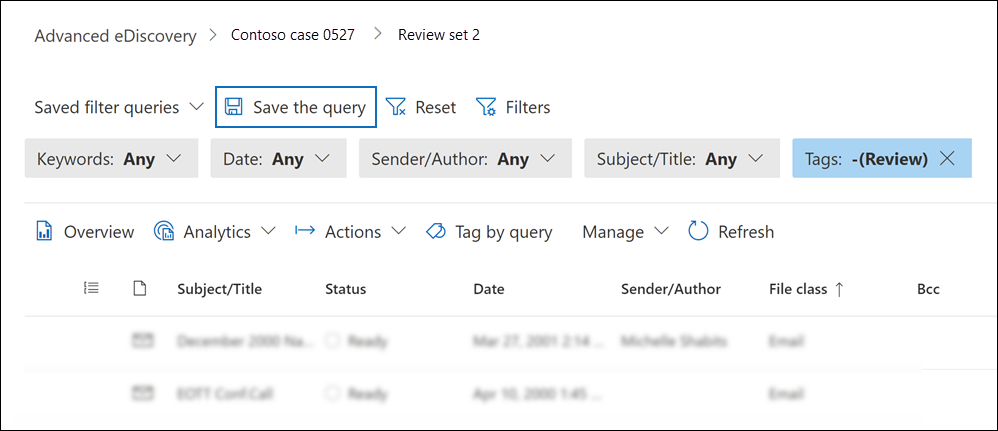
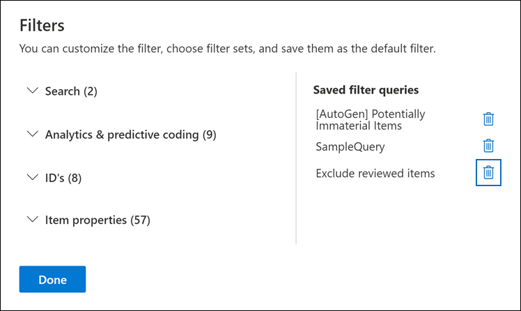
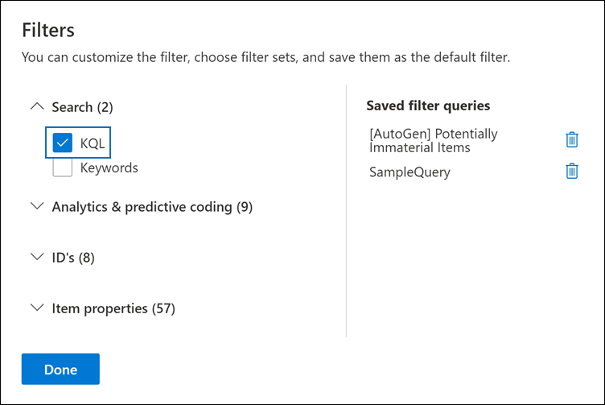

# Query and filter content in a review set

In most cases, it will be useful to dig deeper into the content in a review set and organize it to facilitate a more efficient review. Using filters and queries in a review set helps you focus on a subset of documents that meet the criteria of your review.

## Default filters

In a review set, there are five default filters that are pre-loaded in the review set:

- Keyword
- Date
- Sender/Author
- Subject/Title
- Tags

Click each filter to expand it and assign a value. Click outside the filter to automatically apply the filter to the review set. 

## Add or remove filters

To add or remove filters, select **Filters** to open the filter panel. The available filters are categorized in four sections:

- **Search**: Filters that provide different search capabilities.

- **Analytics & predictive coding**: Filters for properties generated and added to documents when you run the **Document & email analytic** job or use predictive coding models.

- **IDs**: Filters for all ID properties of documents.

- **Item properties**: Filters for document properties. 

Expand each section and select or deselect filters to add or remove them in the filter set. 

## Filter types

Every searchable field in a review set has a corresponding filter that you can use for filter items based on a specific field.

There are multiple types of filters:

- **Freetext**: A freetext filter is applied to text fields such as "Subject". You can list multiple search terms by separating them with a comma.

- **Date**: A date filter is used for date fields such as "Last modified date".

- **Search options**: A search options filter provides a list of possible values (each value is displayed with a checkbox that you can select) for particular fields in the review. This filter is used for fields, such as "Sender", where there is a finite number of possible values in the review set.

- **Keyword**: A keyword condition is a specific instance of freetext condition that you can use to search for terms. You can also use KQL-like query language in this type of filter. For more information, see the Query language and Advanced query builder sections in this topic.

## Include and exclude filter relationships

You have the option to change the include and exclude relationship for a particular filter. For example, in the Tag filter, you can exclude items that are tagged with a particular tag by selecting **Equals none of** in the dropdown filter. 

## Save filters as queries

After you are satisfied with your filters, you can save the filter combination as a filter query. This lets you apply the filter in the future review sessions.

To save a filter, select **Save the query** and name it. You or other reviewers can run previously saved filter queries by selecting the **Saved filter queries** dropdown and selecting the a filter query to apply to review set documents. 

To delete a filter query, open the filter panel and select the trashcan icon next to the query. 

## Query language

In addition to using filters, you can also use a KQL-like query language in the Keywords filter to build your review set search query. The query language for review set queries supports standard Boolean operators, such as **AND**, **OR**, **NOT**, and **NEAR**. It also supports a single-character wildcard (?) and a multi-character wildcard (*).

## Advanced query builder

You can also build more advanced queries to search for documents in a review set.

1. Open the filter panel, select **Filters**, and expand the **Search** section to find the **KQL** filter.

2. Select the **KQL** filter and click **Open query builder**. 

  In this panel, you can create complex KQL queries by using the query builder. You have the option to create conditions within various condition groups as well as defining **AND**/**OR** relationships between them. 

